

          개발 환경 
          - 2021, 맥북 프로 M1 Pro 14인치 모델  
          - Ventura 13.1

# AWS?

Amazon Web Services의 줄임말이다.  
아마존에서 클라우드 컴퓨팅으로 서버를 제공하며, 우리는 간단하게 서버 컴퓨터를 쓸 수 있다.

여러 가지 운영체제로 운영할 수 있으며, 보안 설정도 자유롭고,  
규모에 따라 서버 성능을 자유자재로 바꿀 수 있다. (물론 비싸지긴 하지만..)

## AWS 가입하기

[AWS 회원가입 페이지](https://portal.aws.amazon.com/billing/signup#/start)

이메일, 계정 이름 입력
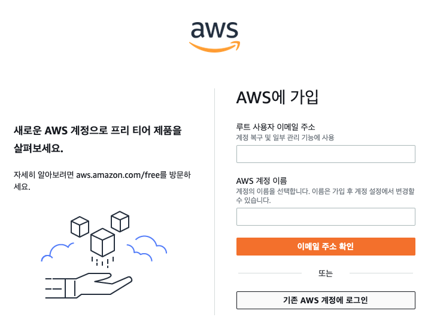

이메일 인증 진행
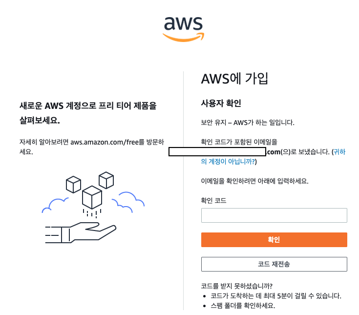

비밀번호 입력
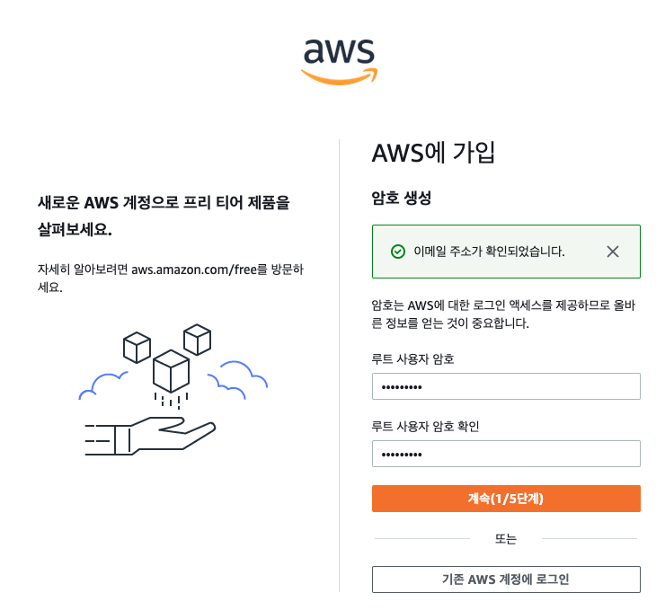

이름, 번호, 주소 등 입력 (모든 것을 영어로 입력!)
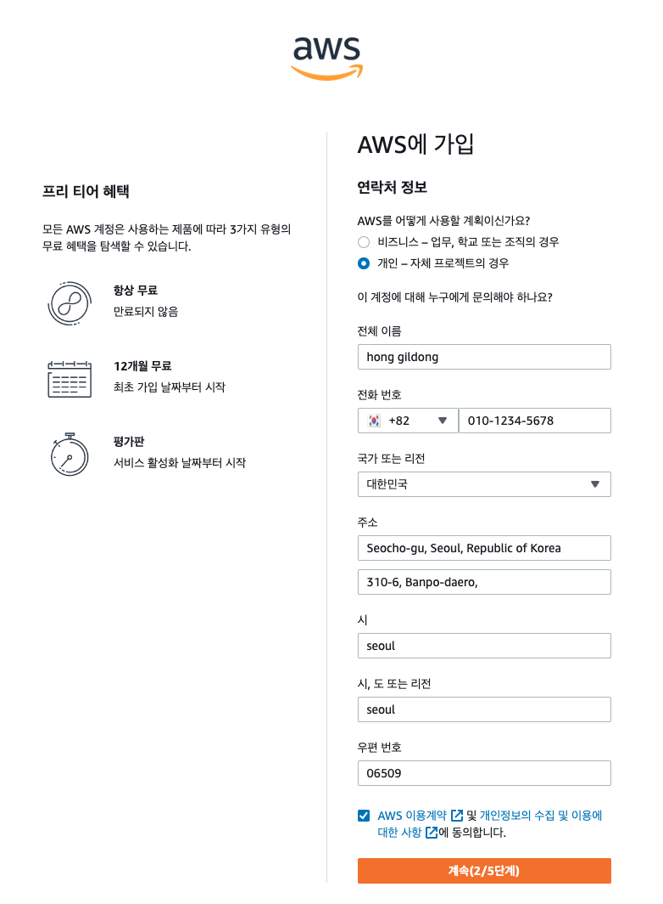

카드 정보 입력 -> 테스트 결제가 이루어집니다.
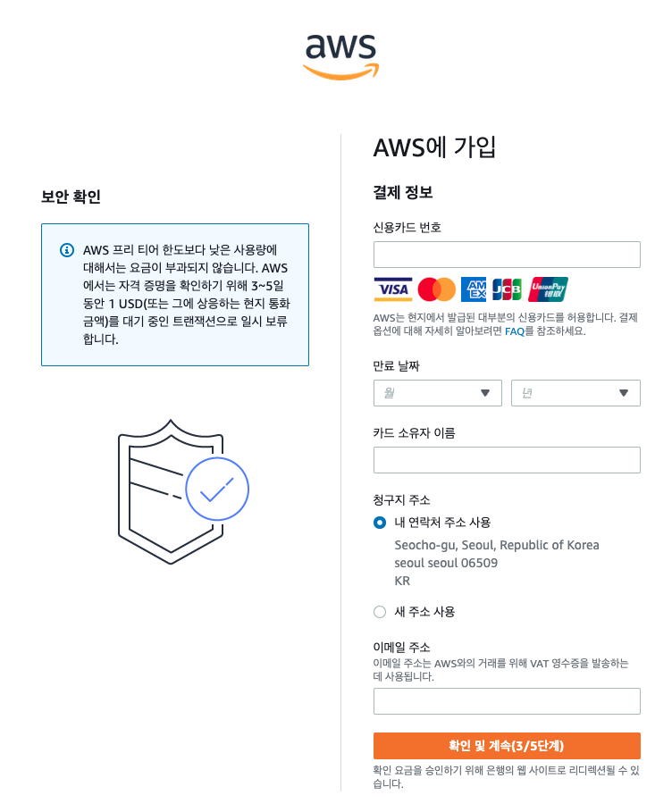

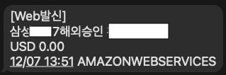

그러고 나서 다음 단계로 넘어가면 100원을 가져갔다가 돌려줍니다.
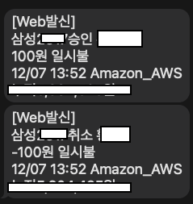

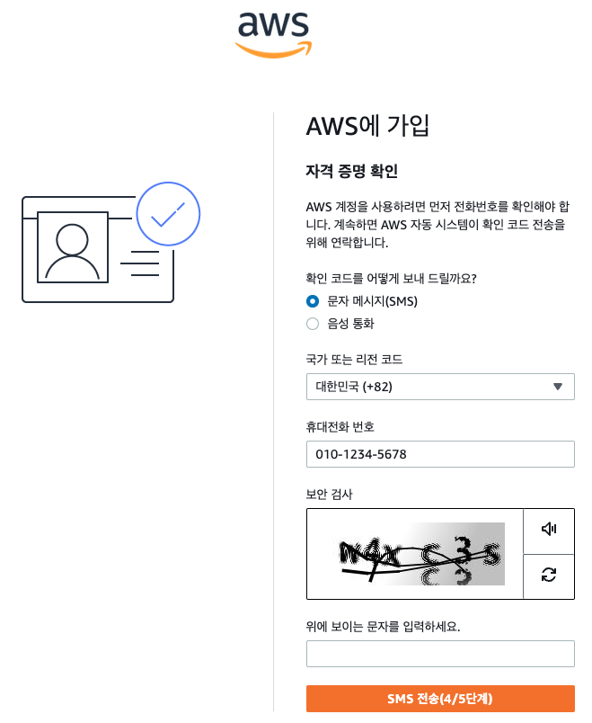

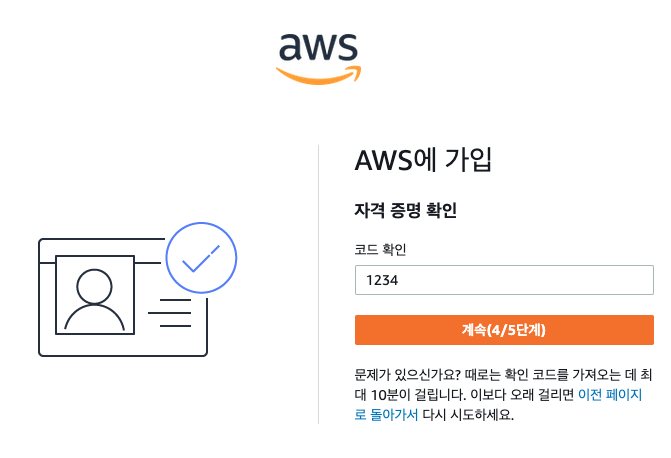

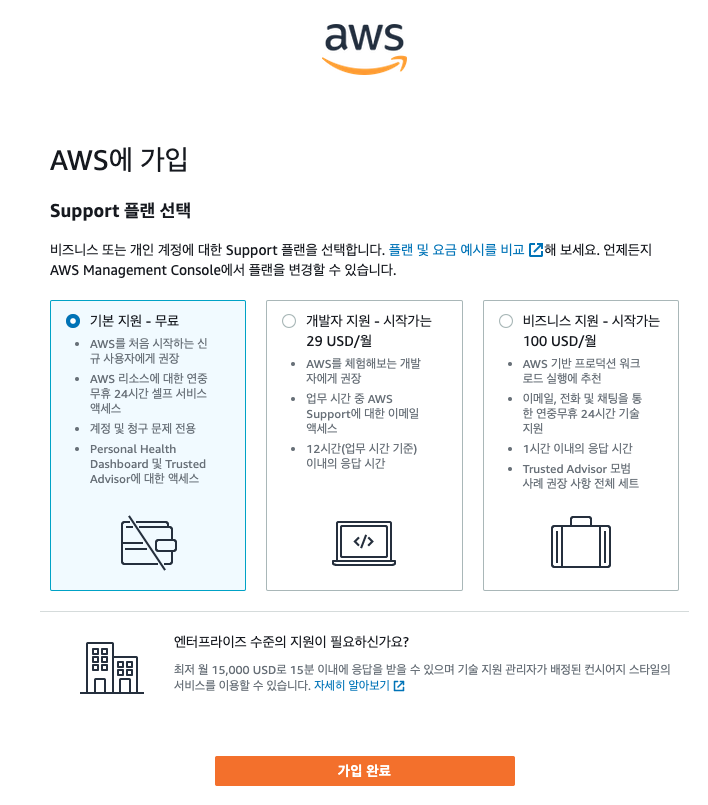

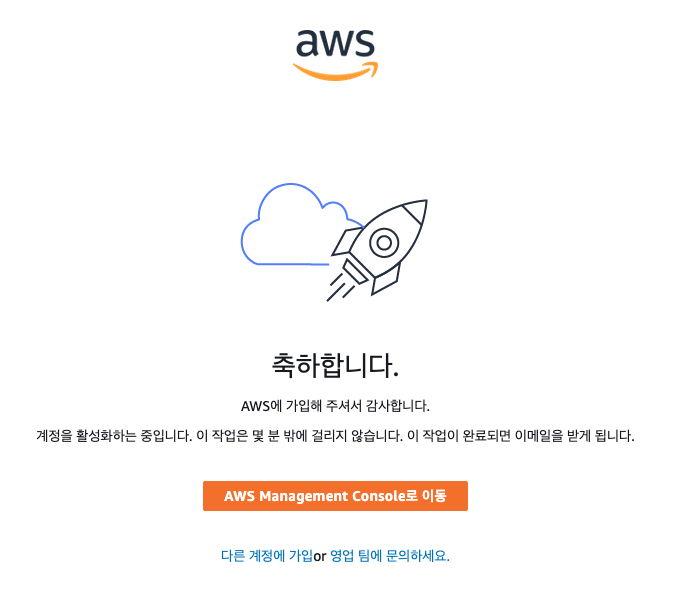

 

## 인스턴스 생성하기

EC2 console 접속 ->로그인  
[EC2 console](https://ap-northeast-2.console.aws.amazon.com/ec2/v2/home?region=ap-northeast-2)

루트 사용자로 로그인하시면 됩니다.  
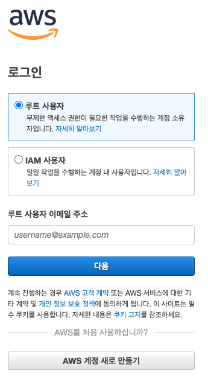

한국어로 설정되어 있지 않은 경우 Unified Settings에서 한국어로 변경    

오른쪽 위 서울 확인
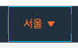

인스턴스 클릭! -> 인스턴스 시작 클릭
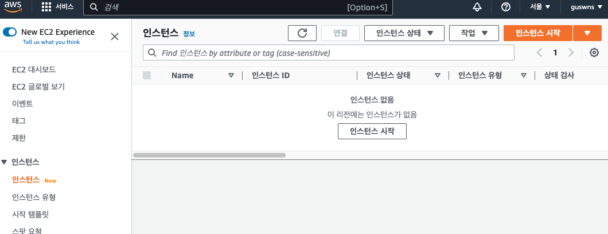

프리티어의 경우 인스턴스 1개까지만 무료이다.  
2개 생성 시 요금이 나간다!! 주의.

이름의 경우 자신의 서버 이름을 원하는 대로 작성하면 된다.

사용할 os의 경우 프리 티어라고 쓰여있는 것을 사용해야 무료인데,  
Ubuntu로 선택하기 ( 웬만하면 LTS 버전 사용 )
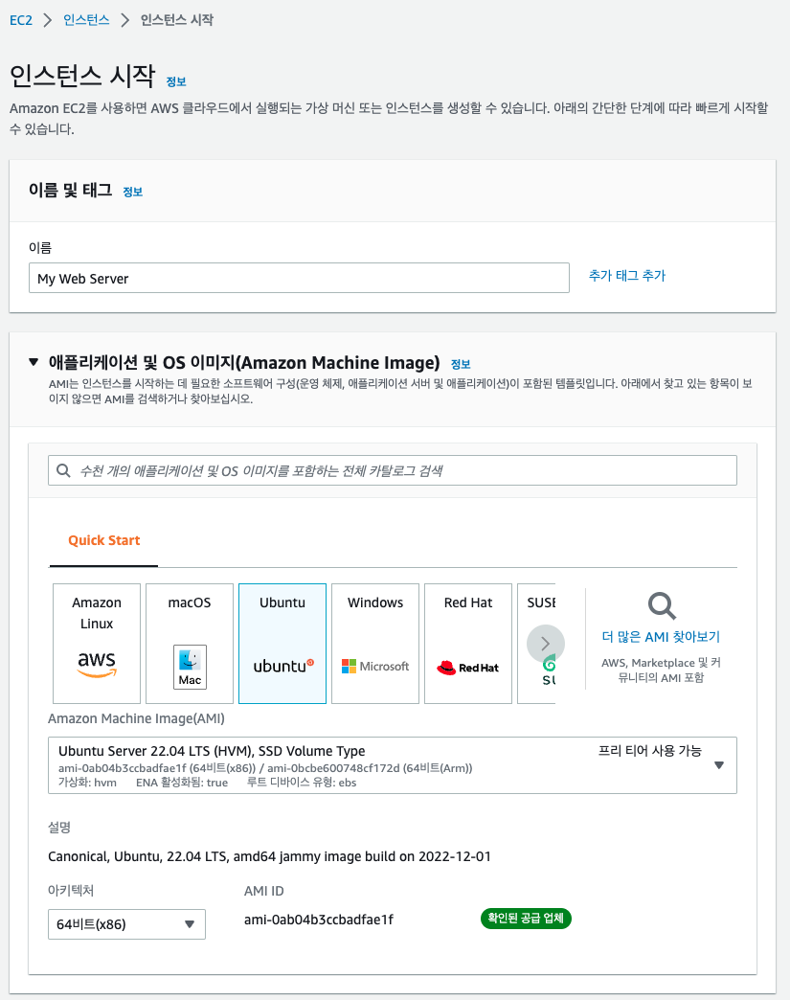

인스턴스 유형의 경우 서버 성능에 따라 가격이 다르다.  
기본으로 프리티어 사용 가능이라고 쓰여있는 t2.micro로 놔두기
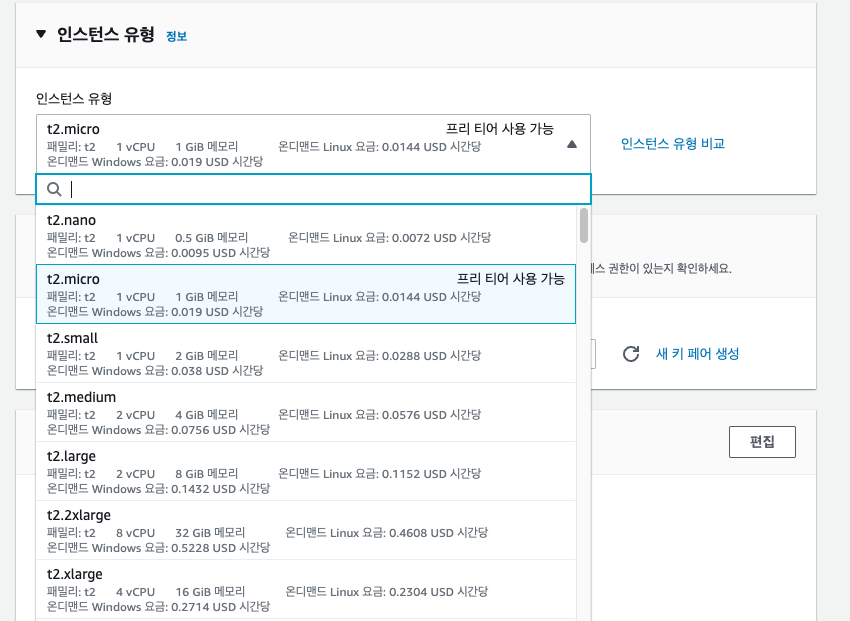

새 키 페어 생성 클릭
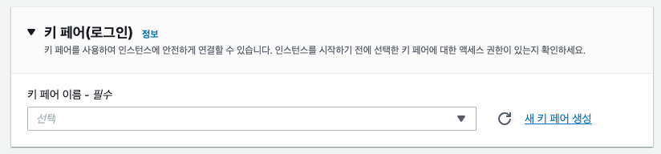

키 페어 생성하기. 
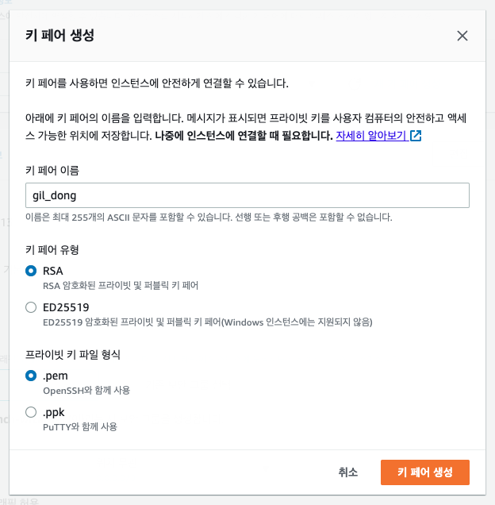

저절로 다운로드가 된다.  
이때 이 .pem 키 페어 파일은 서버로 접속 및 관리할 수 있는 key이며  
이 파일이 유출된다면 자신의 서버가 해킹 당해 비트코인 채굴로 쓰인다든지 할 수 있으므로  
웬만하면 로컬에 잘 저장하는 것을 추천!
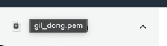

나머지 것들은 그냥 기본 옵션으로 일단 사용
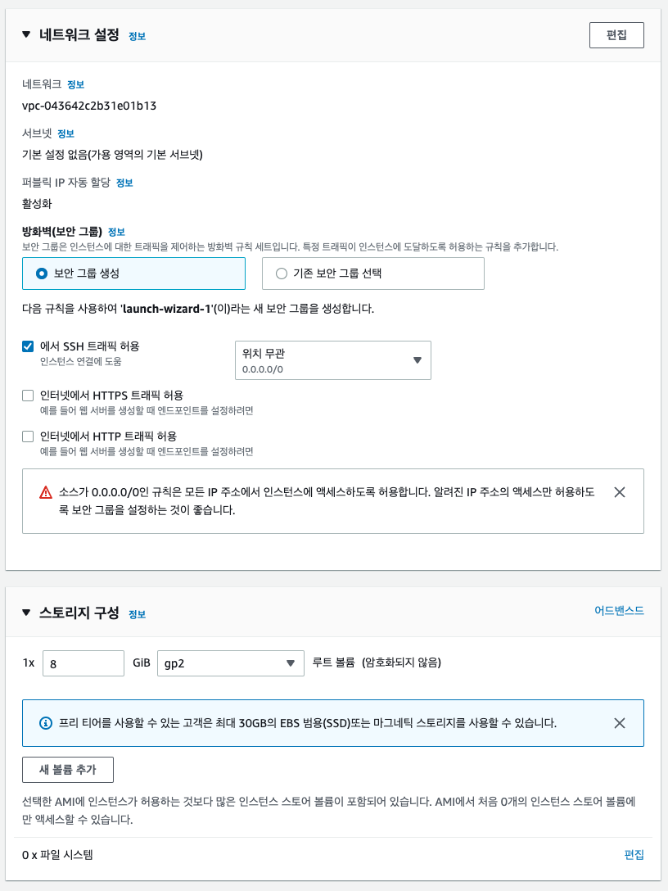

기본 옵션으로 놔두고 - > 인스턴스 시작 클릭
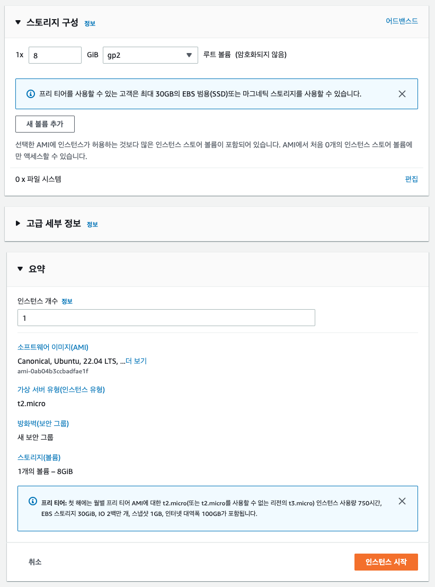

로딩이 지나가고 나면 인스턴스가 생성된다. -> 모든 인스턴스 보기 클릭
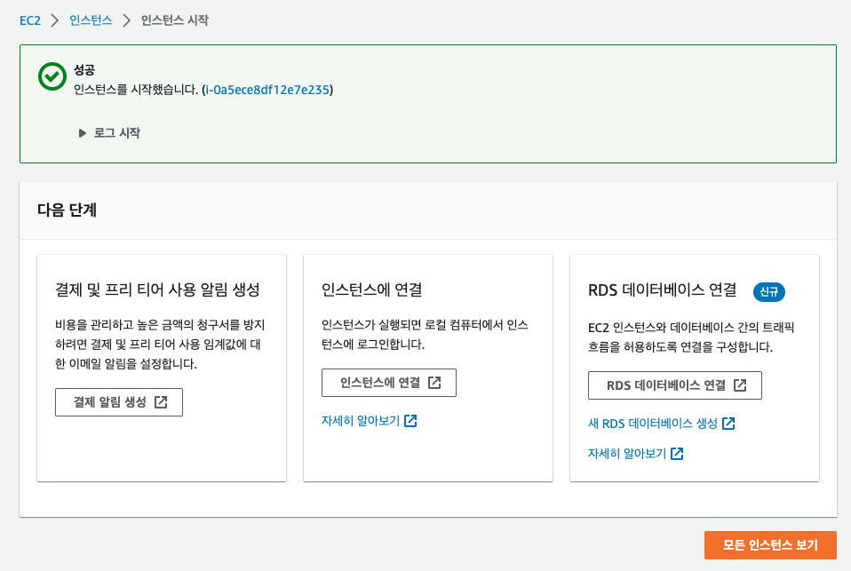

++ 등록한 이메일로 여러 가지 메일이 날라오며,  
아마 서버가 해킹당하거나 위험한 상태일 때 메일도 오지 않을까 생각.

인스턴스 상태가 대기 중이라고 나온다면 -> 아직 컴퓨터를 켜고 있는 상태 ( 인스턴스 준비 상태 )라고 보면 되고
좀만 기다리면 실행 중으로 바뀔 것이다.
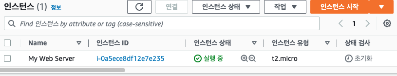

인스턴스 선택 후 오른쪽 마우스 클릭하면 아래와 같은 화면이 나오는데   
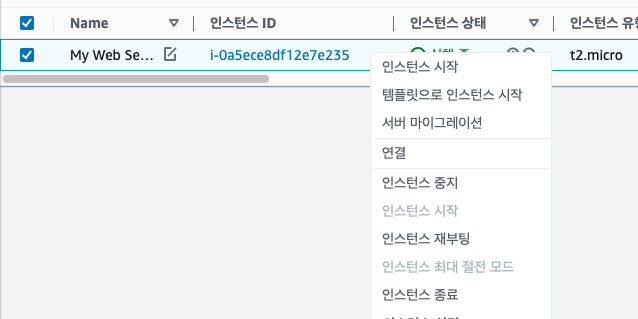

인스턴스 중지 : 컴퓨터를 껐다고 생각하면 됨.  
인스턴스 종료 : 컴퓨터 반납으로, 서버를 지우고 다시만들고 싶을 때 사용  

-> 인스턴스 종료 시 인스턴스 시작으로 처음 과정부터 다시 만들면 되고  
프리티어의 경우 인스턴스 1개까지만 무료이다.

--> 1년 무료이므로 1년 안에 서버를 중지하거나 종료시키면 과금되지 않는다.

AWS 해킹 방지를 위한 google OTP 등록하는 방법은 다음 글에 있습니다!

[AWS EC2 관련 문서](https://buw.medium.com/aws-ec2%EB%9E%80-%EB%AC%B4%EC%97%87%EC%9D%B4%EB%A9%B0-%EC%99%9C-%EA%B8%B0%EC%97%85%EB%93%A4%EC%9D%B4-ec2%EB%A5%BC-%EC%84%A0%ED%83%9D%ED%95%A0%EA%B9%8C%EC%9A%94-e4c4d6b419b4)