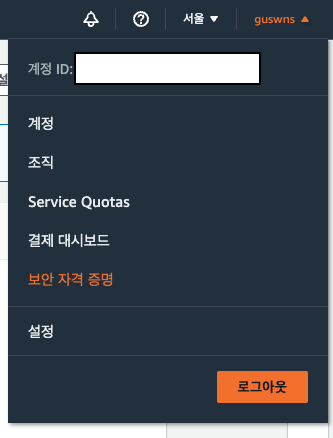
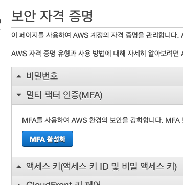
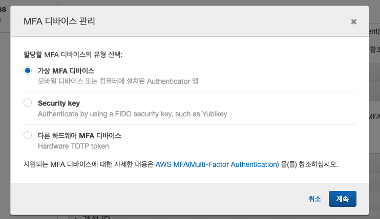
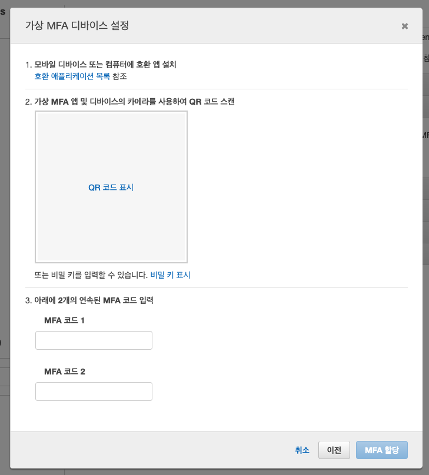
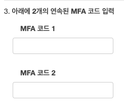
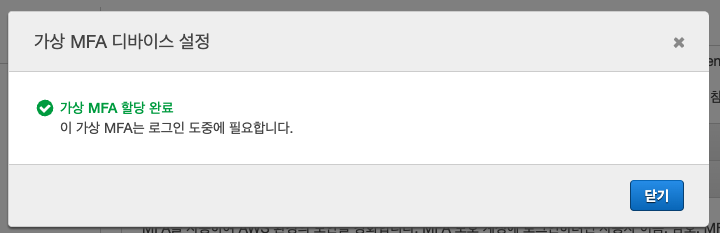
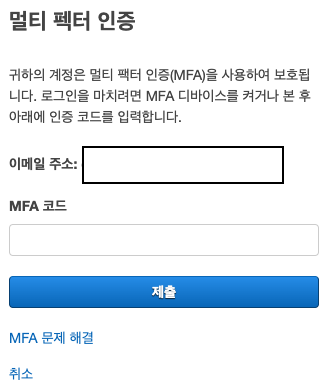

          개발 환경 
          - 2021, 맥북 프로 M1 Pro 14인치 모델  
          - Ventura 13.1

# AWS 보안의 중요성

AWS는 전세계에서 사용하는 만큼, 보안에 유의해야 합니다.  
강의 수강, 실습 시에도 모두 MFA 계정으로만 사용해 주시고,  
쓰지 않는 인스턴스는 꼭 모두 종료해 주세요.

실행 중 인스턴스가 0일 경우, 종료할 인스턴스가 없는 것입니다!  
AWS를 사용하지 않을 계획이시라면 ‘계정 해지’를 권해드려요:)

OTP를 걸지 않고 키 파일을 털릴 경우 해킹의 먹잇감이 되며 몇억의 요금이 청구된다는 안타까운 사례들도 있습니다.

[해킹 사례](https://www.clien.net/service/board/park/17225662)

## google otp
본인의 휴대폰에 google otp 앱을 설치해 주세요.

## MFA
아래 콘솔 접속 후  
[콘솔 홈 접속](https://ap-northeast-2.console.aws.amazon.com/console/home?region=ap-northeast-2#)

보안 자격 증명 클릭

MFA 활성화 클릭

가상 MFA 디바이스 -> 계속

핸드폰으로 google OTP(Authenticator) 접속

+ 클릭 후 QR코드 스캔 터치

QR 코드 표시 클릭 후 핸드폰으로 QR 스캔

핸드폰에 뜨는 6자리 숫자키를 코드 1에 넣고, 다음 번 6자리 숫자키를 코드 2에 넣고 MFA 할당 클릭  

-> 이제 로그인할 때 핸드폰 앱에서 숫자 6자리를 입력해 주면 된다.

[AWS 계정 해지 방법](https://aws.amazon.com/ko/premiumsupport/knowledge-center/close-aws-account/)