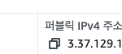
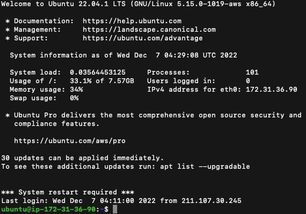

          개발 환경 
          - 2021, 맥북 프로 M1 Pro 14인치 모델  
          - Ventura 13.1

# AWS 인스턴스에 접속해 보기.

## .pem 파일 권한 설정
터미널 실행 후 아래의 코드를 입력한다.    
( 400까지 입력 후 키 페어 파일을 터미널로 드래그 앤 드랍하면
키 페어 파일의 경로가 자동으로 등록된다. )

    sudo chmod 400 /Users/honggildong/Downloads/gildong_mykey.pem 

키 페어 파일에 대한 권한을 나에 한해서 읽기 권한 4로 사용할 수 있게 해주는 것이다.

## ssh를 이용하여 접속

일단 ec2 인스턴스를 접속해 자신의 퍼블릭 주소를 복사한다.  

pem 파일 경로에는 pem 파일을 드래그 앤 드랍 하면 된다. (IP 주소는 예시 주소)  
ssh를 통하여 우리의 서버에 원격 접속하게 되는 것이다.

    ssh -i pem 파일 경로 ubuntu@3.44.122.122 

Are you sure you want to continue connecting (yes/no) 같은 말이 나온다면  
yes라고 입력하면 된다.

키 페어 파일이 서버에 접속할 수 있는 열쇠가 되는 것!

그럼 아래와 같이 기본적인 서버 정보가 나온다!
