결제 대시보드 클릭  
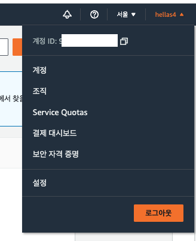

프리 티어 사용량 알림 받기, 결제 알림 받기 클릭 후  
자신의 이메일 주소 입력 후 저장하면 됩니다.  
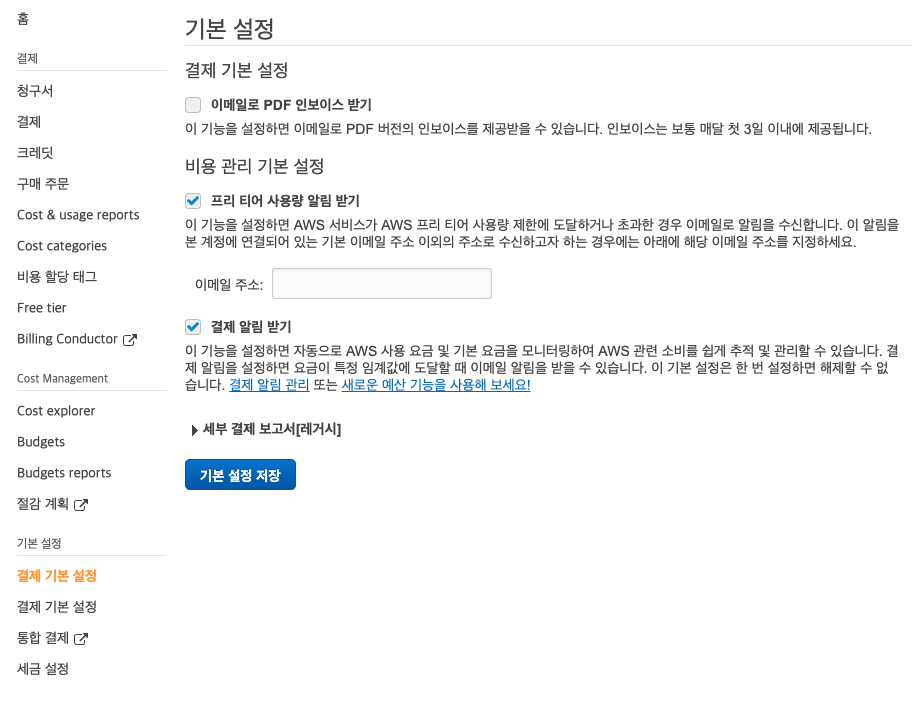

- 프리 티어 사용량 알림 받기  
현재 사용하고 있는 프리 티어의 사용한도를 초과하면 이메일로 알람이 옵니다.

- 결제 알림 받기  
요금이 특정 임계값에 도달할 때 이메일을 알림이 옵니다.

임계값 설정하기.  
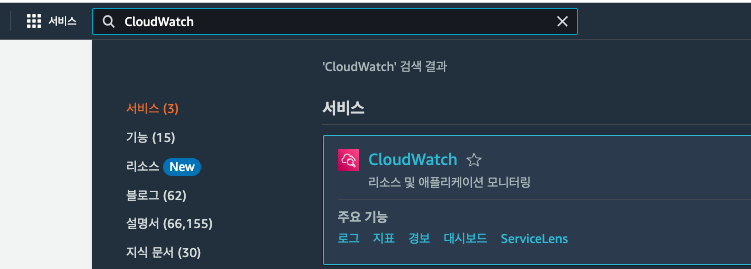

요금과 관련된 설정(정보)가 버지니아 북부에 있기 때문에 지역 변경
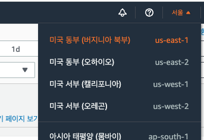

경보 -> 결제 클릭  
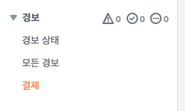

경보 생성 클릭
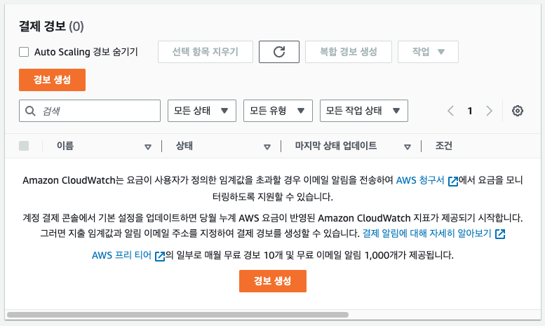

저는 50달러의 요금이 넘게 나오면 알림이 오도록 설정해 주었습니다.
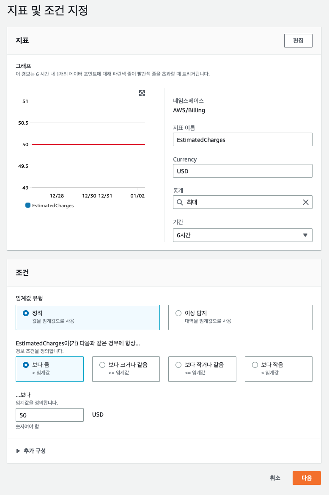

이메일 엔드 포인트에 자신의 이메일을 적고 주제 생성 클릭!
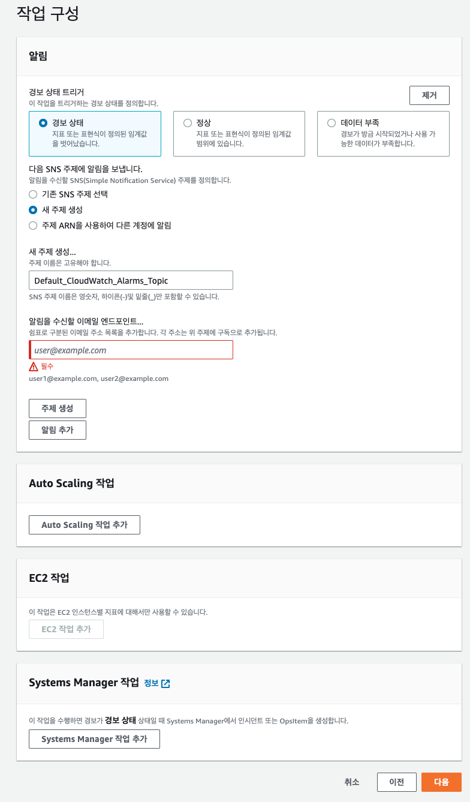

아래와 같이 됐다면 다음 클릭
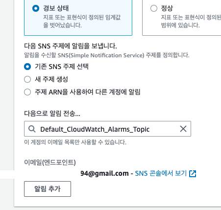

원하는 대로 설정 후 다음 클릭
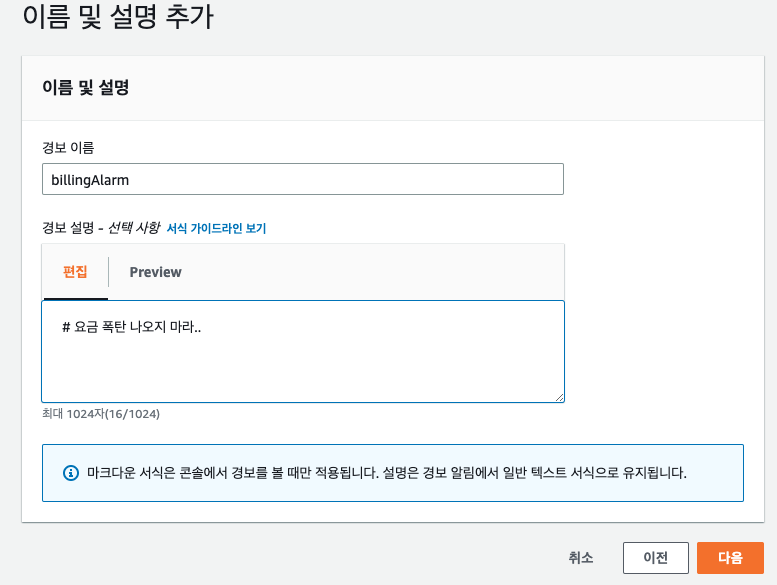

마지막으로 최종 확인 후 경보 생성 클릭
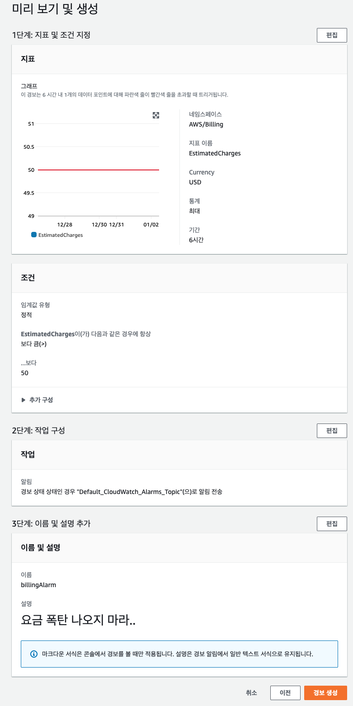

처음엔 이렇게 데이터 부족이라고 나오실 텐데요
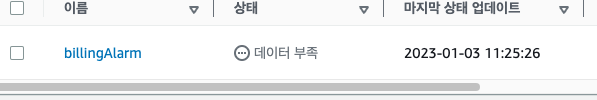

아마 조금 기다리시고 아래처럼 정상이 뜨면 완료입니다!
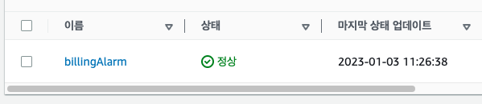