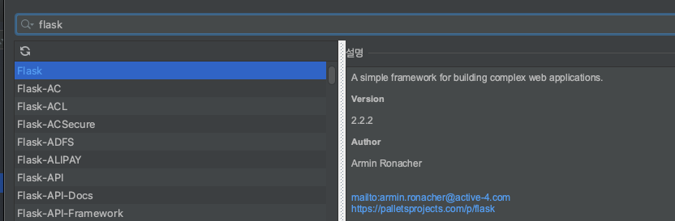

<div class="notice" style="text-align:center">
          개발 환경<br>
          - 2021, 맥북 프로 M1 Pro 14인치 모델 <br>
          - Ventura 13.1
</div>
<hr>

<div class="notice--info" style="text-align:center">
          버전<br>
          Python 3.9<br>
          Flask 2.2.2<br>
          PyCharm 2022.2.3 (Professional Edition)
</div>
<hr>


# Flask란 무엇 일까.

파이썬 기반의 웹 개발용으로 나온 프레임워크이다.
자바 기반의 스프링과 비슷하지만, 좀 더 쉽고, 가벼운 프레임워크라고 생각하면 된다.

우리나라에서는 자바 스프링, 노드js가 많이 쓰이고 있지만,
외국에서는 사이트마다 다르지만 스프링보다 랭킹이 높은 곳도 있다.


## Flask 설치
자신이 사용하는 환경에 맞춰 설치하면된다.

파이참의 경우  



## Flask의 Controller

```python
from flask import Flask 
app = Flask(__name__) . # flask 객체 생성

@app.route('/')         # 홈페이지 입장 시 바로 보여줄 페이지
def hello():
    return 'Hello world'

if __name__ == '__main__':  
    app.run('0.0.0.0', port=5000, debug=True) ## 서버 포트 설정 debug=True -> 파일 변경시 서버를 자동으로 재시작 해준다.
```

