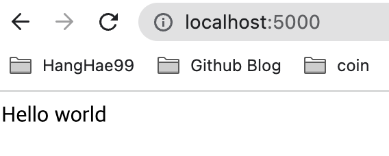

<div class="notice" style="text-align:center">
          개발 환경<br>
          - 2021, 맥북 프로 M1 Pro 14인치 모델 <br>
          - Ventura 13.1
</div>
<hr>

<div class="notice--info" style="text-align:center">
          버전<br>
          Python 3.9<br>
          Flask 2.2.2<br>
          PyCharm 2022.2.3 (Professional Edition)
</div>
<hr>


# Flask란 무엇일까.


파이썬 기반의 웹 개발용으로 나온 프레임워크이다.  
자바 기반의 스프링과 비슷하지만, 좀 더 쉽고, 가벼운 프레임워크라고 생각하면 된다.

"마이크로 프레임워크"라고도 한다.

우리나라에서는 자바 스프링, 노드 js가 많이 쓰이고 있지만,  
외국에서는 사이트마다 다르지만 스프링보다 랭킹이 높은 곳도 있다.

플라스크는 WSGI 프레임워크로서 가볍고, 빠르고,  쉽게 시작할 수 있습니다.  
필요하다면, Jinja2를 사용하여 프론트엔드에서 동적인 기능을 구현할 수도 있습니다


- 장점
- 매우 빠른 속도로, 간편하게 웹 개발을 시작할 수 있다.


- 단점
- WSGI 방식은 구조적으로 한 번에 많은 트래픽을 처리하기엔 느리다는 단점이 있습니다.
- 가벼운 프레임워크라는 말은 개발자가 하나부터 열까지 다 해야 한다는 말이라고도 볼 수 있습니다.

<br>

# mvc 패턴
웹 서비스를 구축할 때, insert, select, update, delete (CRUD)기능을 구현하며 동작하게 되는데,  
이러한 구조는 MVC 패턴 즉, Model, View, Controller에 의해 구조화가 된다.


Model : DB(Data Base)를 처리하는 곳  
View : HTML을 화면에 띄워주는 것   
Controller : 클라이언트와 서버의 상황을 제어 관리하는 것


## Flask 설치
자신이 사용하는 환경에 맞춰 터미널 혹은 IDE 패키지 관리자에서 설치하면 된다.

파이참의 경우  


## 초기화

- 모든 플라스크 애플리케이션은 인스턴스를 생성해야 사용할 수 있다.
- 웹 서버는 클라이언트로부터 수신한 모든 request를 이 오브젝트에서 처리하는데  
이때 웹 서버 게이트웨이 인터페이스 WSGI라는 프로토콜을 사용한다.

애플리케이션 인스턴스는 Flask 클래스의 오브젝트이며 다음과 같이 생성된다.

```python
from flask import Flask # Flask 모듈을 import 하고 Flask 웹 서버를 생성한다.
app = Flask(__name__) # __name__은 현재 파일을 의미함. filename.py가 된다. app이라고 하는 Flask 인스턴스를 생성한다. 새로운 웹 앱이 생성된다.
```

## 라우트와 뷰 함수
- 웹 브라우저 같은 클라이언트는 웹 서버에 request를 전송하며 애플리케이션 인스턴스에 교대로 전송한다.  
- 애플리케이션 인스턴스는 각 URL request 실행을 위해 어떤 코드가 필요한지 알아야 하며, 따라서 URL을 파이썬 함수에 mappingg 하는 기능이 필요하다.
- 이 URL과 이 URL을 처리하는 함수의 관련성을 라우트(route)라고 한다.
- 플라스크 앱(애플리케이션)에서 라우트를 정의하는 가장 손쉬운 방법은 앱 인스턴스에서 app.route 데코레이터를 사용하는 것이다.
- 데코레이터 함수를 라우트로 등록한다.
- 다음은 라우트가 데코레이터를 이용하여 어떻게 선언되는지 보여준다.


```python
@app.route('/')   
def hello():
    return 'Hello world'
```

- 설정한 로컬 IP로 브라우저(클라이언트)에서 접속하면, 서버에서 hello()가 실행된다.
- 이 함수의 return 값은 응답(response)이라고 하는데 클라이언트가 받는 값이다.
- 클라이언트가 웹 브라우저면 응답은 사용자가 보게 되는 문서이다.
- hello()와 같은 함수를 뷰 함수(view function)라고 한다.


- 우리가 사용하는 URL은 다음과 같이 되어 있다.
- http://www.facebook.com/your-name
- 플라스크는 이러한 여러 가지 타입의 URL을 route 데코레이터에 있는 특별한 문법을 사용해서 지원한다.
- 다음 코드는 동적 이름 컴포넌트를 갖는 라우트를 정의한다.

```python
@app.route('/users/<name>')   
def user(name):
    return 'Hi %s' % name
```

- 꺾쇠괄호로 닫혀 있는 부분이 동적 부분이며 정적 부분과 매칭되는 URL이 이 라우트에 매핑된다.
- 뷰 함수가 실행되면 플라스크는 동적 컴포넌트를 인수로 전송한다.
- 뷰 함수의 이전 예제에서 이 인수는 응답으로 'Hello World'를 생성하였다.
- 라우트에 있는 동적 컴포넌트는 기본적으로 문자열이지만 타입에 의해 정의될 수도 있다.
- 예를 들어 라우트 /user/<int:id>는 id 동적 세그먼트에서 정숫값을 찾는 URL에만 매칭된다.
- 플라스크는 라우트에 대해 int, float, path를 지원한다.


## 서버 시작
- 애플리케이션 인스턴스는 run 메소드를 갖고 있는데 이 메소드는 플라스크의 통합 개발 웹 서버를 실행한다.


```python

if __name__ == '__main__':
    app.run('0.0.0.0', port=5000, debug=True)

```

- __name__ == '__main__' 은 스크립트가 직접 실행될 때만 개발 웹 서버가 실행된다는 것을 알려준다.
- 스크립트가 다른 스크립트에 의해 임포트 되며 부모 스크립트는 다른 서버를 실행할 수 있으며 따라서 app.run() 호출은 건너뛰게 된다.
- 서버가 실행되고 나면 서버는 루프를 진행하며 리퀘스트를 기다리고 리퀘스트를 서비스하게 된다.
- Ctrl+C로 중지 가능하다.


- app.run()에 주어진 여러 가지 옵션 인수를 사용하여 웹 서버의 오퍼레이션 모드를 설정할 수 있다.
- 개발 과정에서 이러한 기능은 디버그 모드를 사용할 수 있도록 하기 때문에 편리하며 디버거(debugger)와 리로더(reloader)를 활성화할 수도 있다. 이것은 debug 인수를 True로 설정하면 된다.

- debug=True : 파일 변경 시 서버를 자동으로 재시작 해준다.


## 해보기

정적 라우팅, 동적 라우팅해보기

```python
from flask import Flask
app = Flask(__name__)


@app.route('/')
def index():
    return 'Hello world'


@app.route('/users/<name>')
def user(name):
    return 'Hi %s' % name


if __name__ == '__main__':
    app.run('0.0.0.0', port=5000, debug=True)
```


### 정적 라우팅 



### 동적 라우팅 


<br><br>

# 리퀘스트-응답 사이클

## 애플리케이션과 리퀘스트 컨텍스트

- 플라스크가 클라이언트에서 리퀘스트를 수신하면 이 리퀘스트를 처리하기 위해 뷰 함수에서는 사용 가능한 몇 개의 오브젝트를 생성해야 한다.
- 좋은 예는 Request Object인데 이 오브젝트는 클라이언트에 의해 송신된 HTTP 리퀘스트를 캡슐화한다.
- 플라스크에서 뷰 함수가 Request Object를 액세스할 수 있도록 하는 확실한 방법은 인수로서 리퀘스트 오브젝트를 전송하는 것이다. 그러나 이 방법은 애플리케이션의 모든 뷰 함수가 각각 여분의 인수를 갖도록 요구한다.
- 리퀘스트 오브젝트만이 뷰 함수가 리퀘스트를 액세스해야 하는 오브젝트가 아니라는 사실을 고려해 보면 좀 더 복잡해진다.
- 뷰 함수가 필요하지도 않은 너무 많은 인수를 갖는 것을 피하기 위해 플라스크는 컨텍스트(Context)를 사용하여 임시적으로 오브젝트를 글로벌하게 액세스하도록 한다.
- 뷰 함수는 다음과 같이 작성할 수 있다.


```python
from flask import Flask
from flask import request
app = Flask(__name__)


@app.route('/')
def index():
    user_agent = request.headers.get('User-Agent')
    return '<p>Your browser is %s</p>' % user_agent


if __name__ == '__main__':
    app.run('0.0.0.0', port=5000, debug=True)
    
```

- 스레드들이 동시에 서로 다른 클라이언트가 요청하는 서로 다른 리퀘스트를 처리하는 멀티 스레드 서버를 고려한다면 실제로 request는 전역변수가 될 수는 없다.
- 따라서 각 스레드는 request에 있는 다른 오브젝트를 처리하게 된다.
- 컨텍스트를 사용하면 플라스크는 다른 스레드의 개입 없이 임의의 변수들이 전역적으로 스레드에 액세스 될 수 있도록 해 준다.
- 플라스크에는 두 가지 컨텍스트가 있다. 하나는 애플리케이션 컨텍스트이고 다른 하나는 리퀘스트 컨텍스트이다.


## 리퀘스트 디스패치
- 애플리케이션의 클라이언트에서 리퀘스트를 수신하면, 그것을 서비스하기 위해 실행할 뷰 함수가 무엇인지 검색해야 한다.
- 이를 위해 플라스크는 애플리케이션 URL 맵에서 리퀘스트에 주어진 URL을 검토하고 그것을 처리할 뷰 함수에 URL의 매핑을 포함하고 있는지 찾는다.
- 플라스크는 이 맵을 app.route데코레이터나 데코레이터를 사용하지 않은 버전인 app.add_url_rule()를 사용하여 빌드한다.

```python
    >>> app.url_map
    Map([<Rule '/' (HEAD, GET, OPTIONS) -> index>,
    <Rule '/static/<filename>' (HEAD, GET, OPTIONS) -> static>])
```

- URL 맵에 있는 HEAD, GET, OPTIONS 항목은 라우트에 의해 처리되는 리퀘스트 메소드(Reuest method)다.
- 플라스크는 각 라우트에 대한 메소드를 부착(attach)하며, 따라서 같은 URL에 서로 다른 리퀘스트 메소드라고 하더라도 다른 뷰 함수에 의해 처리된다.


## 리퀘스트 후크
- 때로는 각각의 리퀘스트를 처리하기 전후에 코드를 실행하는 것이 유용하다.
- 예를 들어, 각 리퀘스트의 시작 부분에서 Database Connection을 해야 하는 경우, 리퀘스트를 생성하는 사용자를 인증해야 하는 경우 등이 있다.
- 모든 뷰 함수에서 이러한 작업을 처리하는 코드를 중복하여 생성하는 대신에 플라스크에서는 옵션을 제공하여 공통 함수를 등록하고 리퀘스트가 뷰 함수에 디스패치되는 전후에 실행되도록 한다.
- 리퀘스트 후크는 데코레이터를 사용하여 구현하며 플라스크에서 제공하는 네 개의 후크는 다음과 같다.
- before_first_request, before_request, after_request, teardown_request
- 리퀘스트 후크 함수와 뷰 함수 사이에 데이터를 공유하기 위한 공통 패턴은 g 컨텍스트 전역 변수를 사용하는 것이다.
- 예를 들어, before_request 핸들러는 데이터베이스에서 사용자에 대한 로그를 로드하여 g.user에 저장한다.
- 이후에 뷰 함수가 호출되었을 때 그 저장된 곳에서 사용자를 액세스하게 된다.

### 응답
- 플라스크가 뷰 함수를 호출할 때 리퀘스트에 대한 응답(response)으로 값을 리턴하게 된다.
- 대부분의 경우 응답은 간단한 문자열이며 HTML 페이지로 클라이언트에 전송된다.
- 그러나 HTTP 프로토콜은 리퀘스트에 대한 응답으로 문자열 이상의 것을 요구한다.
- HTTP 응답의 가장 중요한 부분은 상태 코드(Status Code)이며 플라스크에서는 기본적으로 200으로 설정한다.
- 이 코드는 리퀘스트가 올바르게 처리되었는지 알려준다.
- 뷰 함수가 다른 상태 코드를 갖는 응답을 필요로 할 때, 응답 텍스트 이후에 두 번째 리턴 값으로 뉴메릭(numeric) 코드를 추가할 수 있다.
- 예를 들어 다음의 뷰 함수는 400 상태 코드를 리턴하는데 이는 잘못된 리퀘스트 에러 코드이다.

```python
from flask import Flask
from flask import request
app = Flask(__name__)


@app.route('/')
def index():
    return '<p>Hello world</p>', 400


if __name__ == '__main__':
    app.run('0.0.0.0', port=5000, debug=True)
```


- 플라스크 뷰 함수는 하나, 두 개 혹은 세 개의 값을 튜플(tuple)로 리턴하는 대신 Repsonse 오브젝트를 리턴하는 옵션을 갖는다.
- make_response() 함수는 한 개, 두 개 혹은 세 개의 인수를 가지는데 이는 뷰 함수에서 리턴되는 것과 같은 값이며 Response 오브젝트를 리턴한다.