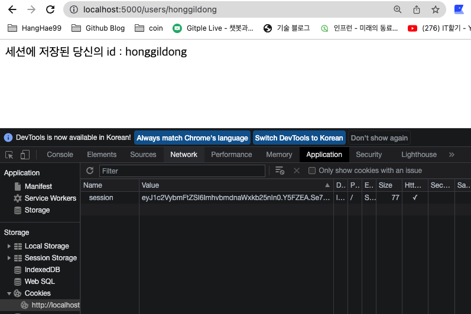
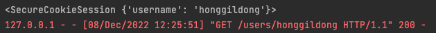
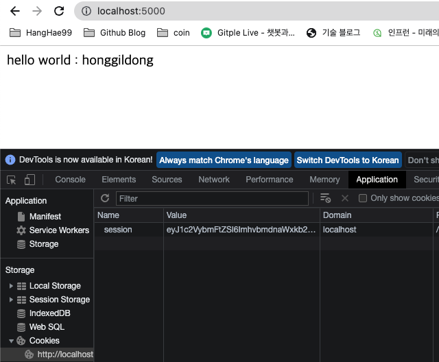
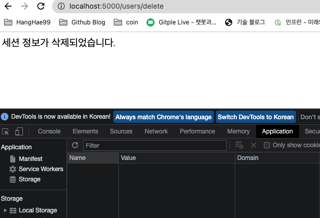
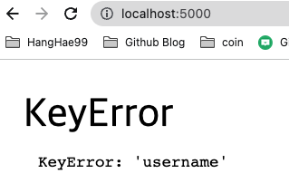
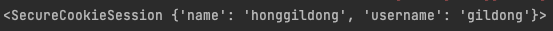
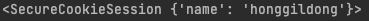
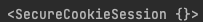

<div class="notice" style="text-align:center">
          개발 환경<br>
          - 2021, 맥북 프로 M1 Pro 14인치 모델 <br>
          - Ventura 13.1
</div>
<hr>

<div class="notice--info" style="text-align:center">
          버전<br>
          Python 3.9<br>
          Flask 2.2.2<br>
          PyCharm 2022.2.3 (Professional Edition)
</div>
<hr>


[세션의 기본 원리 참조](https://thecodinglog.github.io/web/2020/08/11/what-is-session.html)


기본적으로 session, escape는 falsk 패키지에 포함되어 있다.

```python
from flask import Flask
from flask import session, escape
```

<br>

세션 생성하기
- 세션 패키지를 임포트 해오고 서버를 킬 때 이미 세션이 생성되므로  
세션에 값을 넣는다는 게 더 맞는 표현인 것 같다.

```python
@app.route('/users/<id>')
def users(id):

    # 세션에 'username'이라는 Key에 id라는 value를 추가했다.
    session['username'] = id
    print(session)

    return '<p>세션에 저장된 당신의 id : %s</p>' % id
```

<br> 

클라이언트 측 브라우저의 개발자 도구로 확인해 보면 쿠키에  
세션 정보가 담긴 데이터가 하나 오는데,  


이 Value 값은 (session[''] = a)처럼 값을 담을 때 바뀌며  
응답받은 페이지 하나당 하나의 세션 쿠키만을 가지고,  

서버 측에서 같은 세션을 공유하는 경우 (a = session[''])에는 바뀌지 않는다.  
이 Value 값은 개발자 도구에서 바꿀 수 있는데

바꾸는 경우 서버에 가지고 갈 열쇠의 모양이 바뀌었다고 생각해도  
되기 때문에 서버에 있는 세션 안 데이터를 가저 오지 못할 것이다.  


서버에서 본 세션에 담긴 정보



클라이언트 측 -> 서버에 가지고 갈 열쇠, 세션 안 데이터가 아닌 세션을 가리키고 있는 정보인 쿠키를 들고 서버에 간다.  
서버 측 -> 클라이언트가 들고 온 열쇠가 서버에 세션과 맞는지 확인 후 서버의 세션에 저장된 데이터를 사용한다.

index page

```python
@app.route('/')
def index():

    id = session['username']

    return '<p>hello world : %s</p>' % id
```

<br> 
이미 저장되어 있기 때문에 어떠한 url로 접속해도 username이 남아있다.  
(세션 생성되는 부분에서 스크린샷을 찍고 여러 번 생성을 해서 세션 쿠키 Value 값이 다릅니다.)  



세션 정보를 삭제해 보았다.

```python
@app.route('/users/delete')
def user_delete():

    session.pop('username', None)

    return '세션 정보가 삭제되었습니다.'
```




<br>

이후 세션이 남아있나 확인을 하려고 /  <- url로 들어가면? 아래와 같은 에러가 발생한다.



에러가 난 이유는??  
세션을 삭제했기 때문에, 
session['username']에서 'username'을 찾을 수 없어 나는 에러이다.

그러므로 세션 값이 존재하는지 안 하는지부터 확인을 하고 다음 로직으로 넘겨야 한다!

```python


    if('username' in session):
        print("세션 있음")
        return '<p>{}님 안녕하세요.'.format(escape(session['username'])) + '</p>'

    else:
        print("세션 없음")
        return '<p>로그인해 주세요.</p>'

```


## pop()과 clear()의 차이?


```python
@app.route('/users/<id>/<name>')
def users(id, name):


    session['username'] = id
    session['name'] = name
    print(session)

    return '완료'
```




위와 같이 사용한다고 치면! ( 세션에 여러 데이터가 담긴 경우 )

pop으로  username을 삭제한 경우
```python
    ## session.clear()와 차이는?
    session.pop('username', None)
    print(session)
```

아래처럼 pop으로 제거한 내용만 제거되고 나머지 값은 남아있지만  



clear()로 삭제한 경우

```python
@app.route('/users/delete')
def user_delete():

    session.clear()
    print(session)

    return '세션 정보가 삭제되었습니다.'
```

clear의 경우 세션 안 모든 값을 삭제한다.  




<br><br>

++ 여러 url에서 세션에 값을 담는 경우

예를 들어 A라는 페이지는 유저의 ID, Name을 세션에 담고
B라는 페이지는 유저의 Age를 담는 경우

클라이언트는 응답받은 하나의 페이지(A)에서 한 개의 세션 벨류 값을 가지고,  
B라는 페이지에 접속 시 다른 벨류 값을 가진 세션 쿠키를 가지고 오지만,

서버에서의 세션 데이터인 ID, Name, Age는 변하지 않는다.
-> B 페이지의 쿠키 값만 가지고 있어도 ID, Name, Age 사용 가능