

          개발 환경 
          - 2021, 맥북 프로 M1 Pro 14인치 모델  
          - Ventura 13.1

          버전 
          JDK: java version "11.0.17" 2022-10-18 LTS 
          IntelliJ: IntelliJ IDEA 2022.2.3 (Community Edition)

 

# 인텔리 제이 프로젝트 생성 및 Git 연동하기.

인텔리 제이로 프로젝트 생성 후, Share Project on Github 클릭  
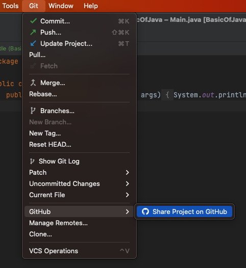

생성할 repo 네임과, 리모트, Description을 설정 후 Share 클릭
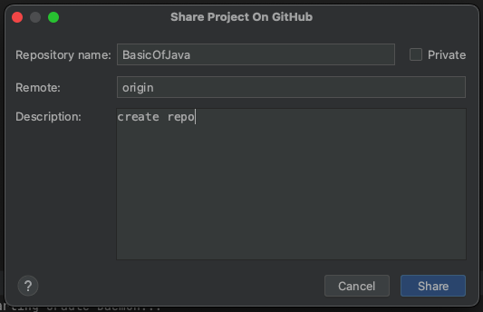

최초 커밋  add 클릭
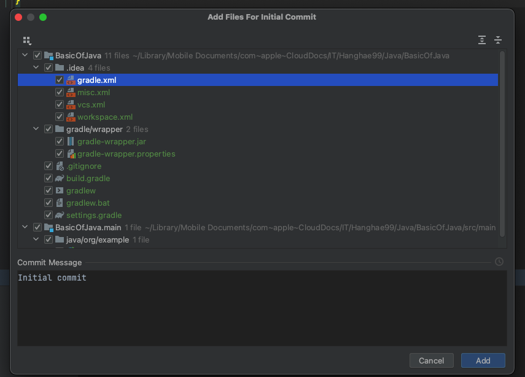

아래처럼 나오면 성공!  

-- 전, 후 과정 중 아래 에러 발생한다면 목차에 core.autocrlf 참조해 주세요 --
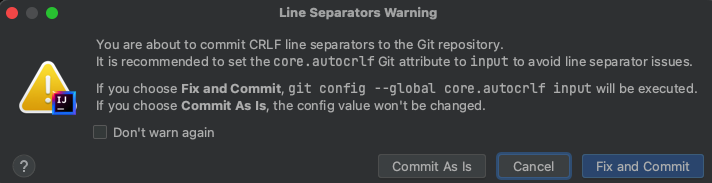

깃허브 로그인 관련 인증이 나온다면 아래 과정을 진행해 주면 된다.

## Github 인증

Log in via Github 클릭
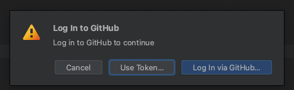

Authorize In Github 클릭
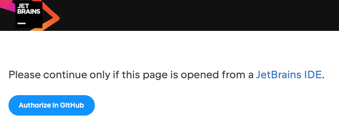

인텔리 제이는 열심히 로딩 중..  
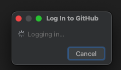

그럼 아래와 같이 젯브레인 IDE(인텔리 제이)랑 자신의 깃이랑 인증하는  
절차가 나오는데 (아마 로그인 안 되어있으면 로그인하시고) Authorize JetBrains 클릭  
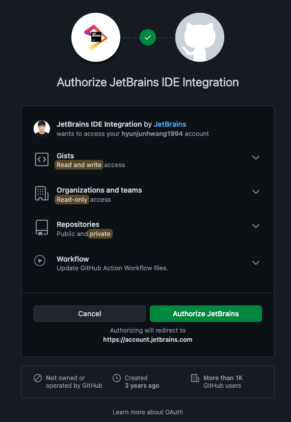

Use GitHub Mobile 클릭  
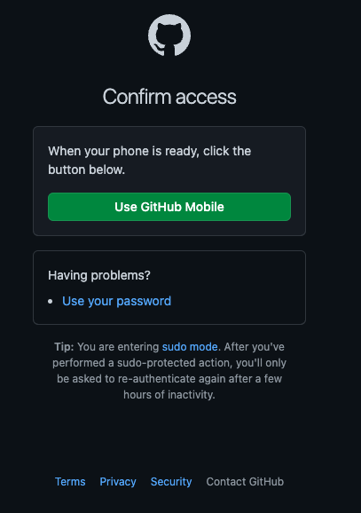

자신의 인증 방식에 따라 인증 진행!  
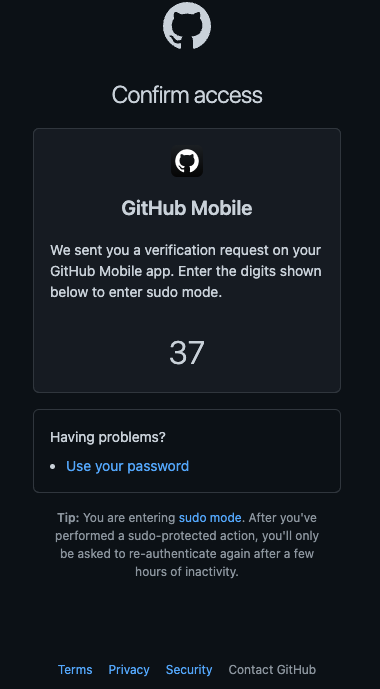

그럼 다시 젯브레인 화면에 아래와 같이 성공 메세지가 뜨고  

다시 인텔리 제이로 돌아와서, 그럼 이제 레파지토리는 만들어진 것이다!!  
자신의 깃허브 레포지토리를 들어가 보면?  
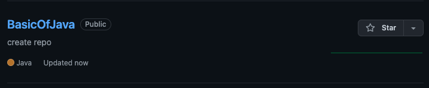

인텔리 제이에서 바로 깃허브로 올라간다.
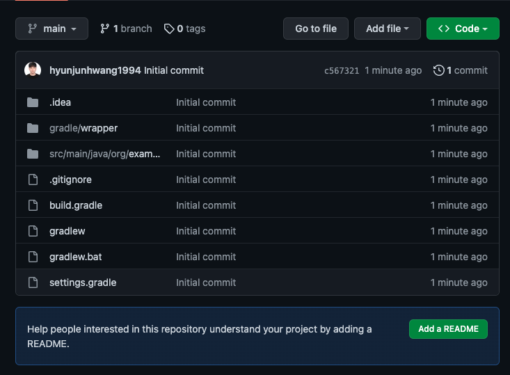

브랜치 확인  
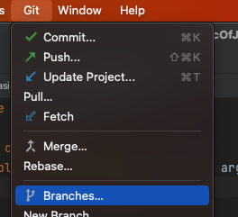

origin/main이 있어야 한다!  
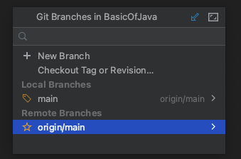

## core.autocrlf  
[core.autocrlf 참조 블로그](https://uxicode.tistory.com/entry/git-%EC%A4%84%EB%B0%94%EA%BF%88-%EB%AC%B8%EC%9E%90-%EB%AC%B8%EC%A0%9C-If-you-choose-Fix-and-Commit-git-config-global-coreautocrlf-input-will-be-executed-%EC%96%B4%EC%A9%8C%EA%B5%AC)

You are about to commit CRLF line separators to the Git repository.  
It is recommended to set the core. autocrlf Git attribute to input to avoid line separator issues.  

If you choose Fix and Commit, git config --global core.autocrlf input will be executed.  
If you choose Commit As Is, the config value won't be changed.

이와 같은 에러는 윈도우에서는 줄바꿈 문자로 CR(Carriage-Return)과 LF(Line Feed) 문자를 둘 다 사용하지만, 
Mac, Linux는 LF 문자만 사용한다.

Git은 커밋 시 자동으로 CRLF를 LF로 변환해 주고 반대로 Checkout할 때 LF를 CRLF로 변환해 주는 기능이 있다.

core.autocrlf 설정으로 이 기능을 켤 수 있다. 윈도우에서 이 값을 true로 설정하면 Checkout할 때 LF 문자가 CRLF 문자로 변환된다.

줄 바꿈 문자로 LF를 사용하는 Linux와 Mac에서는 Checkout할 때  
Git이 LF를 CRLF로 변환할 필요가 없다. 

게다가 우연히 CRLF가 들어간 파일이 저장소에 들어 있어도 Git이 알아서 고쳐주면 좋을 것이다.  
core.autocrlf 값을 input으로 설정하면 커밋 할 때만 CRLF를 LF로 변환한다.

이 설정을 이용하면 윈도에서는 CRLF를 사용하고 Mac, Linux, 저장소에서는 LF를 사용할 수 있다.  
윈도 플랫폼에서만 개발하면 이 기능이 필요 없다. 이 옵션을 false라고 설정하면 이 기능이 꺼지고 CR 문자도 저장소에도 저장된다:

다시 인텔리 제이로 넘어와서 아래처럼 뜬다면

Fix and commit 클릭하면, 깃이 알아서 CRLF를 변환해 준다.  

## 깃허브에 있는 레포 로컬로 가지고 오는 법
애초에 파일을 생성 시 아래의 방법으로 생성합니다.  

아까 우리의 레파지토리 code에서 링크를 복사 후.
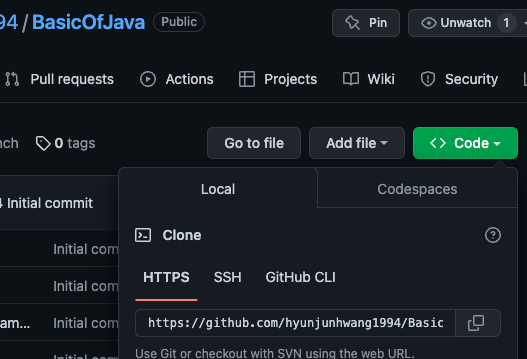

링크 붙이고, 담을 폴더 선택 후 클론!
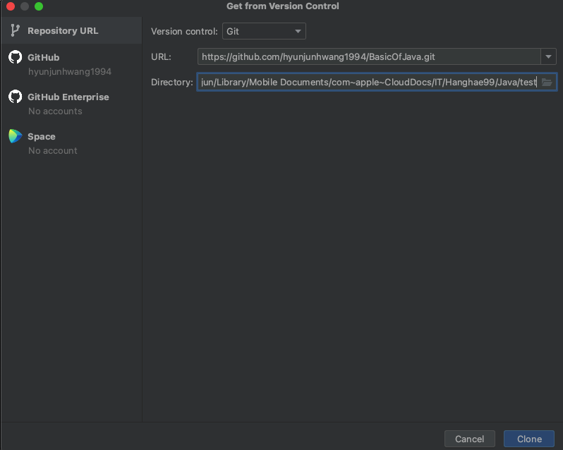

그럼 아래와 같이 잘 나오며,
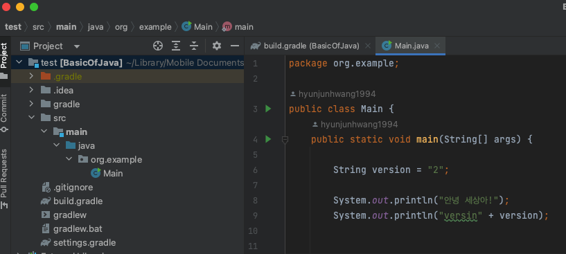

클론을 받은 것과, 해당 깃허브 레파지토리의 브랜치 권한을 가지고 파일을 수정하는 건 다른 얘기이다.  

클론은 그냥 단순히 파일만 가지고 왔다?라고 보면 된다.

깃허브 레포안 메인 브렌치 및 여타 다른 브렌치가 중요 브렌치라 보시면 되고  
사실상 클론 해온 로컬 레포안 브렌치는 깃허브와 연결이 되지 않는다면 깃허브랑 크게 상관없습니다.

