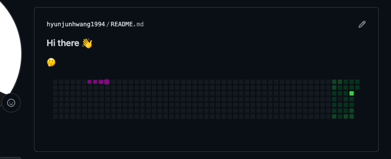
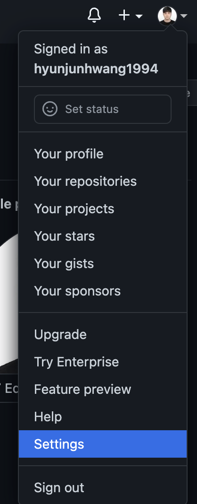
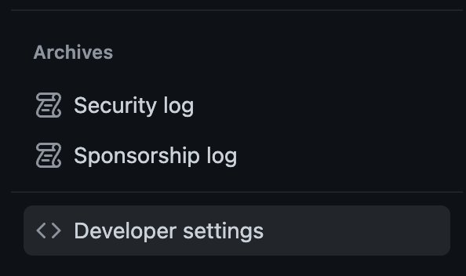
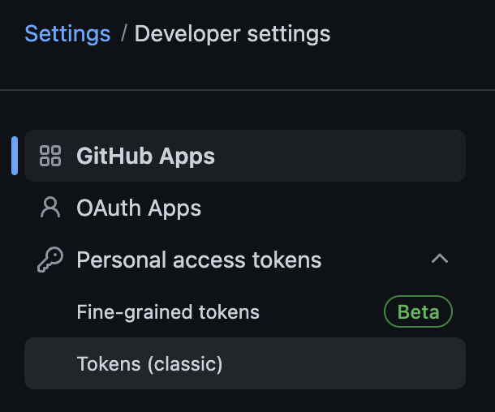
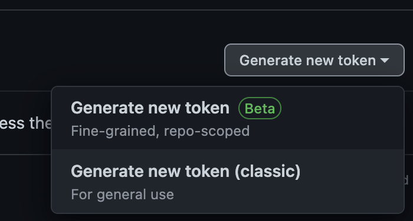
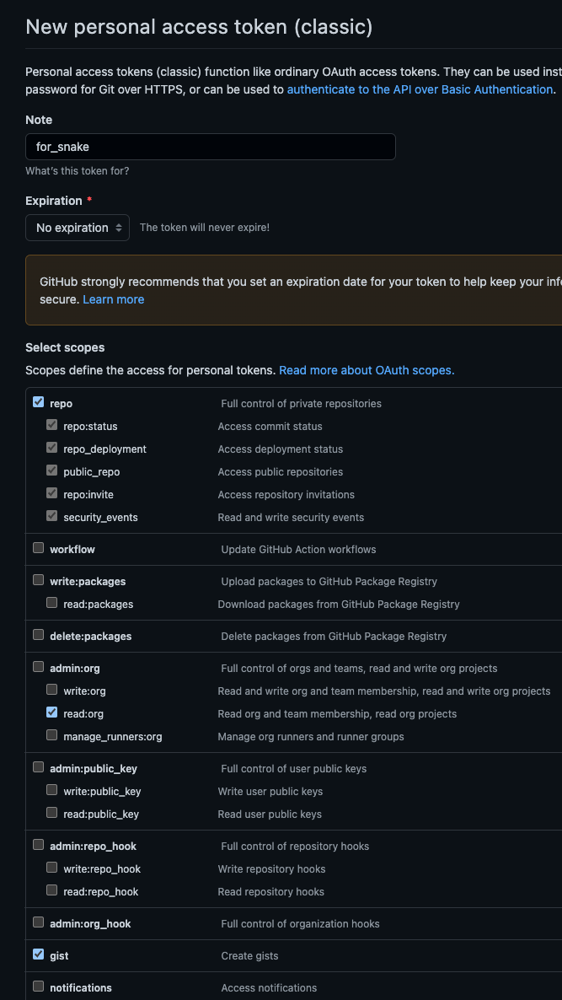
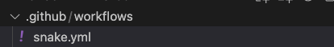
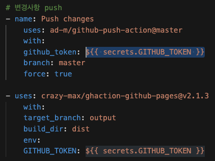
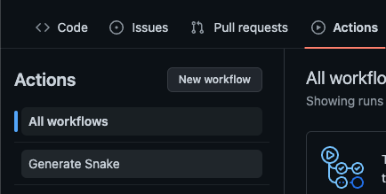
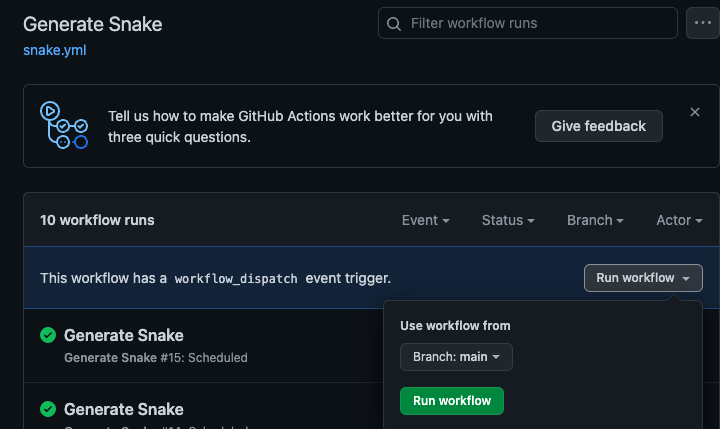

일정 시간마다 자신의 잔디 정보를 기준으로 이미지 형태가 자동으로 만들어지고,  
연한 색 -> 진한 색 잔디 순서로 먹고 원위치로 돌아갑니다.


[참조한 블로그](https://aeda.tistory.com/m/21)


## repo, directory 만들기

본인 계정명 Repo 생성 및, .gihub/workflows를 생성해 줍니다.  
repository 생성 시 readme.md 포함해서 만들어주세요!


자신 본인 id로 레파지토리를 만들고 Readme.md를 만들고 수정하면  
자신의 계정 프로필 방문 시 소개 페이지를 만든 것이 됩니다.


## token 발급받기










옵션 체크 후 제너레이트 클릭


토큰 관련된 정보나 파일은 유출되면 안 됩니다!!

## snake.yml

아까 만들었던 폴더에 snake.yml을 만들고 아래의 내용을 붙여 넣고,  
본인의 계정명을 적어주세요 -> 영문 아이디만 적어주세요.  

snake.yml 파일은 편집기로 하셔서 push 하셔도 되고, 깃허브에서 직접 생성하셔도 됩니다.



```yaml
    # 커밋 먹는 뱀 그래프 생성을 위한 GitHub Action🐍

    name: Generate Snake

    # Action이 언제 구동될지 결정

    on:
    schedule:
        # 6시간마다 한 번(수정 가능)
        - cron: "0 */6 * * *"

    # 자동으로 Action이 실행되도록 함
    workflow_dispatch:

    jobs:
    build:
        runs-on: ubuntu-latest
        steps:
        - uses: actions/checkout@v2

        # 뱀 생성
        - uses: Platane/snk@master
            id: snake-gif
            with:
            github_user_name: !!!본인의 깃허브 계정명 입력 ex) hongildong23 !!!
            # output branch에 gif, svg를 각각 생성
            gif_out_path: dist/github-contribution-grid-snake.gif
            svg_out_path: dist/github-contribution-grid-snake.svg

        - run: git status

        # 변경사항 push
        - name: Push changes
            uses: ad-m/github-push-action@master
            with:
            github_token: ${{ secrets.GITHUB_TOKEN }}
            branch: master
            force: true

        - uses: crazy-max/ghaction-github-pages@v2.1.3
            with:
            target_branch: output
            build_dir: dist
            env:
            GITHUB_TOKEN: ${{ secrets.GITHUB_TOKEN }}
```

GITHUB_TOKEN 부분(아래 참고)에 $\{\{ secrets.GITHUB_TOKEN \}} 내용 2줄 추가해 주세요.




저장 후 Push 해주세요.

## Actions

그다음 본인의 레파지토리 -> Actions를 들어가면 아래처럼  
Generate Snake가 생겨 있습니다. 들어갑시다!




자 이제 Run workflow만 눌러주면 실행됩니다.



이제 본인의 깃허브 계정명 레파지토리 -> readme.md에 아래의 내용만 추가해 주면 자동으로 생성됩니다.
(URL 주소에 아이디 본인의 아이디로 변경하세요.)
```markdown

```

아까 snake.yml에서 적었던 시간(기본 설정 6시간)마다 
본인의 잔디 정보에 따라 Gif(움직이는 뱀))이 재생성되어 프로필 readme.md에 보이게 됩니다.

