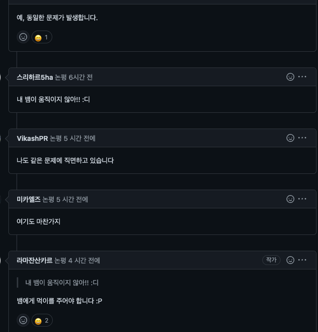
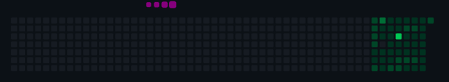

<hr>

어느 날부터 내 깃허브 프로필에 뱀들이 움직이지 않는다..


<hr>

공식 페이지를 확인해 보자 무언가 설정값이 바뀐 것 같습니다.  
아래의 문서에서, 깃허브의 아이디만 입력하면 데모도 돌려볼 수 있는데요 돌려보니 잘 나옵니다.  
[공식 페이지 문서](https://github.com/marketplace/actions/generate-snake-game-from-github-contribution-grid)

<hr>

무언가 제 설정값의 문제 같아서 더 찾아보니 아래처럼 최근에 깃허브 이슈가 올라왔네요.  
[이슈](https://github.com/Platane/snk/issues/58)  


그래서 해당 이슈에, 아래와 같이 코드 예시를 올려준 사람이 있었고  
[코드 예시](https://github.com/Platane/Platane/blob/master/.github/workflows/main.yml#L23-L31)

참조해서 아래처럼 수정하였습니다.

```yml
# 커밋 먹는 뱀 그래프 생성을 위한 GitHub Action🐍

name: Generate Snake

# Action이 언제 구동될지 결정

on:
  schedule:
    # 6시간마다 한 번(수정 가능)
    - cron: "0 */6 * * *"

  # 자동으로 Action이 실행되도록 함
  workflow_dispatch:

jobs:
  build:
    runs-on: ubuntu-latest

    steps:
      - uses: actions/checkout@v2

      # 뱀 생성
      - name: generate github-contribution-grid-snake.svg
        id: snake-gif
        uses: Platane/snk/svg-only@v2
        with:
          github_user_name: hyunjunhwang1994
          outputs: |
            dist/github-contribution-grid-snake.svg
            dist/github-contribution-grid-snake-dark.svg?palette=github-dark

      - run: git status

      # 변경사항 push
      - name: Push changes
        uses: ad-m/github-push-action@master
        with:
          github_token: ${{ secrets.GITHUB_TOKEN }}
          branch: master
          force: true

      - uses: crazy-max/ghaction-github-pages@v2.1.3
        with:
          target_branch: output
          build_dir: dist
        env:
          GITHUB_TOKEN: ${{ secrets.GITHUB_TOKEN }}
```

<hr>

이제 다시 잘 동작하네요!  
