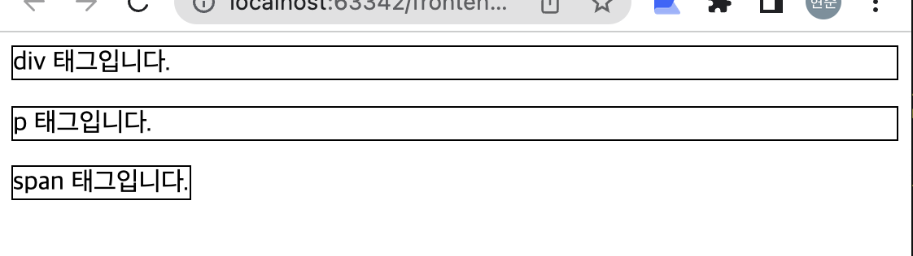

<div class="notice" style="text-align:center">
          개발 환경<br>
          - 2021, 맥북 프로 M1 Pro 14인치 모델 <br>
          - Ventura 13.1 베타
</div>
<hr>

<div class="notice--info" style="text-align:center">
          버전<br>
          PyCharm 2022.2.3 (Professional Edition)<br>
</div>
<hr>


># 블록요소와 인라인 요소

1. div, span, p 태그의 차이는 블록 요소와 인라인 요소에 있습니다.  
div와 p 태그는 블록요소이고, span 태그는 인라인 요소입니다. 

2. div 태그는 레이아웃 계층 나누기 용도,  
span 태그는 특정 문단에 색을 준다던지 강조하기 위해,  
p 태그는 실제 문단(paragraph)을 작성하는 용도이다.

3. 블록 요소는 해당 요소의 영역이 브라우저의 한 줄을 모두 차지한다.  
인라인 요소의 경우 태그안 내용의 길이만큼만 영역을 차지한다.





># 포함 관계

span은 div, p 태그를 포함할 수 없다.

인라인 요소인 span 태그는 블록 요소인 div, p 태그를 자식 요소로 포함시킬 수 없다.

기본적으로 span 안 내용이 짧을경우 작은 요소로 큰 요소를 포함 시킬 수 없으므로 

span 안에는 블록요소를 넣지 않습니다.


반대로, div와 p태그는 span 태그를 포함할 수 있습니다.


p 태그는 div 태그를 포함할 수 없습니다. 
p태그는 기본적으로 문단을 입력하는 용도이므로,  
p태그안에는 블록요소인 div요소는 포함할 수 없습니다.

p태그의 자식요소로써는 span, a, strong등과 같은 인라인 요소만 올 수 있습니다.


```html
<p><div>테스트</div></p>와 같은 형태가 있다면,
<div><p>테스트</p></div>와 같은 형태로 바꾸어야 합니다.
```

div 태그는 p 태그를 포함할 수 있다. 

div태그는 p태그처럼 문자를 입력할 수 있지만 실제용도는 HTML문서의 영역 구분을 하기 위한 요소입니다.
각영역의 용도를 구분하는 기능이므로 다른 블록요소가 하위에 포함될 수 있습니다.

결론적으로,  
단순 텍스트 정보일 경우 p 태그에 사용하고,  
구역을 나누기 위한 용도일 경우 div 태그를 사용합니다.  
또한, 특정 요소를 강조하고 싶은경우 span 태그를 사용하는 것으로,

쓰이는 용도에따라 구분해서 태그를 사용하여야 합니다.
