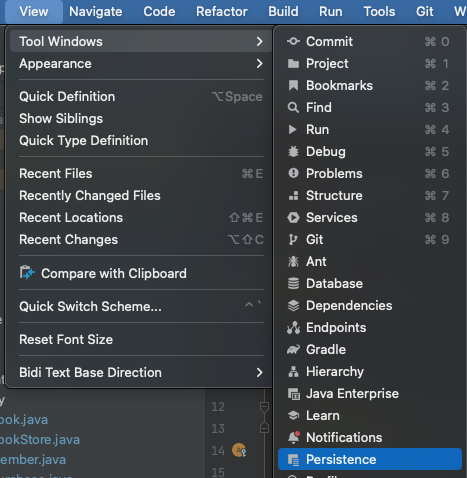
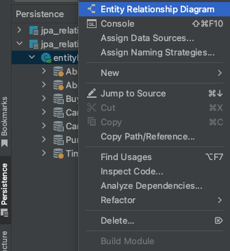
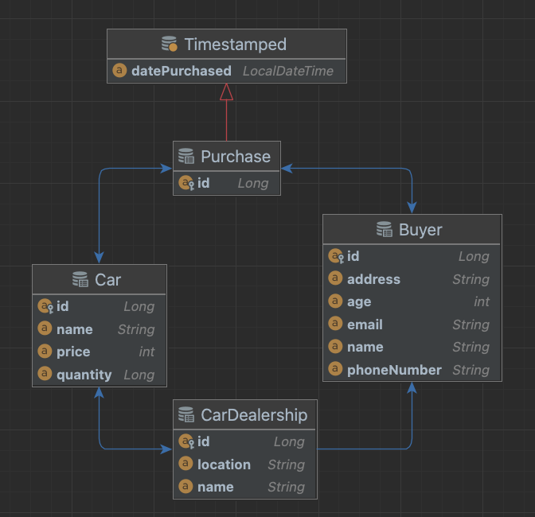
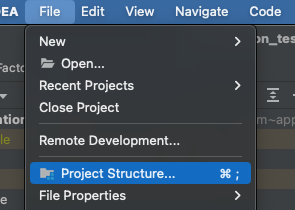
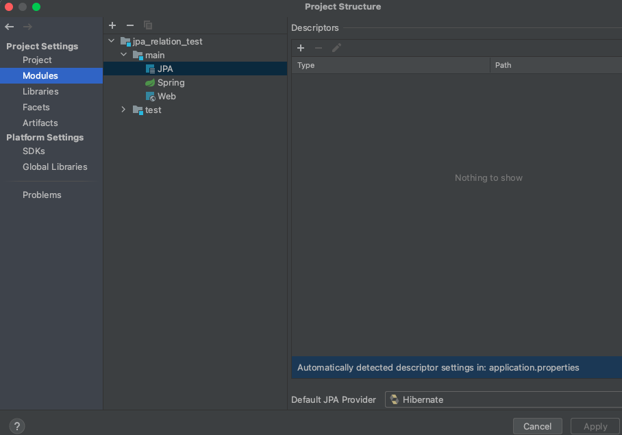

Spring으로 개발을 하다 보면,  
자신이 개발 중인 Entity들을 ERD로 볼 수 있으면 얼마나 편할까?라는 생각이 듭니다.

그래서, 인텔리제이는 JPA의 Entity들을 ERD Diagram으로 볼 수 있는 기능을 제공합니다.

Persistence 탭 생성  

좌측 하단 .main -> entityManagerFactory 우 클릭 ->
Entity Relationship Diagram 클릭  

Entity 간의 관계를 가지고 간단하게 보여주는 것이므로,  
실제 RDB의 ERD처럼 자세히는 안 나오는 것 같습니다.

Persistence에 아무것도 보이지 않거나, 다른 구현체를 사용하시는 경우

아래의 Modules에서 +를 눌러 추가하시거나, Provider 부분을 바꿔주시면 됩니다.
