<!-- 나의 실제 컴퓨터및 컴퓨터 버전 -->

          개발 환경 
          - 2021, 맥북 프로 M1 Pro 14인치 모델  
          - Ventura 13.1

<!-- 자바 포스팅시 JDK, IDE버전 등-->

          버전 
          JDK: openjdk version 1.8.0_352
 
          Eclipse: Version: 2022-09 (4.25.0)

 

JDK 1.8 설치 과정은 아래 링크 참조해 주세요.  
[JDK 1.8 설치](https://hyunjunhwang1994.github.io/java/Java1/)

># 이클립스 설치.
{: .align-center}
## 문제점.
- JDK 1.8 ( ARM ), 최신 이클립스 ( ARM ) 돌리면  
이클립스는 2020 09 버전부터 JDK11 이상 버전만 지원한다.
- JDK 1.8 ( ARM ), 예전 이클립스 ( x64 ) 실행 시 에러 발생.
- JDK 1.8 x64, 예전 이클립스 ( x64 ) 실행 시 작동하나  
비정상적 로딩이라든지 거의 사용 불가.

결론적으로 이클립스 최신 ARM 버전을 JDK17로 일단 설치한 뒤  
설정에서 JRE, 컴파일러를 1.8로 변경하여 사용하고 있습니다.

## 이클립스 설치

[이클립스 설치](https://www.eclipse.org/downloads/)

최신 버전의 AArch64로 받은 후, 실행시켜 줍니다.

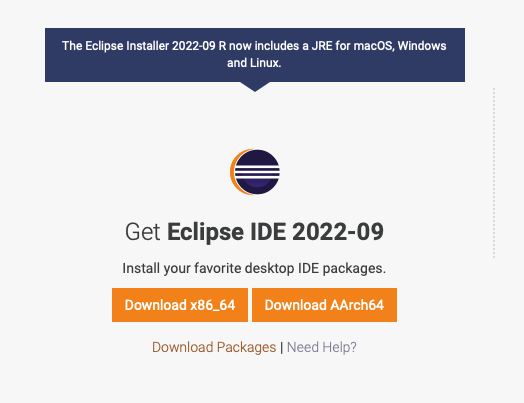{: width="300" height="400"}
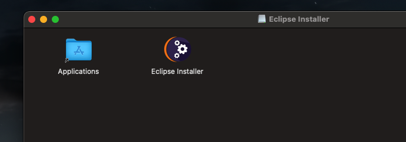{: width="300" height="700"}
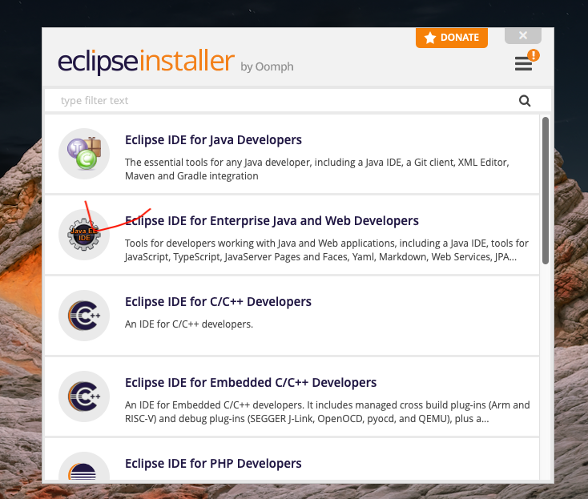

일단 17.0.05로 되어 있는 상태로 설치폴더 놔두고 그대로 설치 및 LAUNCH(실행)까지 시켜 줍니다.  
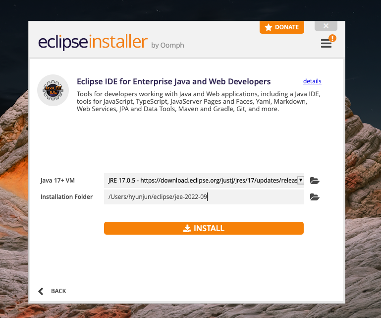{: width="350"}
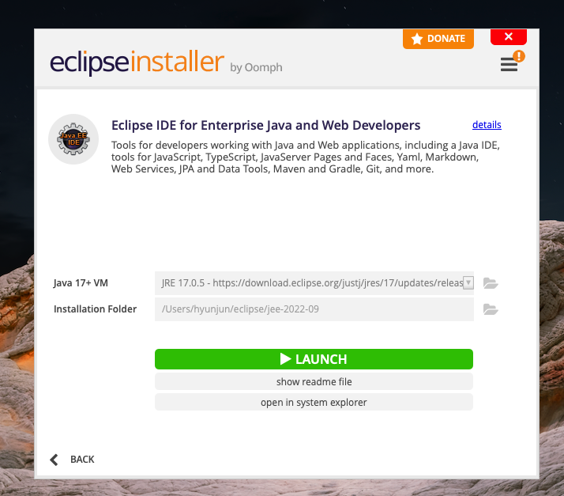{: width="350"}

+이클립스는 아래처럼 자신의 계정명 폴더에 저장되므로 끌어다가 쓰시면 됩니다.
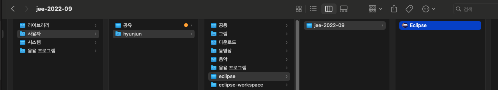

워크스페이스를 설정하시고,  
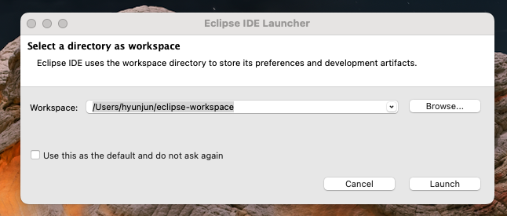

바로 셋팅으로 들어가줍니다.  
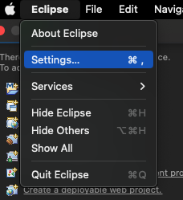

컴파일러 버전 변경입니다.
해당 위치로 가셔서 17 -> 1.8로 변경 후 Apply까지 시켜줍니다.  
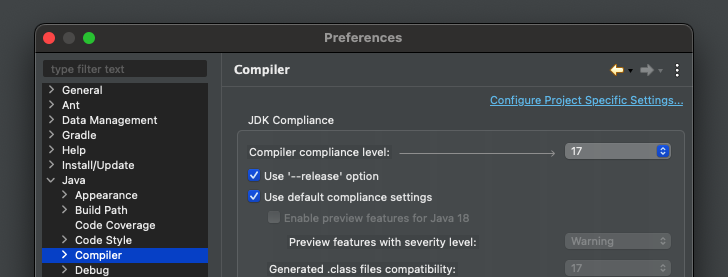
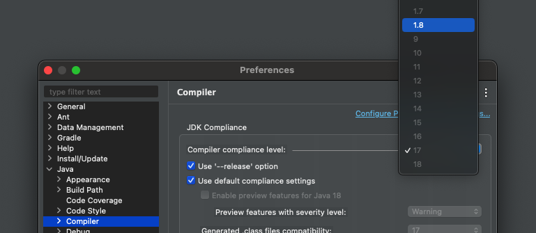
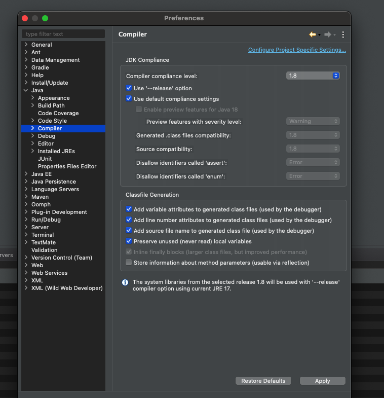

JDK (JRE) 버전 변경입니다.

처음 들어가시면 아마도 아래와 비슷하게 되어있으실 건데요  
(17.0.5의 경우 이클립스 설치 시 같이 설치 및 적용됩니다.)  
오른쪽에 Add 버튼을 눌러주세요!

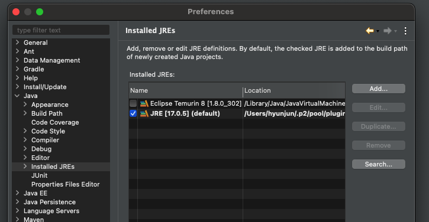

우리가 설치할 Open JDK1.8 JRE Home의 경로를 찾아줘야 합니다.

Dircetory 버튼 클릭 후, MacOS X VM, Next 클릭
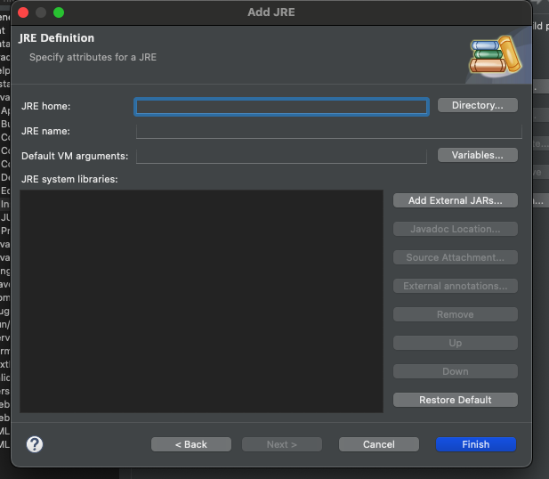
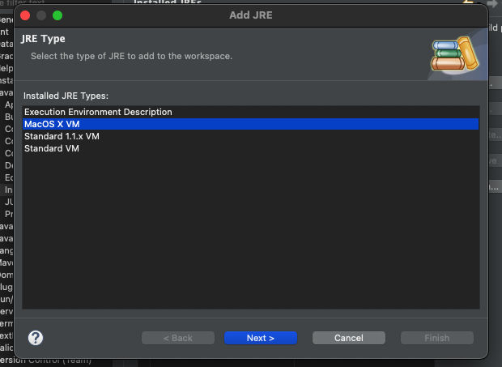

아래와 같이 설정해 줍니다.

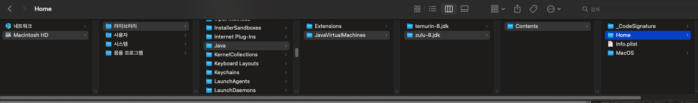

그다음 아래처럼 JRE name을 원하시는 대로 설정해 준 뒤 Finish.
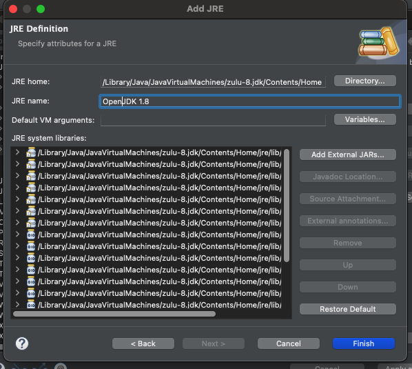

방금 추가한 OpenJDK1.8 체크박스에 체크한 다음 Apply and Close 클릭.
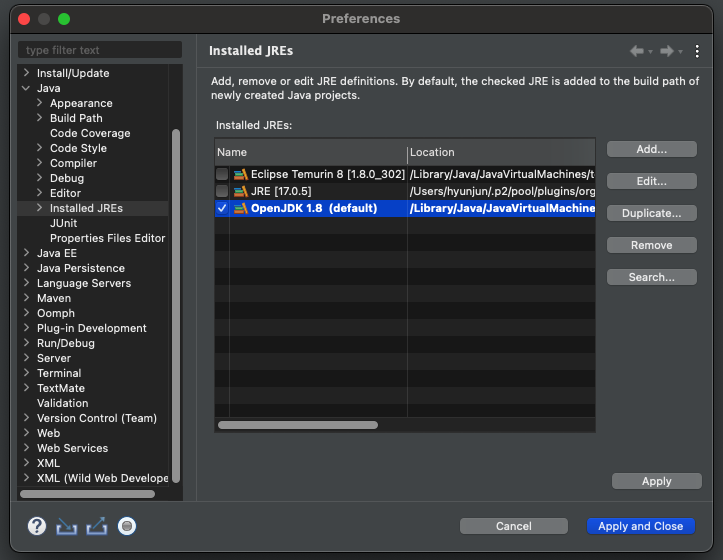

프로젝트를 만드실 때 아래처럼 JRE 부분에 Use a project specific JRE:로 해주시고 만들면 됩니다.

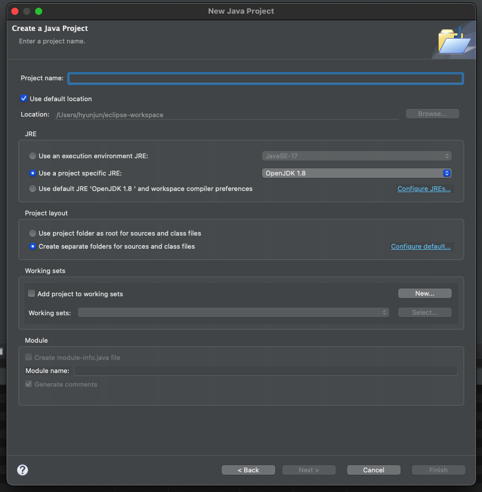

해당 프로젝트의 JRE, 컴파일러 버전 확인

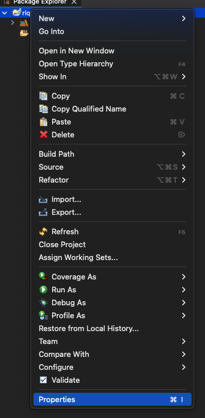
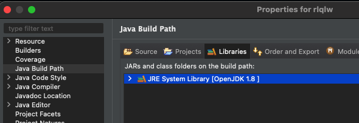
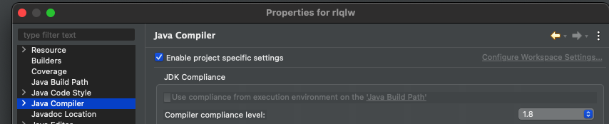

기본적으로 JDK 17 버전 기반으로 설치하였으나, 
설치 후에 설정으로 1.8버전 변경은 가능한 것 같습니다.

혹 JDK 9버전 이상에서 1.8 버전으로 변경하실 때 에러 나시는 경우
아래 글 참조해 주세요.

[참조](https://hyunjunhwang1994.github.io/java/Java3/)

