<!-- 나의 실제 컴퓨터및 컴퓨터 버전 -->

          개발 환경 
          - 2021, 맥북 프로 M1 Pro 14인치 모델  
          - Ventura 13.1

<!-- 자바 포스팅시 JDK, IDE버전 등-->

          버전 
          JDK: openjdk version 1.8.0_352
 
          Eclipse: Version: 2022-09 (4.25.0)

 

JDK 버전 변경 시 JDK 설치와 환경 변수 적용 등이 미리 되어 있어야 합니다.

JDK 설치 참조

[참조](https://hyunjunhwang1994.github.io/java/Java1/)

이클립스 설치 참조

[참조](https://hyunjunhwang1994.github.io/java/Java2/)

## 프로젝트 JDK 버전 확인

Properties -> ProjectFacets -> Convert to faceted form...

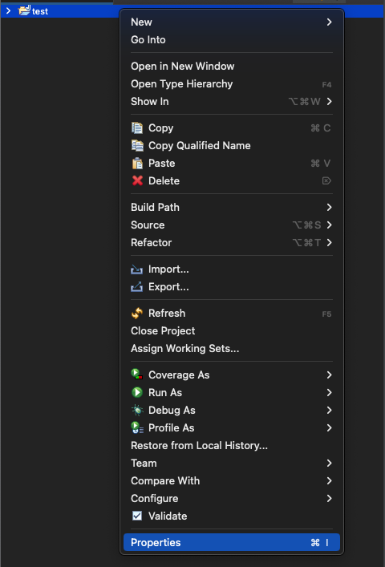{: .align-center}
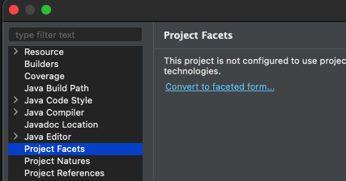{: .align-center}
{: .align-center}

이클립스와 연결된 JRE (JDK) 버전 확인
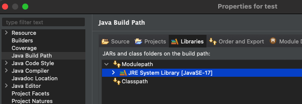{: .align-center}

이클립스와 연결된 컴파일러 버전 확인

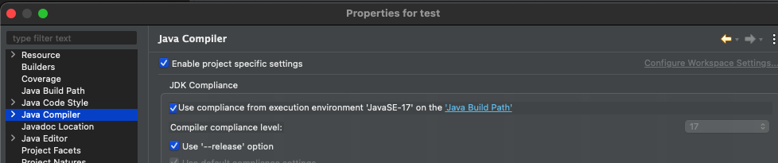{: .align-center}

## 버전 변경

JDK 17 -> JDK 8 (1.8) 변경으로 가정해 보겠습니다.

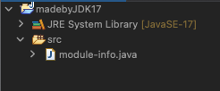{: .align-center}

버전 변경할 프로젝트 Properties -> Project Facets -> Convert to faceted form...

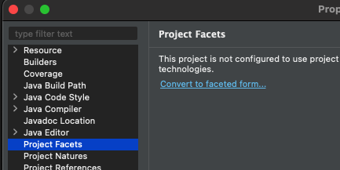{: .align-center}

17 -> 1.8 변경 후 Apply
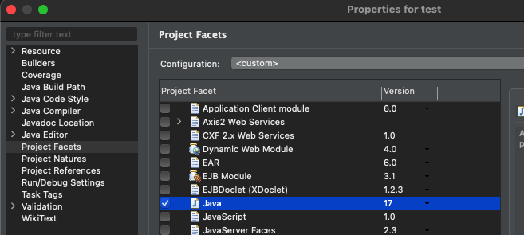{: .align-center}
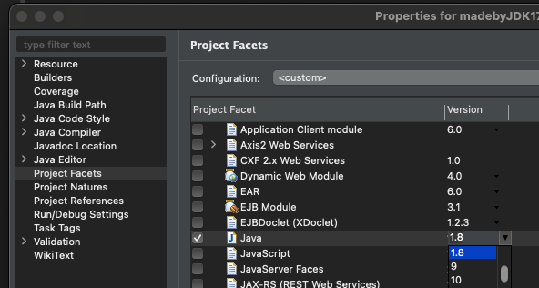{: .align-center}

Java Build Path -> JavaSE - 17 더블클릭 -> JDK1.8 변경 후 Finish -> Apply

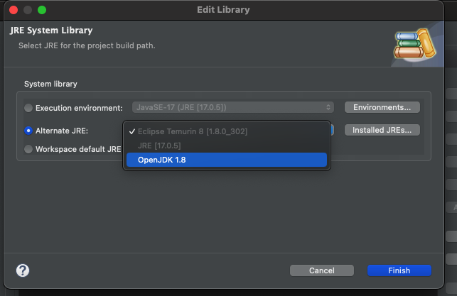

Java Compiler -> 17 -> 1.8로 변경 및 Apply

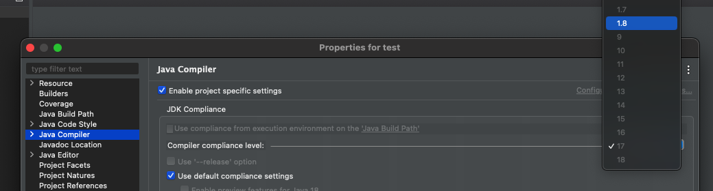

## module error

통상 많이 쓰이는 1.8 버전으로 변경할 경우

그전 프로젝트가 JDK 9버전 이상의 버전으로 작성되었다면 
JDK 9버전부터는 모듈이라는 기능 및 파일 (module-info.java) 추가됩니다.

그렇기 때문에
JDK 1.8 버전에는 모듈 기능이 없으므로  
Syntax error on token "module", module expected" error가 발생합니다.

하여, module.info.java를 제거해 줘야 에러가 발생하지 않습니다.

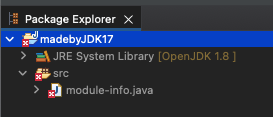
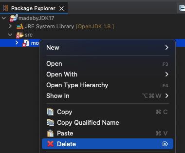{: width="300"}

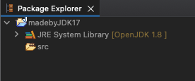