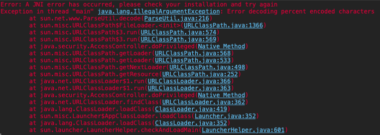

<!-- 나의 실제 컴퓨터및 컴퓨터 버전 -->

          개발 환경 
          - 2021, 맥북 프로 M1 Pro 14인치 모델  
          - Ventura 13.1

<!-- 자바 포스팅시 JDK, IDE버전 등-->

          버전 
          JDK: OpenJDK Runtime Environment (Zulu 8.66.0.15-CA-macos-aarch64) (build 1.8.0_352-b08) 
          Eclipse: Version: 2022-09 (4.25.0)

# 맥에서 이클립스 오류

위와 같은 오류가 발생할 경우  
일단 터미널에서 자바 버전과 이클립스 버전이 맞는지 확인하고  
이상이 없다면 마지막으로! 

이클립스 워크스페이스 폴더 경로에 맥에서 사용하는  
특수문자가 들어가 있다면 지워 주면 잘 실행될 것이다.

폴더 경로에는 한글도 넣는 게 아닌데... 바보같이 특수 문자를 넣었다...

Error: A JNI error has occurred, please check your installation and try again
Exception in thread "main" java.lang.IllegalArgumentException: Error decoding percent encoded characters
	at sun.net.www.ParseUtil.decode(ParseUtil.java:216)
	at sun.misc.URLClassPath$FileLoader.<init>(URLClassPath.java:1366)
	at sun.misc.URLClassPath$3.run(URLClassPath.java:574)
	at sun.misc.URLClassPath$3.run(URLClassPath.java:569)
	at java.security.AccessController.doPrivileged(Native Method)
	at sun.misc.URLClassPath.getLoader(URLClassPath.java:568)
	at sun.misc.URLClassPath.getLoader(URLClassPath.java:533)
	at sun.misc.URLClassPath.getNextLoader(URLClassPath.java:498)
	at sun.misc.URLClassPath.getResource(URLClassPath.java:252)
	at java.net.URLClassLoader$1.run(URLClassLoader.java:366)
	at java.net.URLClassLoader$1.run(URLClassLoader.java:363)
	at java.security.AccessController.doPrivileged(Native Method)
	at java.net.URLClassLoader.findClass(URLClassLoader.java:362)
	at java.lang.ClassLoader.loadClass(ClassLoader.java:419)
	at sun.misc.Launcher$AppClassLoader.loadClass(Launcher.java:352)
	at java.lang.ClassLoader.loadClass(ClassLoader.java:352)
	at sun.launcher.LauncherHelper.checkAndLoadMain(LauncherHelper.java:601)
