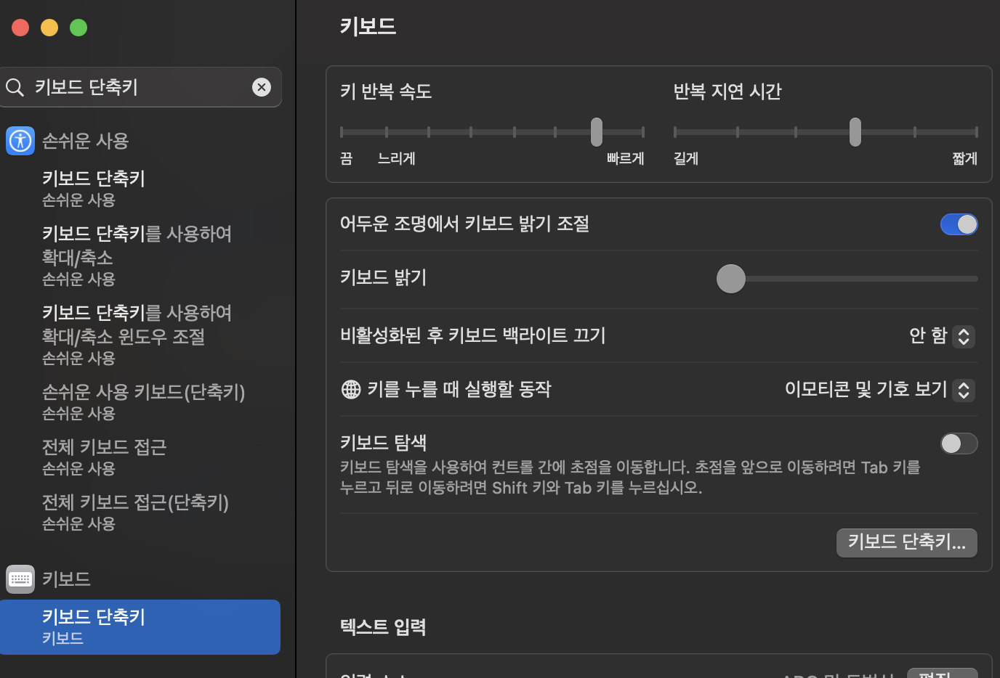
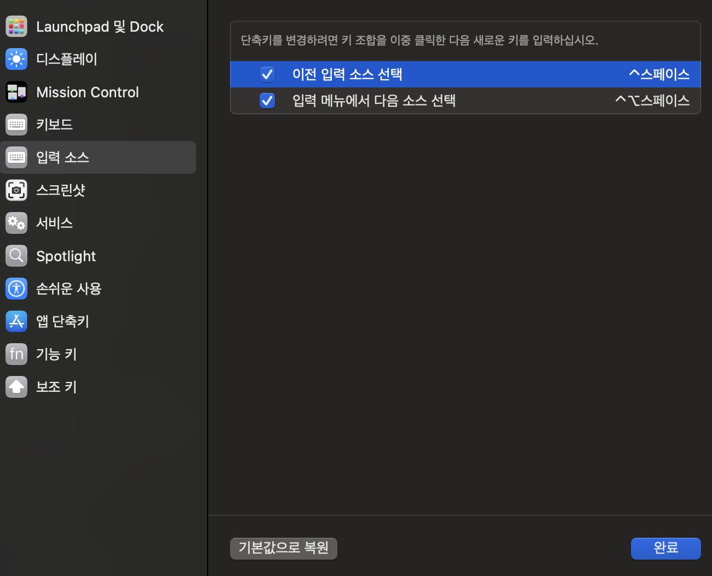
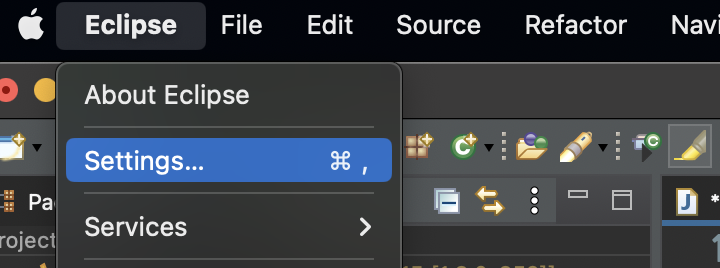
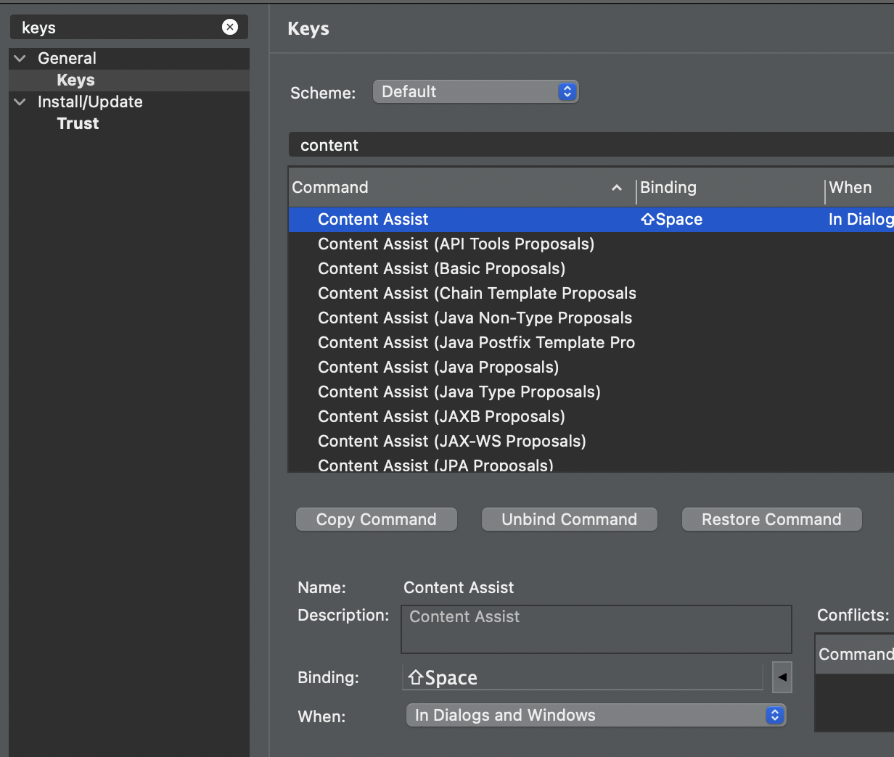
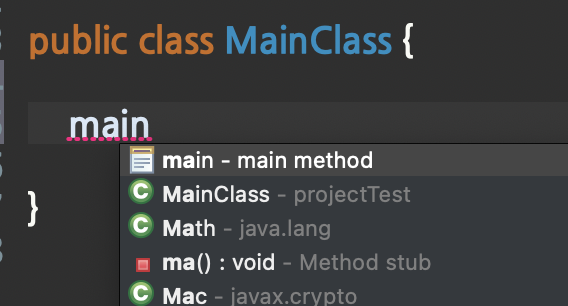

<!-- 나의 실제 컴퓨터및 컴퓨터 버전 -->

          개발 환경 
          - 2021, 맥북 프로 M1 Pro 14인치 모델  
          - Ventura 13.1 베타(22C5050e) 버전

<!-- 자바 포스팅시 JDK, IDE버전 등-->

          버전 
          JDK: OpenJDK Runtime Environment (Zulu 8.66.0.15-CA-macos-aarch64) (build 1.8.0_352-b08) 
          Eclipse: Version: 2022-09 (4.25.0)

Mac에서 이클립스 자동완성으로 사용하는 단축키 Control + Space는
맥에서 이미 한글/영어 변환 키에 사용되고 있다.

맥 단축키를 변경하거나,
이클립스에서 단축키를 변경하면 된다.

기본적으로 한/영 변환을 ctl + space로 잘 안 쓰긴 하지만,
그래도 기본 단축키이므로 이클립스 변경을 추천합니다.

## Spotlight 단축키 변경 

아래의 위치에서 키보드 단축키 클릭.

단축키 부분 더블클릭해서 수정하면 된다.!

## 이클립스에서 변경 방법

아래에 Binding: 부분에 클릭하고 단축키를 입력하면 된다.! 

Shift + space bar로 변경하였다.

잘 됨...
