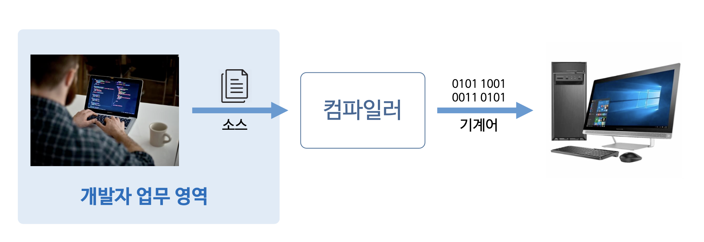
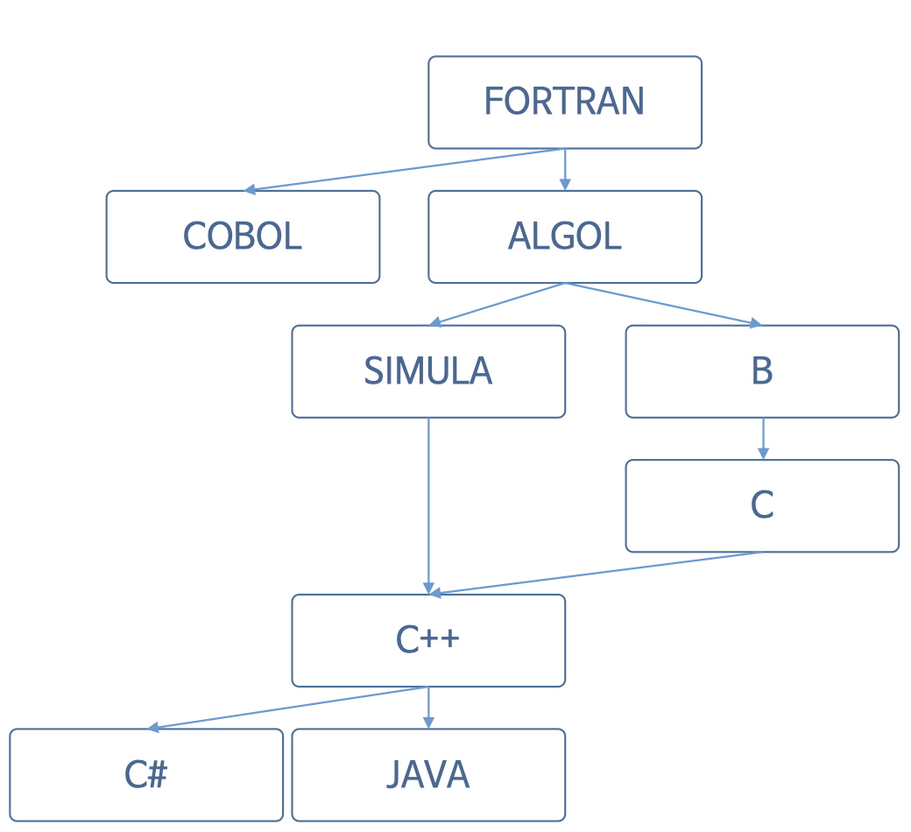
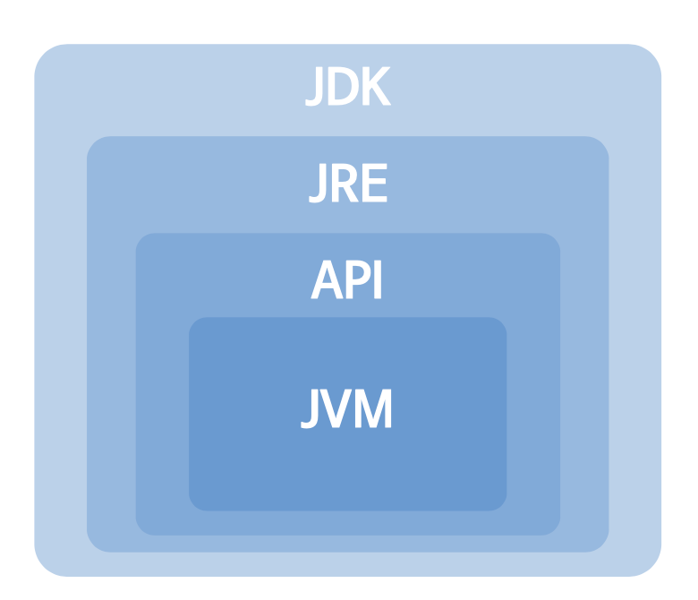
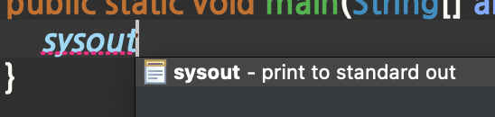
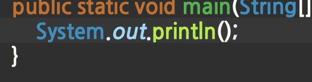

<!-- 나의 실제 컴퓨터및 컴퓨터 버전 -->
<div class="notice" style="text-align:center">
          개발 환경<br>
          - 2021, 맥북 프로 M1 Pro 14인치 모델 <br>
          - Ventura 13.1
</div>
<hr>

<!-- 자바 포스팅시 JDK, IDE버전 등-->
<div class="notice--info" style="text-align:center">
          버전<br>
          JDK: openjdk version 1.8.0_352
<br>
          Eclipse: Version: 2022-09 (4.25.0)
</div>
<hr>

<div class="notice--warning" style="text-align:center">
        해당 포스팅의 전반적인 내용 및 사진은 인프런의 자바 강의에서 가지고 왔습니다.          
        https://www.inflearn.com/course/%EC%8B%A4%EC%A0%84-%EC%9E%90%EB%B0%94_java-renew/dashboard
</div> 

<hr>


># 프로그래밍이란?



각 나라들의 언어가 다른 것처럼 우리가 생성한 코드(인간의 언어)는  
컴파일러를 통해 컴퓨터의 언어로 바꾸어 전달해 주어야 한다.

대부분의 언어는 컴파일러가 존재.  
인간이 만든 소스를 PC가 이해할 수 있도록 변환해 주어야 하기 때문!

프로그래머(프로그래밍)는 컴파일러, 기계어는 신경 쓰지 말고,  
업무영역인 소스코드 생성만 하면 된다.

<br>

># Java 언어의 탄생

- 1995년 제임스 고슬링(James Gosling)에 의해서 탄생.  
- 썬 마이크로시스템즈(Sun Microsystems)에서 발표.  
- 오크(Oak) 언어에서 시작해서 Java 언어로 발전됨.  
- 원래 목적은 가전제품에 탑재할 수 있는 프로그램을 개발하기 위한 목적으로 탄생. 
- 1995년도에만 해도 가전제품에 프로그램이 거의 들어가 있지 않았다.  
- 실제로 가전제품 용도로 큰 성공은 얻지 못했다.  
- 1990년대 말 2000년대 초 인터넷이 활성화될 때 자바 언어를 기본으로 한 웹 프로그래밍 JSP, servlet이 유행하면서 유명해졌다.


## Java 언어의 특징


초창기 시절에 Java 언어의 단점
- 기존 C, C++에 비해서 속도가 굉장히 느리다.
- 리소스(메모리, CPU)를 많이 사용한다.

C, C++은 실제로 메모리를 접근에서 직접 관리 및 제어한다  
자바는 개발자가 직접 관리를 하지 못함, 중간에 매개체가 존재 C, C++ 비해 느림.


현재 Java 언어의 장점
- 객체 지향 언어로 기능을 부품화할 수 있다.  
- JRE를 이용해서 운영체제로부터 자유롭다.  
- 웹 및 모바일 프로그래밍이 쉽다.  
- GC를 통한 자동 메모리 관리를 지원한다.  
- 실행 속도가 많이 개선되어 빨라졌다.


## Java 프로그래밍을 위한 기본 준비물


- JDK (Java Development Kit) 개발자만 설치하여 사용하면 된다.
- JRE java 실행자의 경우는 JRE만 있으면 된다.  
(자바 프로그램이 실행될 수 있는 환경을 만들어준다.)
- API (Application Programming Interface), 프로그램에서 자주 사용되는 클래스 및 인터페이스의 모음이다.
- JVM (Java Virtual Machine) 자바 프로그램이 실행될 때 실제로 JVM 안에서 실행된다.

개발자는 JDK가 있어야 개발을 할 수 있고,  
단지 프로그램만을 사용하는 사용자라면 JRE만 설치되어 있으면 된다.

## src, bin 
src : 실제로 자신이 만든 코드들이 저장되어 있는 폴더  
bin : 컴파일 후 컴퓨터가 이해할 수 있는 파일들이 모여있는 폴더


자바는 여러 가지 클래스가 많아도,  
무조건 Main 메서드부터 실행된다.

System.out.println을 아래처럼 사용 가능하다.




## Hellow Java
```java
public class MainClass {
	
	public static void main(String[] args) {
		System.out.println("Hello Java");
	}

}

```