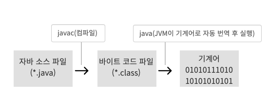

자바로 작성된 모든 프로그램은 모든 운영체제에서 실행 가능하다.  
윈도우에서 자바로 프로그램을 만들더라도 개발자가 아무런 조치를 취하지 않아도  
맥, 리눅스 ...에서 바로 사용이 가능하다.

- 객체지향 프로그래밍
- 메모리 자동 정리 
- 라이브러리 풍부

컴퓨터는 0, 1로 이루어진 이진 코드인 기계어만 이해합니다.  
사람의 언어와 컴퓨터의 언어는 다르기 때문에,

컴퓨터가 이해하도록 하려면 프로그래밍 언어를 사용해야 한다.  
프로그래밍언어로 작성 한 파일을 Source File이라고 한다.

이 소스 파일은 컴퓨터가 바로 이해하지 못하기 때문에, Compile이라는 과정을 통해서  
0,1로 이루어진 기계어로 번역을 해야 컴퓨터에서 사용이 가능하다.

자바 프로그램 개발의 전반적인 프로세스

IDE나, 심지어는 메모장으로도 자바 언어로 코드를 .java 확장자로 작성하면  
자바 소스 파일을 만든 것이 되는데 이 자바 소스파일을 javac 명령어로 컴파일하면,  
.class 파일인 바이트 코드 파일 이 생성된다.

개발자가 만든 소스파일을 javac로 컴파일을 해서 나오는
.class 바이트 코드 파일이 핵심이다.

이 바이트 코드 파일은 어느 운영체제에서라도 해당 운영체제의 JVM에서
돌아가기 때문에 개발자는 운영체제에 전혀 신경 쓸 필요가 없고,

어떠한 운영체제에서라도 java 명령어로 동일하게 똑같은 결과로 실행이 된다.

이게 가능한 이유는 해당 운영체제에 맞는 JVM이 바이트 코드 파일을
해당 운영체제에서 실행 가능한 기계어로 번역해서 실행하기 때문이다.
