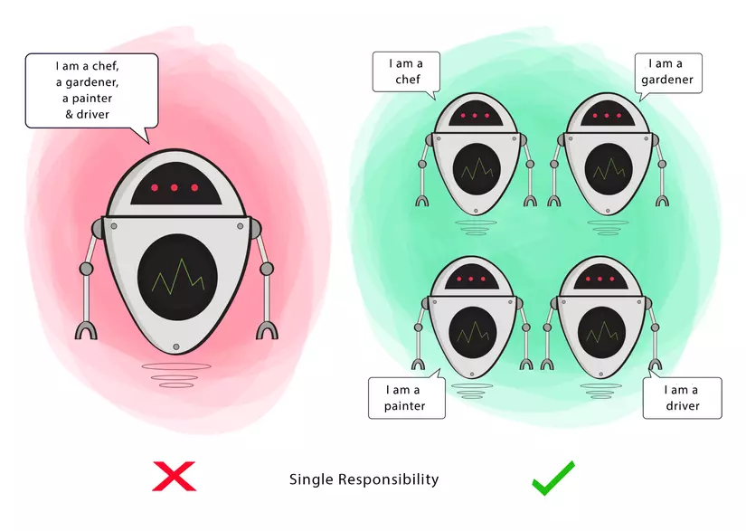
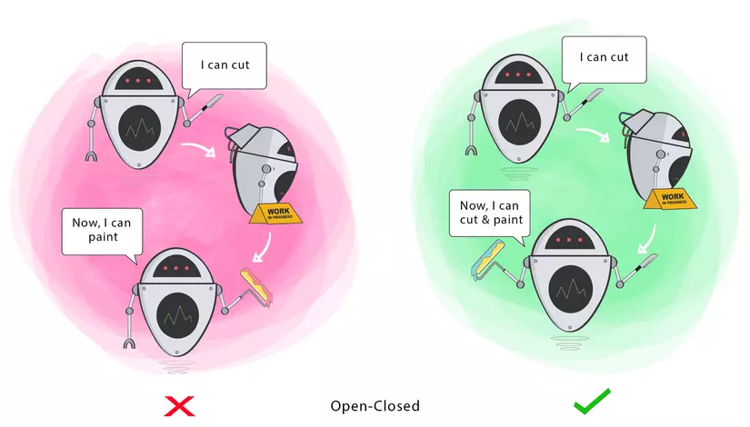
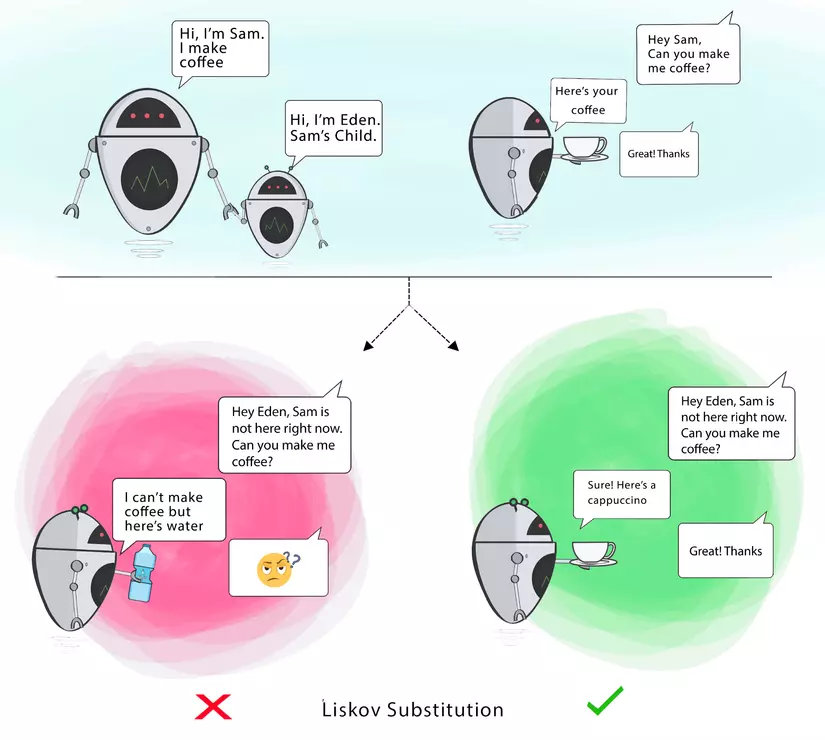
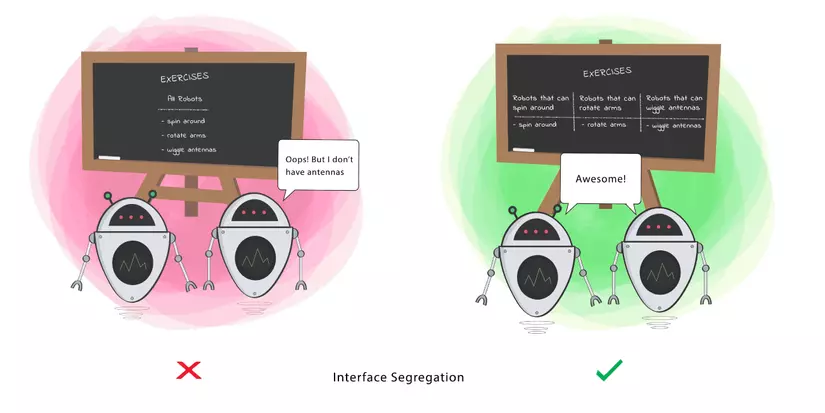
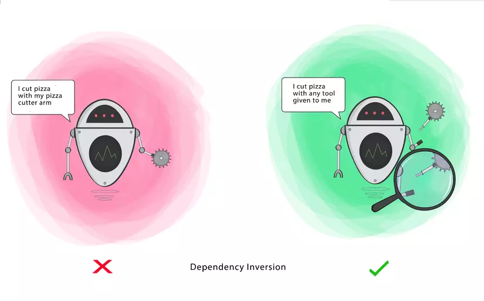

># 객체 지향 프로그래밍
객체 지향이란 쉽게 말하면 현실 세계에서 착안해온 개념으로,  

상태(요금)와 동작(출발)을 가진 객체(버스)들을 만들어 유기적으로 연결시켜 구현하는 프로그래밍 패러다임을 말한다.

김영한 님의 스프링 입문 강의를 보던 중 SOLID 원칙이 강조되어 한번 정리해 보았습니다.

스프링 사용 시 스프링은 객체지향의 5가지 원칙 solid를 더욱더 편하게 지킬 수 있게 해준다.

># solid 원칙

단일 책임 원칙      (Single responsibility principle) : SRP  
개방 폐쇄 원칙          (Open/closed principle) : OCP  
리스코프 치환 원칙      (Liskov substitution principle) : LSP  
인터페이스 분리 원칙    (Interface segregation principle) : ISP  
의존관계 역전 원칙      (Dependency inversion principle) : DIP  

[이 포스팅에 사용된 사진 출처 및 참조한 글](https://viblo.asia/p/the-solid-principles-maGK7JVB5j2)

## SRP, 단일 책임 원칙
모든 클래스는 각각 하나의 기능만 가진다.

해당 클래스가 제공하는 모든 서비스는 단 하나의 책임을 수행하는 데 집중되어야 한다.

-> 클래스들이 서료 영향을 미치는 연쇄작용을 줄일 수 있음, 가독성 향상, 유지 보수하기 좋아짐 

클래스의 단일 책임을 강조한다.

## OCP, 개발 폐쇠 원칙
소프트웨어의 모든 구성요소(클래스, 모듈, 함수)는 확장에는 열려있고, 변경에는 닫혀있어야 한다!

변경사항이나 추가사항 발생 시 기존 구성요소를 수정하지 않고 쉽게 확장이 가능하여 재사용 할 수 있는
형태로 만들어야 한다.

OCP는 객체지향의 장점을 극대화하는 아주 중요한 원리.

## LSP, 리스코프 치환 원칙
상위 타입의 객체를 하위 타입의 객체로 치환해도 상위 타입을 사용하는 프로그램은 정상적으로 동작해야 한다.

## ISP, 인터페이스 분리 원칙
하나의 큰 인터페이스를 구현하기 보다, 인터페이스를 구체적이고 작은 단위들로 분리시켜 꼭 필요한  
인터페이스만 구현하자는 의미이며, 인터페이스의 단일 책임을 강조.

## DIP, 의존관계 역전 원칙
상위 모듈은 하위 모듈에 의존해서는 안 된다. 둘 다 추상화에 의존해야 한다.

추상화는 구체적인 것에 의존해서는 안 된다. 구체적인 것은 추상화에 의존해야 한다.

interface를 활용하여 구체적인 것에 의존하지 말고 추상화에 의존해야 한다는 것

.. 객체지향프로그래밍에 대한 개념과 클래스, 메소드, 상속 관계, 인터페이스 등을 완벽하게
 익히고 있어야 스프링에서 헤매지 않을 것 같다.

