<div class="notice--info" style="text-align:center">
          - 목표 - <br>
    상속, 추상 클래스와 둘에서 비롯되는 다형성에 대해 알고 가는 것
</div>
<hr>


# ⭐️상속⭐️
객체지향적 개념으로 봤을 때 어떠한 객체에서 비롯되는 동작, 기능을 가지는 하위 객체가
무수히 많기 때문에 이를 더욱 편하게 프로그래밍으로 구현하고자 상속이 있습니다.

ex)
- 동물 -> 사람, 고양이, 강아지, 원숭이, ..  이 있을 때
- 상속이 없다면 사람, 고양이, 강아지 등에 공통적인 코드를 전부 일일이 작성해야 한다.

상속은 캡슐화, 추상화, 다형성 등 객체지향프로그래밍을 구성하는 특징 중 하나이다.


## 상속의 특징
- 부모가 상속을 해주는 현실과는 다르게 자식 클래스가 상속받고 싶은 부모 클래스를 선택해서 물려받는다.  
- 이때 상속받는 클래스를 자식(하위, 서브) 클래스, 상속을 해주는 클래스를 부모(상위, 슈퍼) 클래스라고 한다. 
- 클래스 다이어그램의 경우 자식 ----> 부모의 방향으로 표기한다.

- 상속을 받게 되면 자식 클래스는 부모 클래스의 필드와 메서드를 물려받게 된다.   
- 단, 접근제어자가 private을 갖는 필드나 메서드는 상속이 불가하고,  
- 패키지가 다를 경우 접근제어자가 default인 경우도 상속이 불가하다.

- 부모 클래스의 생성자, 초기화 블록은 상속이 안된다.

- ⭐️자바의 모~든 클래스는 java.lang.Object 클래스의 자식 클래스이다.
- 그렇기 때문에 Object 클래스가 제공하는 메서드를 오버라이딩 할 수 있고, JVM이 자동으로 Object 클래스를 부모 클래스로 추가해 준다.


## Object.equals와 String.equals

우리가 기본적으로 비교 연산자인 "==" 을 사용하게 되면,  
레퍼런스 타입끼리 비교하는 경우 객체의 주솟값을 비교하게 된다. 

이때 Object.equals()라는 메소드도 객체의 주솟값을 비교하는 메소드인데.

우리가 String.equals을 사용해서 데이터(문자열 값 등)을 비교할 수 있었던 이유가

Object(모든 부모)의 메소드를 String.equals가 재정의하여 사용했기 때문이다.


<details>   

<summary>equals 예시</summary>

<div markdown="1">             

```java

// test1.java
  public static class test1 {

        String name;
        int age;

        public test1(String name, int age) {
            this.name = name;
            this.age = age;
        }
    }


// Main.java
public class Main {

    public static void main(String[] args) {

        String test1 = new String("test");
        String test2 = new String("test");

        // 모~~든 객체는 Object를 물려받는다.

        // test1은 String 타입 -> String.equals 동작 (부모의 Object.equals 재정의)
        // 스트링의 데이터 비교로 동작.
        if(test1.equals(test2))
            System.out.println("1. String 비교, 같다.");
```

```java

        test1 test3 = new test1("son",25);
        test1 test4 = new test1("son",25);


        // test3과 4는 객체 타입이므로 
        // Object.equals를 재정의하지 않았기 때문에 즉 주소 비교(==)가 들어간다.
        if(test3.equals(test4))
            System.out.println("2. 주소 비교, 다르다.");


```

```java

        // Strig도 그냥 객체에 불과한대 String.equals를 데이터 비교에 사용하는 것처럼
        // 일반 생성 객체도 데이터 비교를 하게 하려면?
        test2 test5 = new test2("merong", 222);
        test2 test6 = new test2("merong", 222);
        test2 test7 = new test2("zz", 2);

        // 기본적으로 Objects.equals는
        // 객체간의 필드값을 비교한다.
        if (Objects.equals(test5, test6)) {
            System.out.println("3. 객체 안 데이터 비교, 같다.");
        }

        if (Objects.equals(test6, test7)) {
            System.out.println("4. 객체 안 데이터, 같다.");
        }else {
            System.out.println("4.🅾️ 객체 안 데이터, 다르다.");
        }

        // 재정의한 equals, Hashcode 사용
        if (test5.equals(test6)) {
            System.out.println(test5);
            System.out.println(test6);
            System.out.println(test7);
        }

        


    }


  

    public static class test2 {

        String name;
        int age;

        public test2(String name, int age) {
            this.name = name;
            this.age = age;
        }

        @Override
        public boolean equals(Object o) {
            if (this == o) return true;
            if (o == null || getClass() != o.getClass()) return false;
            test2 test1 = (test2) o;
            return age == test1.age && Objects.equals(name, test1.name);
        }

        @Override
        public int hashCode() {
            return Objects.hash(name, age);
        }

        
    }


}

```

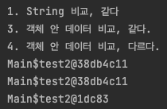


```java

        test2 test5 = new test2("hello", 222);
        test2 test6 = new test2("hello", 222);

        System.out.println(test5);
        System.out.println(test6);

        System.out.println(test5.hashCode());
        System.out.println(test6.hashCode());

        System.out.println(test5.equals(test6));
        System.out.println(test5 == test6);

        // 객체 그 자체로서의 고유값은 다르기 때문에 
        // == 비교시 false가 나온다.
        // sysout(객채) 를 찍어서 나오는 주소가 같아도
        // 실질적으로 아래의 identityHashCode가 다르면 다른 곳을 참조하는 객체이다.
        System.out.println(System.identityHashCode(test5));
        System.out.println(System.identityHashCode(test6));
```

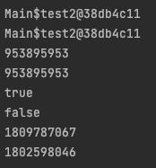

</div>
</details>


인텔리제이에서는 equals, hashcode 오버라이딩을 지원합니다.  
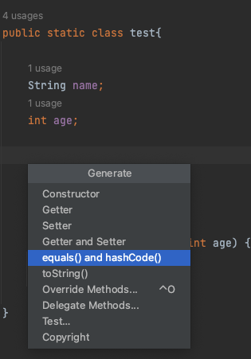

그럼 아래와 같이 자동으로 생성이 됩니다.
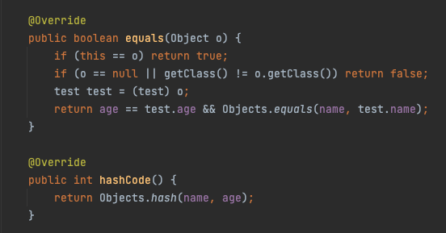

<hr>
equals, hashcode 오버라이딩을 통해

이제는 같은 객체(클래스)로 생성된 인스턴스의 안의 필드값이 같을 경우  

재정의한 equals를 통해 필드값(데이터)을 비교하여 true & false를 리턴 받게 되고, 
(원래 같은 경우 아이덴티티 해시 코드 주소값만 비교합니다, 일반 해시 코드 X)

재정의한 hashcode()는 인스턴스 생성 시 필드값에 대한 절대적인 해시값을 리턴해줍니다.

ex) 
int=1, name="a" -> 38db4c11  
int=1, name="a" -> 38db4c11  
int=1, name="c" -> 22ha4c34

위처럼 다른 인스턴스의 필드 타입, 필드 데이터가 같다면 같은 해시로 인스턴스를 생성해 줍니다.
(원래 같은 경우 데이터가 같아도 해시값이 다르게 인스턴스가 생성됩니다.)

### hashcode()까지 쓰는 이유.

- 보통의 상황에서는 equals만 오버라이딩해도 객체끼리의 값이 비교 가능하다.
- 하지만, HashMap, HaseSet 등의 자료구조는 내부적으로 객체를 비교할 때 해당 객체의 해시값으로 비교를 하기 때문에 
- Hash 값을 사용하는 컬렉션을 사용할 때 완벽하게 같은 데이터의 인스턴스로 다루고 싶다면, 
hashcode()를 오버라이딩해 해시값까지 맞추어 주어야 합니다.


Hash 값을 사용하는 컬렉션에서 객체가 논리적으로 같은지 비교할 때 거치는 과정

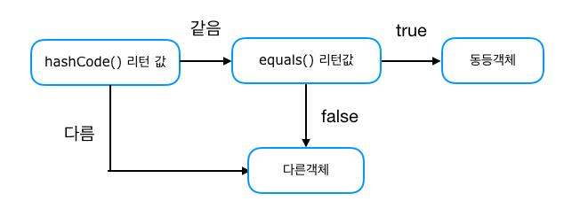

- 하지만 "=="로 실제 객체의 내부 참조 값은 identityHashCode로 동작하기 때문에
False가 나옵니다.
- String의 경우 new를 사용하지 않고, 같은 값으로 초기화한다면,
내부적으로 identityHashCode까지 똑같이 만들어놨기 때문에 "=="로 값을 비교해도 true가 나옵니다.


- 기본적으로 객체 생성 시 identityHashCod 값과 hashCode 값은 같다.
- hashCode는 오버라이딩이 가능하나 오버라이딩 할 경우
- identityHashCode 값은 hascode 값과 다르게 변경된다.
- identityHashCode는 재정의가 불가능하다.
- identityHashCode는 소수의 확률로 중복이 될 수 있다.
- 그러므로 Hashcode를 재정의하여 다른 인스턴스에서 같은 값이 나오더라도,
- 내부적으로 identityHashCode는 다르게 재생성되어 결국 같은 메모리 주소를 참조하진 못한다.
- String의 경우 예외.


[참조](https://codingdog.tistory.com/entry/java-hashCode-vs-identityHashcode-%EC%9D%B4-%EB%91%98%EC%9D%80-%EB%AC%B4%EC%97%87%EC%9D%B4-%EB%8B%A4%EB%A5%BC%EA%B9%8C%EC%9A%94)


## 요약
- equals를 재정의하여 객체 안의 필드값 비교를 가능하게 해줌  
- Hash Collection을 할 때의 같은 데이터로 보게 하려면 Hashcode()를 오버라이딩 해줘야한다.
- 결국 A 인스턴스와 B 인스턴스는 new 해서 생성했지만 같은 데이터가 된다
- 하지만 내부적으로 보자면 결국 같은 곳을 참조하는 건 아니다.


++ 롬복 라이브러리에서 @EqualsAndHashCode 어노테이션을 붙여주면  
롬복 라이브러리가 자동으로 equals와 hashcode를 생성해 준다.

아래 참조 글을 보면 아마 자바에서는 
가비지 컬렉터의 활용 때문에, 프로그래머가 실제 주소값 자체를 활용하는 건 의미가 없는 것 같습니다.  

[참조](https://okky.kr/articles/611110) 
[참조 블로그](https://gardeny.tistory.com/31)  
[해시값과 주소값 차이](https://okky.kr/articles/596050)  
[스택 오버플로우, 해시값 주소값 차이](https://stackoverflow.com/questions/3700595/difference-between-hash-code-and-reference-or-address-of-an-object)
[스택오버플로우 참조](https://stackoverflow.com/questions/7520432/what-is-the-difference-between-and-equals-in-java)

<hr>

여기서 매우 중요한 점은 위의 일련의 과정들이  
상속과 오버라이딩(다형성)이 있기 때문에 가능하다는 점이다.

위의 것들이 가능한 이유도 상속이 있기 때문.  
(모든 객체의 최상위 부모를 Object 클래스로 잡아놓고)

Object <--상속-- 객체(equals, hashcode 재정의)  
Object <--상속-- String(equals 재정의)

## 상속의 관계

### ⭐️IS a 상속관계⭐️ 
자식 클래스는 하나의 부모 클래스 일 수 있다.

[사진 출처](https://zangzangs.tistory.com/44)

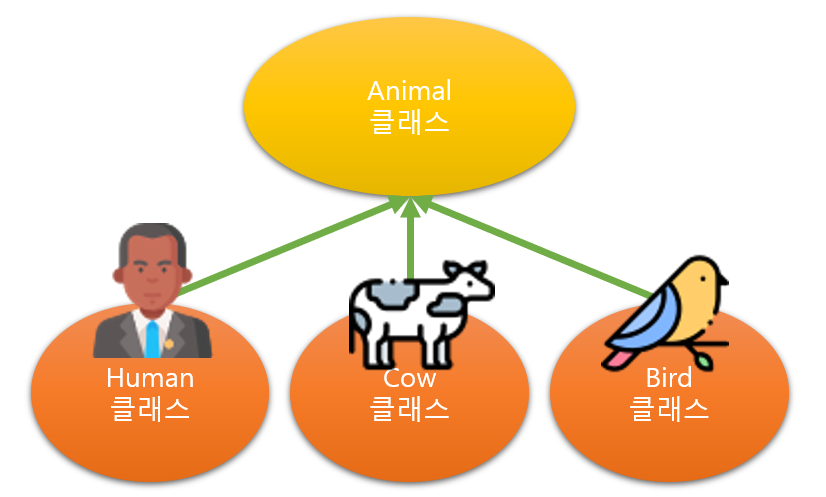


상속은 IS-A 관계에서 사용하는 것이 가장 효율적입니다.

IS-A 관계(is a relationship, inheritance)는 일반적인 개념과 구체적인 개념의 관계입니다.

- 사람은 동물이다.  
- 소는 동물이다.  
- 새는 동물이다.  

위와 같은 관계입니다. 즉, 일반 클래스를 구체화하는 상황에서 상속을 사용합니다.

상속을 사용하면 많은 장점이 있지만, 

하위 클래스가 상위 클래스에 종속되기 때문에 이질적인 클래스 간에는 상속을 사용하지 않는 것이 좋습니다. 

단순히 코드를 재사용할 목적으로 서로 관련이 없는 개념의 클래스를 상속 관계로 사용하는 것은
객체지향적 개념에도 맞지 않으므로, 추천하지 않습니다.


### Has a 상속관계 
HAS-A 관계에서는 상속을 사용하지 않습니다.

HAS-A 관계(has a relationship, association)는 일반적인 포함 개념의 관계입니다.

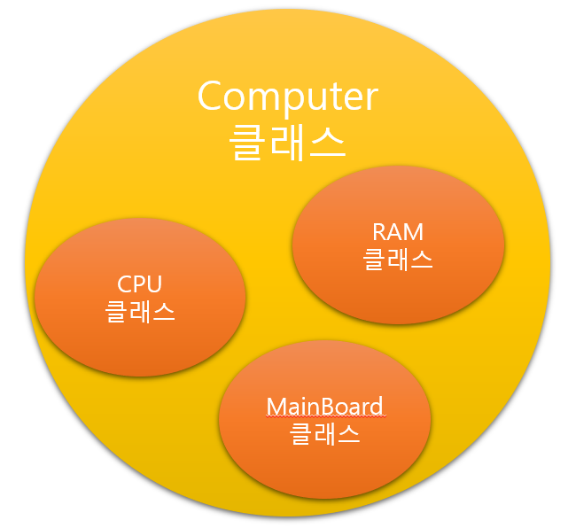

- RAM은 컴퓨터이다?
- CPU는 컴퓨터이다?
- MainBoard는 컴퓨터이다?

컴퓨터에서 RAM을 포함하는 관계는 형성되지만 IS-A의 관계에는 적용되지 않습니다.  
따라서 상속 관계가 아닙니다.

HAS-A 관계는 다른 클래스의 기능(변수 혹은 메서드)을 받아들여 사용합니다.


## ⭐️상속을 사용하는 목적⭐️
- 이미 (잘) 만들어진 클래스를 재사용할 수 있기 때문에, 효율성이 좋으며 개발 시간을 줄여줍니다. (코드의 재사용성 극대화)
- 위와 같은 이유로 유지 보수가 쉽고, 중복이 적고, 통일성이 있는 코드를 작성이 가능합니다.
- 위와 같은 이유로 다형성을 구현할 수 있다.
- 하지만 IS-A 관계가 아닌대도 무분별하게 상속을 해서 사용하게 되면 클래스 간 결합도가 높아져  
상위 클래스를 수정해야 할 때 하위 클래스에 미치는 영향이 커지므로, 상속은 IS-A 관계 일 때만 사용하는 것이 좋습니다.


## 다중 상속
- 자바에서는 자식 클래스가 여러 부모로부터 다중 상속을 받는 것은 불가능합니다. 
- 즉, 1개의 부모 클래스로부터의 단일 상속만 허용됩니다.  
- 하지만 부모 클래스는 여러 개의 자식 클래스에게 상속이 가능하다는 것이 특징입니다.


다이어그램의 화살표 방향을 반대로 보시면 될 것 같습니다.  
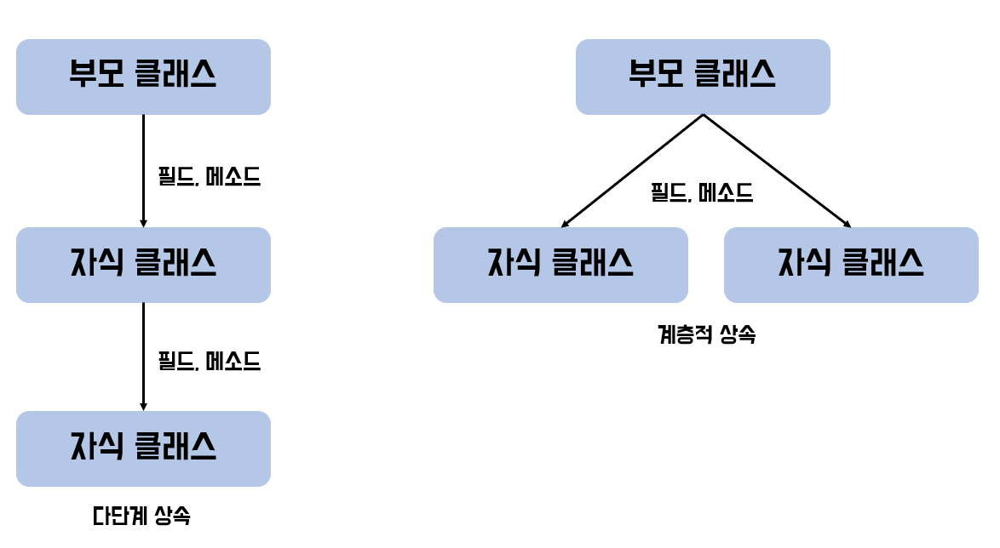

[이미지 출처](https://coding-factory.tistory.com/865)


# super 키워드
자식 클래스에서 부모 클래스를 가리킬 때 사용하는 키워드,  주로 부모 클래스의 필드에 접근
메소드를 호출할 때 사용합니다.

# this 키워드
객체 자신인 자신을 가리 킬 때 사용하는 키워드, 주로 생성자에서 필드값을 변경할 때 사용합니다.


자바에서는 자식 객체를 생성하면 부모 객체를 먼저 생성 후!  
자식 객체가 그다음에 생성됩니다.


## ⭐️다중 상속이 안되는 이유 ?⭐️

- 다중 상속은 코드의 흐름이 모호해지고, 애매해지기 때문에
다중 상속은 지양해야 한다. 어차피 자바에서는 안되지만!


- 상속받은 여러 부모 클래스들 중 동일한 명칭의 필드나 메소드가 있다면?
- 어떤 부모 클래스의 필드와 메소드를 상속받아야 하는가?
- 어떤 부모 클래스에 어떻게 접근해야 하는가?

와 같은 모호함이 발생합니다.

C++, 파이썬, 스칼라, 펄 등은 다중 상속을 지원합니다!  
하지만 자바, 루비 등은 단일 상속만을 지원합니다.


### ⭐️다이아몬드 문제⭐️

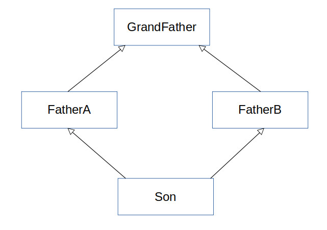

위에서 말했던 여러 이유가 한 장의 다이아몬드 구조의 사진으로 말할 수 있습니다.

예를 들어 GrandFather이라는 클래스가 goToTheHome() (강남)이라는 이름의 메소드를 가지고 있다고 가정해 보려고 합니다.

그리고 FatherA (영등포)와 FatherB (수원)가 각각 오버라이딩하여 구현하였다면, 

FatherA와 FatherB를 모두 상속받은 

Son 클래스 입장에서는 어떤 부모의 goToTheHome()를 사용해야 할까요?  
FatherA의 집으로 가야 할까요, FatherB의 집으로 가야 할까요  
이로 인하여 충돌이 생기게 됩니다.

FatherA에게 단일 상속을 받은 경우 son은 FatherA의 집인  
영등포로 가기만 하면 됩니다. (혹은 재정의 하거나.)

다중 상속을 받으면 재정의 할 때도 모호함이 발생합니다.  
FatherA, B 누구의 메소드를 받아서 재정의 할 것인지?


## 인터페이스의 다중 상속?
인터페이스는 쉽게 말하면 껍데기만 존재하기 때문에,

인터페이스의 메소드는 무조건 추상 메소드이므로 메소드명이 겹쳐도  
인터페이스를 상속한 클래스에서 해당 메소드를 구현하므로 애매한 문제는 생기지 않는다.  

-> 메소드를 사용 측면이 아닌 구현만하면 되기 때문에.

>자바 8버전부터 나온 dafault Method 기능으로, 인터페이스 내에서도 로직이 포함된 메소드를
기술할 수 있는데, 이 경우에도 상속과 마찬가지로 다중 상속이 안 될 수도 있다.

[인터페이스 다중 상속 불가 참고 블로그](https://velog.io/@dnwlsrla40/Java%EC%97%90%EC%84%9C-%EB%8B%A4%EC%A4%91-%EC%83%81%EC%86%8D%EC%9D%84-%EC%A7%80%EC%9B%90-%EB%AA%BB%ED%95%98%EB%8A%94-%EC%9D%B4%EC%9C%A0)


<hr>

# ⭐️다형성⭐️

>다형성(polymorphism)이란 하나의 객체가 여러 가지 타입을 가질 수 있는 것을 의미합니다.!!

자바에서는 이러한 다형성을 부모 클래스 타입의 참조 변수로 자식 클래스 타입의 인스턴스를 참조할 수 있도록 하여 구현하고 있습니다.

다형성은 상속, 추상화와 더불어 객체 지향 프로그래밍을 구성하는 중요한 특징 중 하나입니다.

또한
부모-자식 상속관계에서, 부모클래스가 동일한 메시지로 하위 클래스들을 서로 다르게 동작시키는 객체 지향원리입니다.

다형성을 활용하면 부모 클래스가 자식 클래스의 동작 방식을 알수 없어도 오버라이딩을 통해 자식 클래스를 접근할 수 있습니다.

그렇다면 어떻게  부모가 자식이 어떤 일을 하는 지 몰라도,  자식 멤버 함수를 호출시킬 수 있을 까요? 

이유는 동적 바인딩 때문입니다. 동적바인딩이란, 메서드가 실행 시점에서 성격이 결정되는 바인딩인데요.

<details>  
<summary>동적 바인딩</summary>
<div markdown="1"> 
           

    프로그램의 컴파일 시점에 부모 클래스는 자신의 멤버 함수밖에 접근할 수 없으나,

    실행 시점에 동적 바인딩이 일어나 부모클래스가 자식 클래스의 멤버함수를 접근하여 실행할 수 있습니다. 

    - 실행 시간(Runtime) 즉, 파일을 실행하는 시점에 성격이 결정된다.
    - 오버 라이딩.
    - 자바에서의 다형성, 상속이 가능한 이유!!
            

</div>
</details>
 
<br>


다형성은 무엇에 의해 실현되는가?
- 1) 상속관계
  다형성을 활용하기 위해서는 필수로 부모-자식간 클래스 상속이 이루어져야한다.

- 2) 오버라이딩 
  다형성이 보장되기 위해서는 하위 클래스의 메소드가 반드시 재정의 되어야 한다.

- 3) ⭐️업캐스팅 (자식 클래스의 객체가 부모클래스 타입으로 형변환 되는 것)
부모 타입으로 자식클래스를 업캐스팅하여 객체를 생성해야 합니다. 


다형성의 장점
- 유지보수성이 좋다.(쉽다)
왜? 개발자가 여러 객체를 하나의 타입으로 관리가 가능하기 때문에

- 재사용성이 증가한다.
여러객체를 하나의 타입으로 관리하기 때문에 재사용성도 좋다.

- 느슨한결합
다형성을 활용하면 클래스간 의존성이 줄어들며 확장성이 높고 결합도가 낮아져 안전성이 높아진다.


그렇기 때문에
매개변수에 해당 객체를 상속받은 타입을 넣어도 잘 동작하고.


## 예시

```java
// Animals.java
public class Animals {

    public void printInfo() {
        System.out.println("I am Animals");
    }

}


// Cat.java
public class Cat extends Animals {

}


// Dog.java
public class Dog extends Animals {


}


// Main.java
package polymorphism;

public class Main {


    public static void main(String[] args) {

        // 당연히 자기자신 타입으로 자기자신의 객체를 만들 수 있다.
        // 여기 까진 다형성의 개념이 아니다.
        Cat cat = new Cat();
        Dog dog = new Dog();

        // 부모에게 물려받은 메소드 사용가능
        cat.printInfo();
        dog.printInfo();


        // 여기서 다형성이란 ?
        // 위에서 언급했던
        // IS-A 관계를 생각
        // Dog는 Animal이다.
        // Cat은 Animal이다.

        // 만약 반대로 말한다면 ?
        // Animal은 Dog이다.
        // Animal은 Cat이다
        // 말이안됨!

        // 여기서 다형성의 개념이나옴
        // Dog, Cat은 Is a -> Animal이고,
        // 상속으로 위의 Is a 관계를 구현해놨기 때문에,
        // Animal(부모클래스)이라는 자료형으로 받을 수 있음
        Animals animal = new Cat();
        animal.printInfo();

        animal = new Dog();
        animal.printInfo();


        // 또한 아래와 같은 코드는
        // Animal은 Cat이다 이기 때문에 불가능! 컴파일에러
        // 즉 부모를 생성하고 자식타입에 집어넣을 순 없다.
        // Cat cat1 = new Animals();

        // 하지만, 아래와 같이 강제타입변환을 하면될까?
        // 실제로 컴파일 에러가 안나서 문제 없어 보이지만.
//        Cat cat1 = (Cat) new Animals();
//
        // 사실상 아래의 코드들을 실행하면 에러가 발생한다.
//        System.out.println("test");
//        cat1.printInfo();
//        cat1.playACatTower();
//        System.out.println("test");

        // 부모 타입을 자식타입으로 변환하려면
        // 자식 타입이 부모타입으로 자동변환후 다시 자식타입으로 변환할때만
        // 강제 변환이 가능하다

    }
}

```

위의 코드 결과, Dog이던, Cat이던 -> 전부 Animals이다.
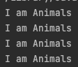


## 오버라이딩 활용

현재 Animals 메소드만 활용하고 있는데,  
Cat,Dog이 Animals에 정의된 메소드를 자기가 원하는대로 사용하고 싶다면?  

부모의 메소드를 오버라이딩 해서 재정의해 사용하면된다.


```java

// Cat.java
public class Cat extends Animals {


    @Override
    public void printInfo() {
        super.printInfo();
        System.out.println("And I'm a cat.");
    }

}

// Dog.java
public class Dog extends Animals {

    @Override
    public void printInfo() {
        super.printInfo();
        System.out.println("And I'm a dog.");
    }
}
```

그리고 Main코드의 수정없이 실행해본다면?

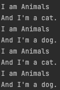

Animal이면서 Dog(Cat)이라는 것을 다 표현할 수 있게된다.

만약 I am Animals를 빼고 Dog(Cat)이라는 것만을 표현하고 싶다면 각 자식클래스 메소드에서

부모클래스의 메소드를 호출하고 있는 super.printInfo()를 삭제하면 됨.    
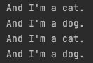


다형성측면에서 보면 Animals는 자기자신이 Animals 타입이지만,  
자신이 아닌 다른 클래스로 볼 수 있는 자식클래스에서 재정의된 메소드를 호출할 수 있다는 것을 뜻함.

그렇다면 Cat과 Dog에서 이미 Animals에 정의된 기능을 오버라이딩 하는 것이 아닌  
각자 다른 기능을 구현하고 싶다면 어떻게 해야 할까요?

Ex)
- Cat은 캣타워를 탄다.
- Dog는 산책을 한다.

이말은 즉 자식 클래스에서 단독으로 정의한 메소드는 어떻게 될까요?


```java

// Cat.java

    ...
   public void playACatTower() {
        System.out.println("캣타워 놀이 시작!");
        System.out.println("캣타워 놀이 끝!");
    }
    ...

// Dog.java
    ...
        public void walkingDogs() {
        System.out.println("산책 시작!");
        System.out.println("산책 끝!");
    }
    ...


// Main.java 이어서

        Animals animal2 = new Dog();
        Animals animal3 = new Cat();

        // 그리고 나서 아래처럼 단독기능을 사용하려고 하면?
        // animal2.walkingDogs();

        // 결국 최종적으로 animal2(Dog)은 Animals 타입 이기때문에,
        // Dog의 단독 메소드는 사용하지 못한다.

        // Animals라는 타입이기 때문에 엄밀히말하면 Dog가 아니므로
        // Dog의 단독메소드는 사용못한다고 생각하면 편함.

        // 또한 Animals(동물)이기 때문에 모든 동물이 산책을 하지는 않는다.
        // 그래서 동작 하면 안됨.


        // 아래처럼 다운 캐스팅(명시적 형변환)해서 사용해야한다.
        // (다형성)
        animal2.printInfo();
        ((Dog)animal2).walkingDogs();

        animal3.printInfo();
        ((Cat)animal3).playACatTower();


```


 왜그런 걸까 ?
Animals는 자신을 상속한 클래스중 해당 자식클래스들이  
어떤 메소드를 만들고, 필드들을 만들지 미리 예상할수가 없다.

그렇기 때문에 해당 단독기능을 사용하려는 타입으로 직접 캐스팅해주어야 메소드를 사용가능하다.

Animals 자료형은 자신의 printInfo()만 사용가능하기 때문에  
상속받은 Dog에서 오버라이딩한 printInfo()도 사용가능한 것이다.

또한 new 를 사용할 때 동적 메모리에 할당하게 되므로  
Dog가 실제 메모리에 잡히기 때문에 Dog로 형변환이 가능한 것


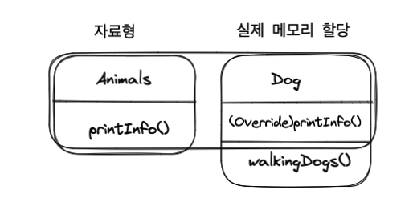


## ⭐️다형성의 쓰임⭐️

>메서드에서 매개변수로 부모 클래스를 상속하는 자식 클래스를 받을 때 사용가 능하다.

whoIsIt 메소드는 Animals 타입을 받는다.  
하지만 다형성이라는 것 이 존재하지 않아 Animals라는 타입으로만 받는다면

Dog, Cat은 사용하지 못하고 Animals 클래스 그 자체만 활용이 가능하고,  
Dog로 바꿀 시 모든 코드를 바꿔야 한다.

매개변수 Animals 타입은 다형성으로 인해 Animals를 상속하는 모든 클래스를 받아 낼 수 있다.  
Cat, Dog은 Animals를 상속 받았기 때문에 매개변수로 사용이 가능하다.

> Object 클래스도 최상위 부모이므로 모든 객체를 받아 낼 수있다.

```java

        Dog dog2 = new Dog();
        Cat cat2 = new Cat();

        whoIsIt(dog2);
        System.out.println("------------------");
        whoIsIt(cat2);

    }

    public static void whoIsIt(Animals animals) {

        if(animals instanceof Cat) {
            animals.printInfo();
            ((Cat) animals).playACatTower();
        }

        if(animals instanceof Dog) {
            animals.printInfo();
            ((Dog) animals).walkingDogs();
        }

    }

```


## 객체 타입 확인 : instanceof 

instanceof 는 객체 타입을 확인하는 연산자로, 객체의 실제 타입을 알아보기 위한 연산자입니다. 

    참조변수 instanceof 타입(클래스명)   (리턴타입 boolean)
            
    형변환이 가능하다면 -> true

ex) animals로 받은것이 dog이면

    dog instanceof Dog 이 되므로 형변환 가능하다.

>모든클래스 instanceof Object는 true


<br>

위의 내용들을 다 보고 나서 다형성을 간단하게 정의하자면 ?
- 하나의 자료형에 여러가지 자료형(객체)를 대입해 다양한 결과를 얻어내는 성질
- 자바에서는  상속, 오버라이딩, 오버로딩, 업캐스팅, 다운캐스팅, 추상메소드, 추상클래스 등을 통해 
다형성이 이루어진다.


[참고 블로그](https://limkydev.tistory.com/188)


# 추상 클래스 

- 추상 클래스란 하나 이상의 추상 메소드를 포함한 클래스!
- A,B,C 클래스가 있을 때 이들 클래스간의 비슷한 필드와 메서드를 공통적으로 추출해 만들어진 클래스
- 실체 클래스의 멤버(필드, 메소드)를 통일하는데 목적.


## ⭐️추상..?⭐️

- 추상 메소드를 가지고 있기 때문에 자연스럽게 해당 클래스는  
메소드의 구현이 되어 있지 않기 때문에, 추상적이게 되고 그렇기 때문에 추상 클래스이다.

- 추상 메소드는 시그니처만 존재하고 구현부는 없기 때문에 추상적임.  
이 추상 메소드를 구현하면 구현한 해당 메소드는 비로소 실체 메소드가 된다.

- 이 추상 클래스는 말 그대로 지금까지 작성해왔던  
구체적(concrete)인 코드(클래스) 들과 다르기 때문에 인스턴스화가 불가능하다.

- new로 추상 클래스 생성 시, 추상 메소드를 오버라이딩 하면서 생성한다면
더 이상 추상 클래스는 추상적이지 않게 되어 인스턴스화가 가능해진다.


## 장점

예를 들어 동물 -> 강아지, 고양이 등의 동물은 먹기/걷기 등의 공통적인 행동을 하기 때문에

동물이라는 추상 클래스를 만들 수 있고,
이 뜻은 강아지, 고양이... 등을 동물이라는 하나의 클래스로 추상화를 시킨 것이다.

결국 Animals 타입으로 Cat, Dog, .. 클래스들을 다 받을 수 있었던  
다형성과도 맞아떨어지는 부분이다.

일반 클래스에서도 만든 메소드를 자식 클래스가 오버라이딩 할 수 있지만,
추상메소드(추상 클래스)를 사용하지 않는다면 해당 오버라이딩을 강제시키진 못한다.


## 예시

키보드라는 클래스가 있다. 
키보드를 만드는 제조사는 여러개이다. 

A 제조사, B 제조사, C 제조사는 각 제조사만의 스타일대로 키보드를 제작하고 소비자들에게 제품을 출시한다. 

여기서 A 제조사는 키보드를 누를 때마다 불빛이 들어온다.  
B 제조사는 키보드를 누를 때 딸깍 거리는 소리가 난다.  
C 제조사는 키보드를 누를 때 살짝만 눌러도 잘 눌린다. 

여기서 이 키보드들 간에 공통점이 있을까? 있다. 

바로 키보드를 누른다!라는 액션! 즉 메서드가 공통적이다. 
그럼 이 메서드를 추출해서 추상 클래스 안에 두면 된다. 

(키보드를 상속받아 탄생한, A 키보드, B 키보드, C 키보드)
이때 이들 키보들간의 공통적인 필드
키보드 이름, 가격 등을 추상 클래스에 넣으면 된다.


## 추상 메소드

- 메소드의 시그니쳐부분만 존재하고, 구현블록은 없는 메소드
- 추상클래스를 상속받는 실체클래스들은 반드시 추상메소드를 오버라이딩 해야한다.


코드 구현

```java
// Animal.java
public abstract class Animal {

    public String kind;

    public void breath() {
        System.out.println("숨 쉰다.");
    }

    // 추상 메소드
    public abstract void sound();

}

// Cat.java
public class Cat extends Animal {

    public Cat() {
        this.kind = "포유류";
    }
    
    @Override
    public void sound() {
        System.out.println("야~옹");
    }
}

// Dog.java
public class Dog extends Animal {

    public Dog() {
        this.kind = "포유류";
    }
    
    @Override
    public void sound() {
        System.out.println("왈왈!");
    }
}


// Main.java
public class Main {
    public static void main(String[] args) {

        Dog dog = new Dog();
        Cat cat = new Cat();

        dog.sound();
        cat.sound();

        System.out.println("=============");

        Animal animal;

        animal = new Dog(); // 자동 타입변환
        animal.sound(); // Dog에 구현된 Sound()메소드 실행

        animal = new Cat();
        animal.sound(); // Cat에 구현된 Sound()메소드 실행

        System.out.println("=============");

        animalSound(new Dog());
        animalSound(new Cat());

    }

    // 자동 타입변환 : 추상 클래스 타입 변수는 추상클래스를 상속받은 실체클래스의 타입으로
    // 자동 타입변환이 된다.
    private static void animalSound(Animal animal) {
        animal.sound();

    }
    
}


```