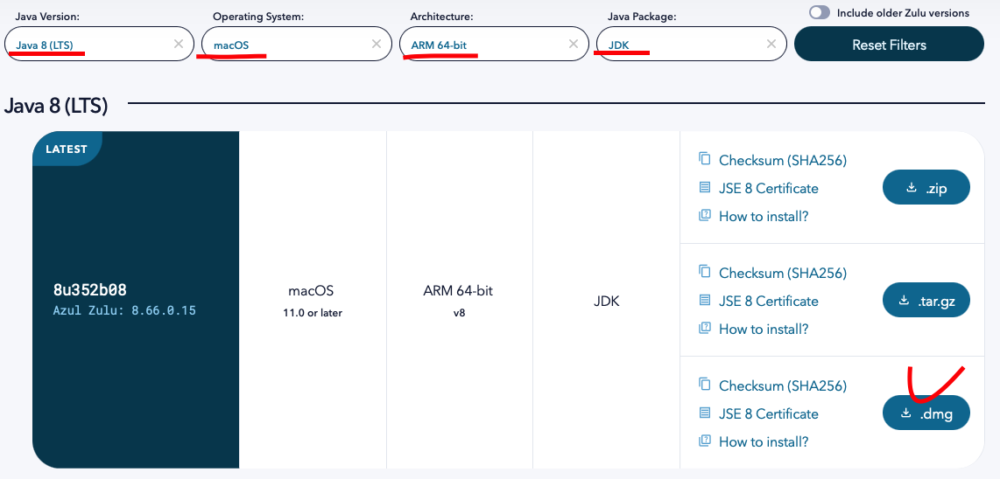
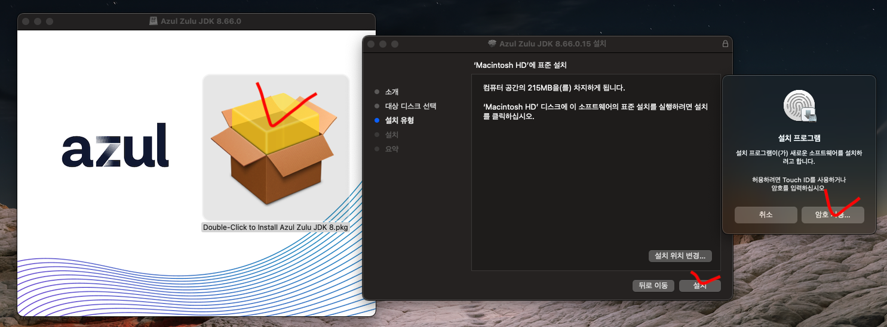
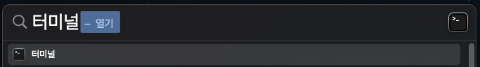
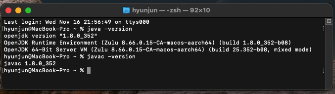
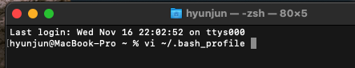
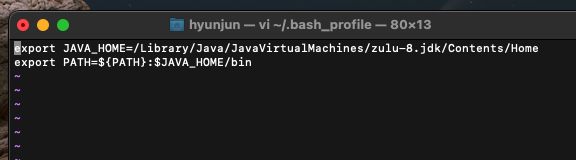
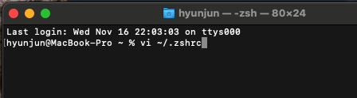
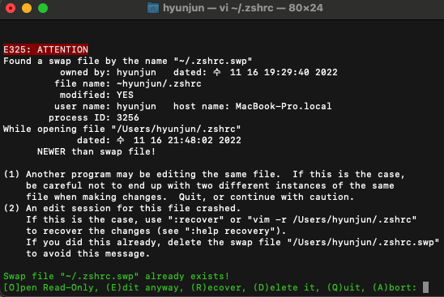
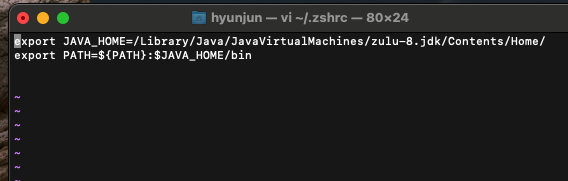
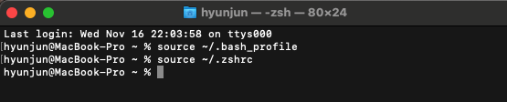

<!-- 나의 실제 컴퓨터및 컴퓨터 버전 -->

          개발 환경 
          - 2021, 맥북 프로 M1 Pro 14인치 모델  
          - Ventura 13.1 베타(22C5050e) 버전

 

라이선스 비용 및 안정성 등 여러 가지 이유로 현업에서는 1.8 버전을 많이 사용합니다.

Oracle JDK의 경우 M1, ARM 방식의 JDK 8버전은 지원하지 않으므로..  
Open JDK인 Azul Zulu를 받아야 한다.

[Open JDK](https://www.azul.com/downloads/?package=jdk#download-openjdk)  

다운로드 된 설치 파일 클릭 후 설치 진행.

터미널에 들어가 줍니다. ( Command + Space Bar -> 터미널 검색 )

java -version,   javac -version 명령어로 잘 설치되었는지 확인!

JDK가 설치된 폴더를 확인해 줍니다.

    MacBook-Pro ~ % /usr/libexec/java_home -V
    Matching Java Virtual Machines (1):
    1.8.0_352 (arm64) "Azul Systems, Inc." - "Zulu 8.66.0.15" /Library/Java/JavaVirtualMachines/zulu-8.jdk/Contents/Home

vi 에디터로 해당 파일을 열어 줍니다.

    vi ~/.bash_profile

에디터 실행 시 처음엔 아무것도 안 써져 있을 거예요.  
키보드 i를 눌러 Insert(입력) 모드로 들어가줍니다.  
맨 처음에 확인했던 주소와 같이 작성한 뒤,

esc를 눌러 입력 모드를 종료하고.  
그 후 키보드 :wq를 입력하여 저장 및 종료합니다.  

    export JAVA_HOME=/Library/Java/JavaVirtualMachines/zulu-8.jdk/Contents/Home
    export PATH=${PATH}:$JAVA_HOME/bin

 
마찬가지로 아래 파일도 수정해 줍니다.

vi ~/.zshrc  

아래와 같이 나올 경우 E를 눌러 진입합니다.  

마찬가지로 아래처럼 작성해 주세요.  

    export JAVA_HOME=/Library/Java/JavaVirtualMachines/zulu-8.jdk/Contents/Home/
    export PATH=${PATH}:$JAVA_HOME/bin

수정한 환경 변수 들을 적용시켜줍니다.

    source ~/.bash_profile
    source ~/.zshrc  

JDK 1.8 ( ARM )과 이클립스 최신 버전과 같이 쓰실 분은 아래 링크 글 참조하세요.
