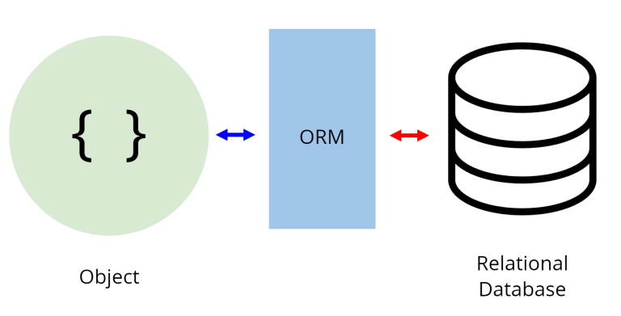
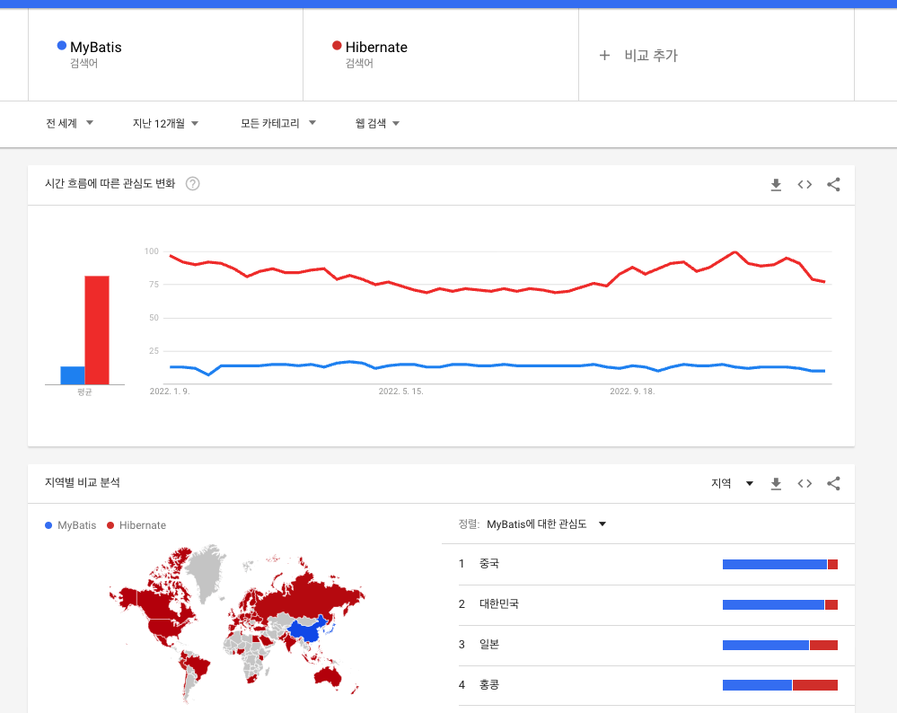

<hr>

# SQL
SQL은 Structured Query Language (구조적 질의 언어)의 줄임말로,  
관계형 데이터베이스 시스템, RDBMS(Relational Database Management System)에서
자료를 관리 및 처리하기 위해 설계된 언어입니다.

- 1970년대 IBM에서 최초 개발
- 관계형 모델 이론에서 파생된 특징을 가지고 있음.
- 현재 SQL의 표준으로 ANSI SQL이 정립됨.
- 각 DBMS 프로그램에서 ANSI SQL을 기반으로 개발된 개별 SQL을 사용합니다.


## SQL 문법의 종류

DDL(Data Definition Languaege, 데이터 정의 언어)  
각 릴레이션을 정의하기 위해 사용하는 언어입니다. (CREATE, ALTER, DROP..)

DML(Data Manipulation Language, 데이터 조작 언어)  
데이터를 추가/수정/삭제하기 위한, 즉 데이터 관리를 위한 언어입니다. (SELECT, INSERT, UPDATE...)

DCL(Data Control Language, 데이터 제어 언어)  
사용자 관리 및 사용자별로 릴레이션 또는 데이터를 관리하고 접근하는 권한을 다루기 위한 언어입니다.
(GRANT, REVOKE...)


## SQL의 특징

- SQL은 대소문자를 가리지 않습니다.  
단, 서버 환경이나 DBMS 종류에 따라 데이터베이스 또는 필드명에 대해 대소문자를 구분하기도 합니다.

- SQL 명령은 반드시 세미콜론(;)으로 끝나야 합니다.

- 고유의 값은 따옴표(")로 감싸줍니다. 

```SQL
    SELECT * FROM EMP WHERE NAME = 'Hyunjun';
```

- 객체를 나타낼 때는 백틱(``)으로 감싸줍니다.


```SQL
    SELECT `COST`, `TYPE` FROM `INVOICE`;
```

- 주석은 `--`으로 사용됩니다.

```SQL
    -- SELECT * FROM EMP;  
```

- 여러 줄 주석은 `/* */`으로 사용됩니다.

```SQL
/*
    SELECT * FROM EMP;
*/
```

<hr>

# ORM

[이미지 출처, 참고 블로그](https://hanamon.kr/orm%EC%9D%B4%EB%9E%80-nodejs-lib-sequelize-%EC%86%8C%EA%B0%9C/)



ORM이란?
- Object Relational Mapping(객체-관계-매핑)의 약자입니다.
- 객체와 데이터베이스의 관계를 매핑해주는 도구입니다.
- 프로그래밍 언어의 객체와 관계형 데이터베이스의 데이터를 자동으로 매핑(연결)해주는 도구입니다.
- 프로그래밍 언어의 객체와 관계형 데이터베이스 사이의 중계자(통역자) 역할을 합니다.
- MVC 패턴에서 모델(Model)을 기술하는 도구입니다.
- 객체와 모델 사이의 관계를 기술하는 도구입니다.

<hr>

ORM 사용 이유
- OOP vs Relational Database
- 객체 지향 프로그래밍은 클래스를 이용하고 관계형 데이터베이스는 테이블을 이용하는데 객체 모델과 관계형 모델 간의 불일치가 존재합니다.
- 데이터베이스 접근을 프로그래밍 언어의 관점에서 맞출 수 있습니다.
- 객체 간의 관계를 바탕으로 SQL을 자동으로 생성하여 불일치를 해결합니다.
- SQL 문을 직접 작성하지 않고 엔티티를 객체로 표현할 수 있습니다.
- 객체를 통해 간접적으로 데이터베이스를 다룹니다.
- 이를 통해 데이터베이스 세계와 프로그래밍 언어 사이의 개념의 간극을 줄여줍니다.
- 이를 통해 느슨하게 연결된, 테스트에 용이한 애플리케이션을 만들 수 있습니다.

<hr>

ORM 장점

👉 직관적인 코드 (가독성) + 비지니스 로직 집중 가능 (생산성)
- ORM을 이용하면 SQL Query 가 아닌 메서드로 데이터를 조작할 수 있습니다.
- 이로써 프로그래머가 객체 모델로 프로그래밍하는 것에 더 집중할 수 있게 도와줍니다.
- 각종 객체에 대한 코드를 별도로 작성하기 때문에 코드 가독성을 높여줍니다.
- SQL의 절차적이고 순차적인 접근이 아닌 객체 지향적인 접근으로 생산성이 증가합니다.

👉 재사용 및 유지보수 편리성 증가
- ORM은 디자인 패턴을 견고하게 만드는 데 유리합니다.
- ORM은 독립적으로 작성되었고 해당 객체들을 재활용할 수 있기 때문입니다.

👉 DBMS에 대한 종속성 저하
- 객체 간 관계를 바탕으로 SQL을 자동으로 생성하기 때문에 RDBMS의 데이터 구조와 프로그래밍 언어의 객체 모델 사이의 간격을 좁혀줍니다.
- 대부분의 ORM 솔루션은 DB에 종속적이지 않습니다.
- 프로그래머는 Object에 집중하므로 DBMS를 다루는 큰 작업에도 비교적 적은 리스크와 시간만 소요할 수 있습니다.

<hr>

ORM 단점

👉 완벽한 ORM 으로만 서비스를 구현하기 어렵습니다.
- 사용하기는 편리하지만 설계는 신중하게 해야 합니다.
- 프로젝트의 복잡성이 커질 경우 난이도 또한 올라갑니다.
- 잘못 구현된 경우 일관성이 무너지는 문제점이 생길 수 있습니다.


이 ORM은 JAVA에만 존재하는 기술은 아닙니다.  
어느 프레임워크던 객체와 데이터베이스의 테이블의 매핑을 할 때 사용되는 기술입니다.

<hr>

# Hibernate, MyBatis

JPA는 JAVA 진영에서 ORM 기술 표준으로 사용하는 인터페이스 모음입니다.

JPA는 ORM 기술로 분류되고,  
MyBatis는 SQL Builder 또는 SQL Mapper의 한 종류입니다.  

MyBatis는 원래 Apache Foundation의 iBatis였으나,  
생산성, 개발 프로세스, 커뮤니티 등의 이유로 Google Code로 이전되면서 이름이 변경되었습니다.  

MyBatis는 record에 원시 타입과 Map 인터페이스, 그리고 자바 POJO를 설정해서 매핑하기 위해 xml과 Annotation을 사용할 수 있습니다.

SQL Mapper의 한 종류인 Mybatis는 옛날부터 많이 사용 되어왔고, 지금도 사용하는 곳도 있지만,  
현재는 JPA 구현체인 Hibernate가 더욱 많이 사용되고 있습니다.

