<hr>


목표
- Spring Security란?
- Spring Security의 구조
- Spring Security를 실제로 어떻게 적용 하는지.
- Spring Security를 왜써야 하는지(장점)
- Spring Security의 다양한 기능들


<hr>

# Spring Security란?
`Spring Security` 프레임워크는, 스프링을 이용하여 서버를 만들 때  
필요한 인증 및 인가를 위해 많은 기능을 제공해 주는 스프링 하위 프레임워크입니다.

아마 서비스 단의 기능기능마다 로그인 및 JWT라던지 인증 기능이 반복된다면,
이 코드를 하나로 줄일수 없을까?라는 생각은 해보았을것입니다.

Spring Security를 공부하게 되면, 공부하는데 어려울 순 있겠지만,
자유자재로 사용한다면 상당히 편리한 이점이 많아집니다.

<hr>

# 구조 (Architecture)
일단 Spring Security를 공부하고, 다루기 위해선, 구조를 먼저 알아야 한다고 생각듭니다.

- Security는 MVC 패턴 이전에 `Filter`로서 동작합니다.
- `Filter`란 클라이언트의 요청이 서블릿으로 가기 전에 먼저 처리할 수 있도록
톰캣(WAS)에서 지원해주는 기능입니다.

## Filter 구조
Filter 구조를 설명하기전 이해하기 쉽게 아래의 기본적인 구조의 사진을 넣어놨습니다.

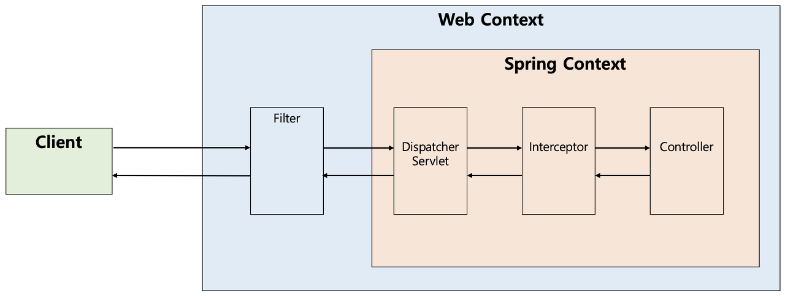
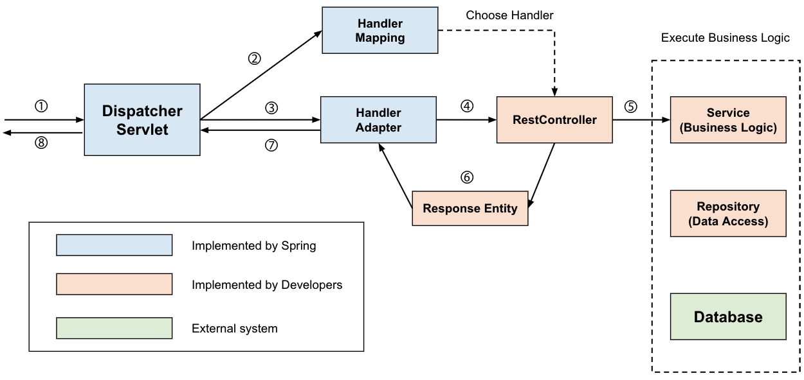


<hr>

### Spring Security 공식 문서

스프링 시큐리티의 서블릿 제공은 Servlet의 Filter에 기반한다.  
따라서 Servlet Filter의 역할을 먼저 살펴볼 필요가 있다.  
다음 그림은 싱글 HTTP 요청이 들어왔을 때, 일반적인 핸들러 계층이다.

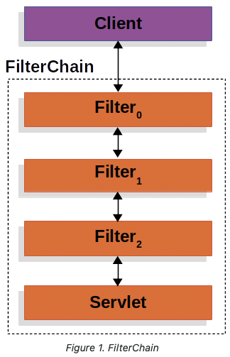

클라이언트가 애플리케이션에 요청을 보내면,  
컨테이너는 Filter와 Servlet을 포함하고 있는 FilterChain을 생성한다. 

보통 Servlet은 한 개의 HttpServletRequest와  
HttpServletResponse를 다루지만, 한 개 이상의 필터도 사용되어질 수 있다.

<hr>

### DelegatingFilterProxy
Servlet 컨테이너는 서로 다른 기준을 가진 Filter를 등록하는 것을 허용하지만,  
스프링은 이를 Beans으로 인식하지 못한다. 

스프링은 Servlet 컨테이너의 생명주기와 스프링의 ApplicationContext를 연결하기 위해서,  
DelegatingFilterProxy라는 Filter implementation을 제공한다.

DelegatingFilterProxy는 표준 Servlet 컨테이너 메커니즘을 통해 등록되어지나,  
모든 작업을 스프링 빈으로도 등록하기 때문에 스프링이 이를 인식할 수 있습니다.  
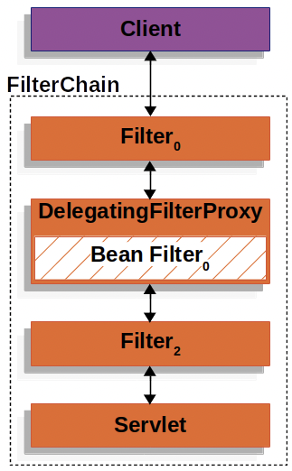

DelegatingFilterProxy는 ApplicationContext로부터 Bean Filter_0을 찾은 다음, Bean Filter_0를 호출한다.

<hr>

### FilterChainProxy
스프링 시큐리티의 서블릿은 FilterChainProxy안에서 지원을 받는다.  
FilterChainProxy는 많은 필터 객체가 SecurityFilterChain으로 전파될 수 있도록 도와주는 특별한 필터이다.  
FilterChainProxy가 bean이기 때문에, 전형적으로 DelegatingFilterProxy에 감싸져 있다.

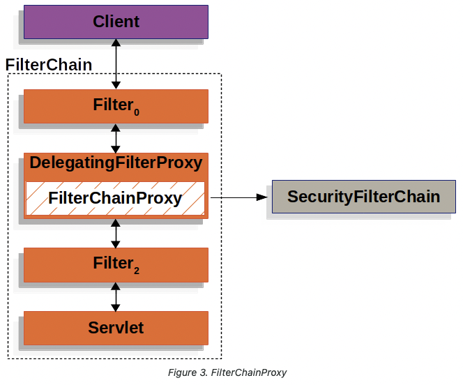

<hr>

### SecurityFilterChain
SecurityFilterChain은 어떤 스프링 시큐리티 필터를 사용할지 결정하기 위해 FilterChainProxy와 소통한다.  
SecurityFilterChain도 FilterChainProxy와 마찬가지로 빈이지만,  
DelegatingFilterProxy가 아닌 FilterChainProxy와 함께 등록이 되어 있다. 
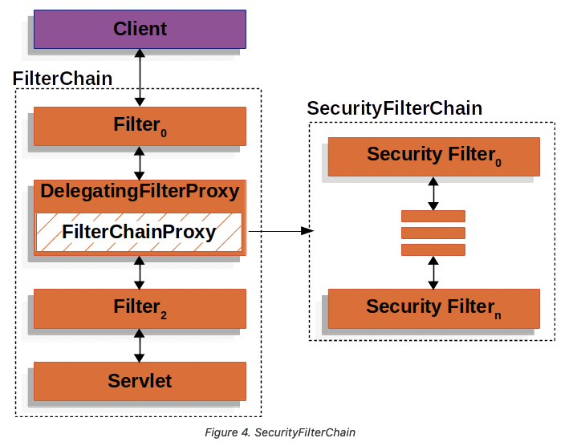

<hr>

FilterChainProxy는 많은 이점을 제공하고 있다.

1. 모든 스프링 시큐리티의 서블릿 지원에게 시작점을 제공한다. (FilterChainProxy에 debug 포인트를 찍는 것은 디버깅을 쉽게 도와줄 것이다.)
2. FilterChainProxy가 스프링 시큐리티 사용의 중심에 있기 때문에, 메모리 유출을 피하는 등의 SecurityContext를 분명히 하는 역할을 한다. 
3. SecurityFilterChain이 언제 호출되어야 하는지에 대한 부분에 있어 유연성을 제공한다. 필터에서는 URL에 기반해서 호출이 되지만, FilerChainProxy는 HttpServletRequest의 어떤 요소든지 기준점을 잡고 호출할 수 있다.
4. FilterChainProxy는 여러개의 SecurityFilterChain이 있을 때 어떤 SecurityFilterChain이 언제 사용되어져야하는지를 지정하는데 사용되어질 수 있으면 이는 큰 이점을 가진다.


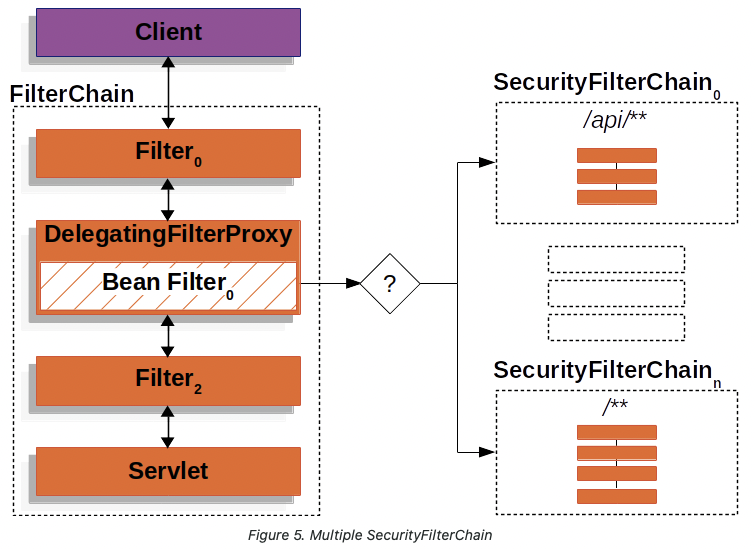
만약에 URL로 /api/messages/가 요청으로 들어오면,  
FilterChainProxy는 SecurityFilterChain_0을 먼저 매칭할 것이다.  
그러면 SecurityFilterChain_n도 매칭이 됨에도 불구하고 _0번만 호출이 된다. 


<hr>


Survlet Container의 Filter
- 서블릿 컨테이너의 Filter는 Dispatch Survlet으로 가기 전에 먼저 적용된다.
- Filter들은 여러개가 연결되어 있어 Filter chain이라고 불린다.
- 모든 Request들은 Filter chain을 거쳐야지 Survlet에 도착하게 된다.

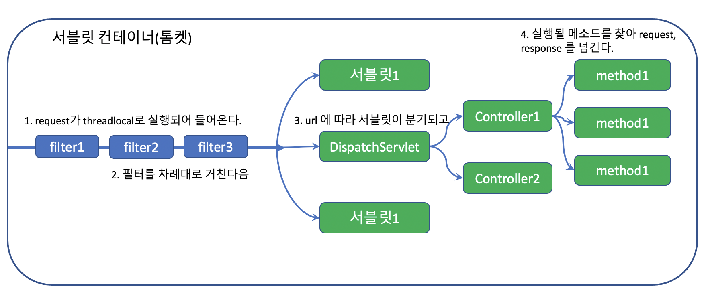

[이미지 출처](https://velog.io/@seongwon97/Spring-Security-Filter%EB%9E%80)

<hr>


Security의 Filter
- Spring Security는 DelegatingFilterProxy 라는 필터를 만들어 메인 Filter Chain에 끼워넣고, 그 아래 다시 SecurityFilterChain 그룹을 등록한다.
- 그렇게 하며 URL에 따라 적용되는 Filter Chain을 다르게 하는 방법을 사용한다.
- 어떠한 경우에는 해당 Filter를 무시하고 통과하게 할 수도 있다.
- WebSecurityConfigurerAdapter는 Filter chian을 구성하는 Configuration클래스로 해당 클래스의 상속을 통해 Filter Chain을 구성할 수 있다.
- configure(HttpSecurity http)를 override하며 filter들을 세팅한다.

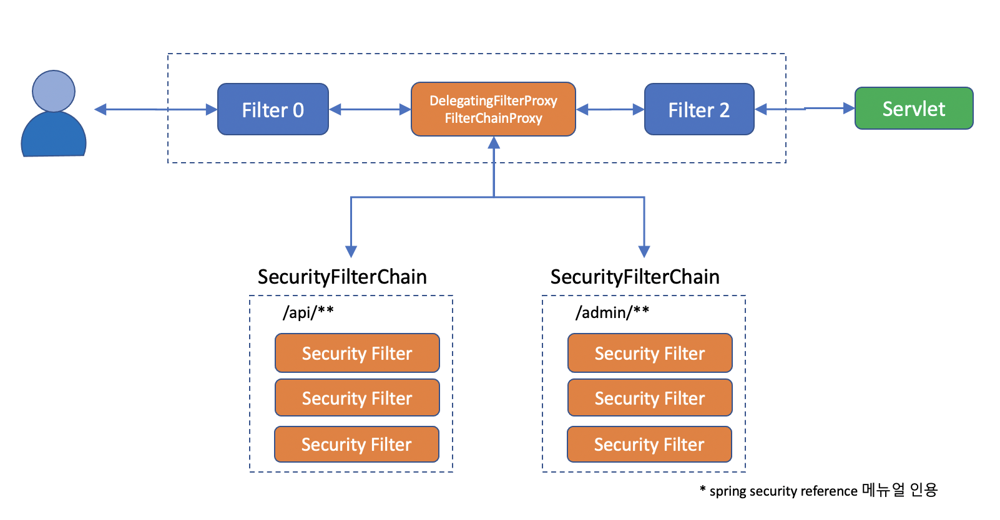

<hr>


<hr>

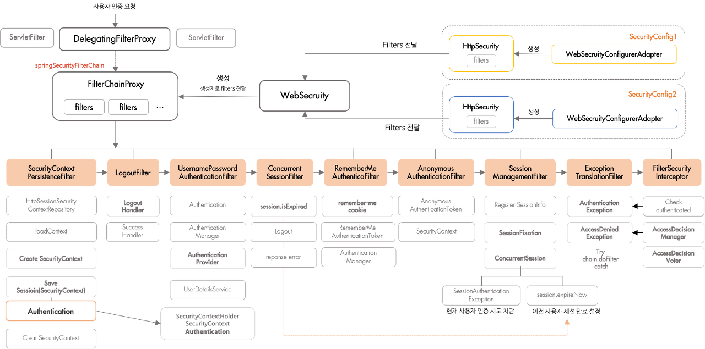
[이미지 출처](https://gngsn.tistory.com/160)


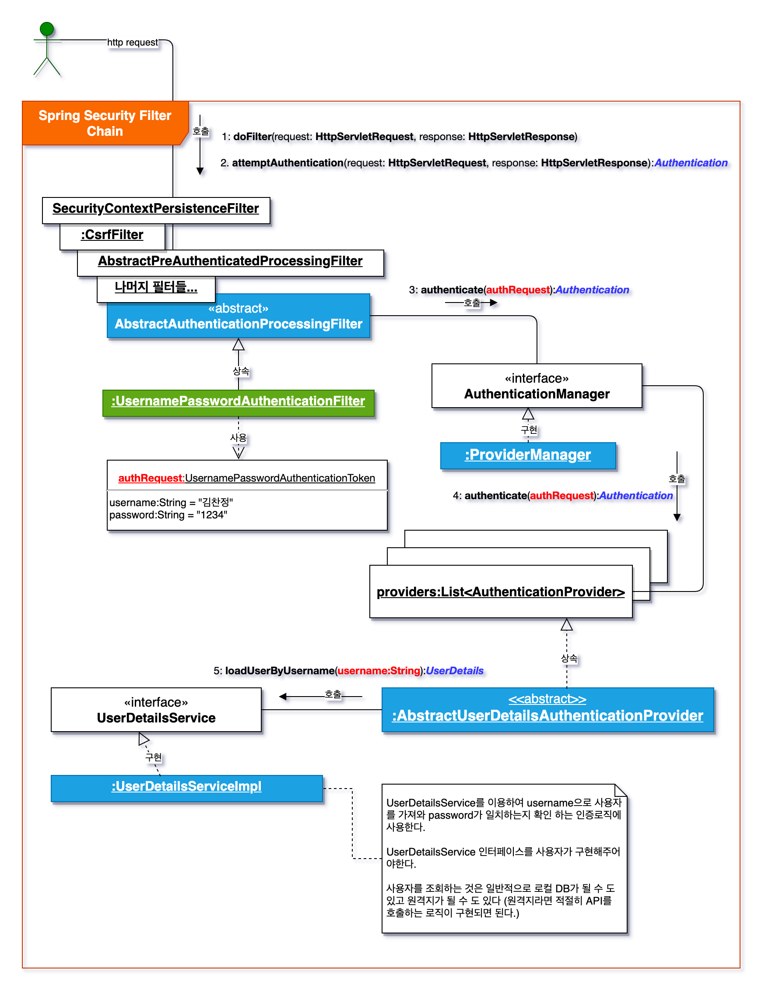
[이미지 출처](https://kimchanjung.github.io/programming/2020/07/01/spring-security-01/)


## Spring Security와 Filter
Spring Security는 요청이 들어오면 Servlet FilterChain을 자동으로 구성한 후 거치게 합니다.

FilterChain은 여러 Filter를 chain형태로 묶어놓은 것을 의미합니다. 

여기서 Filter 란,  
톰캣과 같은 웹 컨테이너에서 관리되는 서블릿의 기술입니다.  
Filter는 Client 요청이 전달되기 전후의 URL 패턴에 맞는 모든 요청에 필터링을 해줍니다. 

CSRF, XSS 등의 보안 검사를 통해 올바른 요청이 아닐 경우 이를 차단해 줍니다.
따라서 Spring Security는 이런한 기능을 활용하기위해 Filter를 사용하여 인증/인가를 구현하고 있습니다.


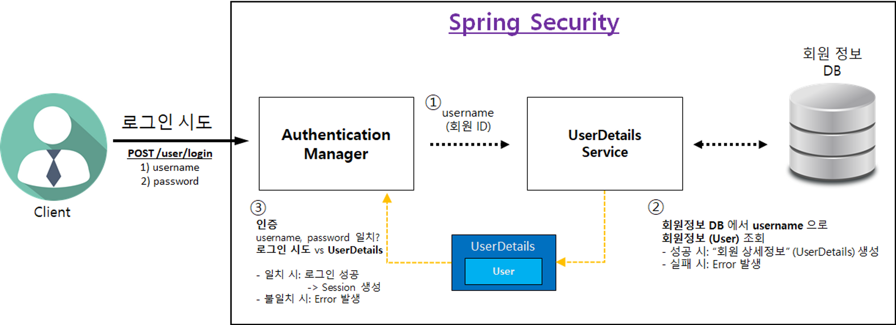


<hr>


# Spring Security 적용하기.

## 프로젝트 생성

Spring Boot Version : 2.7.7

Dependencies
- Spring Security
- Spring Web
- Spring Data JPA
- Lombok
- H2 Database
- Thymeleaf

<hr>

build.gradle


    implementation 'org.springframework.boot:spring-boot-starter-security'


### WebSecurityConfig


```java
@Configuration
@EnableWebSecurity // 스프링 Security 지원을 가능하게 함
public class WebSecurityConfig {

    @Bean
    public SecurityFilterChain securityFilterChain(HttpSecurity http) throws Exception {
        // CSRF 설정
        http.csrf().disable();
        
        http.authorizeRequests().anyRequest().authenticated();
        //http.authorizeHttpRequests().anyRequest().authenticated();
        //SpringBoot 3버전대 부터는 아래의 authorizeHttpRequests()으로 사용해야 합니다.
        
        // 로그인 사용
        http.formLogin();
        
        return http.build();
    }
}
```


아까봤던 URL별로 필터체인이 각각 있는 그림을 구현하려면 어떻게 해야 할까 ?

<hr>


[구조를 이해하는데 도움이 많이된 블로그](https://kimchanjung.github.io/programming/2020/07/01/spring-security-01/)  
[구조 이해하기 쉬운 블로그!!](https://velog.io/@gmtmoney2357/%EC%8A%A4%ED%94%84%EB%A7%81-%EC%8B%9C%ED%81%90%EB%A6%AC%ED%8B%B0-FilterChainProxy-%EB%8B%A4%EC%A4%91-%EC%84%A4%EC%A0%95-%ED%81%B4%EB%9E%98%EC%8A%A4)
[시큐리티 구조 참조 블로그 1](https://catsbi.oopy.io/c0a4f395-24b2-44e5-8eeb-275d19e2a536)  
[참조 블로그 2](https://velog.io/@seongwon97/Spring-Security-Filter%EB%9E%80)  
[참조 블로그 3](https://gngsn.tistory.com/160)  
[참조 블로그 4](https://brightmango.tistory.com/360)  
[참조 블로그 5](https://icthuman.tistory.com/entry/Spring-Security-%EA%B8%B0%EB%8A%A5-%ED%99%9C%EC%9A%A9-1-Filter-Chain)
