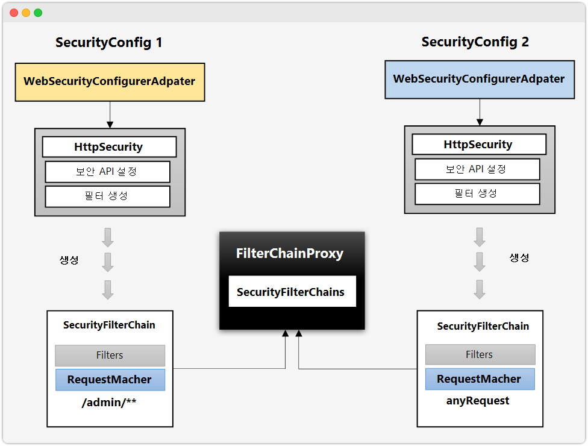
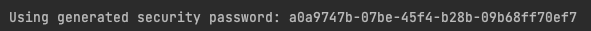
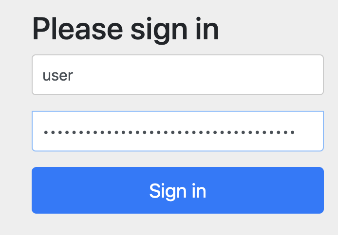
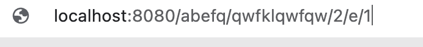
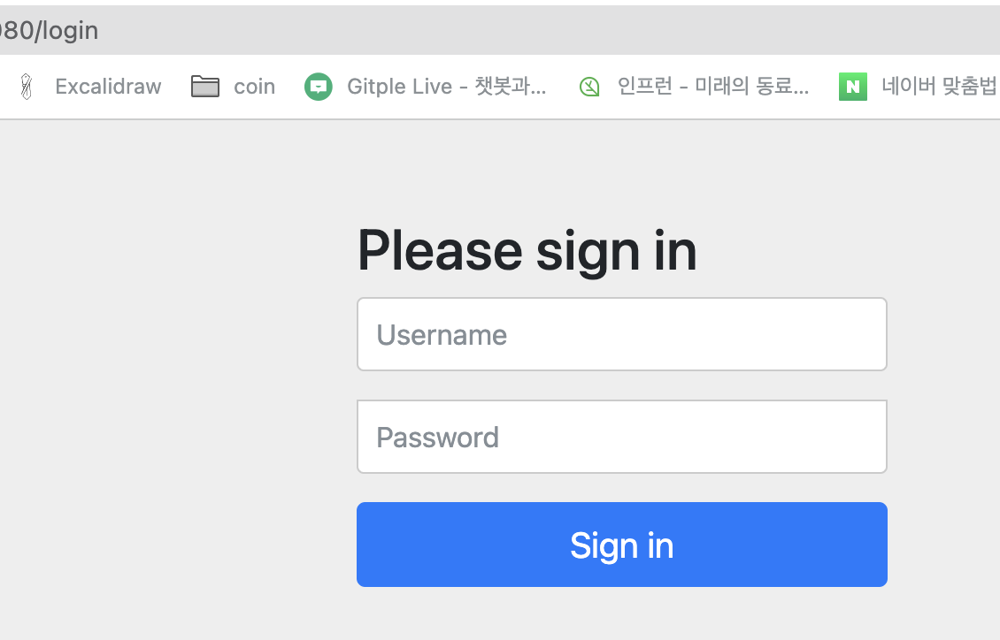
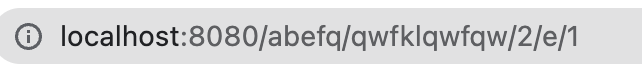
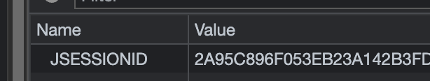
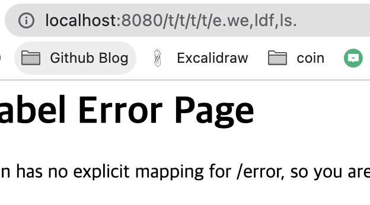

<div class="notice" style="text-align:center">
          개발 환경<br>
          - 2021, 맥북 프로 M1 Pro 14인치 모델 <br>
          - Ventura 13.2
</div>
<hr>

<div class="notice--info" style="text-align:center">
          Spring-Boot 2.7.7<br>
          Spring Security 5.7.6
</div>

<hr>


# Spring Security란?
`Spring Security` 프레임워크는, 스프링을 이용하여 서버를 만들 때  
필요한 인증 및 인가를 위해 많은 기능을 제공해 주는 스프링 하위 프레임워크입니다.

아마 서비스 단의 기능 기능마다 로그인 및 JWT라든지 인증 기능이 반복된다면,
이 코드를 하나로 줄일 수 없을까라는 생각은 해보았을 것입니다.

Spring Security를 공부하게 되면, 공부하는데 어려울 순 있겠지만,
자유자재로 사용한다면 상당히 편리한 이점이 많아집니다.

<hr>

# 구조 (Architecture)
일단 Spring Security를 공부하고, 다루기 위해선, 구조를 먼저 알아야 한다고 생각이 듭니다.

- Security는 MVC 패턴 이전에 `Filter`로서 동작합니다.
- `Filter`란 클라이언트의 요청이 서블릿으로 가기 전에 먼저 처리할 수 있도록
톰캣(WAS)에서 지원해 주는 기능입니다.
- Filter로서의 구조와 + 기본 인증 로직에서의 구조(객체)를 설명합니다.

<hr>

# Filter 구조

Spring에서 진행되는 전체적인 구조입니다.  
Filter는 Dispatcher Servlet보다 앞단에서 실행됩니다.


<hr>

스프링 시큐리티의 서블릿 제공은 Servlet의 Filter에 기반합니다.  
따라서 Servlet Filter의 역할을 먼저 살펴볼 필요가 있습니다.  
다음 그림은 싱글 HTTP 요청이 들어왔을 때, 일반적인 핸들러 계층입니다.


클라이언트가 애플리케이션에 요청을 보내면,  
컨테이너는 Filter와 Servlet을 포함하고 있는 FilterChain을 생성합니다.

보통 Servlet은 한 개의 HttpServletRequest와  
HttpServletResponse를 다루지만, 한 개 이상의 필터도 사용될 수 있습니다.

<hr>

## DelegatingFilterProxy
Servlet 컨테이너는 서로 다른 기준을 가진 Filter를 등록하는 것을 허용하지만,  
스프링은 이를 Beans으로 인식하지 못합니다.

스프링은 Servlet 컨테이너의 생명주기와 스프링의 ApplicationContext를 연결하기 위해서,  
DelegatingFilterProxy라는 Filter implementation을 제공합니다.

DelegatingFilterProxy는 표준 Servlet 컨테이너 메커니즘을 통해 등록되어지나,  
모든 작업을 스프링 빈으로도 등록하기 때문에 스프링이 이를 인식할 수 있습니다.  


DelegatingFilterProxy는 ApplicationContext로부터 Bean Filter_0을 찾은 다음, Bean Filter_0를 호출합니다.

<hr>

## FilterChainProxy
스프링 시큐리티의 서블릿은 FilterChainProxy 안에서 지원을 받습니다.   
FilterChainProxy는 많은 필터 객체가 SecurityFilterChain으로 전파될 수 있도록 도와주는 특별한 필터입니다.  

FilterChainProxy가 bean이기 때문에, 전형적으로 DelegatingFilterProxy에 감싸져 있습니다.  


<hr>

## SecurityFilterChain
SecurityFilterChain은 어떤 스프링 시큐리티 필터를 사용할지 결정하기 위해 FilterChainProxy와 소통합니다.  

SecurityFilterChain도 FilterChainProxy와 마찬가지로 빈이지만,  
DelegatingFilterProxy가 아닌 FilterChainProxy와 함께 등록이 되어 있습니다.  


<hr>

FilterChainProxy는 많은 이점을 제공하고 있습니다.

1. 모든 스프링 시큐리티의 서블릿 지원에게 시작점을 제공합니다. (FilterChainProxy에 debug 포인트를 찍는 것은 디버깅을 쉽게 도와줄 것입니다.)
2. FilterChainProxy가 스프링 시큐리티 사용의 중심에 있기 때문에, 메모리 유출을 피하는 등의 SecurityContext를 분명히 하는 역할을 합니다.  
3. SecurityFilterChain이 언제 호출되어야 하는지에 대한 부분에 있어 유연성을 제공합니다. 필터에서는 URL에 기반해서 호출이 되지만, FilerChainProxy는 HttpServletRequest의 어떤 요소든지 기준점을 잡고 호출할 수 있습니다.
4. FilterChainProxy는 여러 개의 SecurityFilterChain이 있을 때 어떤 SecurityFilterChain이 언제 사용돼야 하는지를 지정하는 데 사용될 수 있으면 이는 큰 이점을 가집니다.


  
만약에 URL로 /api/messages/가 요청으로 들어오면,  
FilterChainProxy는 SecurityFilterChain_0을 먼저 매칭할 것입니다.  
그러면 SecurityFilterChain_n도 매칭이 됨에도 불구하고 _0번만 호출이 됩니다.


<hr>

스프링 시큐리티는 아래처럼 많은 기능을 제공하는 필터가 존재합니다. 

[이미지 출처](https://gngsn.tistory.com/160)

<hr>


## Survlet Container의 Filter
- 서블릿 컨테이너의 Filter는 Dispatch Survlet으로 가기 전에 먼저 적용됩니다.
- Filter들은 여러 개가 연결되어 있어 Filter chain이라고 불립니다.
- 모든 Request들은 Filter chain을 거쳐야지 Survlet에 도착하게 됩니다.


[이미지 출처](https://velog.io/@seongwon97/Spring-Security-Filter%EB%9E%80)

<hr>


## Security의 Filter
- Spring Security는 DelegatingFilterProxy라는 필터를 만들어 메인 Filter Chain에 끼워 넣고, 그 아래 다시 SecurityFilterChain 그룹을 등록합니다.
- 그렇게 하며 URL에 따라 적용되는 Filter Chain을 다르게 하는 방법을 사용합니다.
- 어떠한 경우에는 해당 Filter를 무시하고 통과하게 할 수도 있습니다.


- WebSecurityConfigurerAdapter는 Filter chian을 구성하는 Configuration 클래스로 해당 클래스의 상속을 통해 Filter Chain을 구성할 수 있습니다.
- `(WebSecurityConfigurerAdapter는 최신 버전에서 더 이상 사용되지 않습니다`, 맨 아래에 있는 링크로 이동하시면 최신 버전의 Filter Chain 구성 방법 글이 있습니다.)
- configure(HttpSecurity http)를 override 하며 filter들을 세팅합니다.


Spring Security는 요청이 들어오면 Servlet FilterChain을 자동으로 구성한 후 거치게 합니다.

FilterChain은 여러 Filter를 chain 형태로 묶어놓은 것을 의미합니다. 

여기서 Filter 란,  
톰캣과 같은 웹 컨테이너에서 관리되는 서블릿의 기술입니다.  
Filter는 Client 요청이 전달되기 전후의 URL 패턴에 맞는 모든 요청에 필터링을 해줍니다. 

CSRF, XSS 등의 보안 검사를 통해 올바른 요청이 아닐 경우 이를 차단해 줍니다.
따라서 Spring Security는 이런한 기능을 활용하기 위해 Filter를 사용하여 인증/인가를 구현하고 있습니다.


<hr>

위에서 봤던 사진들처럼, 아래처럼 URL마다 SecurityConfig, 즉 필터 체인을 구성 가능합니다.



<hr>


## 실제 인증 과정
실질적으로 인증 시 아래와 같은 로직을 거치게 됩니다.


[이미지 출처](https://kimchanjung.github.io/programming/2020/07/01/spring-security-01/)


<hr>


<hr>

`구조를 이해하는 게 중요`하기 때문에 사진을 많이 사용했습니다.


# Spring Security 실습

<hr>

Dependencies
- Spring Security
- Spring Web
- Spring Data JPA
- Lombok
- H2 Database
- Thymeleaf

<hr>

build.gradle


    implementation 'org.springframework.boot:spring-boot-starter-security'


## WebSecurityConfig


```java
@Configuration
@EnableWebSecurity // 스프링 Security 지원을 가능하게 함
public class WebSecurityConfig {

    @Bean
    public SecurityFilterChain securityFilterChain(HttpSecurity http) throws Exception {
        // CSRF 설정
        http.csrf().disable();
        
        http.authorizeRequests().anyRequest().authenticated();
        //http.authorizeHttpRequests().anyRequest().authenticated();
        //SpringBoot 3버전대부터는 아래의 authorizeHttpRequests()으로 사용해야 합니다.
        
        // 로그인 사용
        http.formLogin();
        
        return http.build();
    }
}
```

기본적으로 위와 같이 작성 후 UserDetailsService를 구현해 커스텀 하지 않았다면
서버 시작 시 비밀번호가 랜덤하게 생성됩니다.




그래서 기본 아이디인 user와 위의 랜덤 비밀번호를 아래에 창에 입력하면


로그인에 성공합니다.  

<hr>

또한 스프링 시큐리티는 기본 설정으로 세션 방식으로 동작하기 때문에,  
그리고 현재 모든 URL 요청에 대해서 인증되어야지만 사용 가능하기 때문에,

- 로그인을 하지 않은 상태라면 (세션 인증하지 않은 상태)

어떤 URL을 입력해도


LOGIN 창으로 이동하고


<hr>

위의 Login 창에서 Login에 성공하면, 좀 전에 요청했던 URL로 이동하며,


<hr>

내부 로직에 의해 세션 쿠키가 우리 브라우저에 저장되고


인증이 된 상태이기 때문에 어떤 URL을 입력해도 해당 주소로 넘어갑니다.



이 글의 초반에 언급했던 구조에서, URL 별로 Multi Filter Chain를 구현하고 싶다면?  
[Multi Filter Chain 구현하기](https://hyunjunhwang1994.github.io/spring%20security/Spring-Security03/)


<hr>


[구조를 이해하는 데 도움이 많이 된 블로그](https://kimchanjung.github.io/programming/2020/07/01/spring-security-01/)  
[구조 이해하기 쉬운 블로그](https://velog.io/@gmtmoney2357/%EC%8A%A4%ED%94%84%EB%A7%81-%EC%8B%9C%ED%81%90%EB%A6%AC%ED%8B%B0-FilterChainProxy-%EB%8B%A4%EC%A4%91-%EC%84%A4%EC%A0%95-%ED%81%B4%EB%9E%98%EC%8A%A4)
[시큐리티 구조 참조 블로그1](https://catsbi.oopy.io/c0a4f395-24b2-44e5-8eeb-275d19e2a536)  
[참조 블로그 2](https://velog.io/@seongwon97/Spring-Security-Filter%EB%9E%80)  
[참조 블로그 3](https://gngsn.tistory.com/160)  
[참조 블로그 4](https://brightmango.tistory.com/360)  
[참조 블로그 5](https://icthuman.tistory.com/entry/Spring-Security-%EA%B8%B0%EB%8A%A5-%ED%99%9C%EC%9A%A9-1-Filter-Chain)
