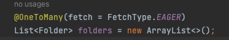
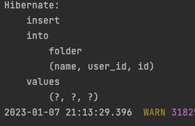
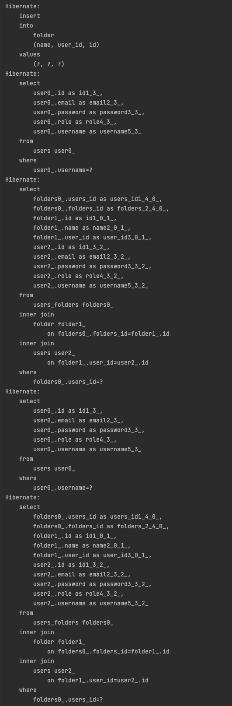

이 글은, Spring Security 사용 중, 유저의 인증이 완료된  
@AuthenticationPrincipal UserDetailsImpl userDetails를

컨트롤러 -> 서비스로 넘겨 유저 정보를 활용하고,
다시 서비스 -> 컨트롤러로 응답될 때 발생하는 아래의 에러로 인해 작성 하였습니다.


<details>   
<summary>발생 워닝</summary>
<div markdown="1">             

2023-01-07 19:58:31.265  WARN 26751 --- [nio-8080-exec-4] .w.s.m.s.DefaultHandlerExceptionResolver : Resolved [org.springframework.http.converter.HttpMessageNotWritableException: Could not write JSON: failed to lazily initialize a collection of role: com.sparta.myselectshopsecurity.entity.User.folders, could not initialize proxy - no Session; nested exception is com.fasterxml.jackson.databind.JsonMappingException: failed to lazily initialize a collection of role: com.sparta.myselectshopsecurity.entity.User.folders, could not initialize proxy - no Session (through reference chain: java.util.ArrayList[0]->com.sparta.myselectshopsecurity.entity.Folder["user"]->com.sparta.myselectshopsecurity.entity.User["folders"])]         

</div>
</details>


Spring Security를 이용하여 프로젝트를 만들어보는 2강을 진행하다,
흥미로운 문제가 있어서 진행해보았다.

아래와 같이 1명의 user가 N개의 폴더를 추가하는 기능이 있었다.

`원래의 부분을 주석으로 작성한 부분처럼 바꿨을때` 왜 동작이 안되는지   
직접 공부해보고, 동작시켜보라고 했다.

시큐리티의 인증은 구현된 상태이다!

```java
@PostMapping("/folders")
    public List<Folder> addFolders(
            @RequestBody FolderRequestDto folderRequestDto,
            @AuthenticationPrincipal UserDetailsImpl userDetails
    ) {

        List<String> folderNames = folderRequestDto.getFolderNames();

                                                  //userDetails.getUser() 
        return folderService.addFolders(folderNames,userDetails.getUsername());
    }
```

```java
   @Transactional                                            // User user
    public List<Folder> addFolders(List<String> folderNames, String name) {

        // user는 Spring Security에서 인증을 걸쳐 들어온 유저이므로
        // User user로 바꾼경우 아래 findByUsename 전체 삭제!!
        user = userRepository.findByUsername(name).orElseThrow(
                () -> new IllegalArgumentException("사용자가 존재하지 않습니다.")
        );

       
        List<Folder> existFolderList = folderRepository.findAllByUserAndNameIn(user, folderNames);

        List<Folder> folderList = new ArrayList<>();

        for (String folderName : folderNames) {
         
            if (!isExistFolderName(folderName, existFolderList)) {
                Folder folder = new Folder(folderName, user);
                folderList.add(folder);
            }
        }
        return folderRepository.saveAll(folderList);
    }
```

<hr>

사실 userDetails에 이미 User가 담겨 있지만,  
JPA, 영속성 관련해서 생각해 볼 문제를 던져주기 위해 위와같은 문제를 주신 것 같다.

그래서, 일단 매개변수를 userDetails.getUser() 및 User user로 바꾸고,

findByUsername()을 지워보니,

로그인 후 폴더 추가 시 최종적으로 아래와 같은 워닝이 뜨면서 로그인 창으로 다시 넘어가게 된다.


<br>

일단 로그를 보고 추측하여, 아래 처럼 FetchType.EAGER로 바꾸니  
일단 폴더 추가 시 아까와 다르게 동작은 하는데..



이제부터는 왜 동작했는지 알아봐야겠다!


검색 및 팀원들과 얘기해본 결과, 

- 컨트롤러단(서비스 전 단)에서의 이미 생성된 User user를 서비스단까지 가지고와서,
- 해당 엔티티는 준영속 상태이므로, 변경감지및 지연로딩이 동작하지 않는다.

fetch = FetchType.LAZY


fetch = FetchType.EAGER


하지만 이는 당장 동작은 할지 몰라도, 위와같이 N+1 문제를 발생시킨다.

## 해결 방법들
- FetchType.EAGER로 사용한다.
동작은 하지만 N+1문제를 일으키며, 현재 여러가지 폴더를 추가할 수 있는
상황이므로, 여러 유저가 많은 폴더를 추가할 때, 얼마나 많은 쿼리가 나올지..?

- 기존 코드처럼 서비스에서 Entity를 다시 불러와 사용한다.
동작하는데는 문제없고 좋지만, 유저가 이미 있는데 다시불러오는것이 비효율적이고,
이러면 Spring Security를 왜쓰지? 라는 생각이든다.

- OSIV(Open Session In View)라는 것을 이용해 해결한다.
영속성 컨텍스트를 뷰까지 열어두는 기능이다.
이 기능은 기본적으로 true로 설정되어 있지만, 인터셉터 단에서 동작하므로,
현재 Spring Security 의 트랜잭션은 필터단에서 이루어진다.

이러한 상황을 위해 필터단에서 동작하는 클래스가 존재한다.  
OpenEntityManagerInView를 Bean으로 등록하면 해결된다!

```java
@Component
@Configuration
public class OpenEntityManagerConfig {

    @Bean
    public FilterRegistrationBean<OpenEntityManagerInViewFilter> openEntityManagerInViewFilter() {
        FilterRegistrationBean<OpenEntityManagerInViewFilter> filterFilterRegistrationBean = new FilterRegistrationBean<>();
        filterFilterRegistrationBean.setFilter(new OpenEntityManagerInViewFilter());
        filterFilterRegistrationBean.setOrder(Integer.MIN_VALUE); // 예시를 위해 최우선 순위로 Filter 등록
        return filterFilterRegistrationBean;
    }

}
```

OpenEntityManagerInView가 Spring Security의 DelegatingFilterProxy보다 먼저 적용될 수 있게끔 Order를 설정하는 것을 잊지 말자.

이 설정을 추가하면 Lazy로 동작하는 연관 Entity를 조회할 때, 정상적으로 동작하는 것을 확인할 수 있다.

[추천 참조 글1](https://tecoble.techcourse.co.kr/post/2020-08-31-entity-lifecycle-1/)
[추천 참조 글2](https://tecoble.techcourse.co.kr/post/2020-09-20-entity-lifecycle-2/)
