

          개발 환경 
          - 2021, 맥북 프로 M1 Pro 14인치 모델  
          - Ventura 13.1 베타(22C5050e) 버전

          버전 
          JDK: openjdk version "11.0.17" 2022-10-18 LTS 
          IntelliJ: IntelliJ IDEA 2022.2.3 (Community Edition)

        해당 포스팅의 전반적인 내용 및 사진은 인프런의 스프링 시리즈 강의 중 하나인 
        "스프링 입문 - 코드로 배우는 스프링 부트, 웹 MVC, DB 접근 기술" 
        강의에서 가지고 왔습니다. (글 작성일 현재 무료 배포 중입니다.)     

 

># 인프런 김영한 님 스프링 시리즈 강의 / 로드맵
[강의 링크](https://www.inflearn.com/course/%EC%8A%A4%ED%94%84%EB%A7%81-%EC%9E%85%EB%AC%B8-%EC%8A%A4%ED%94%84%EB%A7%81%EB%B6%80%ED%8A%B8/dashboard)  
[스프링 시리즈 로드맵](https://www.inflearn.com/roadmaps/373#introduction-of-roadmap)

# 준비물

인텔리제이, JDK11

인텔리제이를 쓰는 이유? 
옛날에는 이클립스가 많이 쓰였지만

인텔리제이의 편의성 및 가볍고 여러 가지 이유에서,  
요즈음에는 인텔리제이 사용자가 늘어나고 있다.

유료 버전이라는 점만 빼면..  
김영한 님 말씀으로는 인텔리제이가 훨씬 편리하다고 함.

인텔리제이 커뮤니티 버전이라도 사용하는 걸로!

# Spring Boot 시작하기.

## 쉽게 시작하기.
[Spring 시작하기](https://start.spring.io/)

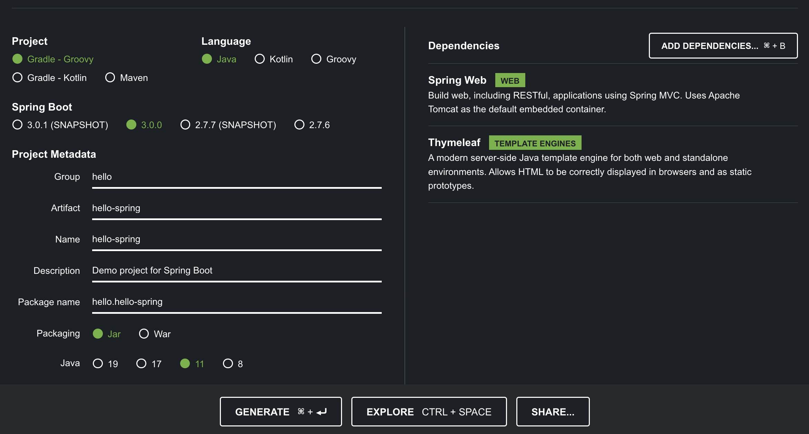

Project : 필요한 라이브러리를 당겨오고, 빌드 하는 라이프 사이클까지 다 관리를 해준다.  
Gradle - Groovy 선택

과거에는 Maven 을 많이 썼지만, 요즘에는 Gradle로 넘어오고 많이 사용하는 추세다.  
레거시 프로젝트의 경우 아직 Maven을 쓰는 것도 많다.

Group : 보통 그룹의 도매인을 쓰지만 연습용이므로 hello로 작성

Spring Boot
스프링 부트 버전은 강의에서는 2.3.1로 나오지만  
현재는 작성일 기준 최신 버전 3.0.0으로 선택. (Snapshot이나 M2, M3등 안 붙은 것 중에 최신 버전 사용)

Java version 11 선택

ADD DEPENDENCIES 클릭 후 
Spring Web, Thymeleaf 선택

마지막으로 GENERATE로 다운로드.

## 인텔리제이.

자신만의 폴더 생성 후 그 안에 방금 다운로드한 hello.spring.zip 파일 압축 해제한다.

인텔리제이 실행 후, Open -> 방금 설치한 폴더 안 build.gradle Open 하기.
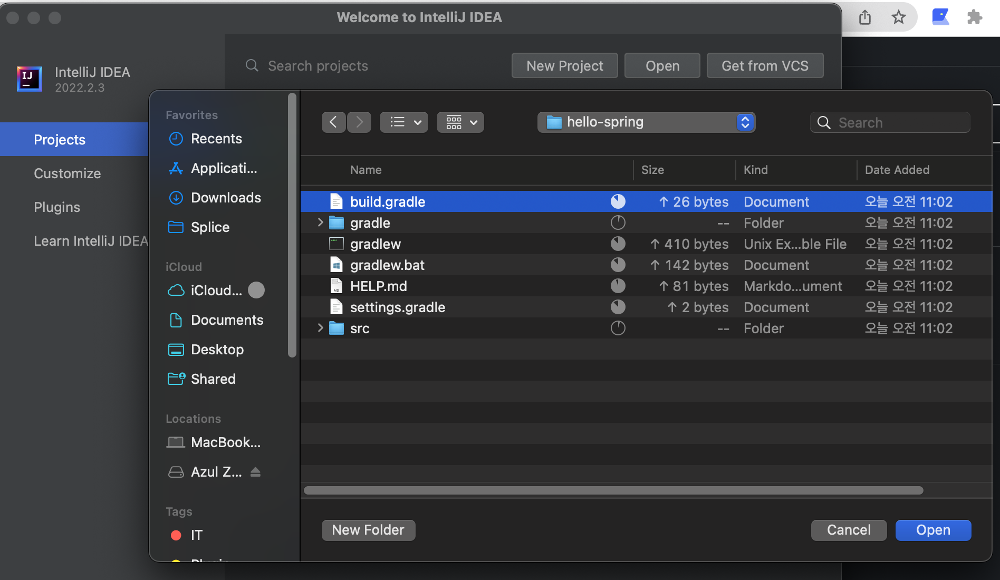

그러면 아까 Dependencies에 추가한 라이브러리들을 다운로드하기 시작한다..
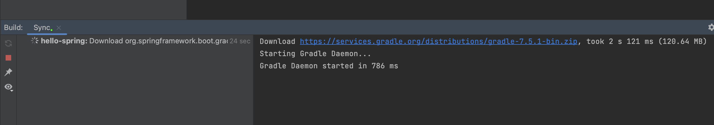

피할 수 없는 에러..
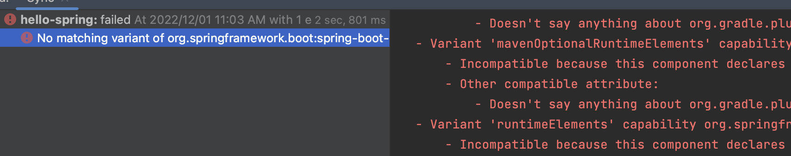

현재 글 작성일 기준 jecenter 인증서가 만료돼서 현재 문제가 있다고 한다.  
그래서 버전을 바꾸기로 했다. 
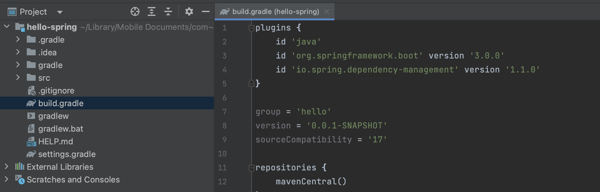

그리고 더 확인해 보니, Spring Boot 3.0 버전부터는 Java17 버전을 사용한다 한다,  
11버전을 사용하기 위해 처음 과정에서 2.7.6버전으로 다시 진행하자!

[다시 처음으로.](#spring-boot-시작하기)
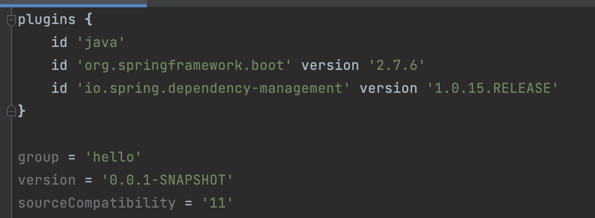

그 후 리로드 하면?
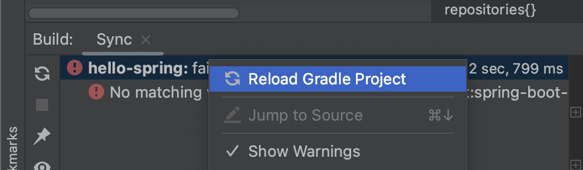

이렇게 뜨면 성공!
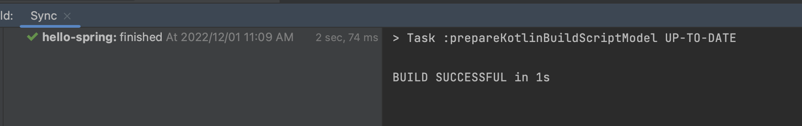

그 후, 메인 소스 파일을 열어 메인 메소드 왼쪽 초록색 화살표를 눌러 Run 해본다.
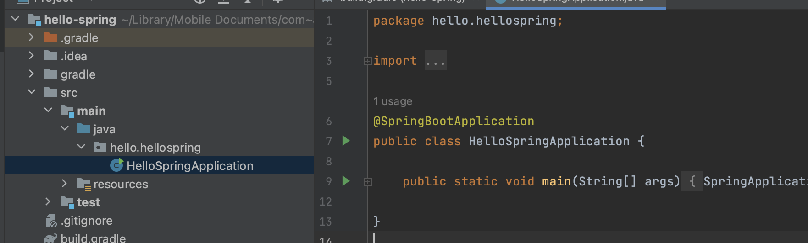

혹시 이때 자바 버전 관련 에러 나시는 분들은

settings에서 자바 컴파일러 버전 11확인
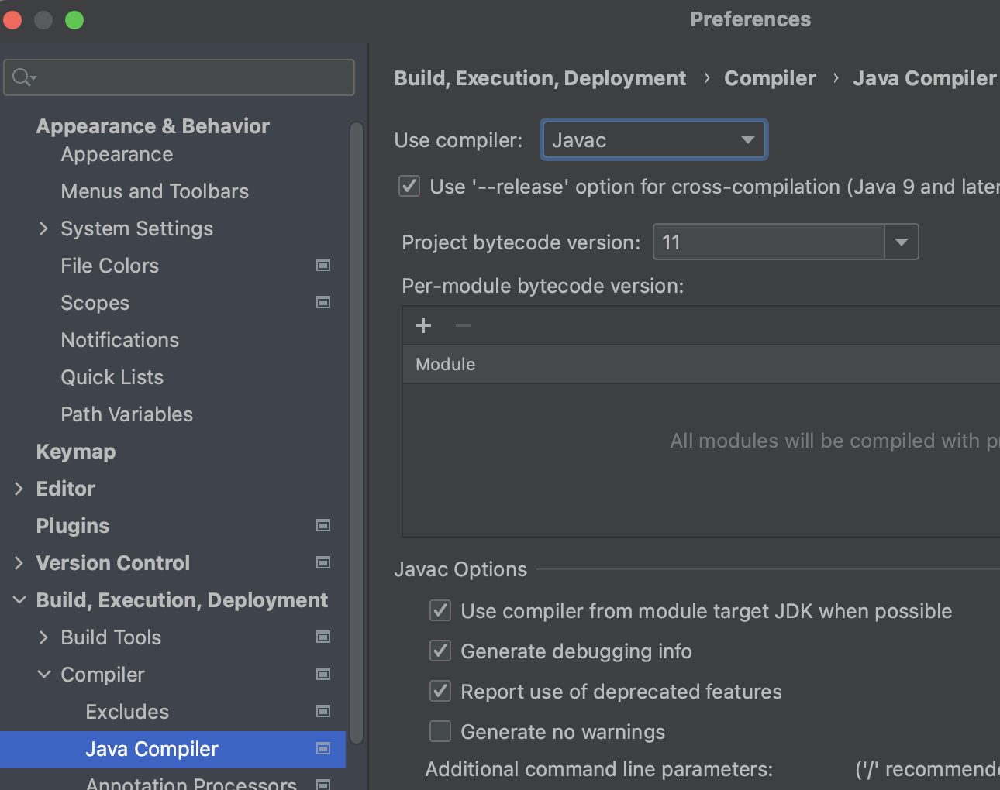

File -> Project Structure에서 SDK 버전 및, Language level 확인
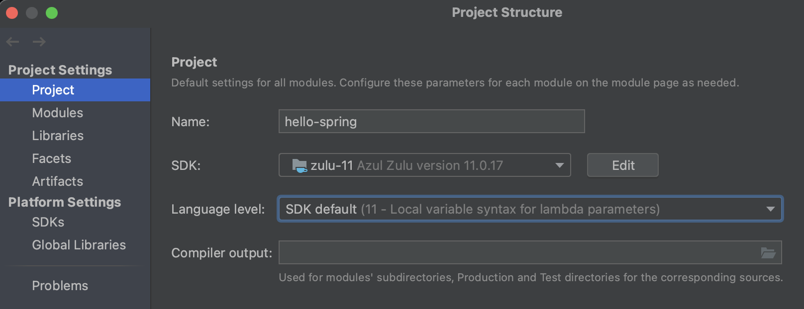

Modules에서 버전 확인!
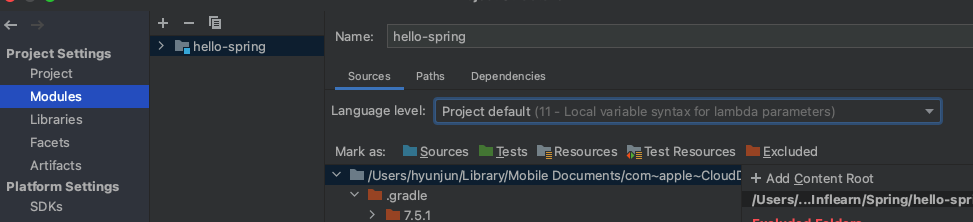

이런 에러가 나온다면
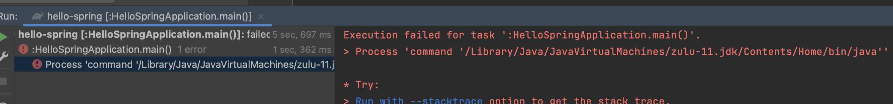

settings -> gradle에서  Build and run using, Run tests using을  
기존 gradle에서 IntelliJ로 바꿔주세요 ( Gradle JVM 도 11버전인지 확인 )
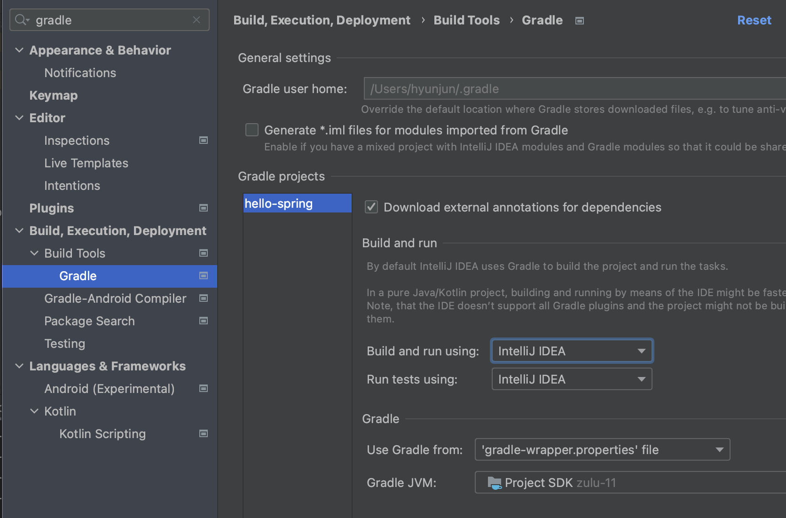

이런 귀여운 그림이 나오면 성공입니다.
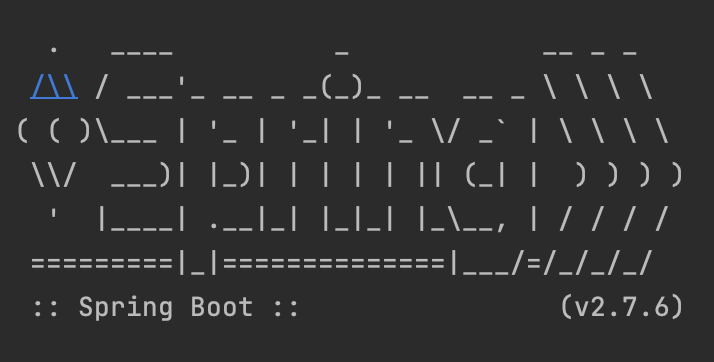

localhost:8080에 접속해서 확인해 보자.
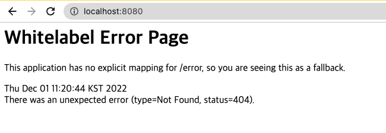

기본 에러 메시지가 아니라 스프링에서 띄워주는 에러 메시지이므로 일단은 연결은 됐으므로 성공이다.

요즈음에는 
main과 test를 나누어서 작업하는 게 거의 표준화되어있다.
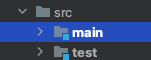

인텔리제이를 재 실행하는 경우  
프로그램을 다시 시작하면 아래와 같은 에러가 뜨는데
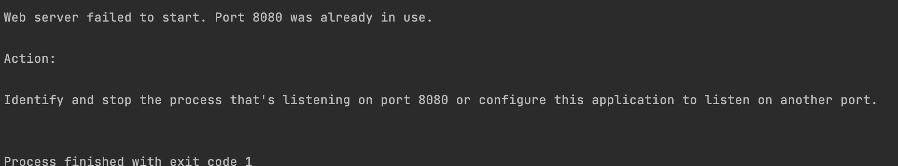

이것은 저번에 실행할 때 8080포트가 안 닫혀서 사용 중이라고 나오는 것이다.  
그럴 경우엔 터미널에서 아래 명령어 사용하면 된다.
 

    lsof -i tcp:8080    // 해당 포트 번호를 누가 사용하는지 확인
    kill $(lsof -t -i:8080) // 해당 포트 내리기

이와 같이 되지 않게 하기 위해서 인텔리제이를 종료하기 전에 프로세스를 종료시키자!  
(종료하지 않고 인텔리제이 끄면 포트는 계속 살아있는다.)  
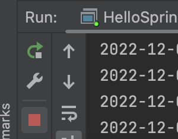

Spring Boot는 자체적으로 tomcat을 내장하고 있기 때문에 가능한 것이다!

그 외 오류 시 아래 링크 참조

[강의 자료](https://www.inflearn.com/course/%EC%8A%A4%ED%94%84%EB%A7%81-%EC%9E%85%EB%AC%B8-%EC%8A%A4%ED%94%84%EB%A7%81%EB%B6%80%ED%8A%B8/unit/49605)