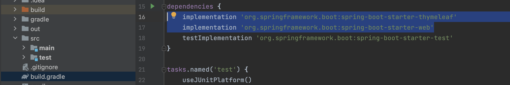
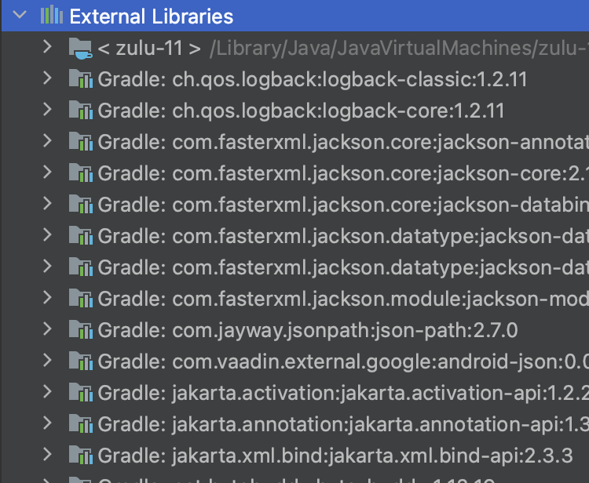
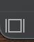
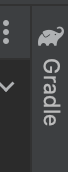
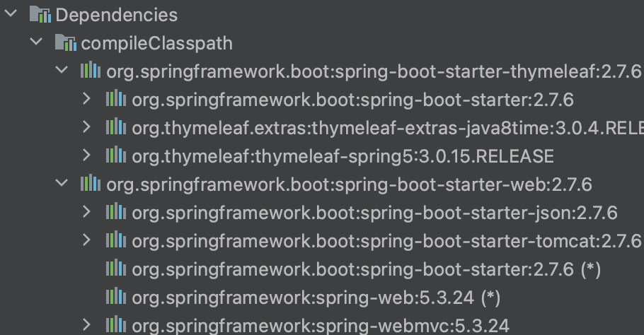

          개발 환경 
          - 2021, 맥북 프로 M1 Pro 14인치 모델  
          - Ventura 13.1

          버전 
          JDK: openjdk version "11.0.17" 2022-10-18 LTS 
          IntelliJ: IntelliJ IDEA 2022.2.3 (Community Edition)

        해당 포스팅의 전반적인 내용 및 사진은 인프런의 스프링 시리즈 강의 중 하나인 
        "스프링 입문 - 코드로 배우는 스프링 부트, 웹 MVC, DB 접근 기술" 
        강의에서 가지고 왔습니다. (글 작성일 현재 무료 배포 중입니다.)     

 

># 인프런 김영한 님 스프링 시리즈 강의 / 로드맵
[강의 링크](https://www.inflearn.com/course/%EC%8A%A4%ED%94%84%EB%A7%81-%EC%9E%85%EB%AC%B8-%EC%8A%A4%ED%94%84%EB%A7%81%EB%B6%80%ED%8A%B8/dashboard)  
[스프링 시리즈 로드맵](https://www.inflearn.com/roadmaps/373#introduction-of-roadmap)

## 라이브러리 의존관계
실제로 처음에 선택하여 설치했던 라이브러리는 
thymeleaf, web 2가지 밖에 안된다.

하지만 설치된 라이브러리들을 표시해 주는 External Libraries 폴더를 클릭하면,  
라이브러리들이 많이 나온다. 아파치, 톰캣, junit 스프링 부트.. 등등

반대로 얘기해 보면, 요즈음 웹 애플리케이션을 만들려면 기본적으로 수많은 라이브러리가 필요하다.  
(빌드 시 몇십 메가 정도가 나옴.)

Gradle이 의존관계에 있는 여러 라이브러리들을 알아서 설치해 준 것이다.
( 그래들이나 메이븐 같은 .. )

이렇게 의존관계를 타고 타고 가서 스프링 코어까지 가져온다.

인텔리제이 화면 왼쪽 최하단에 네모 버튼 클릭  

<- 화면 오른쪽 위쪽에 그레이들 클릭 ( 의존관계를 볼 수 있다. )

thymeleaf, spring-boot-starter-web 등을 가지고 올 때  
있어야만 하는 라이브러리들 (의존관계의 있는)을 자동으로 가지고 와준다.

*은 중복된 의존관계로 한 라이브러리에 표시되었다면  
다른 라이브러리의 의존관계라도 표시하지 않고 *로 나온다.

 

고대의 선배님들은 웹서버와 톰캣이 분리되어 있어서,  
웹서버 안에 톰캣을 깔고, 자바 패키지를 업로드하고 사용했지만,

요즘은 임베디드(내장) 형식으로 라이브러리에  
웹서버를 포함하고 있다. 

요즈음에는 다 이런 식으로 진행을 한다.

라이브러리 하나 잘 빌드 해서 웹서버에 올리면 끝나는 것  
예전처럼 톰캣 서버 깔고 이러지 않는다!

-> 스프링 부트 라이브러리를 쓰면 스프링 코어까지 다 포함되어 있어서   
스프링의 웬만한 세팅이 되어서 사용 가능하다.

