제가 정리한 스프링 부트 기초 1, 2의 경우  
인텔리 제이 Community Edition 버전으로 진행하였기 때문에,

아래의 사이트에서 스프링 프로젝트를 생성해 인텔리 제이로 실행했습니다만  
[start spring](https://start.spring.io/)


항해99 과정 진행 중 인텔리 제이 Ultimate 버전 4개월치가 제공되어서  
이제부터는 인텔리 제이에서 스프링 프로젝트 생성이 가능하며,  
Database 관련 작업도 쉽게 가능합니다.


아마 인텔리 제이 얼티메이트 버전으로 해야 가능한 기능들이 많이 있을 겁니다.

이클립스를 많이 그리고 잘 사용해 본 건 아닌 초보자이지만,  
이제 이클립스는 못 쓸 것 같습니다.


## 시작에 앞서 용어 정리부터.

해당 용어에 대한 자세한 정리가 아닌, 제가 아예 모르고 있던 부분이 많기 때문에
관계 이해를 위해 간단하게 정리만 하고 지나가겠습니다.


### Mysql
전 세계적으로 많이 사용되는 RDBMS 형식의 관계형데이터베이스 시스템

### JDBC (Java Database Connectivity)
자바 언어와 DB를 연결해 주는 통로와 같은 것.
자바를 이용한 DB 접속과 SQL 문장의 실행, 그리고 실행 결과로 얻어진 데이터의 핸들링을 제공하는 방법과 절차에 관한 규약.

자바 프로그램 내에서 SQL문을 실행하기 위한 자바 API.
SQL과 프로그래밍 언어의 통합 접근 중 한 형태

필요한 이유
db 학습 시 SQL 이용해서 db에다 직접 값을 넣거나 조회하는 등의 일을 수행했음.
하지만 우리가 웹을 동작, 수행시킬 때마다 매번 그럴 수는 없음.
그래서 프로그램이 이 일을 대신할 수 있게 만들어줘야 하는데 이때 사용하는 것이 JDBC이다.

### ORM (Object Relational Mapping)
객체와 테이블을 매핑해서 패러다임의 불일치를 개발자 대신 해결해 준다.

### JPA (Java Persisitence API)
자바 진영의 ORM 기술 표준. 어플리케이션과 JDBC 사이에서 동작

### Hibernate
하이버네이트는 자바 언어를 위한 ORM 프레임워크,  
JPA의 구현체로, JPA 인터페이스를 구현하며, 내부적으로 JDBC API를 사용.

[JDBC 참조 블로그](https://velog.io/@jungnoeun/JDBC%EB%9E%80)

### H2
자바로 작성된 관계형 데이터베이스 관리 시스템이다.

장점  
따로 설치가 필요 없다.  
용량이 매우 가볍다.  
웹용 콘솔(쿼리 툴) 제공하여 개발용 로컬 DB로 사용 용이  

특징  
JAVA로 작성된 오픈소스 RDBMS  
스프링 부트가 지원하는 인 메모리 관계형 데이터베이스  
인 메모리로 띄우면 애플리케이션 재기동 때마다 초기화  
로컬 환경, 테스트 환경에서 많이 쓰임  

[H2 참조 블로그](https://yjkim-dev.tistory.com/3)

### lombok
여러 가지 @어노테이션을 제공하고 이를 기반으로 반복 소스코드를 컴파일 과정에서 생성해 주는 방식으로 동작하는 라이브러리

어노테이션 사용 시,  
자바 객체지향에서 자주 사용하는 getter, setter 등을 자동으로 만들어준다.

### thymeleaf
html 태그를 기반으로 하여 동적인 View를 제공하는 템플릿 엔진  
플라스크의 Jinja 템플릿이나, Jsp(Java Server Page) 같은 것,  
Spring Boot에서는 JSP가 아닌 Thymeleaf 사용을 권장하고 있다.


## 간단 관계 정리

이 용어들을 이어 붙여서 관계를 이해해 보자면, H2는 로컬 환경에서 쉽게 데이터베이스 작업을 하기 위해 사용한다.

Spring에서는 JDBC만 사용 시 일일이 쿼리문을 다 입력하여 사용해야 한다.
비즈니스 로직 개발보다 Sql 작성 및, 수정에 따른 관리에 더 많은 시간을 기울여야 한다.

ORM, JPA가 등장하여 간단하게 쿼리를 작성 및 실행하면서,  
객체지향 패러다임의 불일치를 해결해 준다.

하이버네이트는 이 JPA를 구현한 것이므로 하이버네이트를 통해 JPA를 사용하는 것이다.


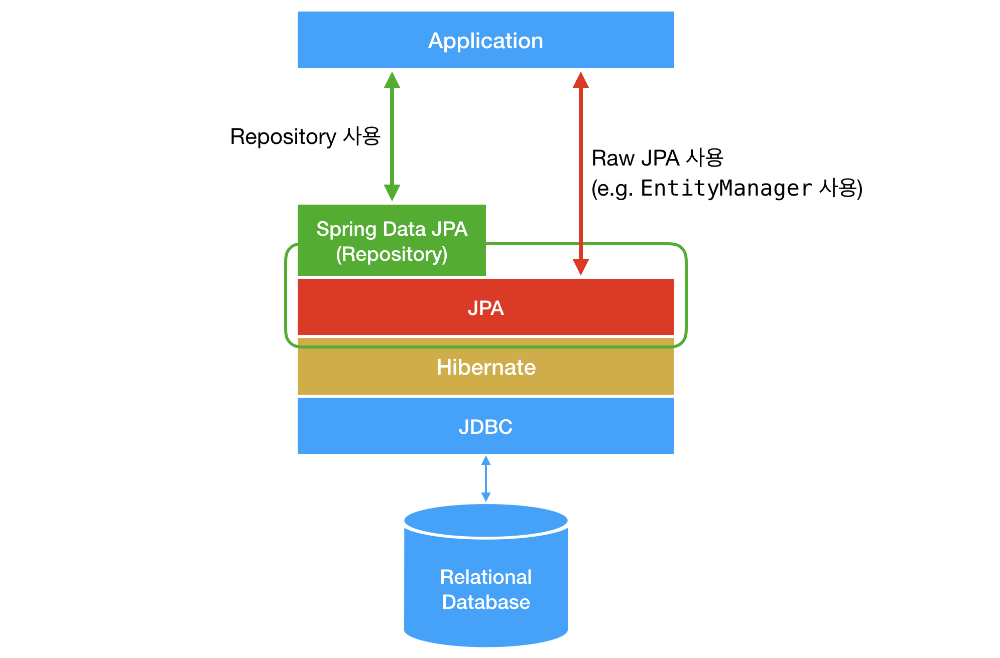

[사진 출처 및 참고 블로그](https://suhwan.dev/2019/02/24/jpa-vs-hibernate-vs-spring-data-jpa/)


[JPA, Hibernate 관련 좋은 참고 블로그](https://victorydntmd.tistory.com/195)
[영속성, ORM 블로그](https://gmlwjd9405.github.io/2019/02/01/orm.html)


## 실습

일단은 Spring, H2, Mysql 쿼리 형식을 이용해
쿼리를 이용하는 방법부터 기술하겠습니다.

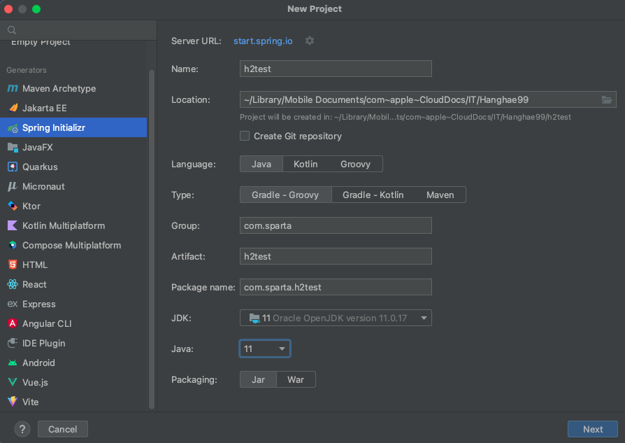

아라처럼 추가해 프로젝트를 생성해 줍니다.
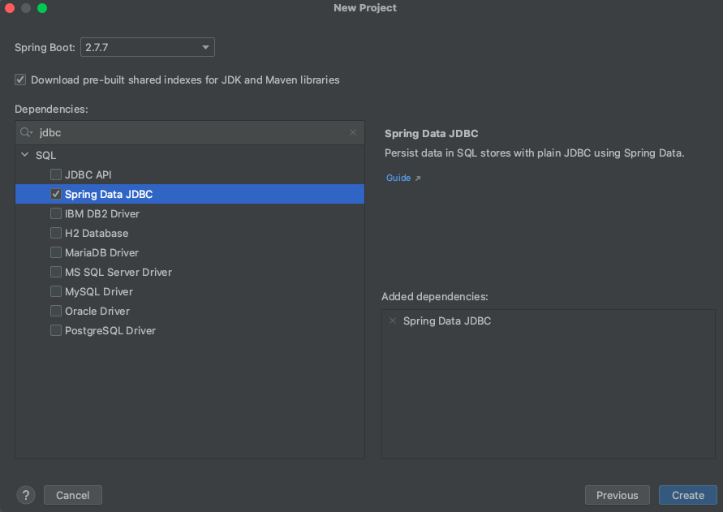


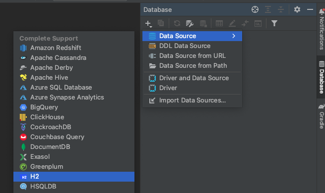

<br>


Connection type을 눌러,  
인 메모리 방식으로 변경 후 아래 url을 url에 추가해 주고 생성합니다.

 

jdbc:h2:mem:test;MODE=MYSQL;  
혹시 위의 url로 진행이 안되거나 진행 중 오류가 난다면,

아래의 url 쓰세요.  
jdbc:h2:mem:test;MODE=MYSQL;OLD_INFORMATION_SCHEMA=TRUE;

Mysql을 이용해서 h2를 사용한다는 뜻입니다.

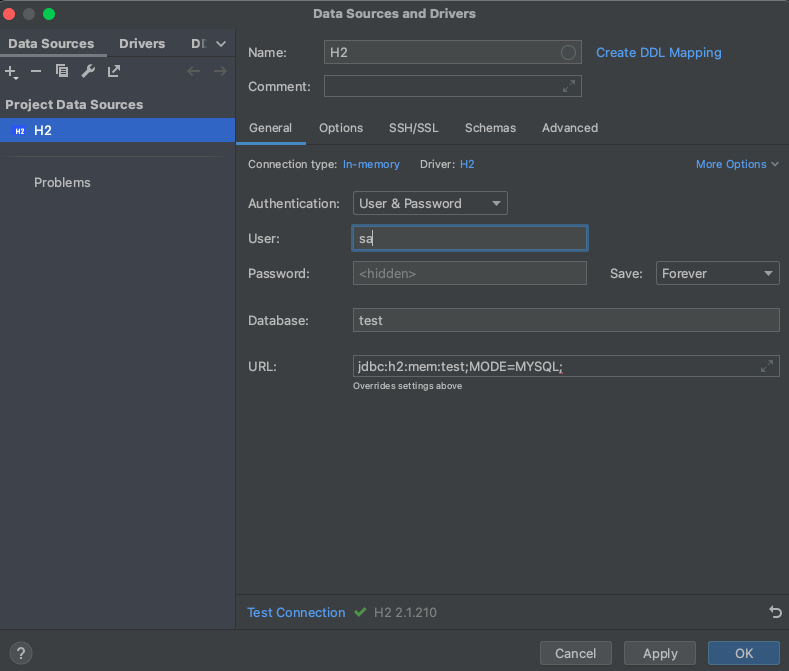


그다음 테스트 커넥션을 누르고,  
만약 첫 실행 시 드라이버 설치 관련 문구가 나온다면 download driver files를 눌러 설치해 주세요.


그럼 드라이버 설치를 자동으로 해주고 아래처럼 성공 결과가 나옵니다.
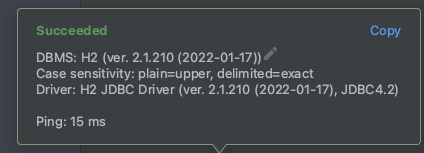


일단 아래처럼 나오면 성공입니다.  
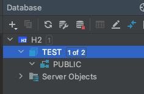


콘솔에 아래처럼 입력해 볼까요?
```sql
CREATE TABLE IF NOT EXISTS MAJOR
(
    major_code varchar(100) primary key comment '주특기코드',
    major_name varchar(100) not null comment '주특기명',
    tutor_name varchar(100) not null comment '튜터'
)
COMMENT '주특기' charset=utf8;
```

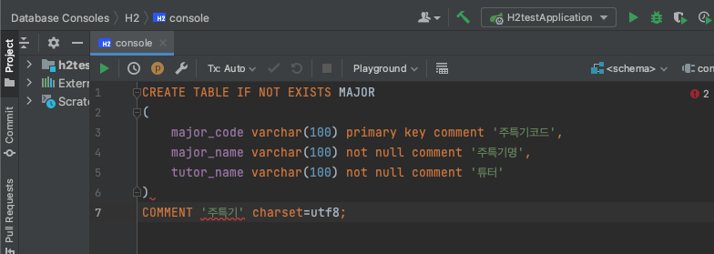

만약 이런 빨간 줄이 나온다면, 현재 H2이기 때문에,  
Mysql쿼리문을 인식하지 못해 나오는 빨간 줄입니다.  
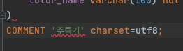


마우스를 올리고  
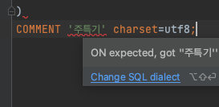


아래처럼 바꿔주시면 됩니다.
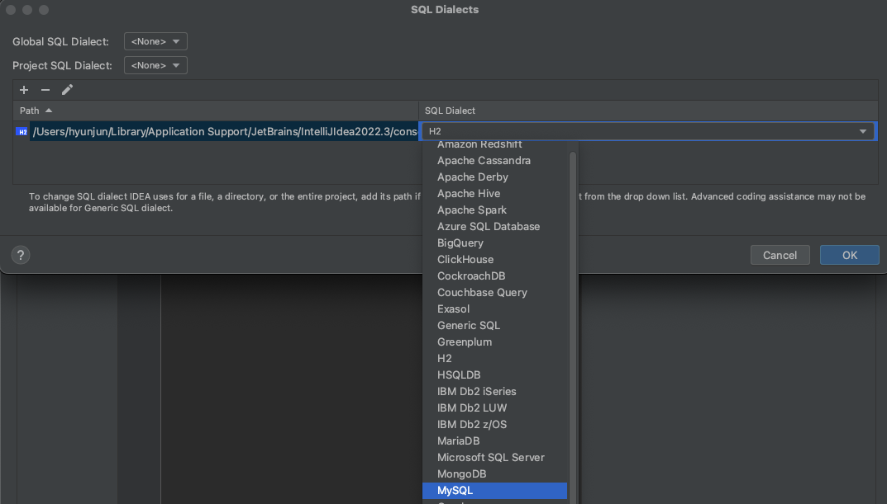


이래도 빨간 줄이 뜹니다.

추가적으로 아래와 같이 설정해 줍니다.
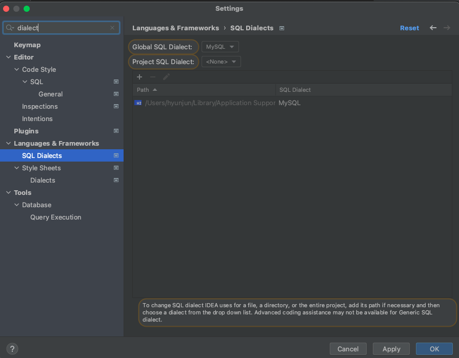

현재 사용 중인 데이터베이스 시스템은 H2 지만 
Mysql의 쿼리문으로 사용하기 위해 하는 설정입니다.


그래도 빨간 줄이..?

MY SQL이 아닌 H2 쿼리문으로 인식해서 그런 거 같은데
사용하는 데는 지장이 없습니다!


쿼리문을 테스트할 때에는 해당 부분을 드래그해준 뒤 실행해야 합니다.
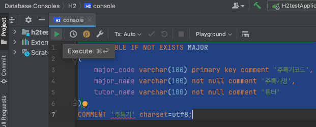


그럼 아래처럼 실행 결과가 나옵니다.
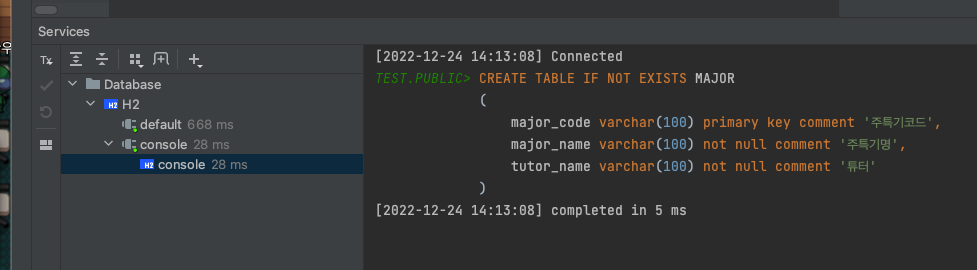


만약 아래와 같은 코드가 있다면
```sql
INSERT into MAJOR(major_code, major_name, tutor_name)
VALUES ( 1, '수학', '철수')
INSERT into MAJOR(major_code, major_name, tutor_name)
VALUES ( 2, '영어', '영희')
INSERT into MAJOR(major_code, major_name, tutor_name)
VALUES ( 3, '국어', '홍길동')
INSERT into MAJOR(major_code, major_name, tutor_name)
VALUES ( 4, '과학', '김아무개')
INSERT into MAJOR(major_code, major_name, tutor_name)
VALUES ( 5, '음악', '사람1')
INSERT into MAJOR(major_code, major_name, tutor_name)
VALUES ( 6, '체육', '사람2')
INSERT into MAJOR(major_code, major_name, tutor_name)
VALUES ( 7, '미술', '사람3')
INSERT into MAJOR(major_code, major_name, tutor_name)
VALUES ( 8, '한문', '사람4')
```

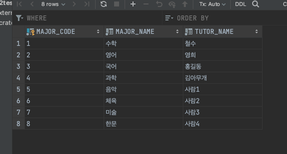

이런 걸 언제 스프링에서 언제 일일이 다 관리하지 ..?

그래서 ORM이 나오고 JPA이 나왔습니다.

스프링을 사용한 데이터베이스 관련 내용은 다음 글에 쓰도록 하겠습니다.


