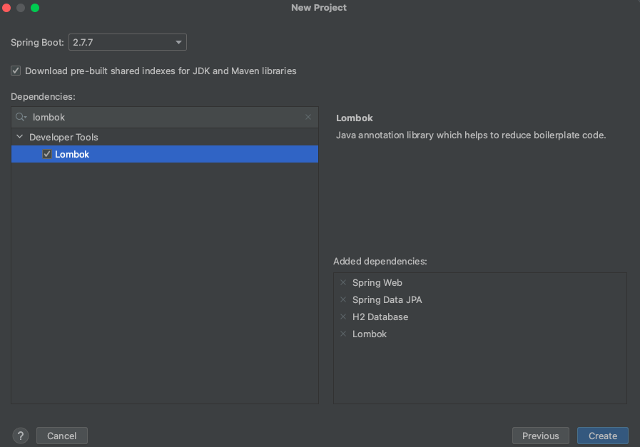
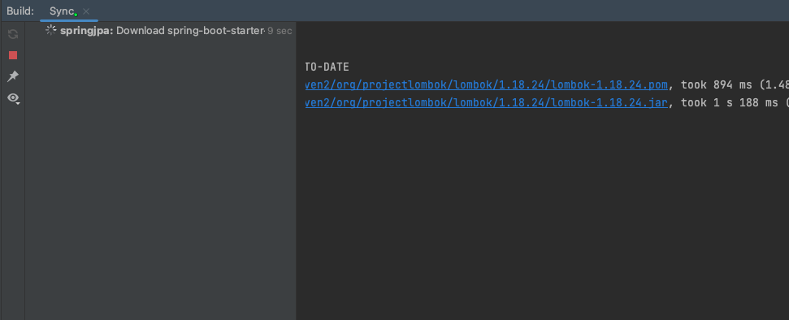
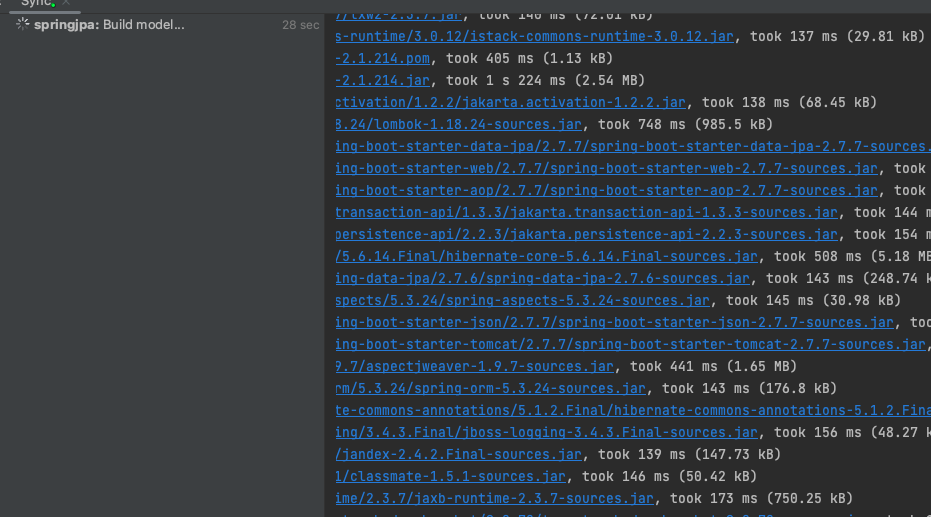
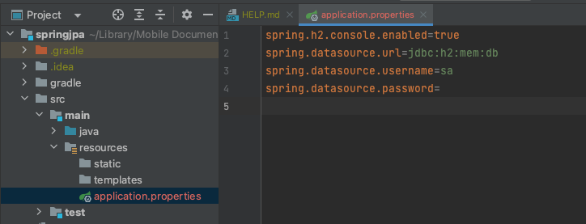
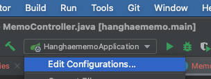
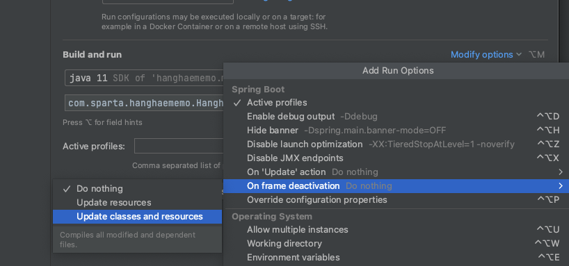

### 스프링으로 실습

필요한 의존파일들은 그래들이 알아서 가저와줍니다

main/resources/application.properties에

아래의 설정을 저장한뒤 시작합니다.

spring.h2.console.enabled=true
spring.datasource.url=jdbc:h2:mem:db
spring.datasource.username=sa
spring.datasource.password=

### 스프링 재시작 방법
처음 스프링 디펜던시중 devtools를 설치한다.

Modify options 눌러서 진행

코드 업데이트시 스프링부트를 재시작하지 않ㅇ아도 자동으로 업데이트시 재시작 시켜준다.