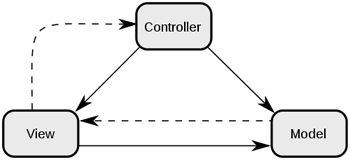
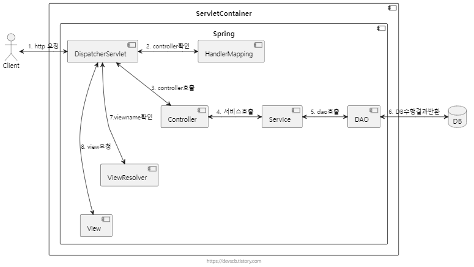
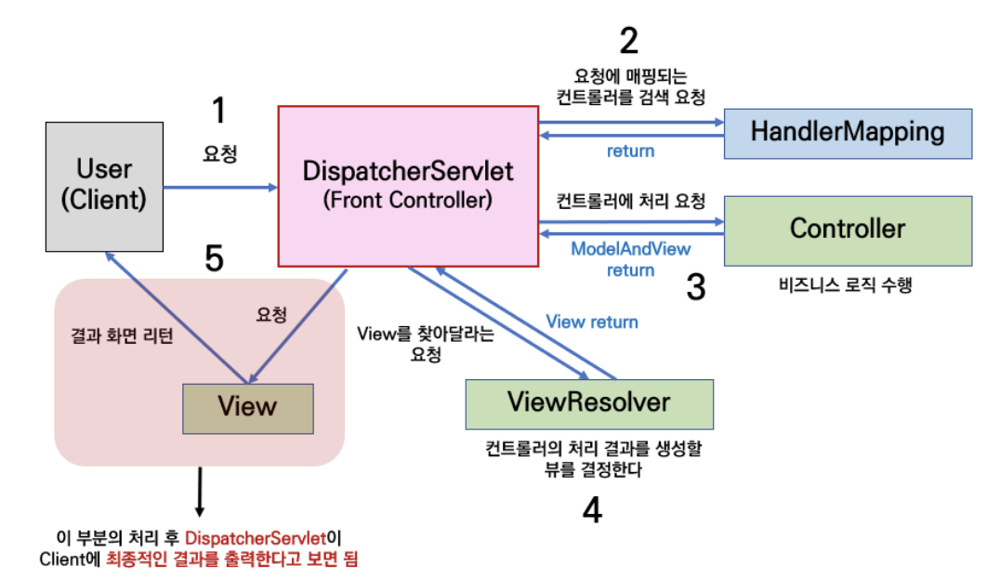
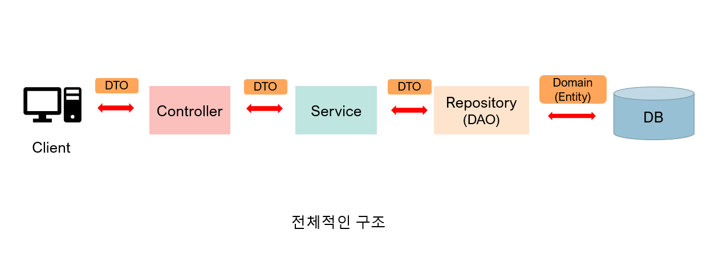

# MVC Pattern

MVC 패턴은 디자인 패턴 중 하나로써,

하나의 애플리케이션에서 Model, View, Controller의 역할로  
구성요소를 구성한 것이 MVC 패턴입니다. 

## Model
애플리케이션의 정보, 데이터를 나타냅니다.

## View
input 텍스트, 체크박스 항목 등과 같은 사용자 인터페이스 요소를 나타냅니다.  
다시 말해 데이터 및 객체의 입력, 그리고 보여주는 출력을 담당합니다.  
데이터를 기반으로 사용자들이 볼 수 있는 화면입니다.  

## Controller
Controller : 데이터와 사용자인터페이스 요소들을 잇는 다리 역할을 합니다.   
즉, 사용자가 데이터를 클릭하고, 수정하는 것에 대한 "이벤트"들을 처리하는 부분을 뜻합니다.  

[사진 및 내용 참조 블로그](https://m.blog.naver.com/jhc9639/220967034588)

# MVC Pattern 스프링 흐름도

[사진 및 스프링 프레임 워크 구조 참조 블로그](https://devscb.tistory.com/119)

[사진 및 내용 참조 블로그](https://iyk2h.tistory.com/147)

 

# 패키지(파일) 구조 스프링 흐름도

[사진 참조 블로그](https://code-lab1.tistory.com/201)

## Controller

Controller는 Client의 요청을 DTO의 형태로 받아 Service의 기능을 호출하고,  
적절한 응답을 DTO의 형태로 반환하는 역할을 한다.  
(Entity를 바로 반환할 수 있지만 추천하지 않는 방식)

즉, 요청과 응답을 관리하는 계층이라고 생각하면 된다. 

## Entity

DB의 테이블에 존재하는 Column들을 필드로 가지는 객체.  
Entity는 DB의 테이블과 1대1 대응하며, 테이블에 가지지 않는 칼럼을 필드로 가져서는 안 된다. 

또한 Entity 클래스는 다른 클래스를 상속받거나 인터페이스의 구현체여서는 안되고 순수한 데이터 객체인 것이 좋다. 

## DTO (Data Transfer Object)

DTO는 말 그대로 데이터를 Transfer(이동)하기 위한 객체이다. 

Client가 Controller에 요청을 보낼 때도 RequestDto의 형식으로 데이터가 이동하고,   
Controller가 Client에게 응답을 보낼 때도 ResponseDto의 형태로 데이터를 보내게 된다.

Controller와 Service, Repository 계층 사이에 데이터가 오갈 때도 데이터는 DTO의 형태로 이동하게 된다. 

DTO는 로직을 갖고 있지 않는 순수한 데이터 객체이며,  
일반적으로 getter/setter 메서드만을 가진다. 
 
하지만 DTO는 단순히 데이터를 옮기는 용도이기 때문에  
굳이 Setter를 이용해 값을 수정할 필요가 없이, 생성자만을 사용하여 값을 할당하는 게 좋다. 

 

그런데 데이터를 움직일 때 왜 Entity 객체를 그대로 사용하지 않고 굳이 DTO를 사용하는 것일까?

### DTO를 사용하는 이유
 
1. View Layer와 DB Layer의 역할을 분리하기 위해서  
-> 객체를 표현하기 위한 계층과 저장하는 계층의 역할을 분리하기 위해서 DTO를 사용한다.

2. Entity 객체의 변경을 피하기 위하여  
-> Entity 객체를 그대로 사용하면 프로그래머의 의도와 다르게 데이터가 변질될 수 있다. 

3. View와 통신하는 DTO 클래스는 자주 변경된다.  
View(클라이언트)와 통신하는 DTO 클래스, 예를 들어 ResponseDTO, RequestDTO는 요구사항에 따라 자주 변경된다. 
어떤 요청에서는 특정 값이 추가될 수도 있고, 특정 값이 없을 수도 있다.  
따라서 Entity 클래스와 분리하여 관리해야 한다. 

4. 도메인 모델링을 지키기 위하여  
도메인 설계를 잘하였다고 하더라도 원하는 데이터를 표시하기가 쉽지 않을 수 있다. 
예를 들어 Entity 클래스의 특정 컬럼들을 조합하여 특정 포맷을 출력하고 싶다고 하자. 

Entity 클래스에 표현을 위한 필드나 로직이 추가되면 객체 설계를 망가뜨릴 수 있다.  
따라서 DTO에 표현을 위한 로직을 추가해서 사용하는 것이 Entity의 도메인 모델링을 지킬 수 있다.

## DAO (Data Access Object)

DAO는 말 그대로 실제 DB에 접근하는 객체를 뜻한다.  
DAO는 Service와 실제 데이터베이스를 연결하는 역할을 하게 된다.  
즉, DB에서 데이터를 꺼내오거나 넣는 역할을 DAO가 담당한다.

JPA의 경우 Repository가 DAO의 역할을 한다고 볼 수 있다.  
하지만 DAO와 Repository가 같은 것은 아니다. 

  

DAO와 Repository의 차이점

             

DAO와 REPOSITORY 모두 퍼시스턴스 로직에 대한 객체-지향적인  
인터페이스를 제공하고 도메인 로직과 퍼시스턴스 로직을 분리하여 관심의 분리(separation of concerns) 원리를 만족시키는데 목적이 있다. 

그러나 비록 의도와 인터페이스의 메서드 시그니처에 유사성이 존재한다고 해서  
DAO와 REPOSITORY를 동일한 패턴으로 취급하는 것은 성급한 일반화의 오류를 범하는 것이다.

DAO는 퍼시스턴스 로직인 Entity Bean을 대체하기 위해 만들어진 개념이다. 

DAO가 비록 객체-지향적인 인터페이스를 제공하려는 의도를 가지고 있다고 하더라도  
실제 개발 시에는 하부의 퍼시스턴스 메커니즘이 데이터베이스라는 사실을 숨기려고 하지 않는다. 

DAO의 인터페이스는 데이터베이스의 CRUD 쿼리와 1:1 매칭되는 세밀한 단위의 오퍼레이션을 제공한다. 

반면 REPOSITORY는 메모리에 로드된 객체 컬렉션에 대한 집합 처리를 위한 인터페이스를 제공한다. 

DAO가 제공하는 오퍼레이션이 REPOSITORY 가 제공하는 오퍼레이션보다 더 세밀하며,  
결과적으로 REPOSITORY에서 제공하는 하나의 오퍼레이션이 DAO의 여러 오퍼레이션에 매핑되는 것이 일반적이다. 

따라서 하나의 REPOSITORY 내부에서 다수의 DAO를 호출하는 방식으로 REPOSITORY를 구현할 수 있다.

 

## Service

Service 계층은 DTO를 통해 받은 데이터를 이용해 비즈니스 로직을 처리하고,  
DAO(혹은 Repository)를 통해 DB에 접근하여 데이터를 관리하는 역할을 한다. 

## Repository

JPA를 사용하면 Repository를 통해 DB에 실제로 접근할 수 있다.  
Service와 DB를 연결해 주는 역할을 하며, 

Service 계층에서 Repository를 이용하여 데이터를 관리할 수 있다. 
(다른 계층에서 접근할 수도 있다.)

