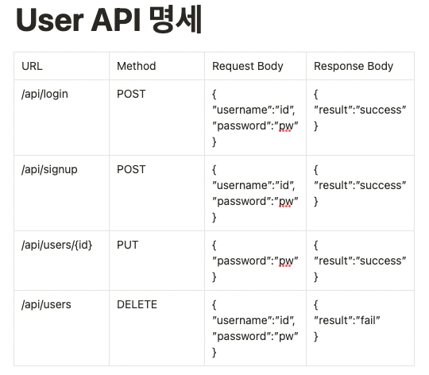
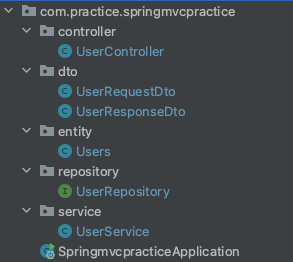
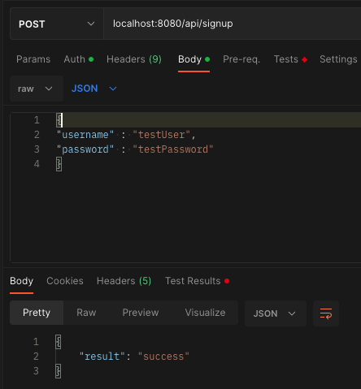
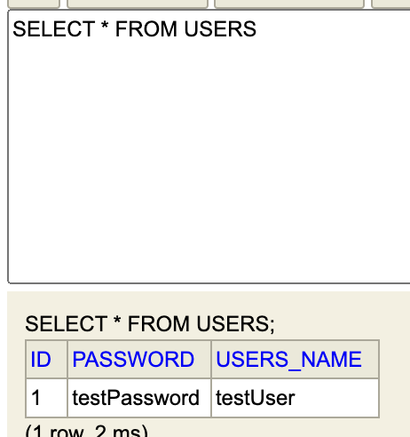

<hr>

# 요구 사항
- User 애플리케이션
- User의 회원가입, 로그인, 정보 수정, 삭제 즉, CRUD 앱 만들기
- MVC 구조를 보기 위한 것으로 암호화는 하지 않아도 됨.

<hr>

# 기획

username, password만 존재하므로 따로 ERD는 기획하지 않겠습니다.

## API 명세


대략적인 MVC 구조로 데이터 접근을 해보는 것이므로,  
간단하게 진행해 보겠습니다.

## 스프링으로 MVC 패턴 데이터 접근 실습해 보기.

아래와 같은 Dependency가 필요합니다.
- Spring Web
- Spring Data JPA
- H2 Database
- Thymeleaf
- Spring Boot DevTools
- Lombok


<hr>

처음 Dependency를 가지고 올 경우 필요한 의존 파일들은 그래들이 알아서 가지고 와서 설치해 줍니다.


<hr>


### application.properties
src/main/resources/application.properties에

아래의 설정을 저장한 뒤 시작합니다.

h2를 인 메모리 방식으로 사용하기 위한 설정입니다.

```
spring.h2.console.enabled=true
spring.datasource.url=jdbc:h2:mem:db
spring.datasource.username=admin
spring.datasource.password=
```

위처럼 설정해놓게 되면 username을 이용하여 h2 데이터베이스로  
관리할 수 있게 됩니다.


<hr>

## 패키지(파일) 만들기
main/java/com.practice.springmvcpractice/ 아래에 아래의 패키지(파일)들을 먼저 생성해 주세요.





현재 User Request Dto, User Response Dto로 통일되어 있지만

실제로는 다양한 요청 응답이 있으므로,

User Login Request Dto
Login Response Dto
Signup Req Dto.... 등으로 만들어서 사용하면 됩니다.

<hr>

### UserController

```java
@RestController
@RequiredArgsConstructor
public class UserController {

    private final UserService userService;


    @PostMapping("/api/signup")
    public UserResponseDto signUp(@RequestBody UserRequestDto requestDto) {

        return userService.createUser(requestDto);
    }

    @PostMapping("/api/login")
    public UserResponseDto login(@RequestBody UserRequestDto requestDto) {

        return userService.loginUser(requestDto);
    }

    @PutMapping("/api/users/{id}")
    public UserResponseDto updateUser(@RequestBody UserRequestDto requestDto, @PathVariable Long id) {

        return userService.updateUser(requestDto, id);
    }


    @DeleteMapping("/api/users")
    public UserResponseDto deleteUser(@RequestBody UserRequestDto requestDto) {

        return userService.deleteUser(requestDto);
    }
}
```

<hr>

### UserRequestDto

```java
@Getter
@NoArgsConstructor
public class UserRequestDto {

    private String username;
    private String password;


    @Builder
    public UserRequestDto(String usersName, String name) {
        this.username = usersName;
        this.password = name;

    }


    public Users toEntity() {
        return Users.builder()
                .usersName(username)
                .password(password)
                .build();

    }


}
```

<hr>

### UserResponseDto
```java
@Getter
@Setter
public class UserResponseDto {

    String result;


    public UserResponseDto(String result) {
            this.result = result;
    }
}

```

<hr>

### Users

```java
@Getter
@Entity
@NoArgsConstructor
public class Users {


    @Id
    @GeneratedValue(strategy = GenerationType.AUTO)
    private Long id;

    @Column(nullable = false)
    private String usersName;

    @Column(nullable = false)
    private String password;

    @Builder
    public Users(String usersName, String password) {
        this.usersName = usersName;
        this.password = password;

    }

    public Users(UserRequestDto userDto) {
        this.usersName = userDto.getUsername();
        this.password = userDto.getPassword();

    }

    public void updateUsers(String username, String password) {
        this.usersName = username;
        this.password = password;

    }


}
```

<hr>

### UserRepository

```java
public interface UserRepository extends JpaRepository<Users, Long> {


    Optional<Users> findByUsersNameAndPassword(String username, String password);
    String deleteByUsersNameAndPassword(String userName, String password);
}
```

<hr>

### UserService
```java
@Service
@RequiredArgsConstructor
public class UserService {

    private final UserRepository userRepository;
    @Transactional
    public UserResponseDto createUser(UserRequestDto requestDto){
        String username = requestDto.getUsername();
        String password = requestDto.getPassword();

        Users user = new Users(username, password);


        if(userRepository.save(user) != null){
            return new UserResponseDto("success");
        }else {
            return new UserResponseDto("failed");
        }

    }

    @Transactional
    public UserResponseDto loginUser(UserRequestDto requestDto) {
        String username = requestDto.getUsername();
        String password = requestDto.getPassword();

        Optional<Users> optionalUsers = userRepository.findByUsersNameAndPassword(username, password);

        if (optionalUsers.isPresent()) {
            return new UserResponseDto("success");
        }else {
            return new UserResponseDto("failed");
        }
    }


    @Transactional
    public UserResponseDto updateUser(UserRequestDto requestDto, Long id) {

        String username = requestDto.getUsername();
        String password = requestDto.getPassword();

        Optional<Users> optionalUsers = userRepository.findById(id);


        if (optionalUsers.isPresent()) {
            Users user = optionalUsers.get();

            user.updateUsers(username, password);
            return new UserResponseDto("success");
        } else {
            return new UserResponseDto("failed");
        }
    }


    @Transactional
    public UserResponseDto deleteUser(UserRequestDto requestDto) {

        Users user = new Users(requestDto);


        if (userRepository.deleteByUsersNameAndPassword(user.getUsersName(), user.getPassword()).equals("1")) {
            return new UserResponseDto("success");
        } else {
            return new UserResponseDto("failed");
        }
    }
}

```

<hr>

테스트의 경우 현재 View Page.html이 없기 때문에, Postman 같은 것으로
테스트해야 합니다!





기능이 잘 동작하네요!

<hr>

실제의 스프링 구조는 중간중간 복잡하지만 현재 예제로서의 간단하게 데이터 접근 과정을 볼까요?

- Controller : URL의 요청을 받아 어떤 서비스를 할지 결정해 주며, 마지막으로 어떤 응답을 줄지 결정되는 곳입니다.
- Service : 실질적인 비즈니스 로직(기능)이 진행되고 응답을 컨트롤러에게 다시 건네줍니다..
- Repository : Service 단에서 호출되어 실제 DB와 연결되어 DB의 접근을 관리합니다.
- Entity : DB의 테이블과 1 대 1 맵핑되는 곳 DB 테이블과 같이 설계하는 곳이라고 생각해도 좋습니다.

Controller <-> Service <-> Repository(Entity) <-> Database(h2)