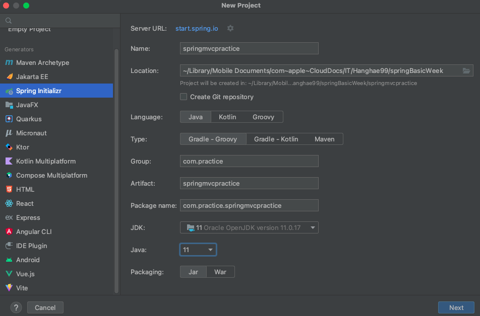
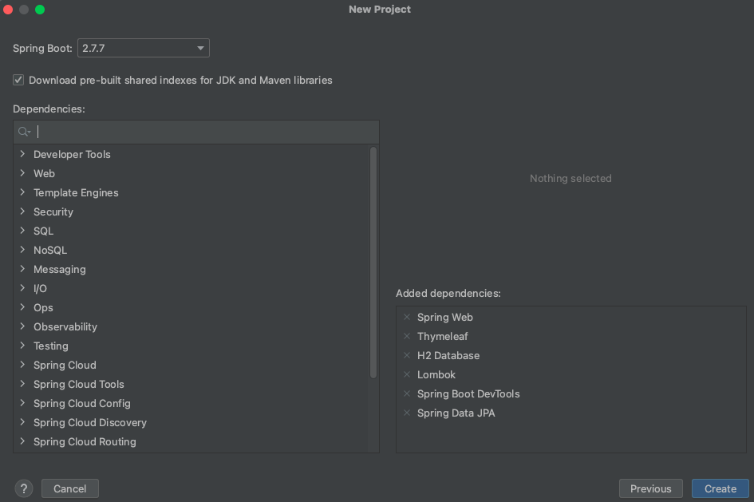
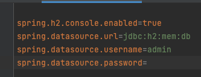
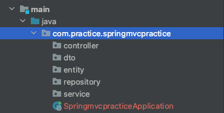

유스케이스 다이어그램에서 아래와같이 설꼐...

ERD는 아래와 같아

API명세는

사용자의 이름과, 간단한 메모를 CRUD, 생성 읽기 수정 삭제 해보는 애플리케이션을 만들어보겠습니다.

## 스프링으로 MVC 패턴 데이터 접근 실습해보기.

아래와 같은 Dependency가 필요합니다.
- Spring Web
- Spring Data JPA
- H2 Database
- Thymeleaf
- Spring Boot DevTools
- Lombok






처음 Dependency를 가지고 올 경우 필요한 의존파일들은 그래들이 알아서 가저와서 설치해줍니다.


### 시작 하기전, 서버 재시작 설정하기
처음 스프링 디펜던시중 devtools를 설치한다.


Modify options 눌러서 진행


코드 업데이트시 스프링부트를 재시작하지 않ㅇ아도 자동으로 업데이트시 재시작 시켜준다.


### application.properties
src/main/resources/application.properties에

아래의 설정을 저장한뒤 시작합니다.

```
spring.h2.console.enabled=true
spring.datasource.url=jdbc:h2:mem:db
spring.datasource.username=admin
spring.datasource.password=
```

위 처럼 설정해놓게 되면 username을 이용하여 h2 데이터베이스로  
관리할 수 있게 됩니다.



### 패키지 설정 하기
main/java/com.practice.springmvcpractice/ 아래에 아래의 패키지들을 먼저 생성해주세요.




