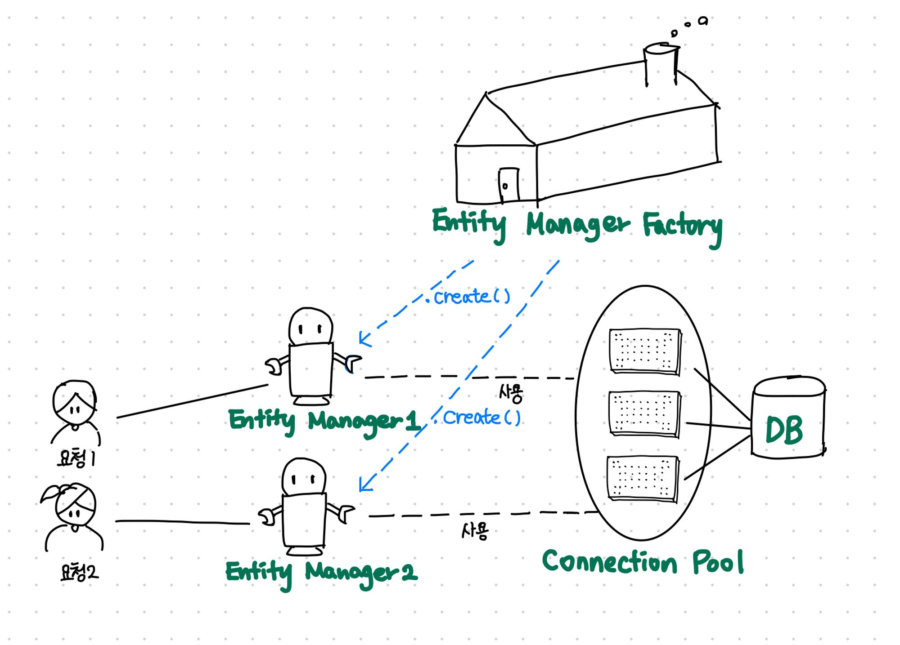
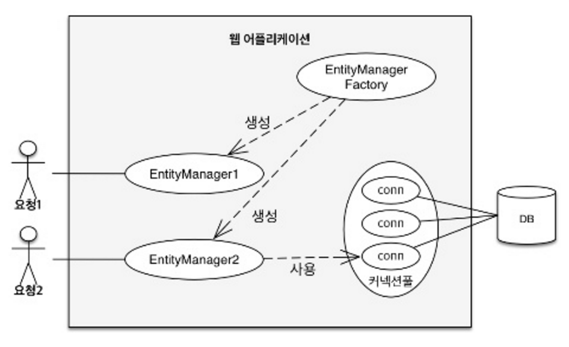

# Spring Data JPA가 없었다면?

Spring Data JPA라이브러리를 사용하면 아래처럼 간단하게 사용이 가능하다.

```java
// Entity 생성
Member hyunjun = new Member();
member.setId("hyunjun94"); 
member.setUsername("현준");

// 이렇게 간단하게 DB에 접근하여 사용 가능했다.
memberRepository.save(hyunjun);
memberRepository.find();
```

만약 Spring Data JPA를 사용하지 않았을때
위의 과정을 실행 시키려면?

```java
// Entity를 생성
Member hyunjun = new Member();
member.setId("hyunjun94"); 
member.setUsername("현준");

// EntityManager를 생성해줄 EntityManagerFactory를 만들어야합니다.
EntityManagerFactory emf = Persistence.createEntityManagerFactory("myAppJpaManager");

// Entity를 관리해줄 EntityManager를 EntityManagerFactory에서 생성!
EntityManager em = emf.createEntityManager();


// 엔티티를 영속화(저장)
em.persist(hyunjun);
// 엔티티를 찾기
em.find(Member.class, 100L);
```

결국 코드자체도 늘어나지만, 엔티티매니저라는 개념이 새로 등장합니다.
(물론 Spring Data JPA라이브러리를 사용해도 내부적으로는 엔티티매니저로 동작함)

<br>

# EntityManagerFactory와 EntityManager


[사진 출처](https://product.kyobobook.co.kr/detail/S000000935744)
[참조 및 이미지 출처한 글](https://ultrakain.gitbooks.io/jpa/content/chapter3/chapter3.1.html)

## EntityManagerFactory

```java
// 비용이 아주 많이 든다.
//엔티티 매니저 팩토리 생성
EntityManagerFactory emf = Persistence.createEntityManagerFactory("myAppJpaManager");
```

- 만드는 비용이 상당히 큼
- 한 개만 만들어서 어플리케이션 전체에서 공유하도록 설계.
- 여러 스레드가 동시에 접근해도 안전, 서로 다르 스레드 간 공유 가능


## EntityManger 

```java
// 엔티티 매니저 생성, 비용이 거의 안든다.
EntityManager em = emf.createEntityManager(); //엔티티 매니저 생성
```

- 여러스레드가 동시에 접근하면 동시성 문제 발생
- 스레드간 절대 공유하면 안된다!
- 데이터베이스 연결이 필요한 시점까지 커넥션을 얻지 않는다.
- EntityManager 는 Thread-Safe 를 보장해야 한다.  
동일한 EntityManager 를 가지고 멀티 스레드 환경에서 호출한다면 데이터가 어떻게 변경될지 모름.


EntityManager가 Entity를 관리해주는 객체라는 것은 알았다.  
그럼 왜 EntityManager를 바로 생성하지 않고

굳이 EntityManagerFactory라는 걸 만들고 Factory에서  
EntityManager를 생성할까?


프로그램 내부에 “스레드”라는 일꾼이 있습니다.  
최근의 프로그램들은 성능을 위해 여러 스레드들이 일을 같이하게 되어 있는데(multi thread), 

하나의 큰 일을 동시에 처리하려다 보면 동시성 문제가 생길 수 있습니다.  
그런 일을 방지하기 위해 특정 리소스나 정보는 공유하지 못하게 하는등의 처리가 필요합니다.  
엔티티매니저에는 공유하면 안되는 특정 리소스나 정보가 있고,  

여러 스레드가 하나의 엔티티 매니저를 이용 할 수 없도록 처리해야 합니다.  
그래서 엔티티 매니저 팩토리에서 필요 할 때 마다 여러개의 엔티티매니저를 생성하는 구조로 설계한 것 입니다.

이해가 어려우시면, 모종의 이유로 여러개의 엔티티 매니저가 필요하고,  
매번 모든과정을 다시하기에는 비용이 많이 들어 대부분 비용이 많이 드는 일을 엔티티 매니저 팩토리를 생성하면서 하고,

엔티티 매니저를 여러개 생성하는 일의 비용을 줄였다고 이해하시면 좋을 것 같습니다.



[사진 출처](https://ultrakain.gitbooks.io/jpa/content/chapter3/chapter3.1.html)

- EntityManagerFactory에서 다수의 엔티티 매니저를 생성했다.
- EntityManager1은 아직 데이터 베이스 커넥션을 사용하지 않는데, 엔티티 매니저는 데이터베이스 연결이 필요한 시점까지 커넥션을 얻지 않는다.
- EntityManager2는 커넥션을 사용중인데 보통 트랜잭션을 시작할때 커넥션을 획득한다. 
 

하이버네이트를 포함한 JPA 구현체들은 EntityManagerFactory를 생성할때 커넥션풀도 만드는데, 이것은 J2SE 환경에서 사용하는 방식이다.