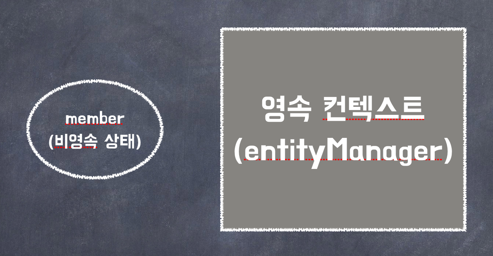
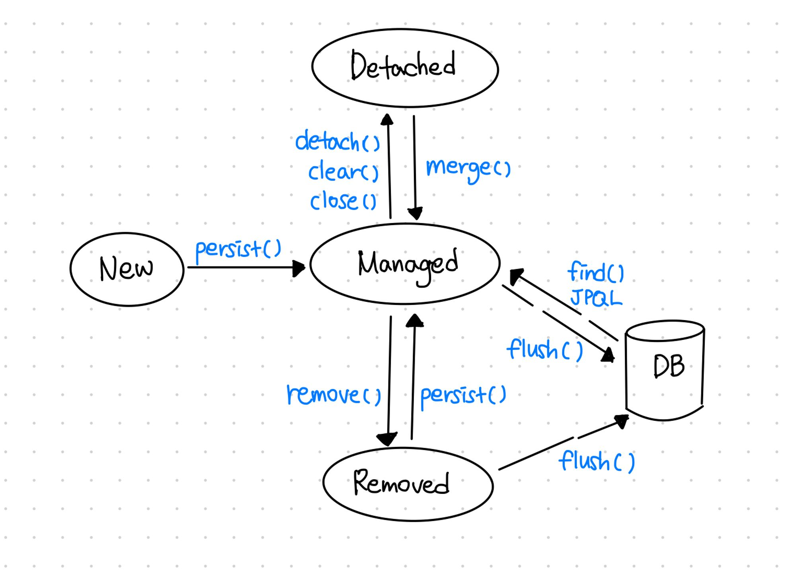
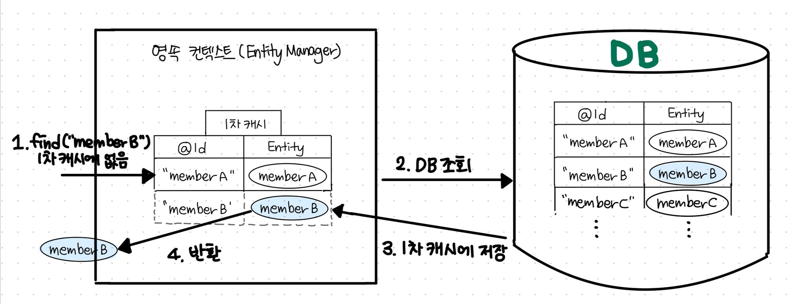
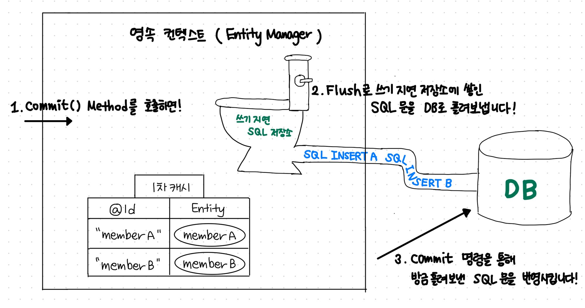
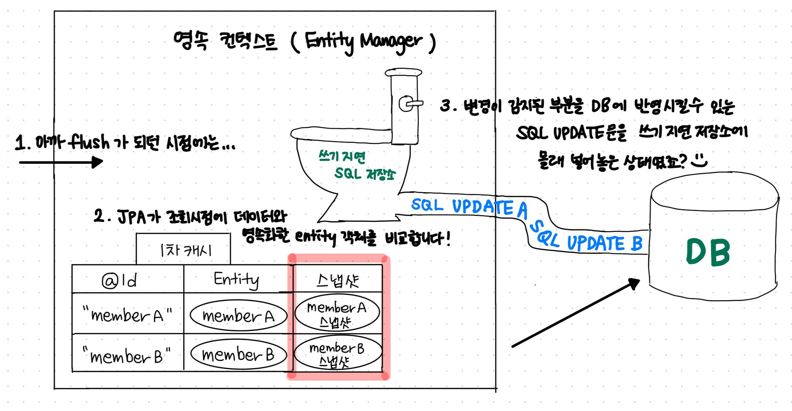

# JPA의 영속성 컨텍스트란?

- persistence context!
- 엔티티를 영구 저장하는 환경
- 어플리케이션이 데이터베이스에서 꺼내온 데이터 객체를 보관하는 역할을 합니다.
- 영속성 컨텍스트는 엔티티 매니저를 통해 엔티티를 조회하거나 저장할 때 엔티티를 보관하고 관리합니다.


<div class="notice">
엔티티 매니저마다 개별적으로 부여되는, 어떠한 논리적 공간같은 개념으로 비유적으로 이해하셔도 좋을 것 같습니다.   <br>
<br>
자바의 엔티티 객체를 엔티티 매니저마다 가지고 있는 영속성 컨텍스트라는 공간에다 넣고 빼고 하면서 사용하는거죠, <br><br>
“영속화 한다” 라는 말을 “엔티티 매니저가 자기의 영속성 컨텍스트에 넣어준다”로 이해하는 것 처럼 말이죠
</div>

<hr>

> 예시

```java
em.persist(member);
```

- 단순하게 회원 엔티티 저장
- 정확하게는 엔티티 매니저를 사용해서 회원 엔티티를 영속성 컨텍스트에 저장
- 논리적인 개념에 가까움
- 엔티티 매니저를 생성할 때 하나 만들어진다.
- ⭐️엔티티 매니저를 통해 영속성 컨텍스트에 접근하고 관리할 수 있다.




## JPA 엔티티의 상태

### 비영속(New)
영속성 컨택스트와 관계가 없는 새로운 상태입니다.
해당 객체의 데이터가 변경되거나 말거나 실제 DB의 데이터와는 관련없고, 그냥 Java 객체인 상태!

```java
Member hyunjun = new Member();
member.setId("hyunjun94");
member.setUsername("현준");
```

### 영속(Managed)
엔티티 매니저를 통해 엔티티가 영속성 컨텍스트에 저장되어 관리되고 있는 상태입니다.  
이와 같은 경우 데이터의 생성, 변경등을 JPA가 추적하면서 필요하면 DB에 반영합니다.

```java
// 엔티티 매니저를 통해 영속성 컨텍스트에 엔티티를 저장
em.persist(hyunjun);
```


### 준영속(Detached)
영속성 컨택스트에서 관리되다가 분리된 상태입니다.

```java
// 엔티티를 영속성 컨택스트에서 분리
em.detach(hyunjun);
// 영속성 컨텍스트를 비우기
em.clear();
// 영속성 컨택스트를 종료
em.close();
```

### 삭제(Removed)
영속성 컨택스트에서 삭제된 상태

```java
em.remove(hyunjun)
```


[사진 출처](https://product.kyobobook.co.kr/detail/S000000935744)


## 영속성 컨텍스트는 어떻게, 왜 이렇게 설계되어있을까요?

<details>   
<summary>1차 캐시</summary>
<div markdown="1">            

DB역시 저장공간, 연산능력과 같은 컴퓨팅 리소스를 가진 프로그램 같은 것이라고 말씀드렸죠?  
그리고 보통은 서버가 떠있는 컴퓨터(AWS라고 치면 여러분의 ec2 인스턴스)가 아닌 다른 곳에 떠있는 경우가 많습니다.

그리고 다른 여러가지 이유와 함께 DB를 이용하는 작업은 상대적으로 부하와 비용이 심한 작업입니다.  
그래서 부하가 심한 작업을 자주하는 것을 줄여야 할 필요가 있었습니다.
 
자바 어플리케이션 상에서 데이터를 조회 사용할일이 아주 잦은데,  
그럴때마다 DB로 “SELECT * FROM….”과 같은 SQL쿼리를 내는 일은 막아야 한다는 거죠! 

그러기 위해서 영속성 컨텍스트 내부에 1차캐시를 둡니다.  
1. find(”memberB”)와 같은 로직이 있을 때 먼저 1차 캐시를 조회합니다.  
2. 있으면 해당 데이터를 반환합니다.
3. 없으면 그 때 실제 DB로 “SELECT * FROM….” 의 쿼리를 내보냅니다.
4. 그리고 반환하기 전에 1차캐시에 저장하고 반환해줍니다.

이제 memberB를 find 하는 요청이 다시 들어와도 굳이 DB로 다녀올 필요가 전혀 없겠죠?
            

[사진 출처](https://product.kyobobook.co.kr/detail/S000000935744)

</div>
</details>


<details>   
<summary>Lazy loading SQL 저장소</summary>
<div markdown="1">            

비슷한 맥락입니다.  
MemberA, MemberB를 생성할 때 마다 DB를 다녀오는건 비효율적이겠죠?  
굳이 여러번 DB를 방문하지 않도록 내부에 “쓰기 지연 SQL 저장소”를 뒀습니다.

1. memberA, memberB를 영속화 하고
2. entityManager.commit() 메서드를 호출하면
3. 내부적으로 쓰기 지연 SQL 저장소에서 Flush가 일어나고
4. “INSERT A”, “INSERT B”와 같은 쓰기 전용 쿼리들이 DB로 흘러들어갑니다.
            

[사진 출처](https://product.kyobobook.co.kr/detail/S000000935744)

</div>
</details>


<details>   
<summary>Dirty Checking</summary>
<div markdown="1">            

사실 똘똘한 JPA는 1차캐시와 쓰기지연 SQL 저장소를 이용해서 변경과 수정을 감지해줍니다.

1. 사실 1차 캐시에는 DB의 엔티티의 정보만 저장하는것이 아닙니다.
2. 해당 엔티티를 조회한 시점의 데이터의 정보를 같이 저장해둡니다.
3. 그리고 엔티티객체와 조회 시점의 데이터가 다르다면 변경이 발생했다고 알 수 있겠죠?
4. 해당 변경 부문을 반영 할 수 있는 UPDATE 쿼리를 작성해둡니다.
            

[사진 출처](https://product.kyobobook.co.kr/detail/S000000935744)

</div>
</details>

<details>   
<summary>데이터의 어플리케이션 단의 동일성을 보장해줍니다.</summary>
<div markdown="1">            


```java
Member member1 = em.find(Member.class, "hyunjun");
Member member2 = em.find(Member.class, "hyunjun");
System.out.println(member1 == member2) => true
```

- 결과는 "참"
- 둘은 같은 인스턴스
- 영속성 컨텍스트는 성능상 이점과 엔티티의 동일성을 보장한다.

위와 같이 JPA는 매우 세심하게 어플리케이션과 DB를 이어줍니다.  
그러면서도 성능 최적화 부분까지 세심하게 신경을 써줬죠.  

</div>
</details>
