AWS 가입및 EC2 설정은 아래 글 참 조

1. 아래의 링크에 접속!
[AWS](https://ap-northeast-2.console.aws.amazon.com/console/home?region=ap-northeast-2#)

2. RDS 검색후 클릭
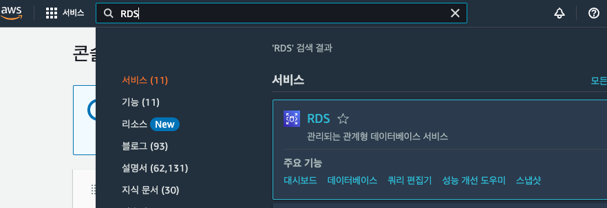

3. 데이터베이스 생성
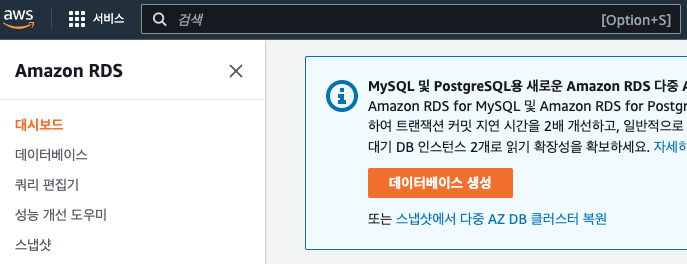

-로딩-

4. 표준, MySQL(상황에 따라 선택)
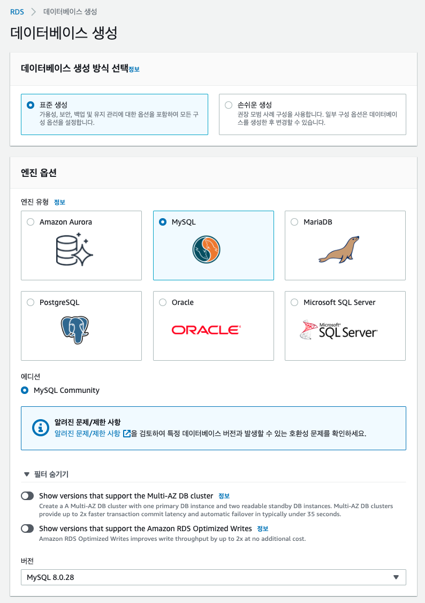

5. 프리티어 선택 및 DB이름, 계정, 암호 설정(마스터 사용자 이름및 암호는 기억해야 함)
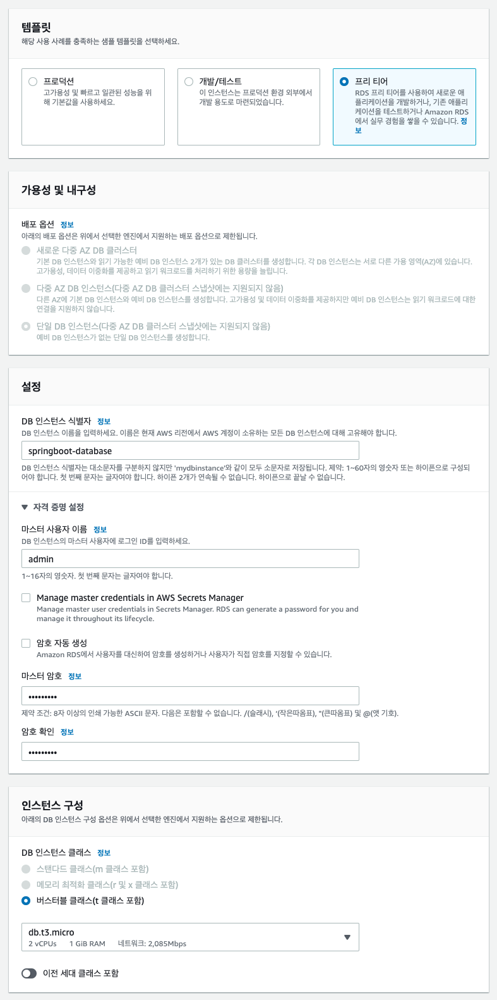

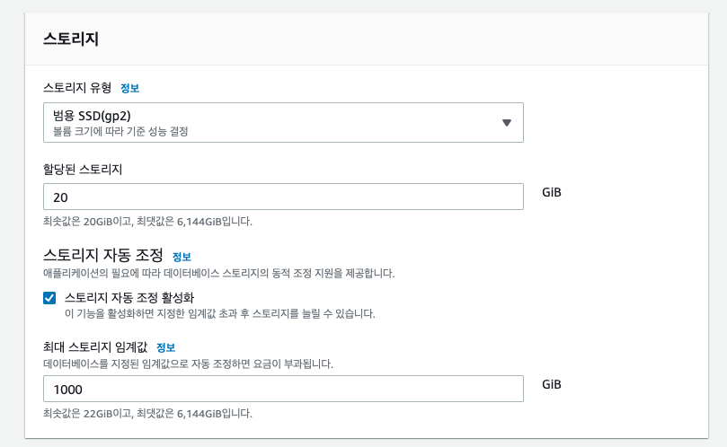

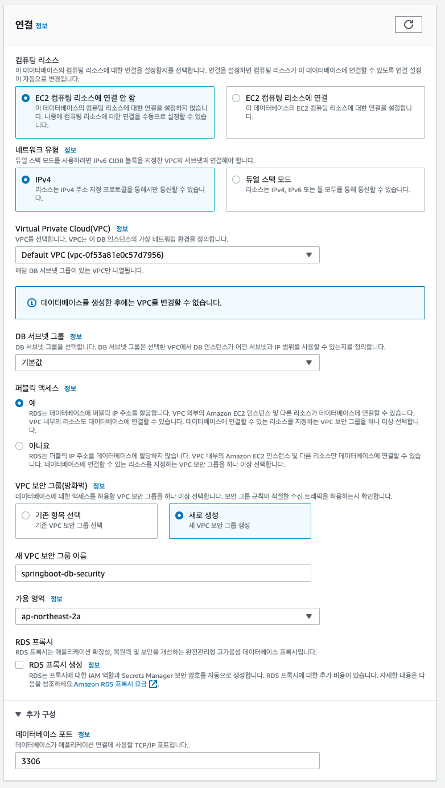

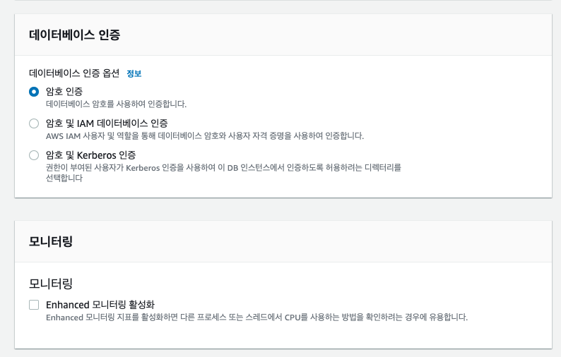

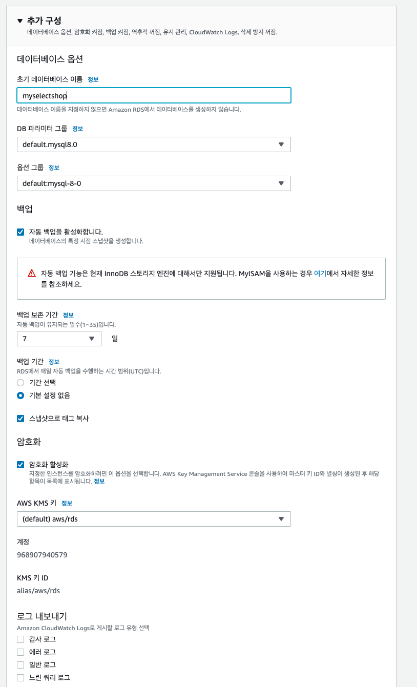

데이터베이스 생성 클릭
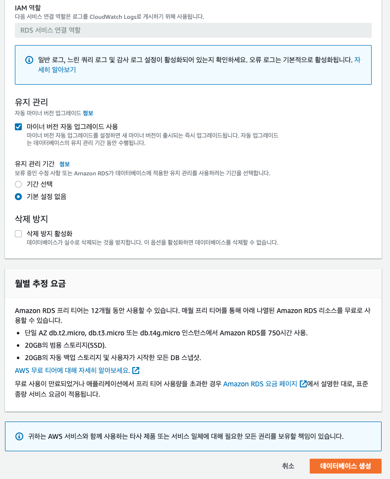

생성되는데 시간이 조금 걸립ㄴ디ㅏ.

생성된 인스턴스 클릭
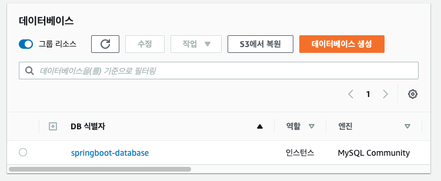

VPC 보안그룹의 security 클릭
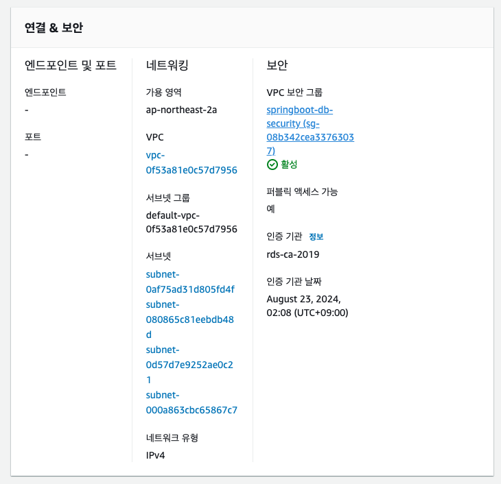

보안그룹 ID 클릭
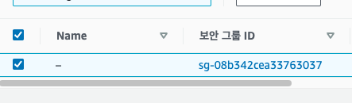

인바운드 규칙 편집 클릭
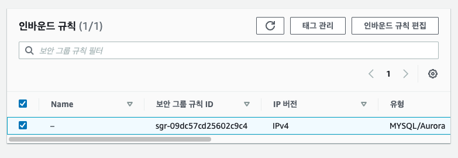

아래처럼 설정 후 규칙 저장 클릭
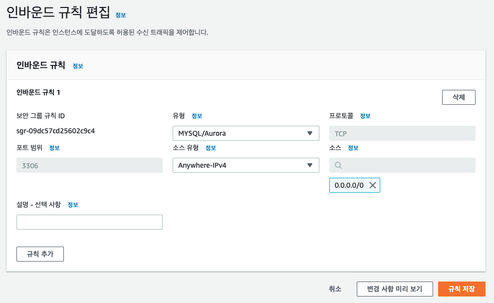

[RDS 대시보드](https://ap-northeast-2.console.aws.amazon.com/rds/home?region=ap-northeast-2#databases:)

다시 대시보드 이동 후 인스턴스 클릭

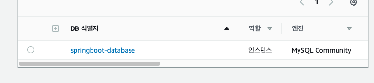

엔드포인트 복사하기
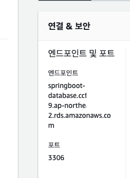

호스팅할 프로젝트 인텔리제이로 들어가서 mysql 추가
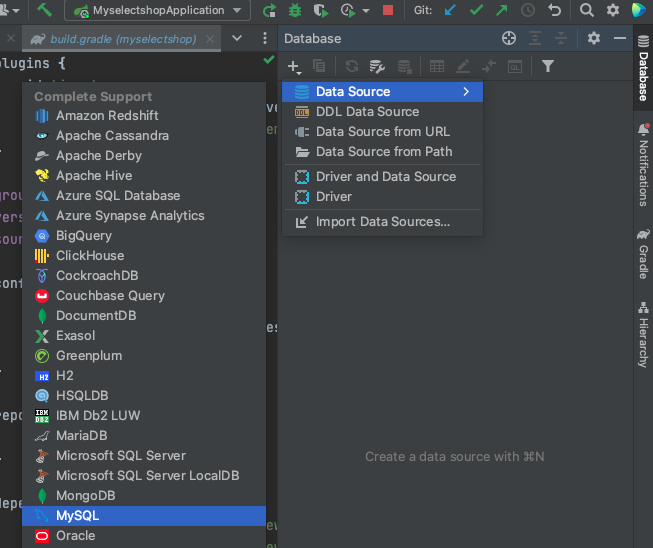

- Name: DB 인스턴스 식별자
- Host: 나의 엔드포인트
- User: 마스터 사용자 이름
- Password: 마스터 암호
- Database: 초기 데이터베이스 이름
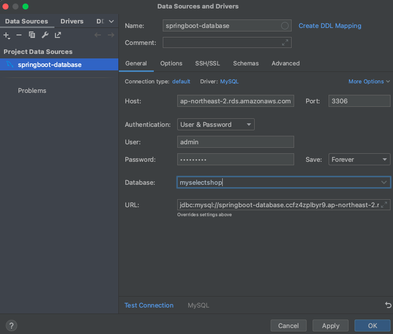

OK 누르지말고 일단 Test Connection 클릭

아래와 같은 창이 나온다면 Download Driver Files 클릭
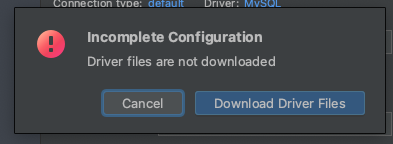

아래와 같이 나오면 Test Connection성공!
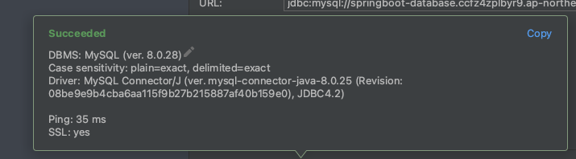

성공 했다면 OK클릭 실패 시 AWS 인바운드 규칙 설정이나, 인텔리제이 위의 SQL설정 값들 확인!

application.properties(설정파일)에 DB관련 설정값을 넣어줍니다.  
(한글로 된 값 바꿔서!)

        spring.datasource.url=jdbc:mysql://나의엔드포인트:3306/myselectshop
        spring.datasource.username=나의USERNAME
        spring.datasource.password=나의패스워드
        spring.jpa.hibernate.ddl-auto=update

참고로 해당 프로젝트를 깃에 올린다면 위의 정보는 중요정보이므로
application.properties는 ignore 해주고 올려주세요.

현재 properties에 jwt secret key와 실제 AWS RDS 어드민 계정 정보가있으므로
해당 파일을 통째로 추가해보겠습니다.

resources 아래에 application-원하는이름.properties로 파일 생성 후
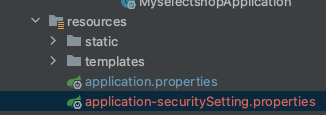

그안에 중요 정보 작성 후 저장해주세요!
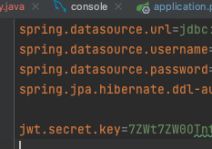

application.properties에 아래처럼 우리가 만든 파일을 포함해주는 코드를 작성해주세요!
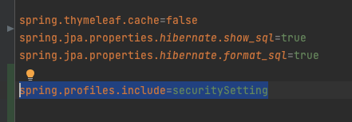

.gitignore라는 파일을 찾아 아래 우리가 만든 properties를 추가해주세요!
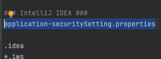

이제 푸쉬해보면 application.properties만 올라와 있을겁니다!
오타가 나있을수 있으니 꼭 처음에 한번 확인해보세요

다시 데이터베이스로와서.
사실 위의 설정까지만 하면 이제 우리의 데이터베이스는 작동합니다
각자의 데이터 베이스 입력을 한뒤 스프링서버를 껏다켜보세요!

프리티어인 1년 기간 동안을 잘 맞춰서 사용하시고,
데이터베이스의 경우 프리티어라도 사용량이 정해져있으므로 사용하지 않을 시 인스턴스 종료해주세요!

RDS의 경우 EC2와 다르게 정지를 시켜놓아도 1주일 뒤면 자동 재부팅이 된다고 하네요
안쓰는 DB는 삭제하시는게 좋습니다!

20기가 까지만 무료이므로 인스턴스는 1개까지만!

프리티어라도 무료 사용량이 정해져있는데 아래 블로그 글 참조하시면 좋을 것 같습니다.
[AWS 무료 사용량](https://inpa.tistory.com/entry/AWS-%F0%9F%92%B0-%ED%94%84%EB%A6%AC%ED%8B%B0%EC%96%B4-%EC%9A%94%EA%B8%88-%ED%8F%AD%ED%83%84-%EB%B0%A9%EC%A7%80-%F0%9F%92%B8-%EB%AC%B4%EB%A3%8C-%EC%82%AC%EC%9A%A9%EB%9F%89-%EC%A0%95%EB%A6%AC)

스토리지 자동 조정기능과, 자동 백업기능을 해제하라는 말이 많아서 해제해보려고 합니다.
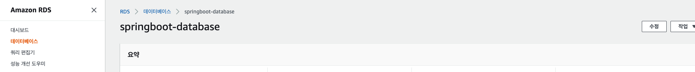

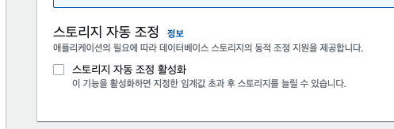

자동백업같은경우 아래처럼 나와 일단 놔두고

마이너 버전 자동업그레이드 만 해제해줬다

그다음 계속 클릭후 아래처럼 확인 후 적용해 주었다.
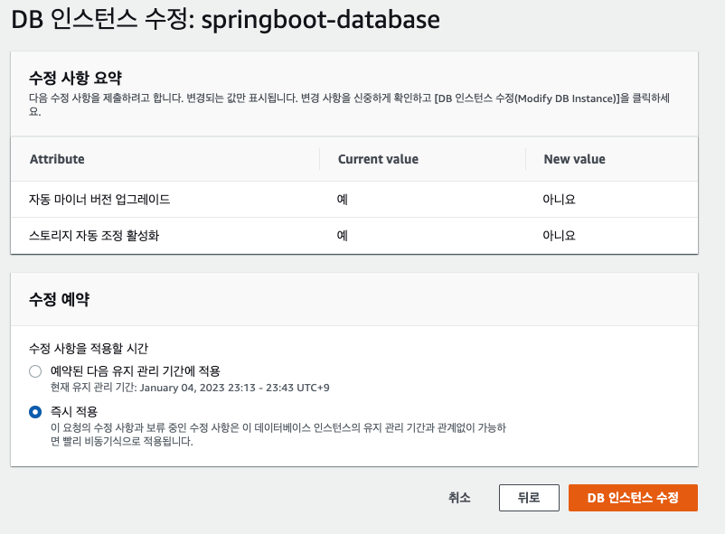

# EC2호스팅하기
EC2의 기본적인 호스팅방법은 아래글을 참조하사ㅔ요.

- 배포 파일 빌드하기
    - 우측 탭 중에서 Gradle 을 선택합니다.
    - Tasks > build > build 를 더블 클릭합니다.
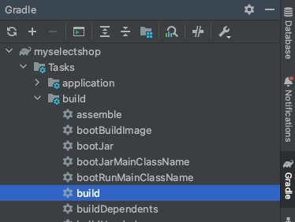

아래처럼 빌드가 성공하게되면
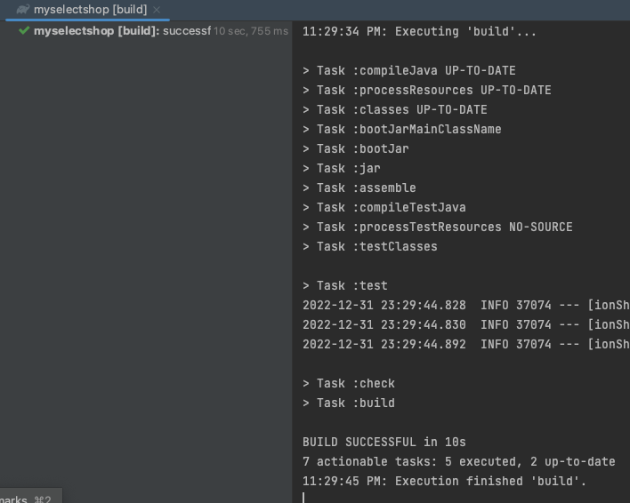

build/libs/에  .jar로 끝나는 파일이 생겼다면 빌드성공!
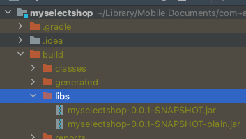

터미널로 자신의 EC2서버에 접속해주세요ㅣ.

그후 자신의 EC2의 위치에서

아래의 명령어를 한줄 씩 실행하여 설치및 
자바 버전을 확인해 주세요.

    sudo apt-get update

    sudo apt-get install openjdk-11-jdk

    java -version

    javac -version

아래와 같이 나오면 y 입력후 엔터
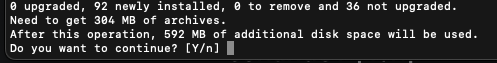

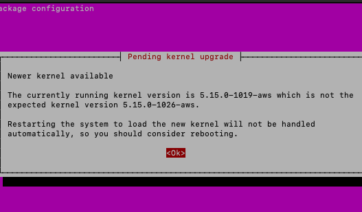

이런창이 나오면 그냥 엔터 클릭
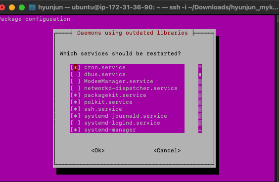

그후 포트 스프링의기본 8080포트를 80포트로 연결해줍니다
    sudo iptables -t nat -A PREROUTING -i eth0 -p tcp --dport 80 -j REDIRECT --to-port 8080

인바운드 규칙 아래처럼!
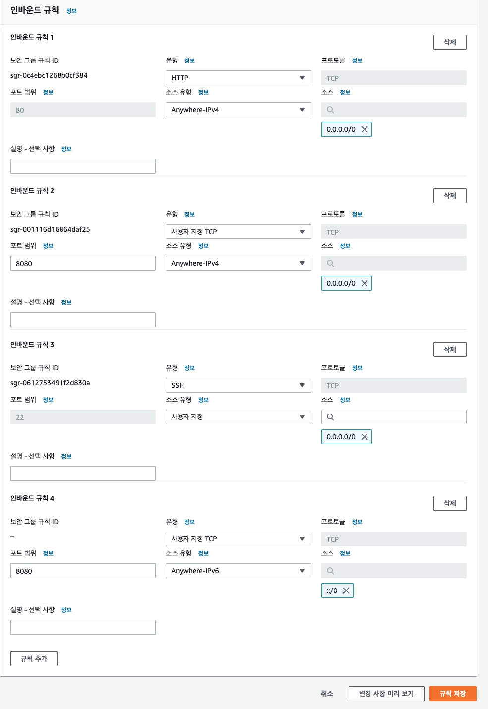

그후 아래의 명령어로 jar빌드 파일 실행!
    java -jar JAR파일명.jar

그럼아래처럼 우리의 서버에서 돌아갑니다.
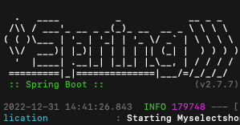