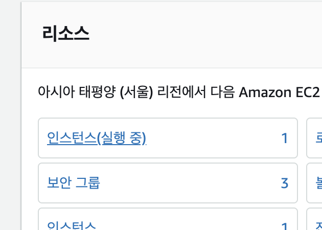
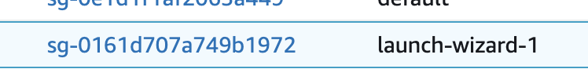
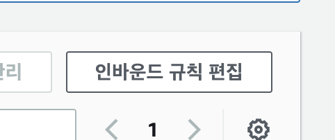
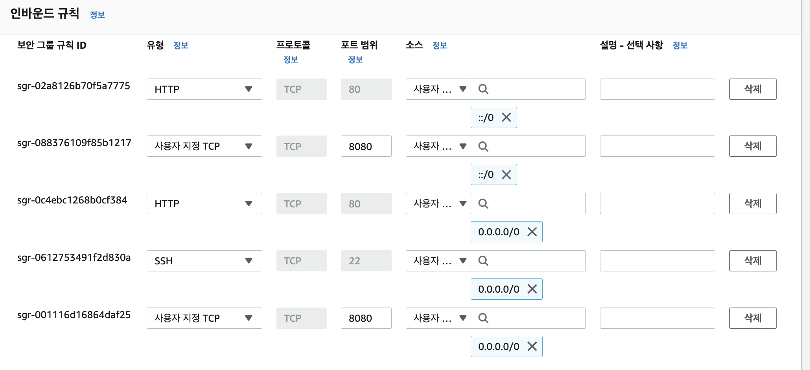
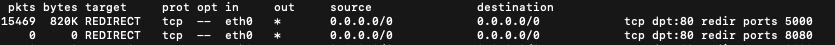
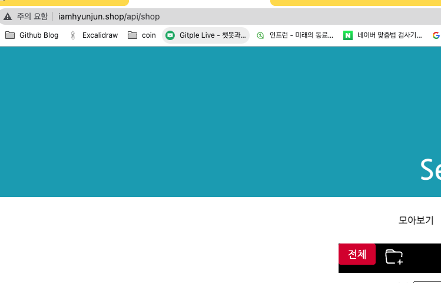
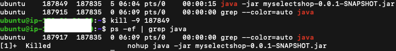

[AWS 가입 및 EC2 설정](https://hyunjunhwang1994.github.io/cloud%20computing%20-%20aws/AWS-01/)

# RDS

아래의 링크에 접속!  
[AWS](https://ap-northeast-2.console.aws.amazon.com/console/home?region=ap-northeast-2#)

RDS 검색 후 클릭

데이터베이스 생성

-로딩-  

표준, MySQL(상황에 따라 선택)

프리 티어 선택 및 DB 이름, 계정, 암호 설정   

데이터베이스 생성 클릭

생성되는데 시간이 조금 걸립니다!

생성된 인스턴스 클릭

VPC 보안 그룹의 security 클릭

보안 그룹 ID 클릭  

인바운드 규칙 편집 클릭

아래처럼 설정 후 규칙 저장 클릭

[RDS 대시보드](https://ap-northeast-2.console.aws.amazon.com/rds/home?region=ap-northeast-2#databases:)

다시 대시보드 이동 후 인스턴스 클릭

엔드 포인트 복사하기  

호스팅 할 프로젝트 인텔리제이로 들어가서 mysql 추가

- Name: DB 인스턴스 식별자
- Host: 나의 엔드 포인트
- User: 마스터 사용자 이름
- Password: 마스터 암호
- Database: 초기 데이터베이스 이름

OK 누르지 말고 일단 Test Connection 클릭

아래와 같은 창이 나온다면 Download Driver Files 클릭

아래와 같이 나오면 Test Connection 성공!

- 성공했다면 OK 클릭 
- 실패 시 AWS 인바운드 규칙 설정이나, 인텔리제이의 SQL 설정값들 확인!

application.properties(설정파일)에 DB 관련 설정값을 넣어줍니다.  

        spring.datasource.url=jdbc:mysql://나의엔드포인트:3306/myselectshop
        spring.datasource.username=나의USERNAME
        spring.datasource.password=나의패스워드
        spring.jpa.hibernate.ddl-auto=update

참고로 해당 프로젝트를 깃에 올린다면 위의 정보는 중요한 정보이므로
application.properties는 ignore 해주고 올려주세요.

# properties 추가하기 (github)
현재 제 properties에는 노출이 돼서는 안되는  
jwt secret key와 실제 AWS RDS 어드민 계정 정보가 있으므로  

새로운 properties 파일을 만들어 gitignore에 추가하고 푸쉬를 해보겠습니다.

resources 아래에 application-원하는이름.properties로 파일 생성.  

그 안에 노출돼서는 안되는 중요 정보 작성 후 저장.  

기존 application.properties에 아래처럼 우리가 만든 파일을 포함해 주는 코드를 작성해 주세요!  

프로젝트 내 .gitignore라는 파일을 찾아 아래 우리가 만든 properties를 추가해 주세요!  

이제 푸쉬 해보면 깃허브에 application.properties만 올라와 있을 겁니다!
설정하는 부분들에서 오타가 나있을 수 있으니 꼭 처음에 한번 시큐리티 파일이 제외되어 올라갔나 확인해 보세요!

# RDS 설정

사실 위의 설정까지만 하면 이제 우리의 데이터베이스는 작동합니다
각자의 웹에서 데이터가 잘 저장되나 시험을 해보세요!

프리 티어인 1년 기간 동안을 잘 맞춰서 사용하시고,
데이터베이스의 경우 프리 티어라도 사용량이 정해져있으므로 사용하지 않을 시 인스턴스 종료해 주세요!

RDS의 경우 EC2와 다르게 정지를 시켜놓아도 1주일 뒤면 자동 재부팅이 된다고 하네요
안 쓰는 DB는 삭제하시는 게 좋습니다!

20기가까지만 무료이므로 인스턴스는 1개까지만!

프리 티어라도 무료 사용량이 정해져있는데 아래 블로그 글 참조하시면 좋을 것 같습니다.  
[AWS 무료 사용량](https://inpa.tistory.com/entry/AWS-%F0%9F%92%B0-%ED%94%84%EB%A6%AC%ED%8B%B0%EC%96%B4-%EC%9A%94%EA%B8%88-%ED%8F%AD%ED%83%84-%EB%B0%A9%EC%A7%80-%F0%9F%92%B8-%EB%AC%B4%EB%A3%8C-%EC%82%AC%EC%9A%A9%EB%9F%89-%EC%A0%95%EB%A6%AC)

## 사용량 줄이기

RDS 사용량을 줄이기 위해 스토리지 자동 조정기능과, 자동 백업 기능을 해제하라는 말이 많아서 해제해 보려고 합니다.

수정 클릭

스토리지 자동 조정 활성화 끄기

자동 백업 같은 경우 꺼야 하는데 저 같은 경우 체크해제가 안돼서 그냥 놔뒀습니다.  

마이너 버전 자동 업그레이드 해제

설정 정보 확인 후 DB 인스턴스 수정 클릭!

# EC2 호스팅 하기

[AWS 가입 및 EC2 설정](https://hyunjunhwang1994.github.io/cloud%20computing%20-%20aws/AWS-01/)

- 배포 파일 빌드 하기
    - 우측 탭 중에서 Gradle 을 선택합니다.
    - Tasks > build > build를 더블 클릭합니다.

아래처럼 빌드가 성공하게 되면

build/libs/에  .jar로 끝나는 파일이 생겼다면 빌드 성공!

## AWS 포트 열어주기
 우리의 EC2 인스턴스 서버에 접근하기 전  
 먼저 AWS에서의 포트 설정이 먼저 작용하므로,  
 여기서 해당 포트를 열어주지 않는다면 해당 포트로 접근이 불가능합니다.

아래의 설정을 하면 8080포트와, 80포트에 대해서  
전 세계의 모든 유저가 접근할 수 있습니다.

22번은 터미널로 우리의 서버에 접근하기 위한 포트

EC2 보안 그룹 클릭

 

 

80, 8080, 22포트로의 접근 열어주기

## EC2 서버 설정(자바 설치)

자신의 터미널에서 아래와 같은 명령어로 EC2 서버 접속
(주소 부분은 키 페어가 있는 주소입니다.)

    ssh -i /Users/honggildong/Downloads/myname_mykey.pem ubuntu@1.23.456.789

자바 설치 및 설치 확인 (명령어 1줄씩 입력)

    sudo apt-get update

    sudo apt-get install openjdk-11-jdk

    java -version

    javac -version

아래와 같이 나오면 y 입력 후 엔터

이런 창이 나오면 그냥 엔터 클릭

## 포트포워딩 80 -> 8080
현재 스프링 웹의 포트는 8080이므로, 도메인네임으로 쉽게 접속하기 위해서는
포트포워딩 과정을 거쳐야 합니다.

아래의 명령어를 입력하면 80포트로 오는 요청을(기본적으로 브라우저는 주소 맨 뒤에 80이 붙어있음)
8080으로 보내주어 동작하게 됩니다.

    sudo iptables -t nat -A PREROUTING -i eth0 -p tcp --dport 80 -j REDIRECT --to-port 8080

그 후 아래의 명령어로 jar 빌드 파일 실행!
    
    java -jar JAR파일명.jar

그럼 아래처럼 우리의 서버에서 스프링 부트가 돌아갑니다.

## 포트포워딩 정책 해제
만약 저처럼 플라스크라든지 다른 프로그램의 포트를
포트포워딩 해놓으셨다면 아래의 과정으로 포트를 제거해 주셔야 합니다.

현재 제일 상단에 80포트 -> 5000포트(플라스크)로 리다이렉트 되어있습니다.

그래서 현재 저는 도메인네임으로 접속이 안되어서 아래의 명령어로 리다이렉트된 포트를 확인해 보았습니다. 
    
    sudo iptables -t nat -L PREROUTING -vn

저와 같은 상황인 경우 아래처럼 iptables에서 해당 포트를 제거해 주면 됩니다.
[iptables 정책 삭제 참조 블로그](https://steady-snail.tistory.com/314)

        sudo iptables -t nat -L PREROUTING --line-numbers

        위의 명령어에서 포트 확인 후 해당하는 라인(번호) 이용하여 아래의 명령어로 정책 해제

        sudo iptables -t nat -D PREROUTING 1

이제 도메인네임으로 접속이 잘 되네요!

## nohup
현재는 서버가 존재하는데도 불구하고, 우리가 터미널 접속을 끊으면  
웹 애플리케이션이 동작하지 않습니다.

아래의 명령어를 실행하면 터미널을 끄더라도 우리의 앱 프로세스를 종료시키지 않습니다.

    nohup java -jar JAR파일명.jar &

프로세스 종료하기(앱 종료하기)

    ps -ef | grep java

    kill -9 [pid값]

