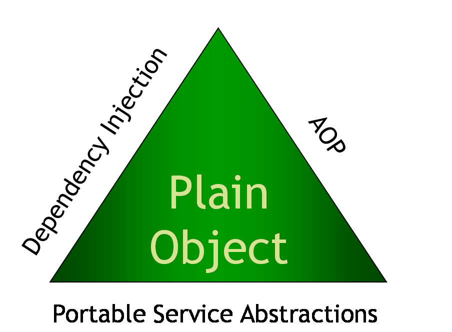
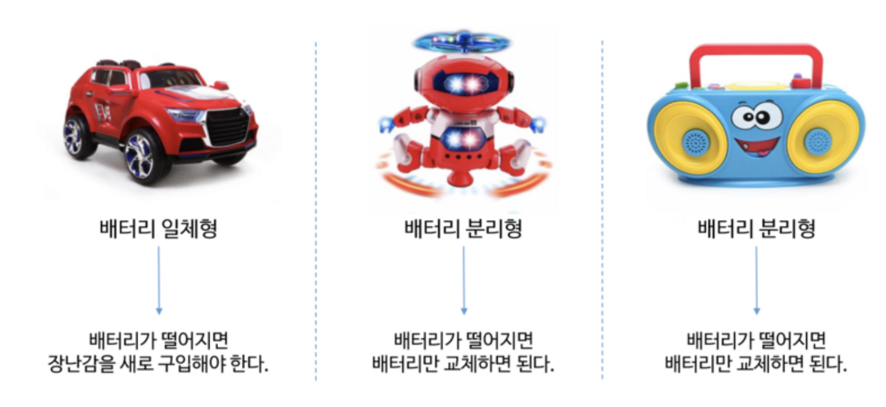
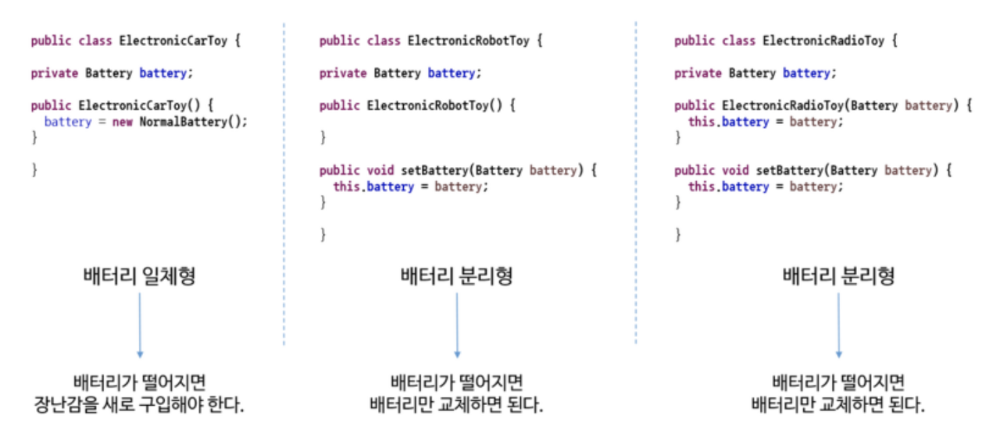
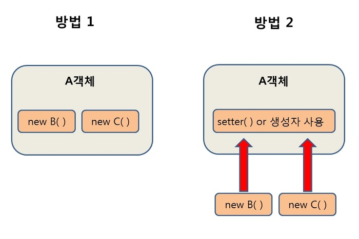
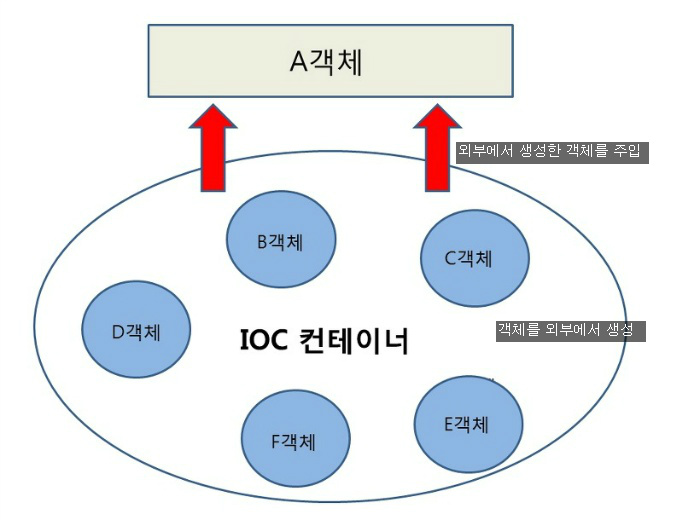

[이미지 출처 및 참조 글](https://devlog-wjdrbs96.tistory.com/165)

>Spring 삼각형  
Spring의 기반이 되는 설계 개념을 표현한 것!

# DI (Dependency Injection)
어떤 객체가 사용하는 의존 객체를 직접 만들어 사용하는게 아니라, 
주입 받아 사용하는 방법이다. 

스프링이 다른 프레임워크와 차별화되어 제공하는 의존 관계 주입 기능으로,  
객체를 직접 생성하는 게 아니라 외부에서 생성한 후 주입 시켜주는 방식이다.

new 연산자를 이용해서 객체를 생성하는 것을 스프링에서 해준다고 보면 된다. 

DI(의존성 주입)를 통해서 모듈 간의 결합도가 낮아지고 유연성이 높아진다.

[이미지 출처](https://m.blog.naver.com/PostView.nhn?blogId=ljh0326s&logNo=221395815870&proxyReferer=https:%2F%2Fwww.google.com%2F)

이 장난감들은 `배터리가 있어야만 동작` 하므로, `배터리에 의존`하고 있다 라고 보면되고,
`장난감들에게 배터리를 넣어주는 것을 의존성 주입이라고 한다.`

위의 예시를 자바코드로 구현하면?  

베터리의 일체형인 경우에는 생성자에서만 의존성을 주입해주는 상황이라 

베터리가 떨어지게 된다면 다른 베터리로 교체하지 못하고 

새로운 것으로 바꿔야 하기 때문에 유연하지 못한 방식이다.  

 

setter, 생성자를 이용해서 외부에서 주입해주는 상황은 외부에서 

베터리를 교체해줄 수 있기 때문에 일체형보다 유연한 상황이다. 

[이미지 출처, 참조 블로그](https://velog.io/@gillog/Spring-DIDependency-Injection)

첫번째 방법은 A객체가 B와 C객체를 New 생성자를 통해서 직접 생성하는 방법이고,

두번째 방법은 외부에서 생성 된 객체를 setter()를 통해 사용하는 방법이다.

이러한 두번째 방식이 의존성 주입의 예시인데,  
A 객체에서 B, C객체를 사용(의존)할 때 A 객체에서 직접 생성 하는 것이 아니라 외부(IOC컨테이너)에서 생성된 B, C객체를 조립(주입)시켜 setter 혹은 생성자를 통해 사용하는 방식이다.

스프링에서는 객체를 `Bean`이라고 부르며, 
프로젝트가 실행될때 사용자가 Bean으로 관리하는 객체들의 생성과 소멸에 관련된 작업을 자동적으로 수행해주는데 객체가 생성되는 곳을 스프링에서는 Bean 컨테이너라고 부른다.

# IoC(Inversion of Control)
IoC(Inversion of Control)란 "제어의 역전" 이라는 의미로,  
말 그대로 메소드나 객체의 호출작업을 개발자가 결정하는 것이 아니라,  
외부에서 결정되는 것을 의미한다.

간단히 말해 "제어의 흐름을 바꾼다"라고 한다.

객체의 의존성을 역전시켜 객체 간의 결합도를 줄이고  
유연한 코드를 작성할 수 있게 하여 가독성 및 코드 중복, 유지 보수를 편하게 할 수 있게 한다.

기존에는 다음과 순서로 객체가 만들어지고 실행되었다.

1. 객체 생성
2. 의존성 객체 생성  
    클래스 내부에서 생성
3. 의존성 객체 메소드 호출

하지만, 스프링에서는 다음과 같은 순서로 객체가 만들어지고 실행된다.

1. 객체 생성

2. 의존성 객체 주입  
스스로가 만드는것이 아니라 제어권을 스프링에게 위임하여 스프링이 만들어놓은 객체를 주입한다.

3. 의존성 객체 메소드 호출

스프링이 모든 의존성 객체를 스프링이 실행될때 다 만들어주고 필요한곳에 주입시켜줌으로써 Bean들은 싱글톤 패턴의 특징을 가지며,

제어의 흐름을 사용자가 컨트롤 하는 것이 아니라 스프링에게 맡겨 작업을 처리하게 된다.

# Bean
Spring IoC 컨테이너가 관리하는 자바 객체를 빈(Bean)이라고 부릅니다. 

우리가 알던 기존의 Java Programming 에서는 

1. Class를 생성하고 
2. new를 입력하여 원하는 객체를 직접 생성한 후에 사용했었습니다. 
    
하지만 Spring에서는 직접 new를 이용하여 생성한 객체가 아니라,  
Spring에 의하여 관리당하는 자바 객체를 사용합니다. 

이렇게 Spring에 의하여 생성되고 관리되는 자바 객체를 Bean이라고 합니다. 

Spring Framework 에서는 Spring Bean 을 얻기 위하여  
ApplicationContext.getBean() 와 같은 메소드를 사용하여 Spring 에서 직접 자바 객체를 얻어서 사용합니다.