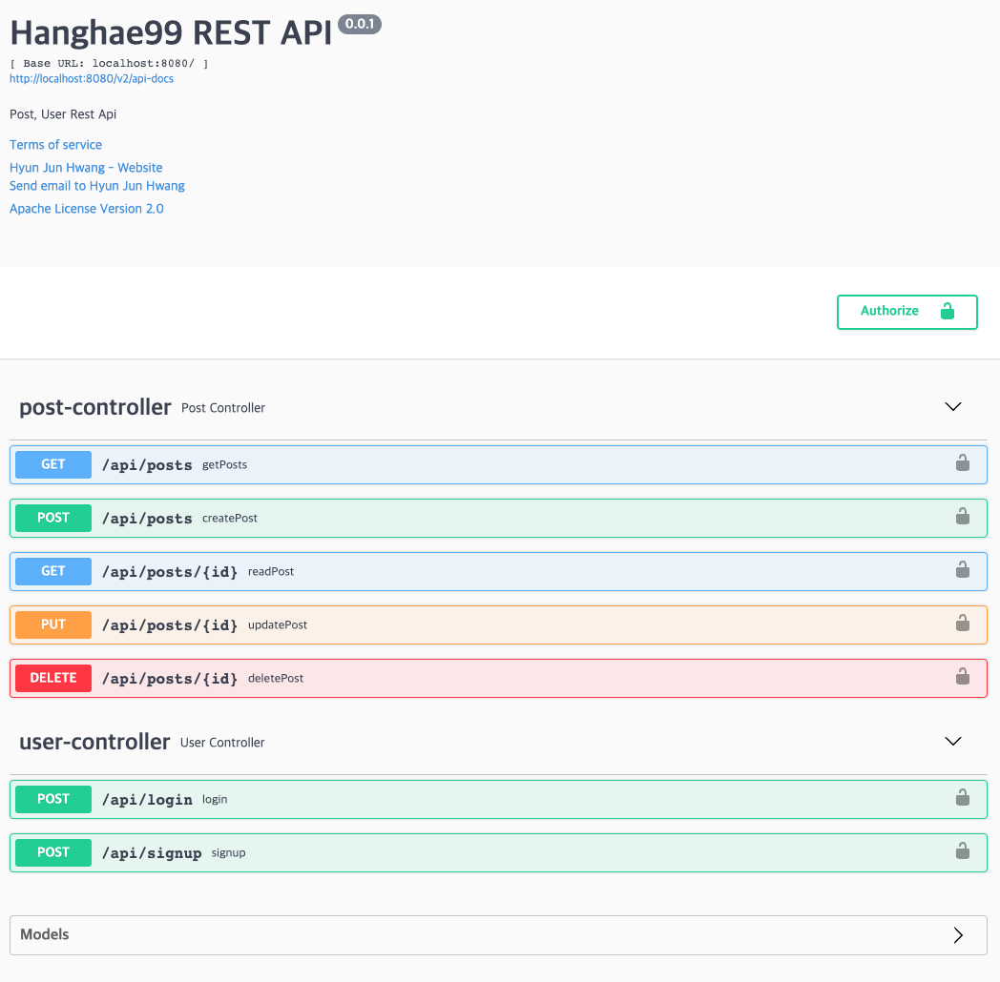
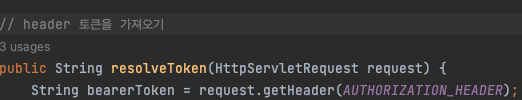
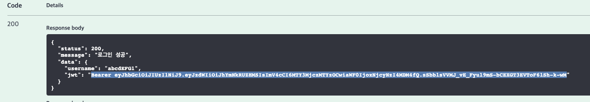
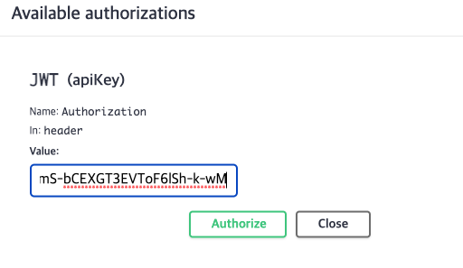
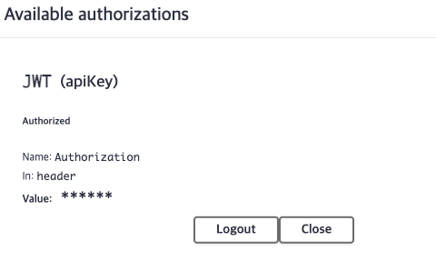
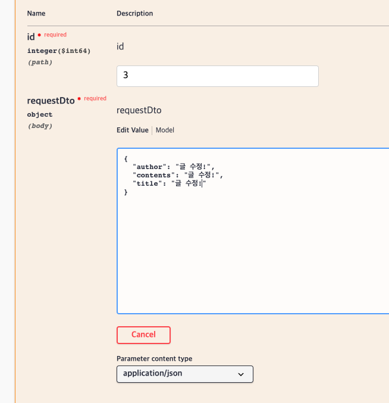
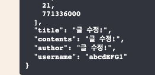

[참조한 글 ](https://velog.io/@livenow/SpringBoot-Swagger%EB%A5%BC-%ED%86%B5%ED%95%9C-REST-%EC%9A%94%EC%B2%AD%EC%97%90-%EC%A0%84%EC%97%AD-jwt-%EC%9D%B8%EC%A6%9D-%EC%84%A4%EC%A0%95-%ED%95%98%EA%B8%B0)

# Swagger(UI)란?
- Open Api Speccification(OAS)를 위한 프레임워크.
- RESTful API 테스트를 쉽게 가능하게 해주고
- 자신의 프로젝트에 설정할 경우 Swagger UI로 API 문서 및 테스트 페이지가 자동완성된다.
- Authorize 기능의 추가로 JWT 같은 토큰 사용 시 토큰 재입력 필요 없이 편하게 사용 가능하다.


## Gradle 추가

    implementation 'io.springfox:springfox-boot-starter:3.0.0'
    implementation 'io.springfox:springfox-swagger-ui:3.0.0'


## Config 클래스 생성
1. 스프링 부트 프로젝트 기준 최상단 (.Application 클래스 있는 곳)에 클래스 생성 후 설정 파일 작성
2. basePackage() 부분에 자신의 컨트롤러 패키지 Path를 입력!


```java
@Configuration
@EnableWebMvc
public class SwaggerConfig {

    @Bean
    public Docket api() {
        return new Docket(DocumentationType.SWAGGER_2)
                .useDefaultResponseMessages(false)
                .select()
                .apis(RequestHandlerSelectors.basePackage("com.sparta.spring_skillful_week_assignment.controller"))
                .paths(PathSelectors.ant("/api/**"))
                .build()
                .apiInfo(metaData())
                .securityContexts(Arrays.asList(securityContext()))
                .securitySchemes(Arrays.asList(apiKey()));

    }

    private ApiInfo metaData() {
        return new ApiInfoBuilder()
                .title("Hanghae99 REST API")
                .description("Post, User Rest Api")
                .version("0.0.1")
                .termsOfServiceUrl("Terms of service")
                .contact(new Contact("Hyun Jun Hwang", "https://github.com/hyunjunhwang1994/Spring_Skillful_Week_Assignment", "hyunjunhwang1994@gmail.com"))
                .license("Apache License Version 2.0")
                .licenseUrl("https://www.apache.org/licenses/LICENSE-2.0")
                .build();
    }

    private ApiKey apiKey() {
        return new ApiKey("JWT", AUTHORIZATION_HEADER, "header");
    }


    private SecurityContext securityContext() {
        return springfox
                .documentation
                .spi.service
                .contexts
                .SecurityContext
                .builder()
                .securityReferences(defaultAuth()).forPaths(PathSelectors.any()).build();
    }

    List<SecurityReference> defaultAuth() {
        AuthorizationScope authorizationScope = new AuthorizationScope("global", "accessEverything");
        AuthorizationScope[] authorizationScopes = new AuthorizationScope[1];
        authorizationScopes[0] = authorizationScope;
        return Arrays.asList(new SecurityReference("JWT", authorizationScopes));
    }


}
```

<hr>

# Swagger(UI) 접속하기
위의 과정까지 완료하고 에러가 없이 프로젝트 실행이 잘 된 경우

도메인주소/swagger-ui/index.html로 접속을 하면?  

ex)  
http://localhost:8080/swagger-ui/index.html

아래와 같이 API 문서 및 테스트까지 가능한 페이지가 자동으로 완성된다!  



<hr>

## JWT 연동하기, apikey()
JWT를 편하게 사용할 수 있게 연동이 가능한데
아래의 설정을 바꿔주어야 한다.

```java
private ApiKey apiKey() {
        return new ApiKey("JWT", AUTHORIZATION_HEADER, "header");
    }
```

- "JWT"  
defaultAuth()에서 설정해 준  
return Arrays.asList(new SecurityReference("JWT", authorizationScopes)); 값이다.

<hr>

- AUTHORIZATION_HEADER  
본인의 JWT 관련 로직이 있는 곳에서 JWT 값을 헤더에 넣어줄 때
헤더의 네임 값을 넣으면 된다.

아래와 같은 코드가 있다면 AUTHORIZATION_HEADER 값!

        response.addHeader(JwtUtil.AUTHORIZATION_HEADER, jwtUtil.createToken(user.getUsername()));



<hr>

- header  
JWT 값이 header에 담겨있으므로 그냥 그대로 둔다.

<hr>

로그인 성공 시 발급되는 JWT







자신이 쓴 글만 수정이 가능하다면


토큰 값 입력 없이도 잘 동작한다. (글 번호, 글 내용 들만 입력했고, 토큰 인증 후 해당 글 쓴 유저 네임과 일치해야 삭제되는 API이다.)



<hr>

# Errors errors 매개변수를 사용하는 경우 에러!
스프링의 @Validated를 이용해서 Errors errors를 바로 뒤에 매개변수로 받거나,
혹은 여타 다른 매개변수로 인하여 아래처럼 화면이 나오는 경우!  
or 아예 에러가 뜨는 경우!


사실 그냥 무시하고 위의 에러 입력값들 제외 원래의 입력값만 잘 주어도
동작하지만, 보기 불편하고 사실상 없는 게 맞다.


@ApiIgnore로 매개변수 앞에다 사용해 주면 해당 파라미터를 제외하고 API 컨트롤러가 동작한다  


