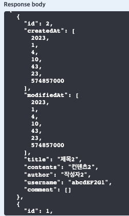
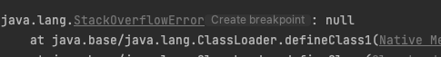

[연관관계 참조 블로그](https://cornswrold.tistory.com/350)


# 현재 상황
- 전체 Post와 각 Post들의 전체 Comment를 가지고 오는 도중 무한 순환 참조가 발생
- Infinite recursion (StackOverflowError)

<hr>


```java
//Comment 
    @ManyToOne
    @JoinColumn(name = "USER_ID", nullable = false)
    private User user;

    @ManyToOne
    @JoinColumn(name = "POST_ID", nullable = false)
    private Post post;
```

```java
//Post
    @ManyToOne
    @JoinColumn(name = "USER_ID", nullable = false)
    private User user;

    @OneToMany(mappedBy = "post")
    List<Comment> comments = new ArrayList<>();
```

```java
//User
    @OneToMany(mappedBy = "user")
    List<Post> posts = new ArrayList<>();

    @OneToMany(mappedBy = "user")
    List<Comment> comments = new ArrayList<>();
```

```java

//Service

    // post와 해당 포스트의 commentList를 받아서 postResponseDto -> DtoList에 넣는다.
    PostResponseDto postResponseDto = new PostResponseDto(post, commentList);

    postResponseDtoList.add(postResponseDto);

```

```java
@Getter
@Setter
@NoArgsConstructor
public class PostResponseDto {

    private Long id;
    private LocalDateTime createdAt;
    private LocalDateTime modifiedAt;
    private String title;
    private String contents;
    private String author;
    private String username;

    // 실질적인 문제 발생 지점
    private List<Comment> comment;


    // entity -> dto
    public PostResponseDto(Post post, List<Comment> comment) {
        this.id = post.getId();
        this.createdAt = post.getCreatedAt();
        this.modifiedAt = post.getModifiedAt();
        this.title = post.getTitle();
        this.contents = post.getContents();
        this.author = post.getAuthor();
        this.username = post.getUser().getUsername();
        this.comment = comment;
    }

}
```

<hr>

## 로그 확인하기.

로그를 자세히 보면 친절하게 아래처럼 알려줍니다.  
(실제로는 무한 순환 참조로 스택오버플로가 걸릴 때까지 진행되기 때문에 로그가 훨씬 길어요.)


<details>  
<summary>로그 확인하기.</summary>
<div markdown="1">             

         2023-01-04 14:03:56.792 ERROR 4348 --- [nio-8080-exec-4] o.a.c.c.C.[.[.[/].[dispatcherServlet]    : Servlet.service() for servlet [dispatcherServlet] in  context with path [] threw exception [Request processing failed; nested exception is org.springframework.http.converter.HttpMessageNotWritableException:  Could not write JSON: Infinite recursion (StackOverflowError); nested exception is com.fasterxml.jackson.databind.JsonMappingException: Infinite recursion (StackOverflowError) (through reference chain: com.sparta.spring_skillful_week_assignment.entity.User["posts"]->org.hibernate.collection.internal.  PersistentBag[0]->com.sparta.spring_skillful_week_assignment.entity.Post["user"]->com.sparta.spring_skillful_week_assignment.entity.User["posts"]->org.  hibernate.collection.internal.PersistentBag[0]->com.sparta.spring_skillful_week_assignment.entity.Post["user"]->com.sparta.spring_skillful_week_assignment.  entity.User["posts"]->org.hibernate.collection.internal.PersistentBag[0]   

</div>
</details>

로그로 짐작해 보자면 posts -> user의 무한 반복인 것처럼 보입니다.

<hr>

# 무한 순환 참조가 왜 일어날까?

[참조 블로그1](https://k3068.tistory.com/32)  
[2](https://m.blog.naver.com/writer0713/221587351970)  
[3](https://dev-coco.tistory.com/133)

무한 순환 참조는 자바의 객체(Entity, Dto)를 JSON 타입으로 직렬화할 때  

Dto던 Entity던 직렬화하는 과정에 필드에 Entity가 있다면 해당 Entity를 직렬화하기 위해 참조하게 되고,

해당 Entity 안의 연관관계가 맺어진 Entity를 직렬화하기 위해 또 참조하게 되고,

또 그 Entity에서의 연관관계가 맺어진 Entity를 참조하게 되고의 반복입니다.
(양방향 매핑이 되어 있기 때문에 !)

<hr>

🤔 현재 상황이 Comment와 Post를 활용 중인데 로그에 user는 왜 나온 걸까?를 한번 생각해 보면  

아래의 순서를 보시면 실제적으로 무한 순환 참조가 이루어지는 곳은 user posts입니다.

예를 들면 제 코드를 기준으로

- PostResponseDto에 담긴 내용물들을 직렬화하는 과정 중
- List 타입의 comment 필드를 만나게 되고 해당 객체 자체(entity)가 들어와있으므로
- comment Entity를 참조하여 comment Entity에 대한 내용들을 또 직렬화합니다.
- comment로 가서 직렬화하던 중 user를 만나게 되고 또, 다시 user를 참조하여 user를 직렬화하게 됩니다.
- user 직렬화 중 posts를 만나게 되고 posts를 참조하기 위해 또 posts로 이동합니다.
- posts에서 user를 발견하고 또 참조하게 되고 -> posts 참조를 무한 반복합니다.

- 결국 양방향 매핑을 자바에서 표현하려다 보니 나는 문제입니다.


그럼 이제 대략 무한 순환 참조가 왜 나는지는 알았습니다.

## 어느 부분에서 JSON으로 직렬화가 될까?

위의 무한 순환 참조가 왜 일어났는지 까지는 그렇다 칩시다.  
그렇다면 우리는 JSON 직렬화라는 것을 직접 해준 적이 없습니다.

그리고, 서비스단에서도 단순히 자바 객체지 JSON으로 직렬화를 해주는 부분이 없습니다.

그렇다면 어디에서 JSON의 직렬화가 이루어지는 것인가를 한번 생각해 볼 필요가 있습니다.

<hr>

그 답은 의외로 쉽습니다.  
RestAPI를 만들고 있는 현재 JSON이라는 형태로 데이터를 보내주고 있고,  
알아서 직렬화를 해주는 곳은? 당연히 RestController이겠죠.

RestController 어노테이션을 붙인 컨트롤러 혹은
@ResponseBody가 붙은 컨트롤러 메소드에서 

값을 반환(return) 할 때 객체를 JSON 타입으로 ObjectMapper가 변환시켜줍니다. 
여기서 JSON 타입에 대한 무한 루프 문제가 발생하고 스택오버플로가 발생하는 것입니다.

[참조 블로그](https://pasudo123.tistory.com/350)

## 참조 자체를 안 하면?

현제 제 기준으로 무한 순환 참조의 원인을 발생시키느 부분이 참조하는 것이 없다면?
다른 말로 null이면 무한 순환 참조는 발생하지 않습니다.

예를 들어 현재 무한 순환 참조가 발생하고 있는 상태인데요.

만약 모든~~ 포스트에 댓글이 하나도 존재하지 않는다면
어디에서도 comment를 참조하지 않고 순환 참조가 발생하지 않습니다.


Swagger UI로 확인 시, 포스트에 댓글이 존재하지 않는다면 댓글은 빈 배열로
순환 참조 없이 잘 불러와집니다.



댓글을 1개 이상 작성 후 다시 전체 포스트를 불러오면? (인피니티 시작..)




## 순환 참조를 막는 방법

[Json Ignore 참조 블로그](https://gorokke.tistory.com/202)

### @JsonIgnore(지양해야 하는 방법)
JosnIgnore는 객체를 직렬화하는 과정에서 해당 어노테이션이 붙은  
필드들을 직렬화 대상에서 제외합니다.

제 코드 기준으로 responseDto 안의 필드가, Comment Entity를 참조하는데 
Comment는 연관 관계가 설정된 user, post를 참조해서 문제이므로  

결국 무한 순환 참조가 일어나는 두 개의 필드에 @JsonIgnore를 붙여주면 잘 동작은 합니다.  

하지만 해당 필드가 직렬화 과정에서 아예 제외되므로,  
실질적으로 다른 비즈니스 로직 사용 시, 이용해야 할 때 사용을 못 할 수 있습니다.

```java
//Comment
    @ManyToOne
    @JsonIgnore
    @JoinColumn(name = "USER_ID", nullable = false)
    private User user;

    @ManyToOne
    @JsonIgnore
    @JoinColumn(name = "POST_ID", nullable = false)
    private Post post;
```

<hr>

### DTO 사용 (지향해야 하는 방법)

그러면 애초에 원인인 Json의 직렬화가 이루어질 때의
객체 안에 comment -> CommentResponseDto 와 같은 식으로 바꾸면 문제없지 않을까요?


현재 저의 경우 CommentResponseDto는 statusCode, responseMessage, data의 형태로
쓰고 있기 때문에 PostCommentResponseDto로 만들어보겠습니다.


```java

// PostResponseDto
 private List<PostCommentResponseDto> comment;

    public PostResponseDto(Post post, List<PostCommentResponseDto> comment) {
        this.id = post.getId();
        this.createdAt = post.getCreatedAt();
        this.modifiedAt = post.getModifiedAt();
        this.title = post.getTitle();
        this.contents = post.getContents();
        this.author = post.getAuthor();
        this.username = post.getUser().getUsername();
        this.comment = comment;
    }


// PostCommentResponseDto
@Getter
@Setter
@NoArgsConstructor
public class PostCommentResponseDto {


    private LocalDateTime createdAt;
    private LocalDateTime modifiedAt;
    private String Contents;

    public PostCommentResponseDto(Comment comment) {
        this.createdAt = comment.getCreatedAt();
        this.modifiedAt = comment.getModifiedAt();
        Contents = comment.getContents();
    }
}


// service 대략적인 로직
@Transactional(readOnly = true)
    public List<PostResponseDto> getPosts() {


        List<Post> postList = postRepository.findAllByOrderByModifiedAtDesc();
        List<PostResponseDto> postResponseDtoList = new ArrayList<>();


        List<Comment> commentList;
        List<PostCommentResponseDto> postCommentResponseDto = new ArrayList<>();


        for (Post post : postList) {

            commentList = commentRepository.findAllByPost_IdOrderByCreatedAtDesc(post.getId());
            
            for (Comment comment : commentList) {
                postCommentResponseDto.add(new PostCommentResponseDto(comment));
                
            }
            PostResponseDto postResponseDto = new PostResponseDto(post, postCommentResponseDto);
            postResponseDtoList.add(postResponseDto);

        }
        
        return postResponseDtoList;
    }

```

이제 실질적으로 Entity가 아닌 DTO만 들어가 있으므로  
JSON의 직렬화가 일어날 때 순환 참조가 일어날 일이 없다!

<hr>

# 정리⭐️
만약 저와 다른 상황이시더라도, 
아래의 글을 자~~세히 읽어보신다면 금방 해결하실 것 같습니다.

- 무한 순환 참조 Infinite recursion (StackOverflowError)는
- 자바 객체(DTO, Entity)의 직렬화가 이루어질 때 발생하고,
- 직렬화는 @RestController(@ResponseBody)에서 리턴 시 이루어진다.
- 해당 객체 안에 양방향으로 연관관계가 설정되어 있다면
- 직렬화 과정에서 계속 참조를 하게 되므로 발생한다.
- 그러므로 해당하는 엔티티에 대응하는 Dto 객체를 만들어
- 엔티티의 내용물을 Dto로 옮기고 최종적으로 컨트롤러에서 직렬화를 시켜 리턴한다.
