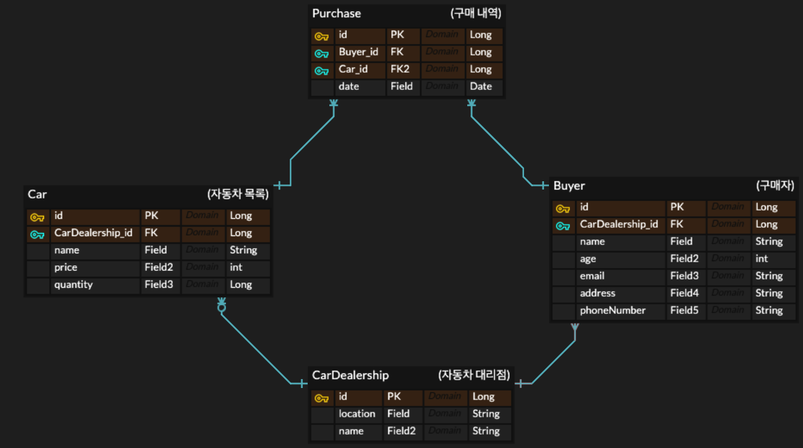
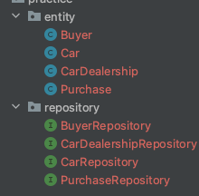
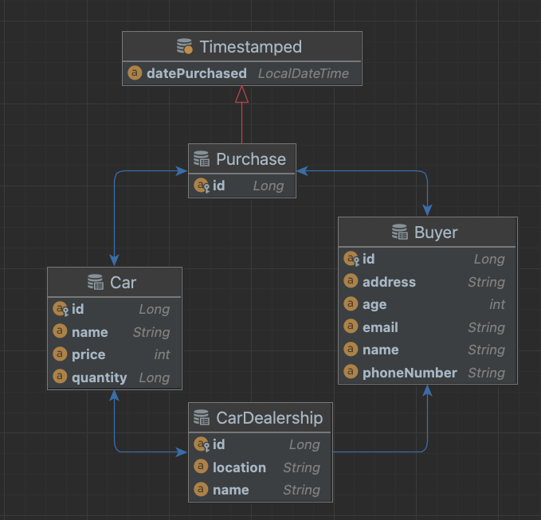

요구사항에 따라 Spring Data Jpa의 Entity를  
만들어 연관관계를 맺는 연습을 해보면 어떨까요?


# 요구사항
## ERD 



- 자동차 테이블은 1대당 개별 테이블이 아닌
자동차 종류별 테이블입니다 ex) 1개의 로우에 아반떼 재고 10대.

- 구매자의 경우 회원 형식이 아닌 말 그대로 구매자이므로,
구매를 한 경우에만 등록됩니다.

간단하게 위처럼 정의하고 자바 코드로 만들어 볼까요?

<hr>

# 구현하기.

- repository, entity 파일부터 기획에 맞게 생성



<hr>

- 각각의 repository 인터페이스에 JpaRepository 상속받기

```java
// BuyerRepository
public interface BuyerRepository extends JpaRepository<Buyer, Long> {
}

// CarDealershipRepository
public interface CarDealershipRepository extends JpaRepository<CarDealership, Long> {
}

// CarRepository
public interface CarRepository extends JpaRepository<Car, Long> {
}

//PurchaseRepository
public interface PurchaseRepository extends JpaRepository<Purchase, Long> {
}
```

<hr>

이제 미리 기획한 ERD를 보고 구현만 하면 됩니다!
참 쉽죠?!

- Buyer Entity

```java
@Entity
public class Buyer {


    // PK
    @Id
    @GeneratedValue(strategy = GenerationType.IDENTITY)
    private Long id;

    @Column(nullable = false)
    private String name;

    @Column(nullable = false)
    private int age;

    @Column(nullable = false)
    private String email;

    @Column(nullable = false)
    private String address;

    @Column(nullable = false)
    private String phoneNumber;

    @OneToMany(mappedBy = "buyer")
    private List<Purchase> purchases;


    // FK의 경우 ( N인 곳에만 있습니다. )
    // CarDealership(1) --> (N)Buyer
    // 위와 같이 단방향이므로 이곳 필드엔 기입하지 않아요!


}

```

<hr>

- Car

```java
@Entity
public class Car {
    @Id
    @GeneratedValue(strategy = GenerationType.IDENTITY)
    private Long id;


    @Column(nullable = false)
    private String name;

    @Column(nullable = false)
    private int price;

    @Column(nullable = false)
    private Long quantity;

    @ManyToOne
    @JoinColumn(name = "CARDEALERSHIP_ID")
    private CarDealership carDealership;


    @OneToMany(mappedBy = "car")
    private List<Purchase> purchases;


}
```


<hr>

- CarDealership  

```java
@Entity
public class CarDealership {


    // PK
    @Id
    @GeneratedValue(strategy = GenerationType.IDENTITY)
    private Long id;

    @Column(nullable = false)
    private String location;

    @Column(nullable = false)
    private String name;

    @OneToMany
    @JoinColumn(name = "CARDEALERSHIP_ID")
    List<Buyer> buyers = new ArrayList<>();


    @OneToMany(mappedBy = "carDealership")
    List<Car> cars = new ArrayList<>();

}
```

<hr>

- Purchase  

```java
@Entity
public class Purchase extends Timestamped {
    @Id
    @GeneratedValue(strategy = GenerationType.IDENTITY)
    private Long id;


    @ManyToOne
    @JoinColumn(name = "BUYER_ID")
    private Buyer buyer;

    @ManyToOne
    @JoinColumn(name = "CAR_ID")
    private Car car;


}
```

<hr>

- Timestamped

```java
@Getter
@MappedSuperclass
@EntityListeners(AutoCloseable.class)
public class Timestamped {

    @CreatedDate
    @Column(updatable = false)
    private LocalDateTime datePurchased;
}
```

<hr>


인텔리제이에서 JPA ER 다이어그램으로 확인해 보니,  
처음 기획한 것과 비슷하게 나오네요!

