

진행 환경 
- 2021, 맥북 프로 M1 Pro 14인치 모델  
- Ventura 13.1 베타(22C5050e) 버전

---

목표 
minimal mistakes 테마 기반 깃허브 지킬 블로그 만들기

 

>> ## 깃허브 계정 만들기.

아래의 링크에서 깃허브 계정을 만든다.  
[깃허브](https://github.com/)

>> ## Repository(저장소) 만들기  

Repository에 들어가서 자신의 블로그로 사용 할 레퍼지토리를 만들어야 한다.  
우상단 프로필클릭 -> Your repositories -> New를 눌러 새 레파지토리 생성

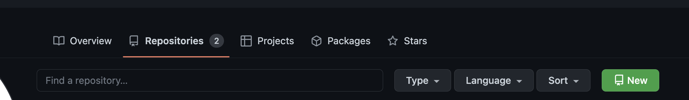

Repository name은 꼭 깃허브계정.github.io로 만들어야 동작한다.

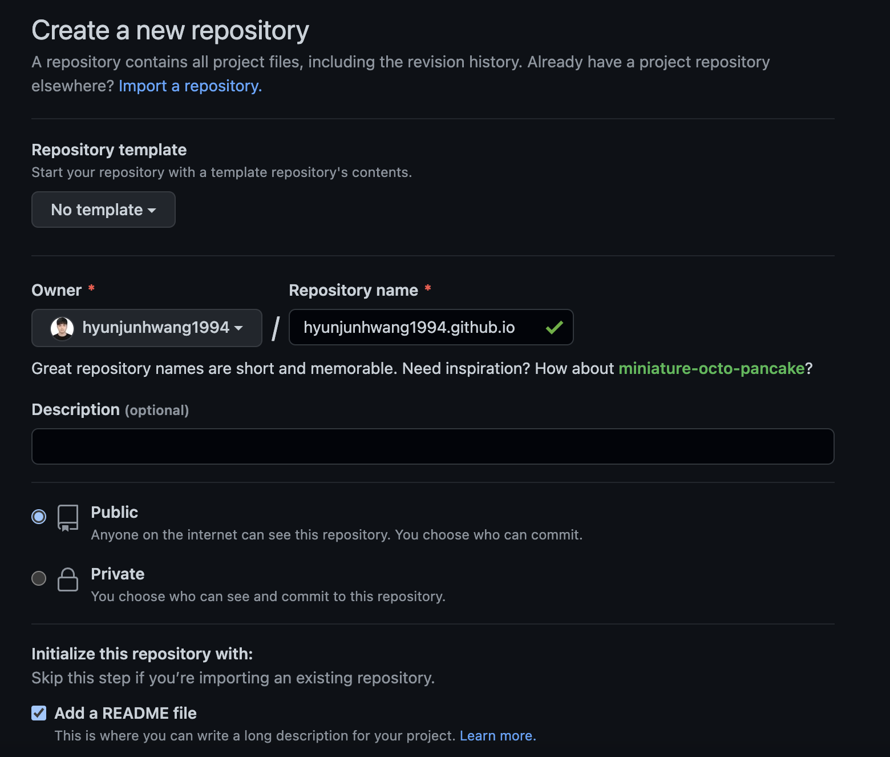

위의 계정.github.io 주소가 본인의 블로그 주소가 되며,  
레파지토리란 저장소안에 블로그를 생성 하고, 유지보수를 할 수 있게 된다.

>> ## Github Desktop 설치

일단 깃허브 데스크탑 깔아주세요 (터미널은 나중에 사용)  
[깃허브 데스크탑](https://desktop.github.com/)

깃허브 데스크탑 실행 후 Your Repositories에서 방금만든 레파지토리를 가저옵니다.

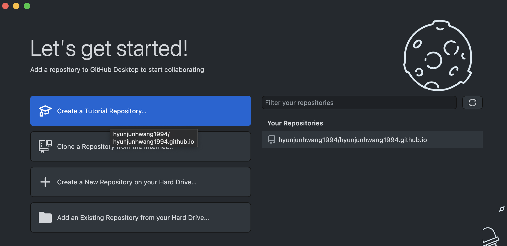

초이스를 눌러 블로그 설치를 원하는 위치에 Clone해주세요.

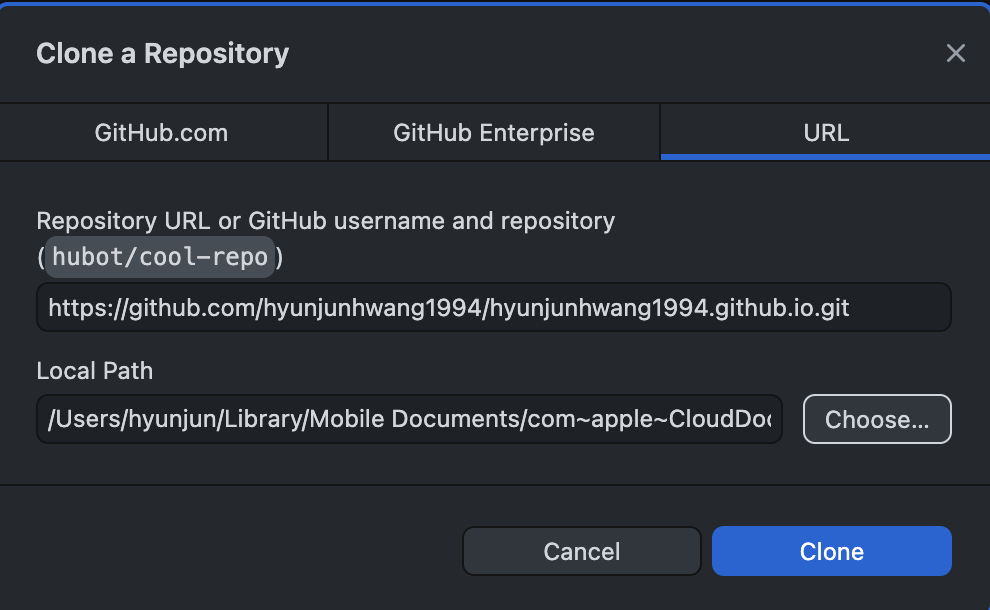

이런 창이 뜨면 성공입니다.

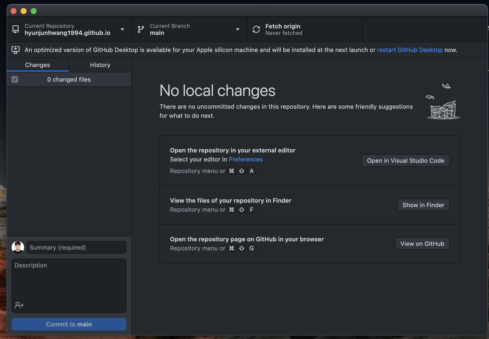

>> ## Minimal Mistakes테마 설치.

지킬은 기본적으로 다양한 사람들이 만들어놓은 좋은 테마가 이미 존재 한다.  
테마 설치 과정에서 원하는 테마를 깃허브 fork로 바로 복사해오면 편하기야 하겠지만..

fork를 사용해서 복사해온 레파지토리는  
커밋, 이슈, 코드리뷰등을 할때 기록해주는 일명 잔디심기가 되지 않는다.

그래서 Github Desktop을 깔고 직접 가지고 오는 것!

나름 많은 사람들이 이용중이고 깔끔한 Minimal Mistakes테마를 설치 해보도록 하겠다.

[Minimal Mistakes 깃허브](https://github.com/mmistakes/minimal-mistakes)

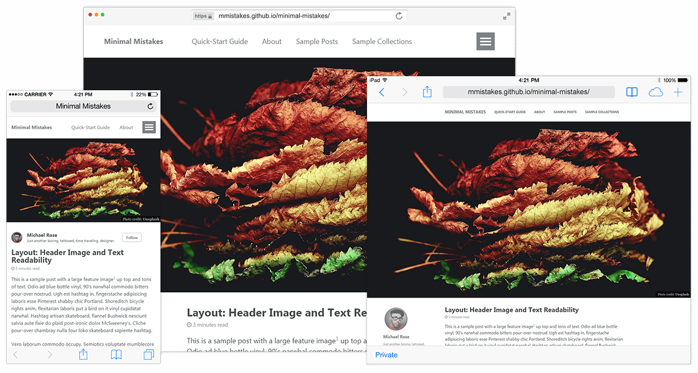

Download ZIP으로 다운로드.

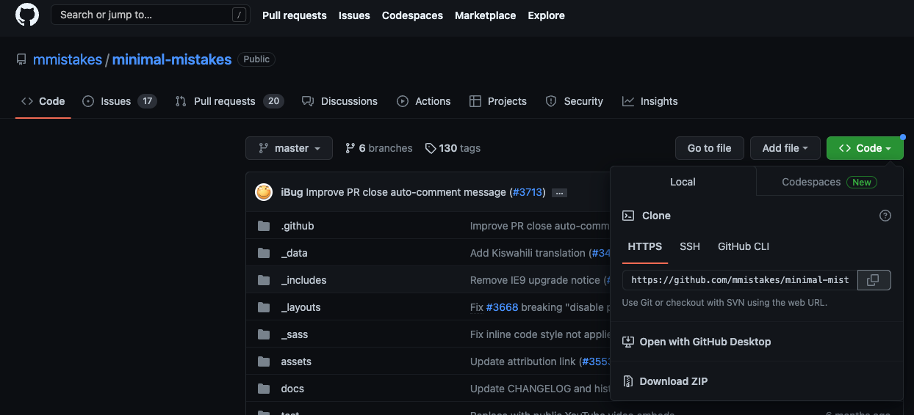

좀전에 클론해온 username.github.io 폴더로  
minimal-mistakes 안에 있는 파일들 전부 넣기.  
README.md 파일은 덮어쓰기

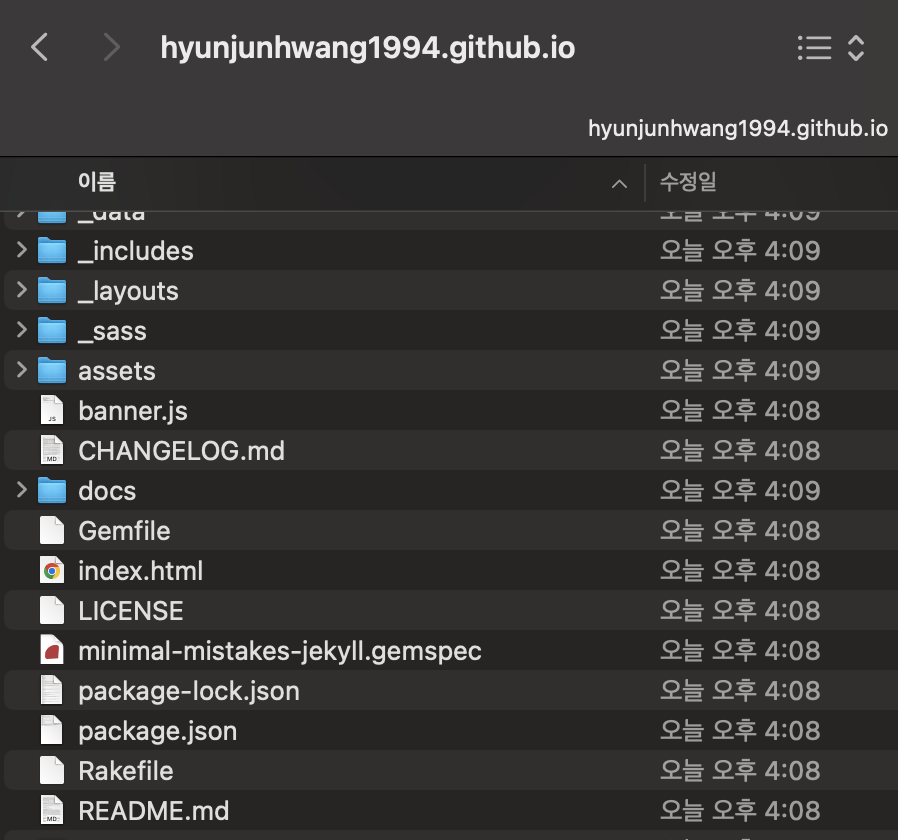

Github Desktop으로!  
우리가 수정한 내용이 저절로 기록이 된다.

이제 이 수정사항을 깃허브로 다시 보내야 한다.  
commit to main 클릭.

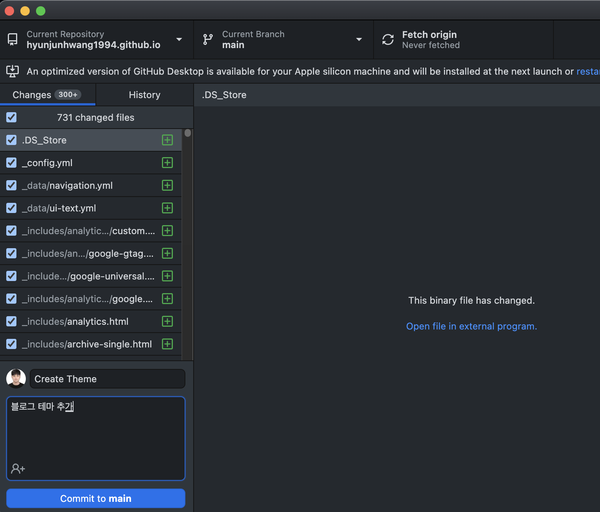

마지막으로, Push origin 버튼 클릭 ( 최종으로, Push를 해야 깃허브 레퍼지토리의 내용이 바뀐다. )

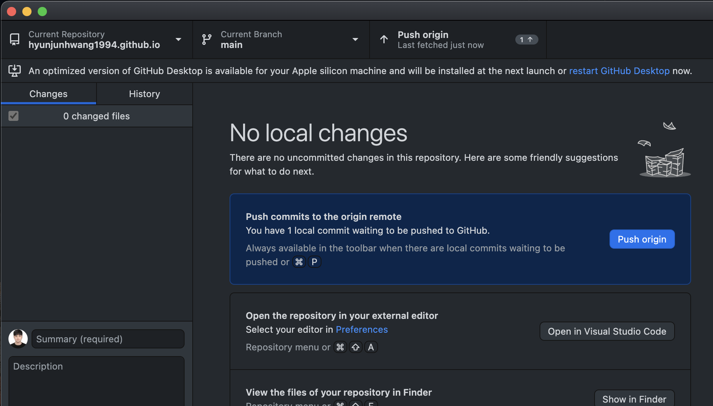

그 다음, 다시 깃허브로와 이번에는 레파지토리를 직접 들어가서  
_config.yml 파일을 찾아, url 부분을 자신의 깃허브주소(예시)처럼 바꾼뒤 커밋.

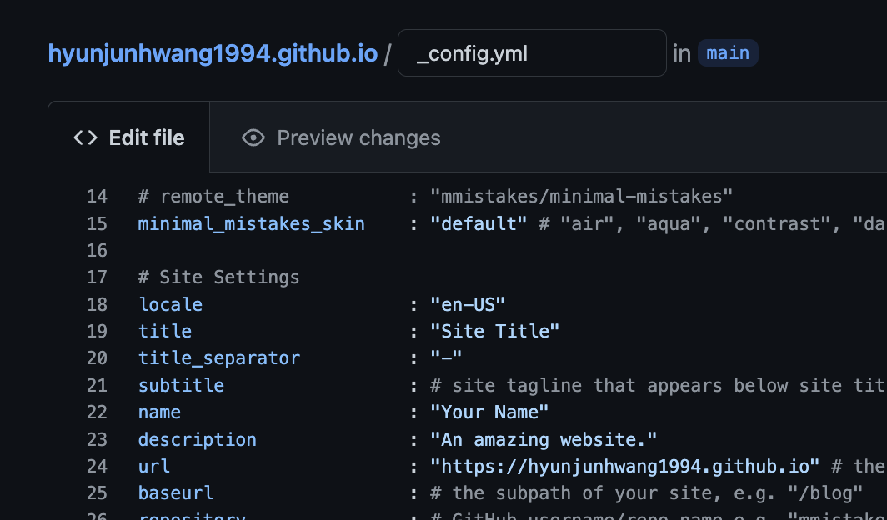

>> ## 블로그 확인하기.

그런후 자신의 아이디.github.io 에 접속하면?  

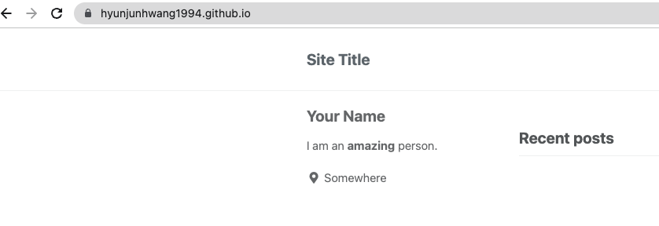

기본적인 블로그 형태가 나올 것이다👍

