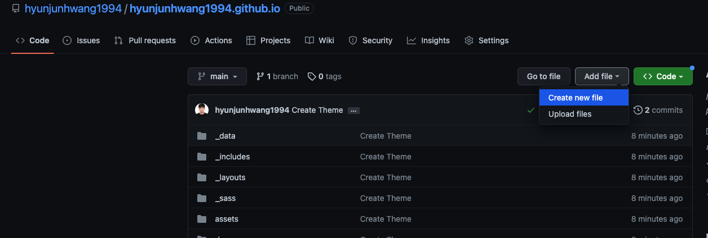
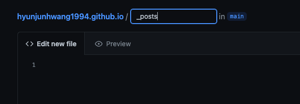
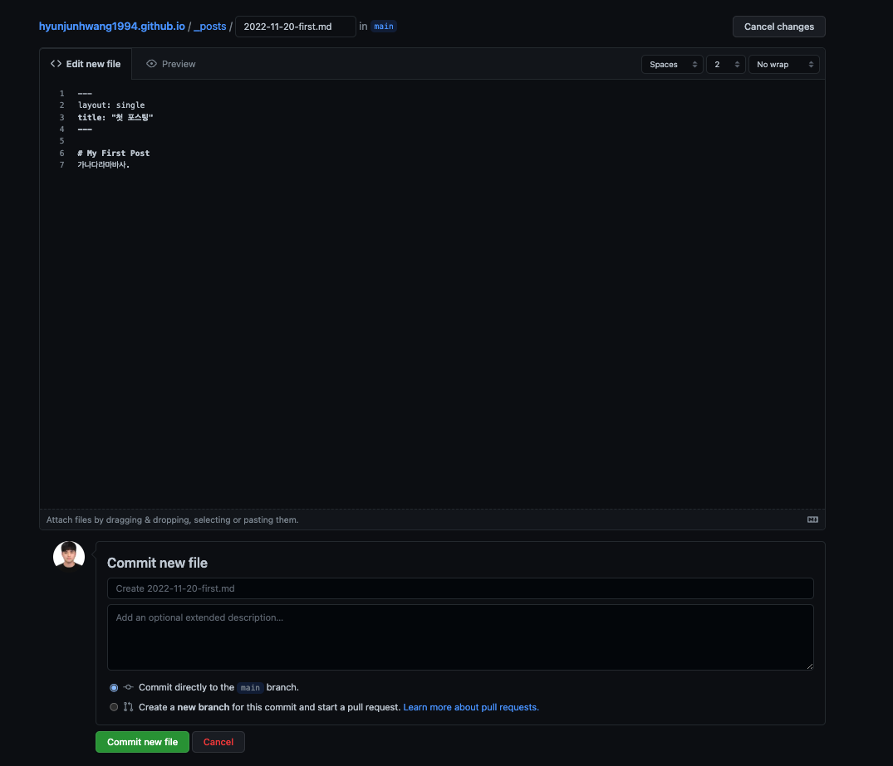
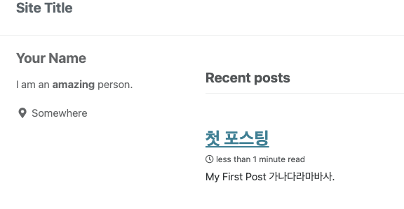
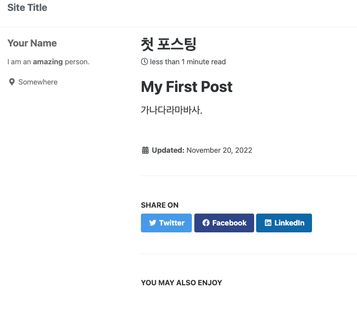

## 기본적인 포스팅 방법

포스팅 할 글의 경우 /posts 에 올려주면 됩니다.
하지만 처음에 없으므로 생성합니다.

새로운 파일생성

_posts/  <- / 를 치면 폴더 생성입니다.

파일 제목은 꼭 년도-월-일-ab-cd.md 형식으로 만들어야합니다.

그후 커밋 뉴 파일을 하면 ?

이와같은식으로 글이 잘 올라오는것을 볼 수 있습니다.

그런데 커밋후 글이올라오는데 시간이 좀 걸리네요!
시간 지연 없이 포스팅 테스트 하는법은 다음 편에 알려드리겠습니다.

