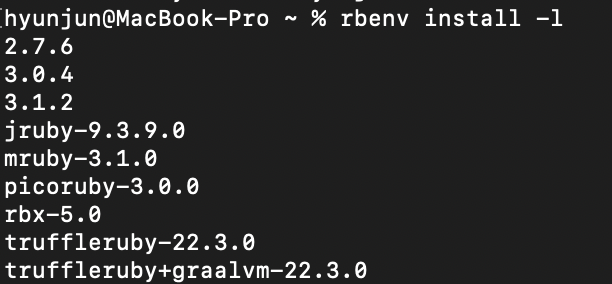

이번에는 터미널 활용과, 로컬서버 생성을 하기 위한 셋업등을 알려드릴게요.

결론적으로 아래와 같은 것들을 설치해야 합니다.
- Homebrew
- rbenv
- ruby (맥은 기본적으로 깔려있지만, 다른버전 설치해야함)
- jekyll, bundler

1. Homebrew
https://brew.sh/index_ko 접속 후 설치.

맥 터미널에서
/bin/bash -c "$(curl -fsSL https://raw.githubusercontent.com/Homebrew/install/HEAD/install.sh)"

위와 같은 명령어 실행 시 다운로드 할 수 있다.

이때 혹시 아래와 같은 에러가 난다면 (맥북 M1의 경우 무조건 나는 듯..)
zsh: command not found: brew

eval $(/opt/homebrew/bin/brew shellenv) 명령어 입력후 다시 

/bin/bash -c "$(curl -fsSL https://raw.githubusercontent.com/Homebrew/install/HEAD/install.sh)" 
입력해주세요.

---
2. rbenv 설치
brew를 이용해 설치한다.

brew update
brew install rbenv ruby-build

rbenv versions 로 설치되었는지 버전확인

      * system (set by /Users/yourname/.rbenv/version)

이런식으로 아마 나올 것이다. ( 기본 맥북 루비 )
그렇다면 rbenv로 다른 버전을 설치해주어야한다.

rbenv install -l

이런식 으로 나온다면 3.1.2 버전을 설치해보겠다.

        rbenv install 3.1.2 

아래처럼 나온다면 설치는완료, 버전을 변경해보자.

        * system
        3.1.2 (set by/Users/yourname/.rbenv/version)

rbenv global 3.1.2

rbenv versions

        system
        * 3.1.2 (set by/Users/yourname/.rbenv/version)

위 처럼 바꼈을 것이다.

이제 rbenv PATH를 추가해주어야한다.

쉘 설정 파일 (.zshrc or .bashrc) 을 열어 다음의 코드를 추가 해주어야 한다.
M1맥북 이상의경우 .zshrc에 추가하면 맞을것이다.

        vi ~/.zshrc

맨아래에 추가

        [[ -d ~/.rbenv  ]] && \
        export PATH=${HOME}/.rbenv/bin:${PATH} && \
        eval "$(rbenv init -)"

적용
source ~/.zshrc

---
3. Jekyll , bundler 설치

gem install jekyll bundler

 버전확인

        MacBook-Pro ~ % jekyll -v
        jekyll 4.3.1
        MacBook-Pro ~ % bundler -v
        Bundler version 2.3.26

끝

결론적으로 루비에 지킬과 번들러를 설치해야하는데
맥에 설치 되어있는 시스템 루비로 설치하면,
아마 권한에러가 뜰것이다.

그렇기 때문에,

homebrew를 받고, brew에서 루비 관리 시스템인 rbenv를 받아 루비를 설치하고 그루비에 jekyll과 bundler를 받은것이다.

homebrew : 맥OS용 패키지 관리자

rbenv : 루비 버전및, 설치등을 도와주는 관리시스템

jekyll : 깃헙 설립자 중의 한명이 Ruby 언어를 통해 개발한 프레임 워크이다. 정적웹사이트를 만들게 도와주는 프레임워크

bundler: 정확히 필요한 gem과 그 gem의 버전을 설치하고, 추적하는 것으로 일관성 있는 Ruby 프로젝트를 제공하는 도구다.

번들러는 종속성 관리를 위한 도구이다. RubyGems가 이미 처리한 것 아닌가라고 물을 수 있다. 하지만 RubyGems는 gem 자체만을 위해서 종속성 처리를 한다. 당신의 일반 루비 애플리케이션은 gem으로 만들어진게 아니므로 이 기능을 얻지 못한다. 이것이 번들러가 존재하는 이유이다.

참조 블로그 https://til.younho9.dev/docs/frontend/jekyll/jekyll-github-page%EB%A5%BC-%EC%9D%B4%EC%9A%A9%ED%95%B4-%EA%B0%9C%EC%9D%B8%EB%B8%94%EB%A1%9C%EA%B7%B8-%EB%A7%8C%EB%93%A4%EA%B8%B0/
