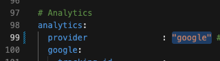
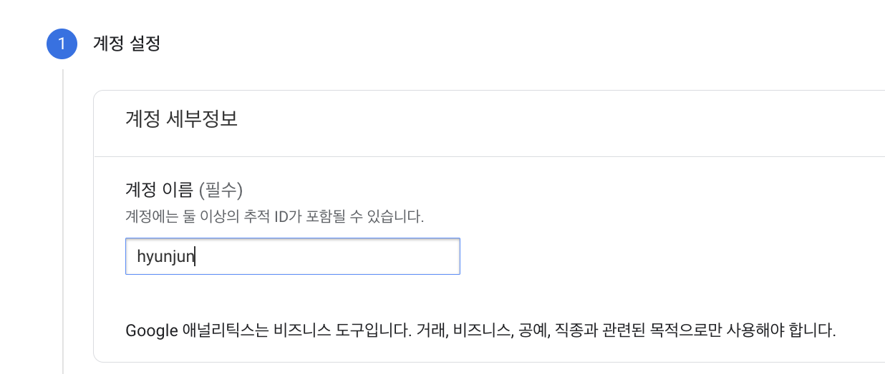
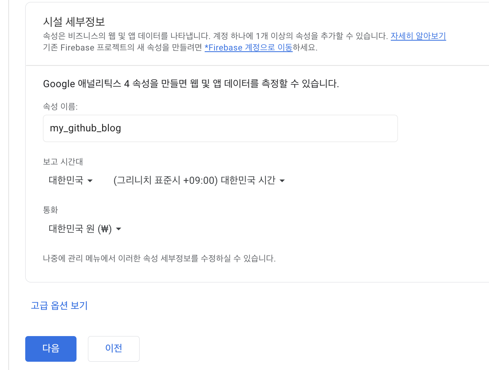
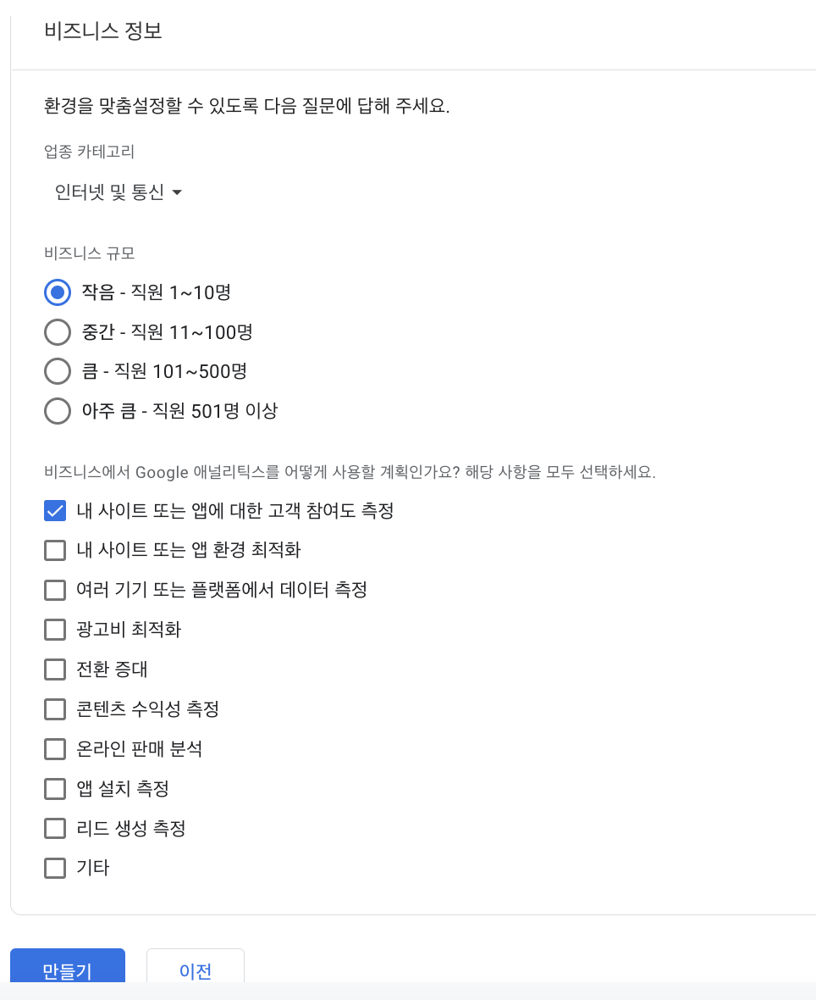
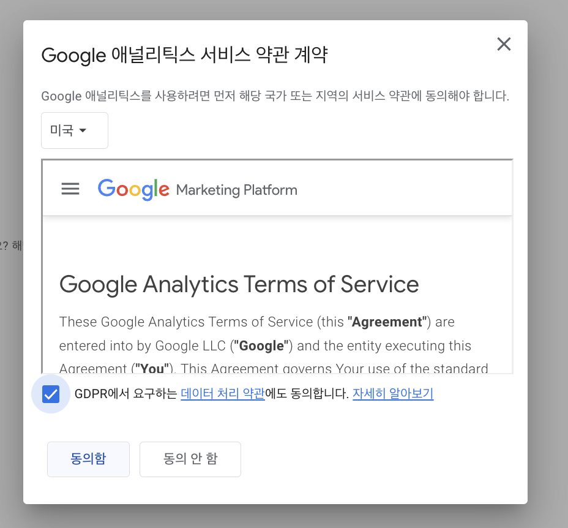
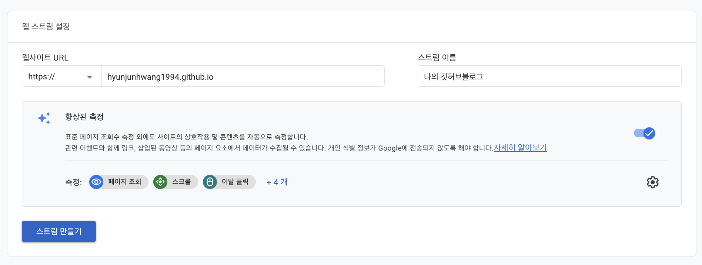
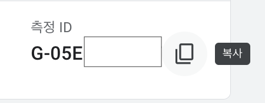
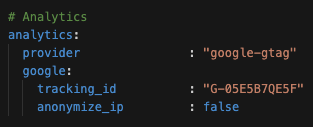
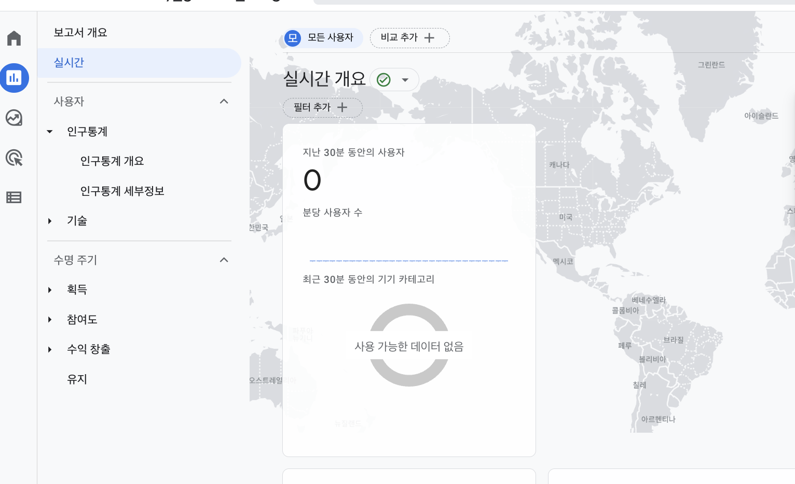

_config.yml

google analyics검색

첫 사용자인 경우 측정시작 클릭

이름 설정후 맨아래 다음 클릭 ( 설정은 기본 옵션대로 하기 )

업종의 경우 자신이 원하는걸로 선택.

웹 클릭

요런식으로 자신에맞게 URL및 스트림이름 입력후 스트림만들기 클릭

측정 ID복사

적용되는데 시간이 좀걸린다.

analytics -> 보고서에 들어가면 각종 정보들이 확인가능하다.
