
      <!-- 개발환경에 대해 설명 -->
개발 환경 
- 2021, 맥북 프로 M1 Pro 14인치 모델  
- Ventura 13.1 베타(22C5050e) 버전

---

    <!-- 현재 포스팅의 목표에 대해 기술 -->
목표 
minimal-mistakes 기반 Jekyll 블로그 Utterances 댓글 적용하기.

 

># Disqus에서 Ufferances로 바꾼 이유.

## Disqus의 치명적인 단점.
- 어느샌가 몰래 덕지덕지 붙어있는 광고들..
- 왠지 모르게 무겁다.
- 왜 나만 글자가 투명색(흰색)으로 나오는지ㅠ  
Disqus 내 설정을 바꿔도, Only 흰색 글자만 나온다.  
결국 이러한 점 때문에 바꾸었다. (하얀색 배경으로 된 테마를 사용 못 하기 때문.)
- 광고 없애려면 유료...

## 그렇다면 장점은 없나?  
- 구글, 페이스북, 트위터, 디스쿼스 등의 다양한 로그인 종류 제공
- 설치가 편하다..?

 
결론은 장단점 따지기 전에, 아예 흰색 테마에서는  
사용을 못 하기 때문에 바꾸기로 마음먹었다. 

구글링 해도 전혀 나오지도 않아요...!
 
 
 
 
 

># Utterances 장단점

## 장점
- 가볍다.
- 거의 실시간으로 댓글 알림을 받을 수 있다.
- 깔끔하며, 테마 변경 가능
- 깃허브랑 연동이 가능하다.
- 무료..🌝

## 단점
- 깃허브 계정이 있어야 구현할 수 있다.
- 댓글 작성 시 오직 깃허브 계정으로만 로그인이 가능하다.
- 댓글 삭제 기능이 없다. (깃허브 이슈 내에서만 가능)

 

결론적으로, 깃허브 계정을 가지고 있고 개발 관련 포스팅 or TIL을 위주로 올리기 때문에  
댓글 다시는 분들도 깃허브 계정이 있으리라?? 판단하여 단점은 상쇄됐다.

 
 

># Utterances 동작원리.

## Github Issue 기반.  
Utterances는 Github의 App이다.  
Github의 repositroy 안의 Issue 기능으로 동작한다.

예를 들어, 블로그 댓글 작성 시 -> Github/repository의 Issue가 생성되며  
해당 Issue의 Comment가 댓글이 되는 것이다.

결국 우리의 Repository를 댓글 Database로 쓰는 셈이다.

- Repository : Issue, Comment를 담을 저장소.
    - Issue : 해당 포스팅이 대한 정보를 담고 있음, 포스팅 1개당 Issue는 1개 
        - Comment : 실제 댓글

 
 

># Utterances 설치하기 ⭐️

## Github App 설치
1. 자신의 깃허브 계정에 Utterances를 이용, 댓글이 담길 새로운  
   repository를 생성 ( ⭐️ public이어야 한다. )
2. 아래의 링크 클릭하여 install로 자신의 깃허브 계정에 Utterances 앱을 설치!

[Utterances 앱 설치](https://github.com/apps/utterances)
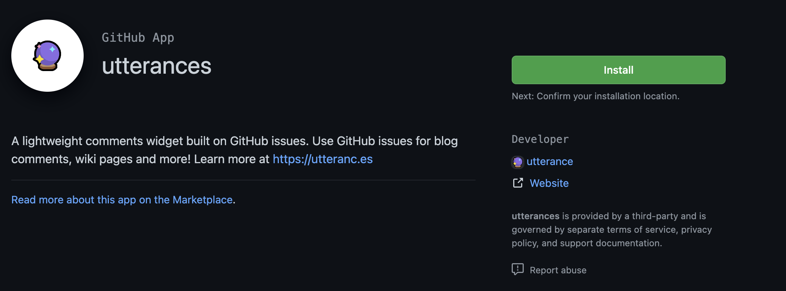

1번에서 만든 repository를 주소를 선택하여 install 해준다.
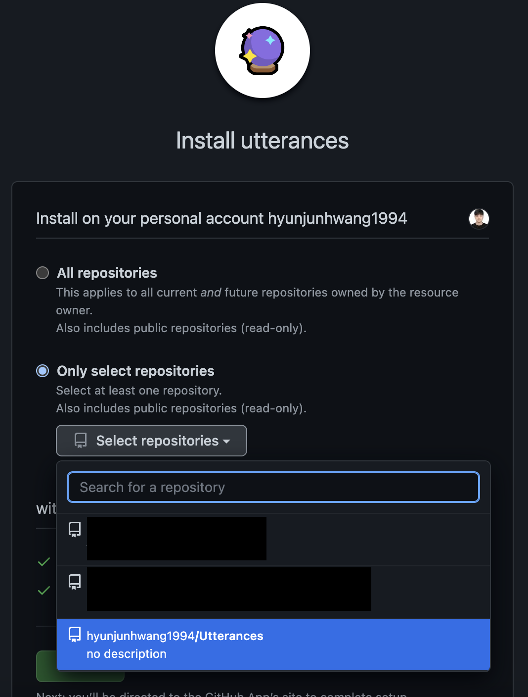

 
repository name으로 Utterances는 나중에 헷갈릴 것 같아.  
직후에 repository name을 Utterances-comments로 변경했습니다.
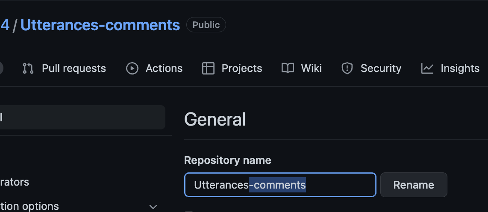

 

이제 repository에 App 설치는 끝났습니다.
 

[minimal-mistakes 테마 사용 중인 경우 클릭⭐️](#minimal-mistakes-사용자의-utterances-설치)

 

## 일반 Utterances 설치.

아래에 경우 이 과정을 진행해 주세요.
- minimal-mistakes 테마를 사용하지 않음.
- _config.yml에 댓글 추가 기능이 없는 경우
- 새로운 플랫폼이나, 기초부터 Utterances를 생성하고 싶은 경우

아래의 링크로 이동!  
[Utterances 설정](https://utteranc.es/?installation)

그럼 이런 화면이 나오실 겁니다!  
repo에 자신의 repository name을 넣어주세요.
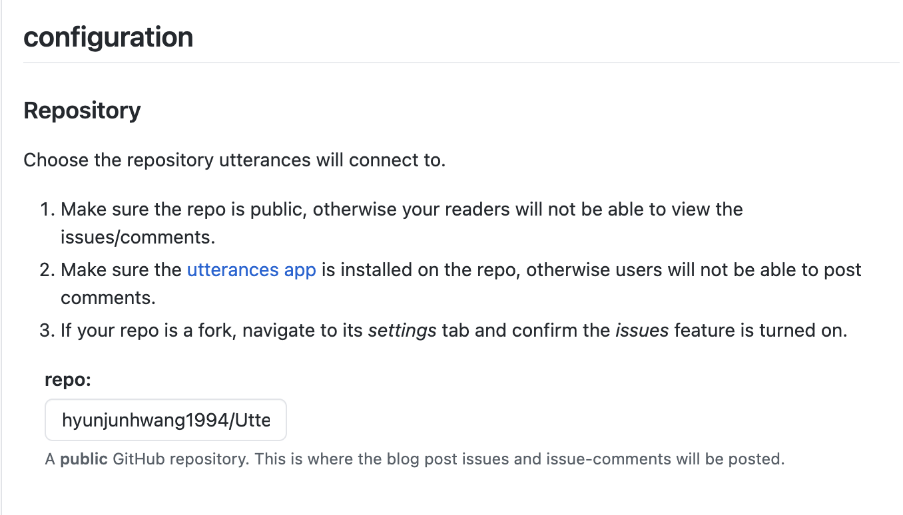

아래의 주소 복사해서 넣으면 됩니다.
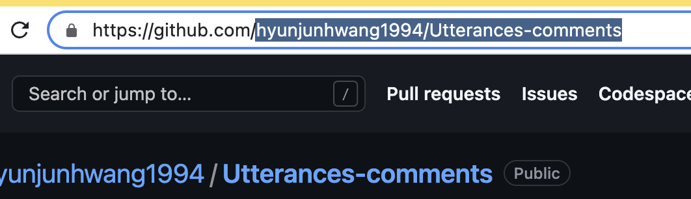

 
해당 댓글을 repository에서
어떤 기준으로 매핑할 건지 정하는 옵션입니다.

블로그 포스팅 시 파일명은 잘 수정하지 않으므로  
Issue title contains page pathname으로 선택해 주세요.
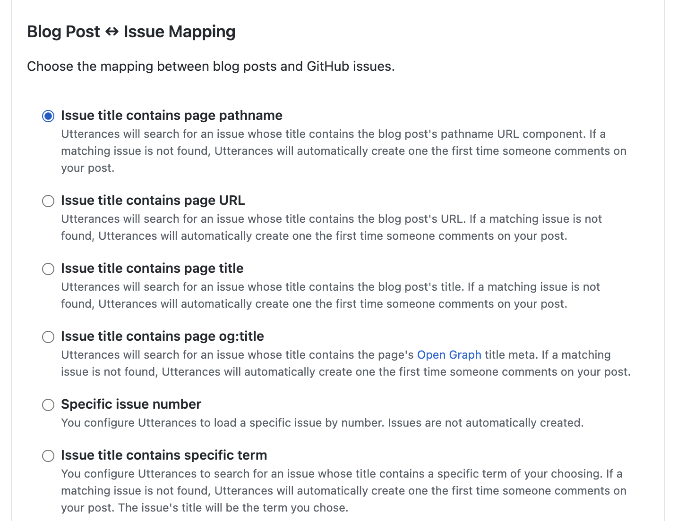

Issue Label 설정 (Comment 시 달릴 라벨)
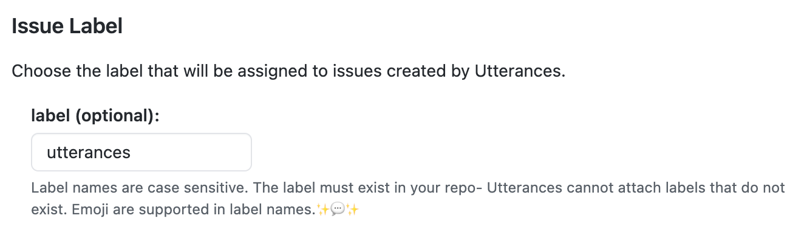

Theme 설정 (원하는 테마로 설정하세요.)
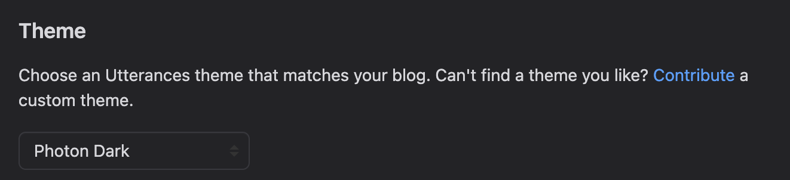

이제 방금 선택한 옵션들을 포함한 소스코드가 만들어집니다. (Copy 클릭)
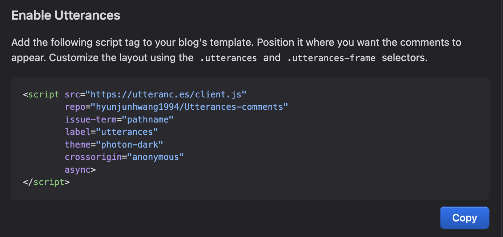

이제 댓글을 추가하고 싶은 html 파일에  
복사한 소스코드를 붙여넣기 해주면 돼요!

 
 

## minimal-mistakes 사용자의 Utterances 설치.

minimal-mistakes를 테마로 쓰시는 경우,  
_config.yml에 utterances 관련 설정이 있는 경우

사실 minimal-mistakes의 경우 이미 포스팅 할 때  
참조되는 레이아웃에 utterances 관련 파일이 만들어져있으므로

설정 파일인 _config.yml만 바꿔주면 됩니다.

[이 과정을 진행할 필요가 없다.](#일반-utterances-설치)
- repository: Utterances 앱 설치한 repository 주소를 사진의 형태와 맞게 입력.
- provider: "utterances"
- theme: 옆에 주석 참조하여 테마 설정
- issue_term: "pathname" 
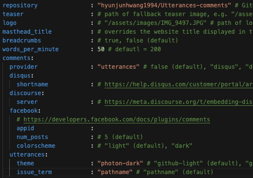

label(optional)의 경우 추가하고 싶다면 아래처럼 만들어주면 된다.
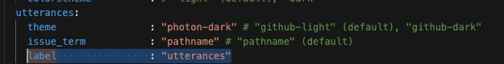

아래처럼 utterances를 만들어주는 코드가 이미  
_includes/comments-providers/utterances.html에 숨어있다.
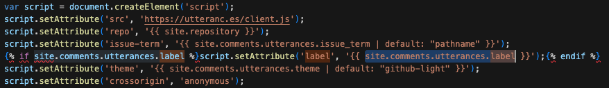

이제 커밋, 푸쉬 후 약간의 시간이 흐른 뒤 본인의 깃허브 블로그에 들어가면  
적용되어 있을 것이다.

 
 

># 그 외에.

## 포스팅 파일명을 변경 한 경우

 

실제 댓글을 달면?
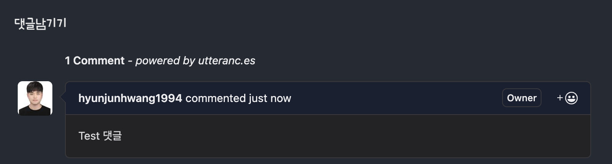

실제 레파지토리에 이슈 생성 -> comment 생성 과정이 진행된다.
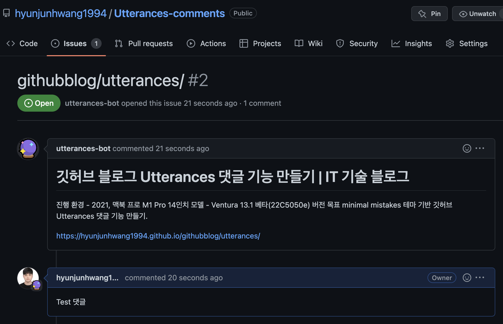

이때, Isuue가 포스트의 파일명인 /Utterances를 참조하고 있으므로  
해당 글의 포스트 내용은 변경해도 되지만,

아래처럼 포스팅의 파일 이름을 변경하면 댓글에서 참조하고 있는  
URL 주소가 바뀌므로 댓글이 사라집니다.  
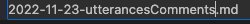

파일명 변경하자 댓글이 삭제됨.
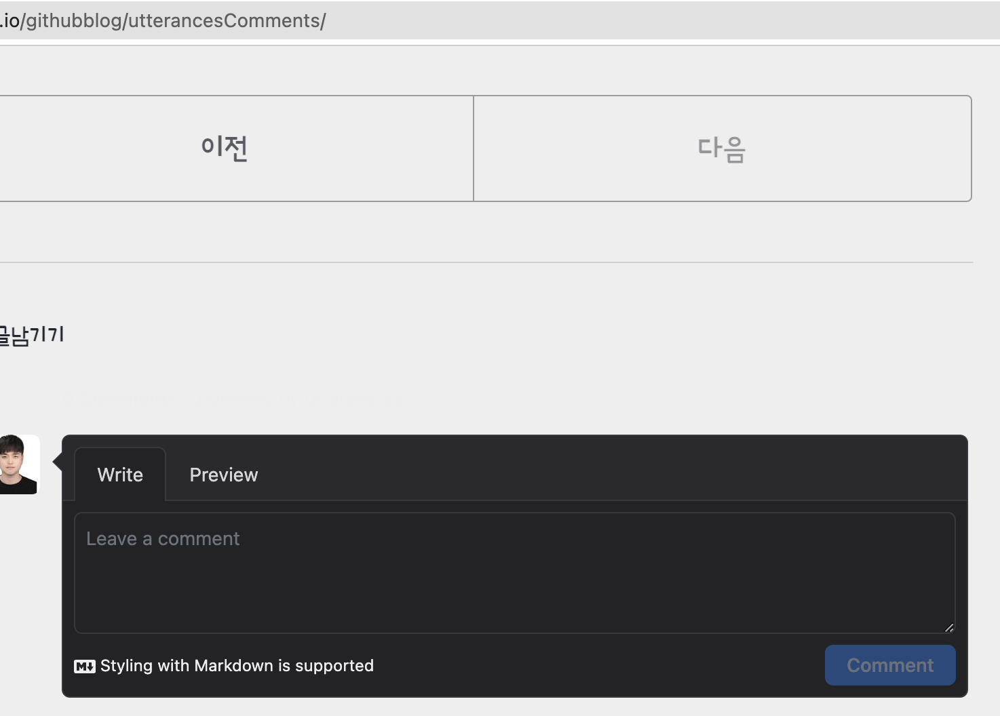

 

이때는 issue, issue 안 내용을 바꿔주면 된다.

일단 issue 이름부터 바꿔줍니다.
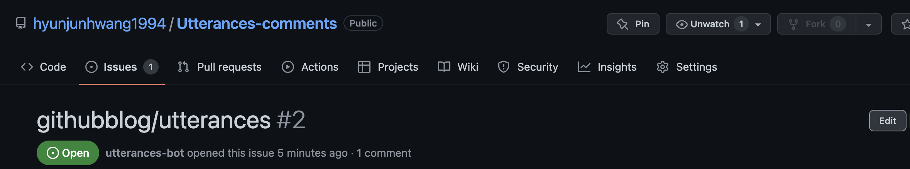

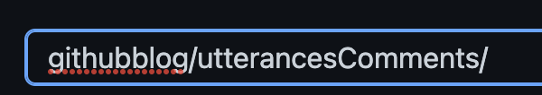

그리고 안에 내용에서 경로도 바꿔주어야 합니다.
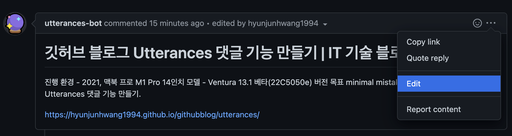

 

바꾼 뒤 업데이트!
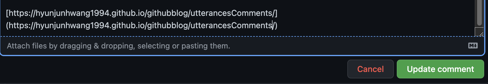

Issue 이름, 내용 둘 다 바꾸면 댓글이 복구됩니다.

 

## 댓글 삭제

특정 댓글 삭제의 경우 직접 레파지토리에서  
해당 Issue(글) -> Comment(댓글)를 삭제하면 됩니다.
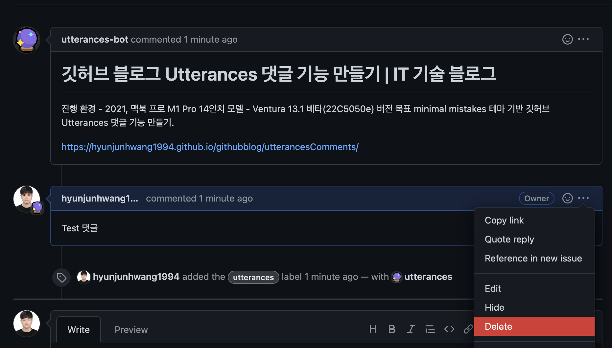

 

해당 게시물의 댓글 통째로 삭제하시려면 (이슈 통으로 삭제)  
해당 이슈 들어가서 오른쪽 아래의 Delete issue를 하면 됩니다.
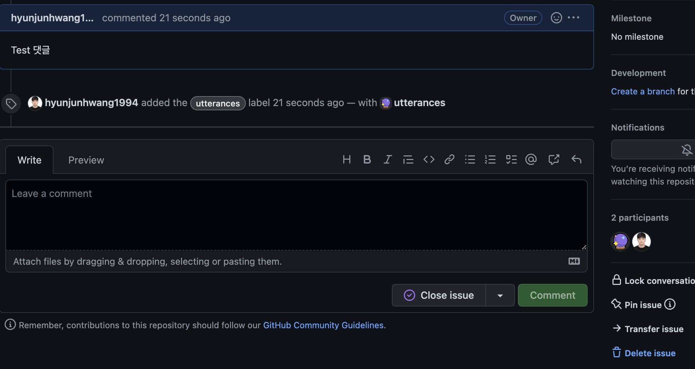

 

## 알람도 온다?
알람은 다음과 같은 경우 옵니다.

- 첫 댓글이 달려 Issue가 생성된 경우
- 댓글이 달린 경우 (자신의 댓글은 알람 오지 않습니다.)

거의 실시간으로 빠르게 오네요.
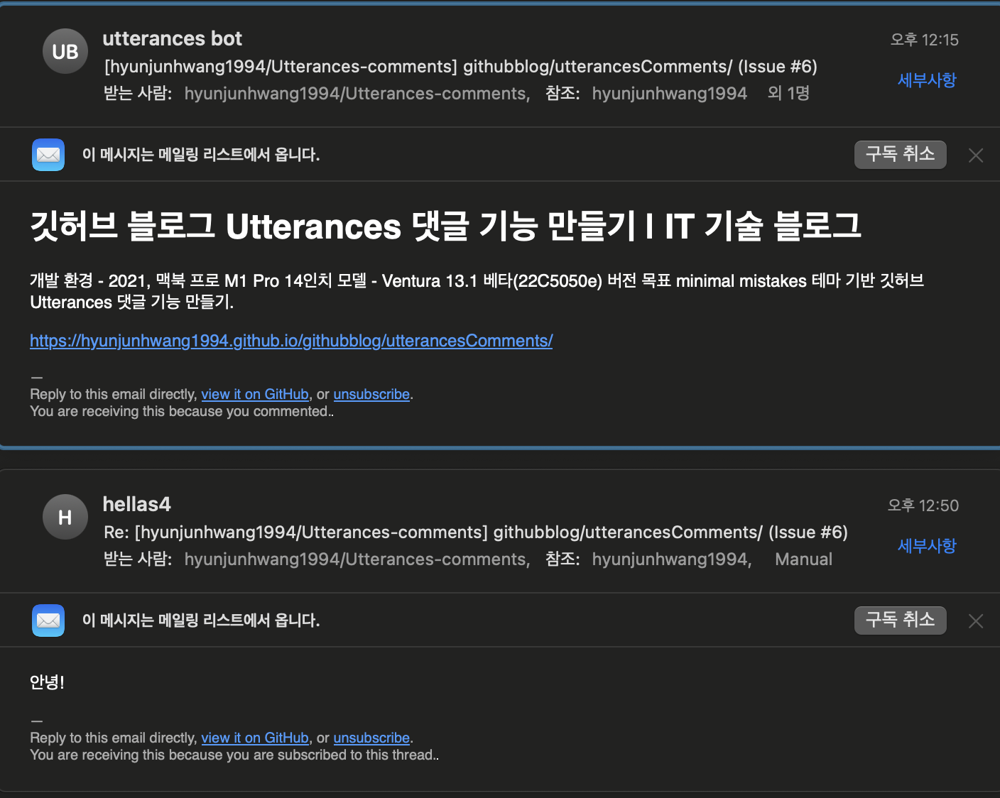

## Issue Number
repository에서 이슈 삭제 재생성 시 Issue Number가 1번이 아닌  
그전 번호가 쌓여서 2, 3처럼 진행되는데

댓글 기능엔 이상이 없으므로 그다지 신경 안 써도 될듯합니다.

참조 블로그  
https://computasha.github.io/etc-utterances/
https://ansohxxn.github.io/blog/utterances/