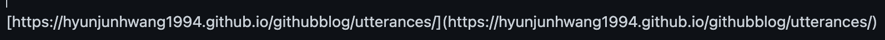

개발 환경 
- 2021, 맥북 프로 M1 Pro 14인치 모델  
- Ventura 13.1 베타(22C5050e) 버전

---

목표 
minimal mistakes 테마 기반 깃허브 Utterances 댓글 기능 만들기.

 

Utterances는 깃허브의 이슈

utterances로 사용할 댓글이 담길 레파지토리 생성 ( public로 만들기. )

저는 그냥 Utterances로 만들었습니다.

Disqus를 사용하려고 하다가..

광고는 둘째치고, 저는 아무리 배경을 바꿔도 디스쿼스의 댓글색이 흰색으로만나와

하얀배경의 테마에서는 전혀 사용할 수가 없어서.. 우터렌스로 바꿔ㅇ습니다.

Ufferances전용으로 만든 레파지토리주소를 아래에 입력해준다.

https://utteranc.es/?installation_id=31487720&setup_action=install

참조 블로그
https://computasha.github.io/etc-utterances/
https://ansohxxn.github.io/blog/utterances/

mapping 하기.
깃허브 블로그 와 깃허브 이슈를 연결해줄 매핑 방식을 선택해야한다.

Issue title contains page pathname 선택

Issue Label 설정

Theme 설정

이제 옵션입력으로 만들어진 아래의 소스코드를 복사한다!

다른 테마를 쓰시는분은 위의 코드를 댓글창 만드는 html 파일에 바로 넣어주시면되고..

사실 minimal-mistakes  의 경우 이미 포스팅 레이아웃에 utterances html 파일이 만들어져있으므로

_config.yml에서 repository, provider, theme, issue_term 부분만 바꿔주면된다.

(https://utteranc.es/?installation 참조)

label(optional) 의 경우 추가하고싶다면 아래처럼 만들어주면된다.

_includes/comments-providers/utterances.html 참조

이제 커밋, 푸쉬후 약간의 시간이 흐른뒤 본인의 깃허브 블로그에 들어가면

적용되어 있을것이다.

이렇게 댓글을 다는경우

실제 레파지토리에 이슈로 달리고 그 이슈가 댓글로 연동되는것!

이때,
URL path 기반으로 돌아가기때문에 
단순히 댓글이달린 해당 포스트 글의 내용 변경시에는 동작하지만
포스팅 파일이름을 변경하면 URL주소가 바뀌므로 댓글이 사라집니다.

글의 파일명을 바꾼경우 (기존 댓글이 많아서 댓글을 옮겨야 하는경우)

파일명 변경하자 댓글이 삭제됨.

- 이슈명, 이슈내용안 링크를 두개다 바꿔줘야 적용됩니다.
일단 이슈명 부터 바꿔줍니다.

이슈명 말고 안에 내용에서 경로를 바꿔주어야해요.

바꾼뒤 업데이트!

댓글 삭제의 경우 직접 레파지토리에서 해당 이슈를 삭제하면 됩니다.

해당 게시물의 댓글 통째로 삭제하시려면 (이슈 통으로 삭제)

해당이슈들어가서 오른쪽아래의 Delete issue를 하면 됩니다.

특정 댓글 삭제 시

# 파일명 변경 한 경우

# 댓글 삭제