

          개발 환경 
          - 2021, 맥북 프로 M1 Pro 14인치 모델  
          - Ventura 13.1 베타(22C5050e) 버전
          

 

># Disqus

Disqus란 댓글 API를 제공하는 회사이다.

보통 네이버나, 티스토리 등 블로그에는 댓글 기능이 달려 있지만,

Jekyll 기반 블로그, 개인 블로그 등에 댓글 기능을 추가할 때 사용하면 된다.

## 회원 가입.
아래 페이지에서 회원 가입을 해주세요.

[Disqus 홈페이지](https://disqus.com/)

## 설정

settings
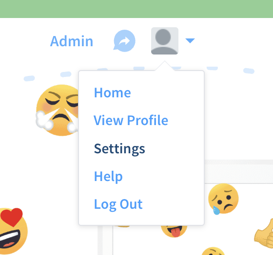{: .align-center}

Add Disqus To site
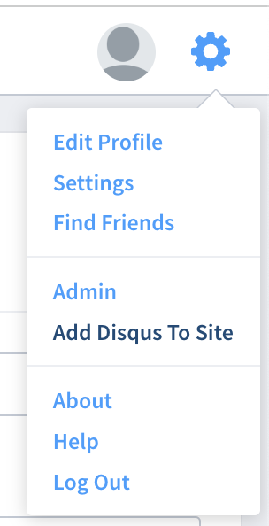{: .align-center}

Get Started
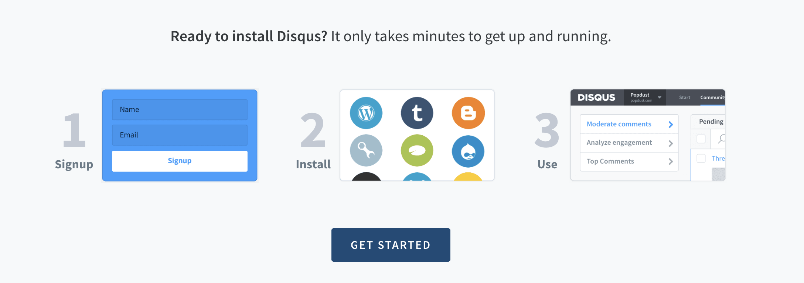

I want to install Disqus on my site
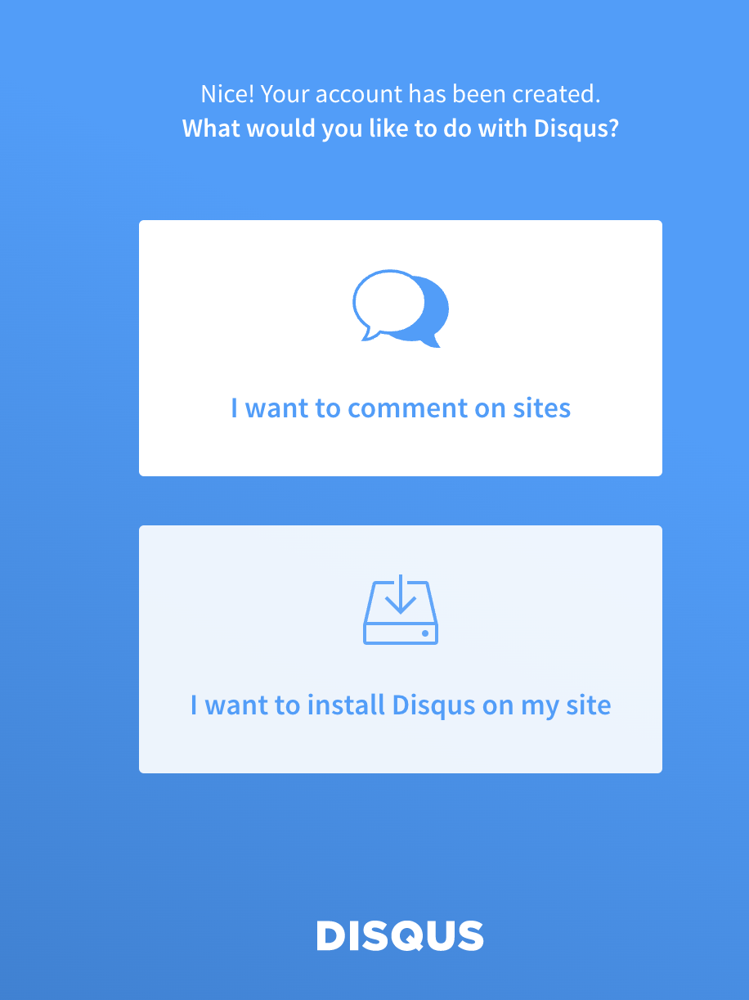

Website Name을 적어 주세요. (임의 설정)
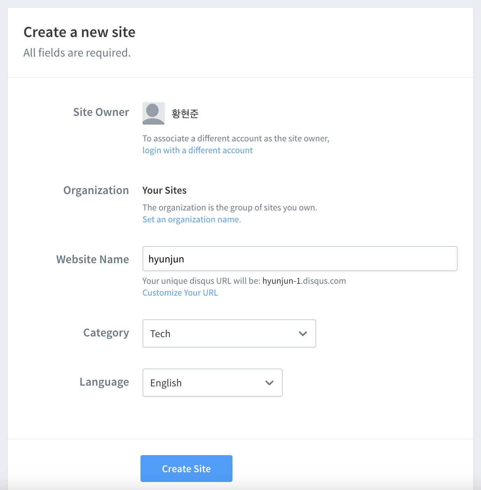

Basic -> Subscribe Now
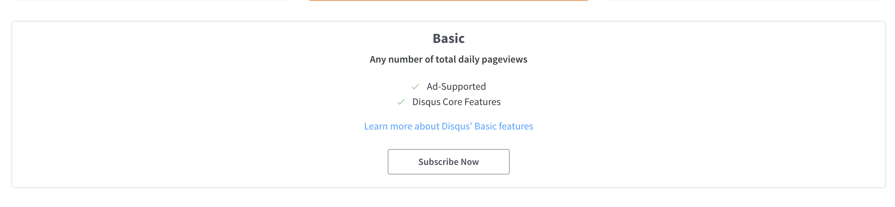

Jekyll
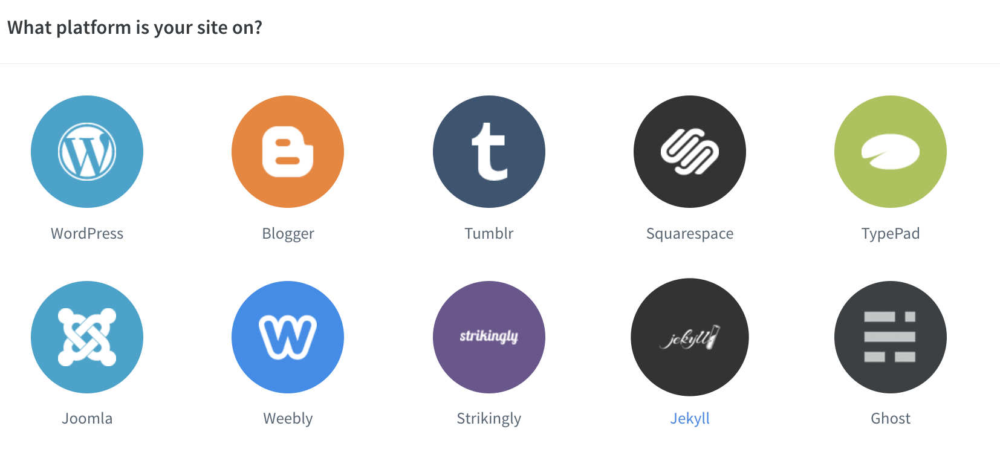

 
minimal-mistakes의 경우 또는 기본적인 Jekyll 테마 사용하시는 경우  
기본적인 설정이 _config.yml에 있으므로 아래 코드 복사 안 해도 됩니다.

Configure 클릭
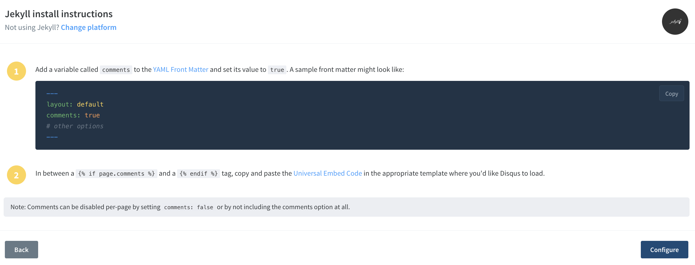

url : 본인의 깃허브 블로그 주소.
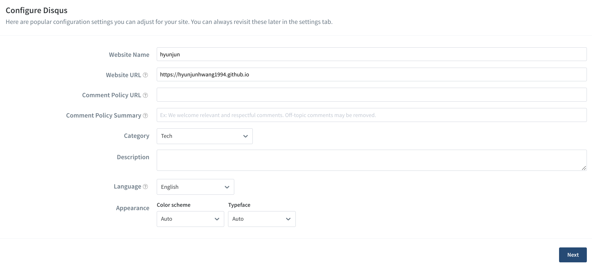

Complete setup
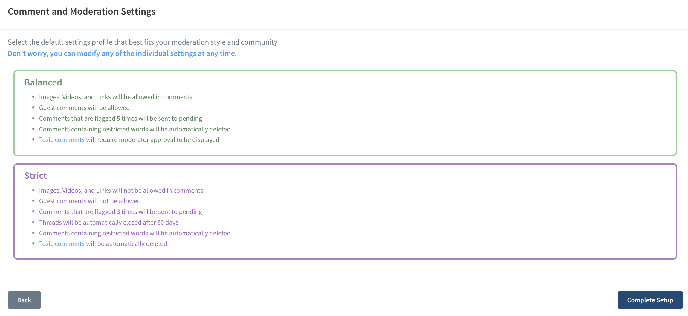

## _config.yml 설정

comments: true
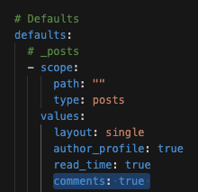{: .align-center}

provider : "disqus"  
shortname : "myshortname"
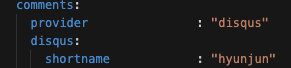{: .align-center}

Disqus -> admin에서 shortname 확인 가능합니다.
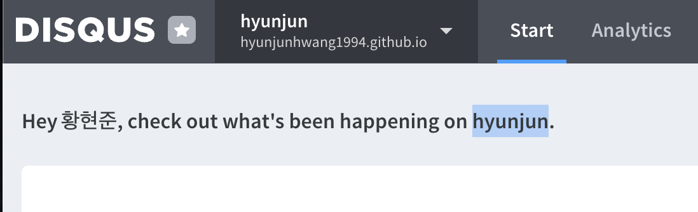

Commit, Push 해주어야 서버에 반영됩니다.

Disqus는 실제 Disqus 쪽에서 API를 제공해 주기 때문에,  
로컬 서버에서는 댓글이 보이지 않고, 실제 깃허브에 연결된 도메인으로 접속해야 사용 가능하다.

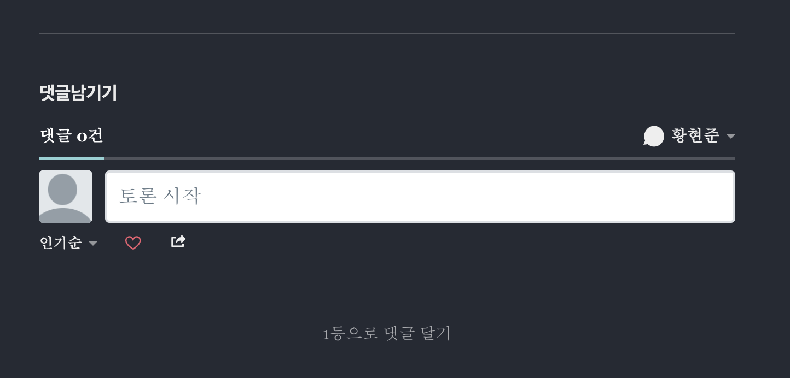

Disqus 사이트 어드민에서 댓글 관리 및 여러 기능 추가 가능합니다!
