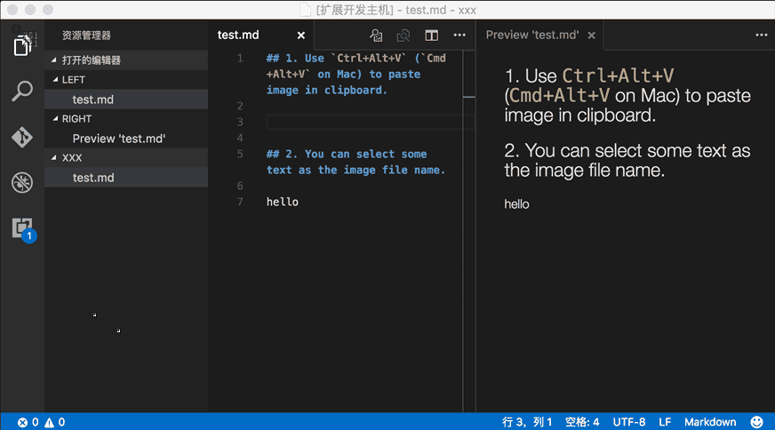
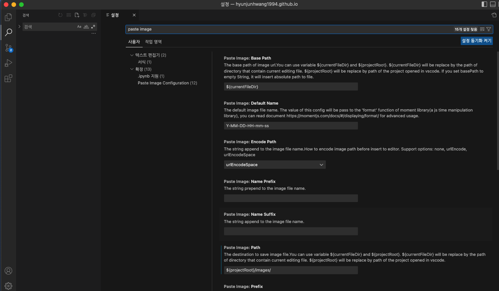
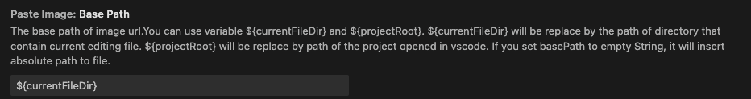
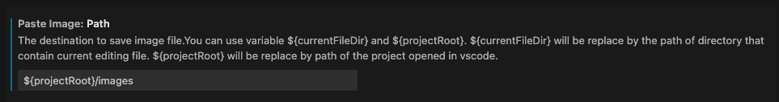
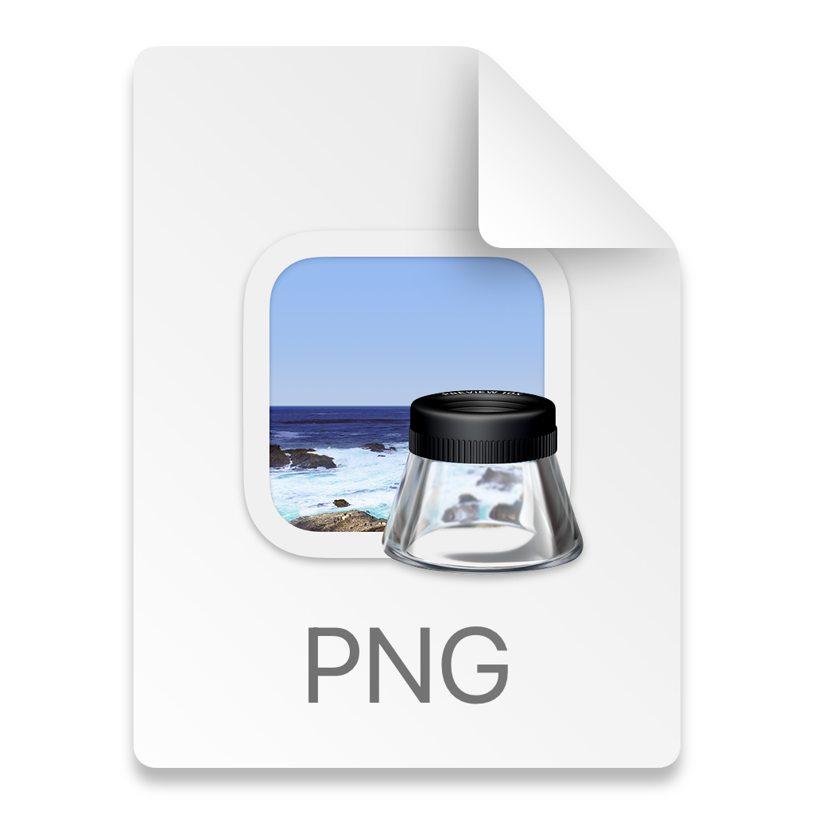
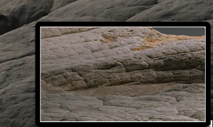

          개발 환경 
          - 2021, 맥북 프로 M1 Pro 14인치 모델  
          - Ventura 13.1 베타(22C5050e) 버전
          

 

># Paste Image?

공식 움짤인데..? 참 설명도 헷갈리게 해 놓았다..

Paste Image 앱은 VS Code 내에서 돌아가며,  
인터넷상 존재하는 혹은 캡처한 이미지 파일을 VS Code에서

간단하게 저장 및 Markdown 자동 작성까지 해준다.  
(여기서 포인트는 문법 작성뿐 아니라 파일 자체를 원하는 위치에 다운로드해 준다는 것)

## 설치는 어떻게 하는데..?
VS Code의 확장에 들어오면 Paste Image를 검색 후에 설치하면 된다.

## 설정.
이 앱은 설정이 살짝 헷갈린다!

VS Code 왼쪽 아래 톱니바퀴 누르고 Paste image 검색 후 진행하면 된다.

Bass Path, Path 2가지 설정만 해주면 된다.

Bass Path : url 스타트를 어디 기준으로 할 건지 설정한다.  
Path : 사진을 저장할 위치이다.

${currentFileDir} : 현재 파일이 있는 디렉토리  
${projectRoot} : VS code 킬때  선택한 최상위 디렉토리 (프로젝트)

아래 참고하여 설정해 보자.

위처럼 설정 시 사진을 가져오면,  
최상위 폴더 /images에 사진이 저절로 저장되고 (최초 폴더 자동 생성됨)  
경로도 해당 위치로 잘 설정된다.

Bass Path(시작 경로)에서 Path(최종 도착지점)을 정해주는 것으로  
사진은 Path 경로에 저장이 되며, 이미지 삽입 경로는 Bass Path -> Path까지 자동으로 잡힌다.

## 사용법
쉽다.
 
인터넷상에 존재하는 이미지 파일 우 클릭 이미지 복사한 뒤에,  
작성 중인 마크다운 포스트에서,  
단축키인 Command + option + v 하면 사진 저장과 동시에, 마크다운 문법으로 작성된다.

## 사용을 하다 보니..
보통 블로그 글 작성 시 맥북 기본 캡처를 많이 쓰는데,  
캡처한 후 바탕화면에 생긴 파일을 복사 후 마크업에  
Paste Image를 이용 붙혀넣기 하면 아래 같은 아이콘이 나온다.

실제로 파일 저장이 안 됨..

그런데.. 캡처 후 파일이 저장되기 전 미리 보기 상태에서 붙여 넣으면 동작을 한다.
  

저기 있는 미리 보기가 사라지고 파일이 저장되면, 동작을 안 함..

이걸 보니 맥에 저장된 파일은 동작이 안되고, 클립보드에만 남아 있을 때 저장이 되는 것 같다.  
실제, 어떤 사진이던 로컬에 있는 파일 복사하면 동작 안 함

버그인지..? 아니면 애초에 인터넷에 있는 사진만을 쉽게 가져오기 위하여 만든 앱인지..?

그래서 이렇게 사용하기로 했다.  
맥북 부분 캡처할 때 Shift + Command + control 4로 캡처 시 파일 저장이 아닌  
클립보드로만 저장을 바로하고,

블로그 글을 쓰면서 바로바로 클립보드에 넣어서 붙여넣기 해서 사용하는 것이 정신건강에 좋을 듯하다..

인터넷상에서 있는 이미지 파일의 경우 잘 동작합니다.
