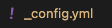
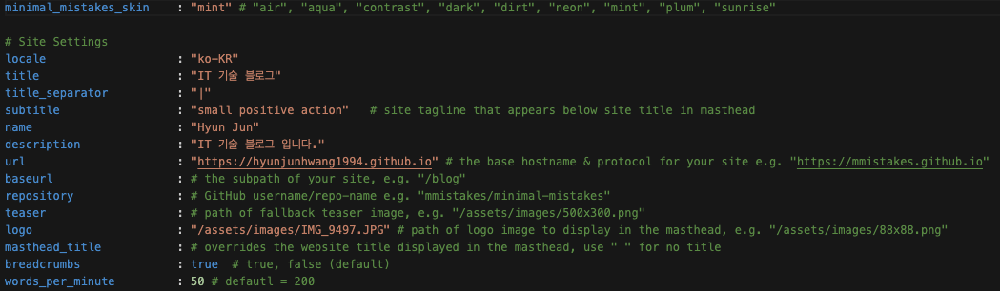
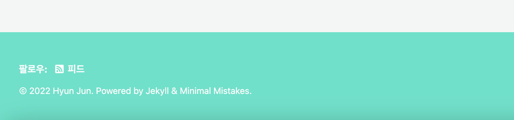
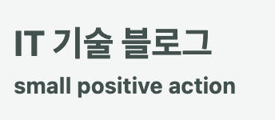
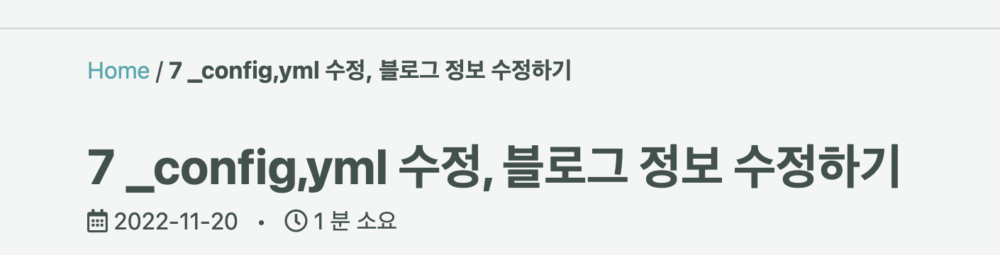
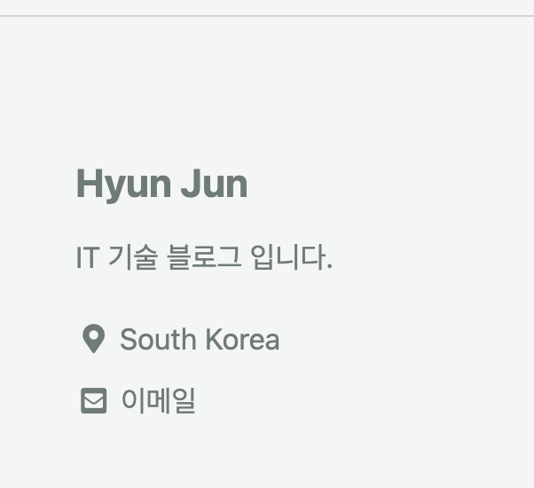
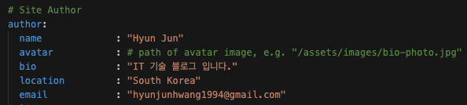
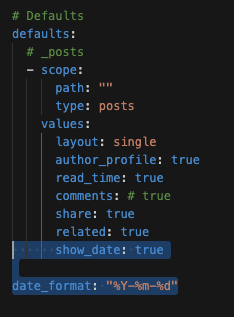
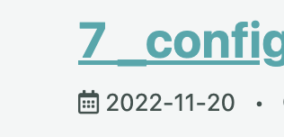

          개발 환경 
          - 2021, 맥북 프로 M1 Pro 14인치 모델  
          - Ventura 13.1 베타(22C5050e) 버전
          

 

# _config.yml?

_config.yml은 Jekyll 블로그 생성시 만들어지는 파일로  
여러가지 블로그 관련 정보를 설정 할 수 있다.  

## 스킨 선택
minimal_mistakes_skin : 설정 하고싶은 스킨을 선택해 보자.

Mint를 선택 할 경우

## 언어 변경
locale : "ko-KR"  할 경우 여러가지 설정된 언어가 영어에서 한글로 바뀐다.  
예를들면 위에 팔로우: 피드 이런부분!

## title 변경
title : "IT 기술 블로그"  
title_separator : "|"  
subtitle : "small positive action"  

아래 메인 부분과, 인터넷브라우저 창의 제목, 구분자가 바뀐다.

{: width="200"}

## 메타 정보 수정
아래 부분은 메타정보에만 들어가므로 바꿔도 아무런 변경이 일어나지 않는다.  
name : "Hyun Jun"  
description : "IT 기술 블로그 입니다."

## 로고 사진 추가
assets -> images에 사진을 넣고  
logo : "/assets/images/IMG..." 에 추가해주면 대문에 자기 사진이나온다.

## Breadcrumbs 링크 생성
breadcrumbs : true 할 경우 포스팅을 눌럿을 때 Home으로 이동할 수 있는 링크가 생김.

## 글 읽는데 걸리는 시간 표시
words_per_minute : 50

글마다 읽을때 몇분 소요되는지 기록이되는데,  
아마 50으로 해놓으면 50글자가 넘어갈때마다 1분이 추가 되는것 같음.

## Site author
실질적으로 아래 영역의 경우
{: .align-center}

맨처음 Site settings 부분이 아닌!  
아래의 Site Author 부분에서 변경해야 적용된다.
{: .align-center}

show_date, date_formate을 저렇게 설정해 줄경우  
{: .align-center}

포스트에 아래처럼 작성 날짜가 나온다.  
{: .align-center}

그외에 주석으로 되어있거나 여러 부분들은 아래 가이드링크 참조하여 직접 테스트 해보세요.  
[Minimal-mistakes 가이드 문서](https://mmistakes.github.io/minimal-mistakes/docs/quick-start-guide/)
 