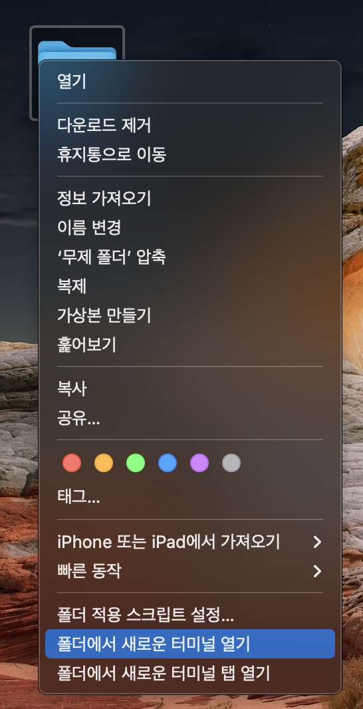
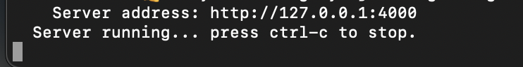

# 3탄의 과정이 끝났다면 더욱 자유도가 높아집니다.

## 블로그 내용 수정 시 실시간으로 확인하기

자신의 블로그 레파지토리 폴더를 터미널로 연다.

해당 폴더안에서 아래의 명령어 입력으로 번들을 설치해준다.

        bundle install

그럼 번들이 우리의 블로그에 설치 되었을 것이다.        

그렇다면 아래의 명령어로 서버를 실행시켜준다.

        bundle exec jekyll serve

아래처럼 나오면 성공!

브라우저로 http://127.0.0.1:4000 에 접속해주면된다.

이때 원래는 호스팅중인 서버에 파일변경시 바로 변경이 되어야하지만,
서버를 재시작 해야하만 변경이되어서 삽질을 좀 했다.

그럴땐  --force-polling를 추가해주면 된다.

        bundle exec jekyll serve --force-polling    

그럼 이제 포스팅 수정 시 커밋,푸쉬 나 서버재시작을 하지않아도 
브라우저 새로고침만 하면 수정된 내용이 바로바로 보일 것이다.
( 실제 블로그에 적용하려면, 커밋,푸쉬 필수 )
       

